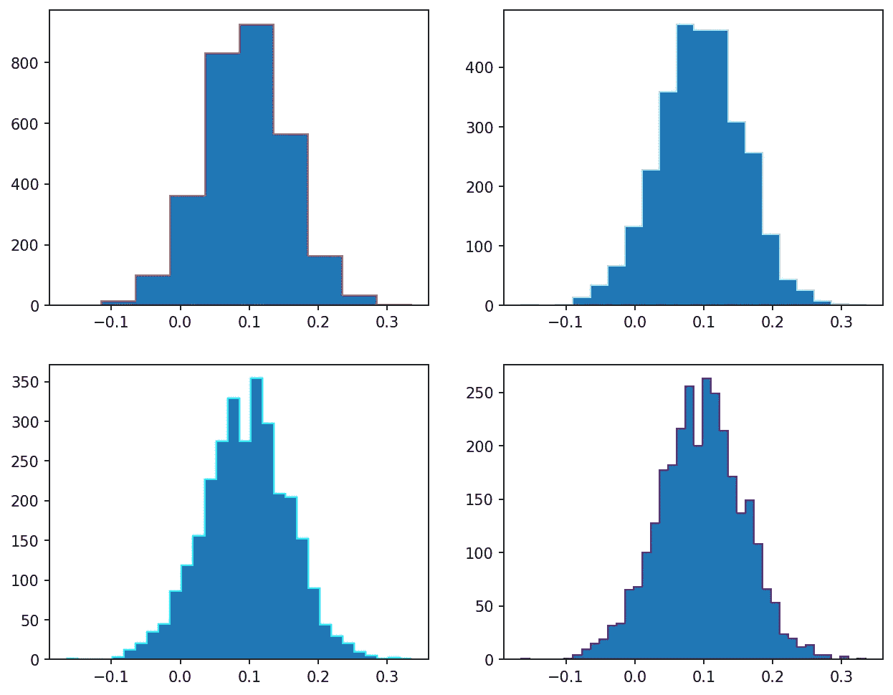
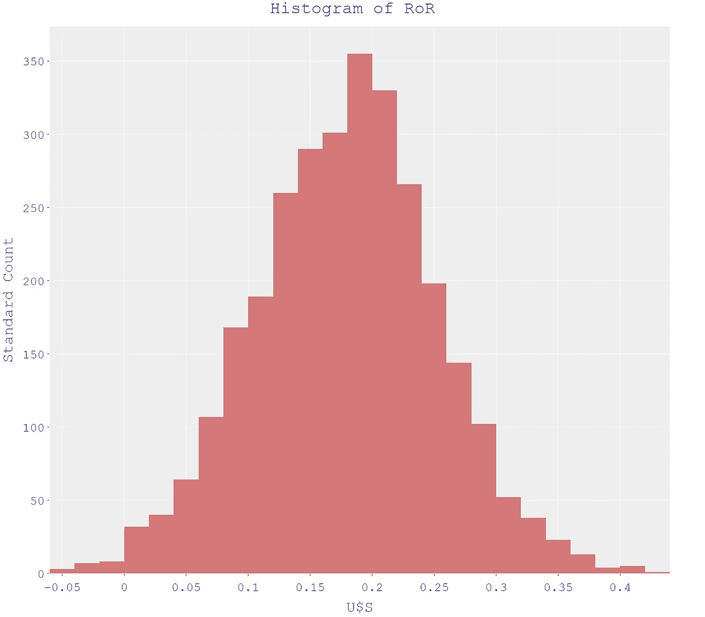
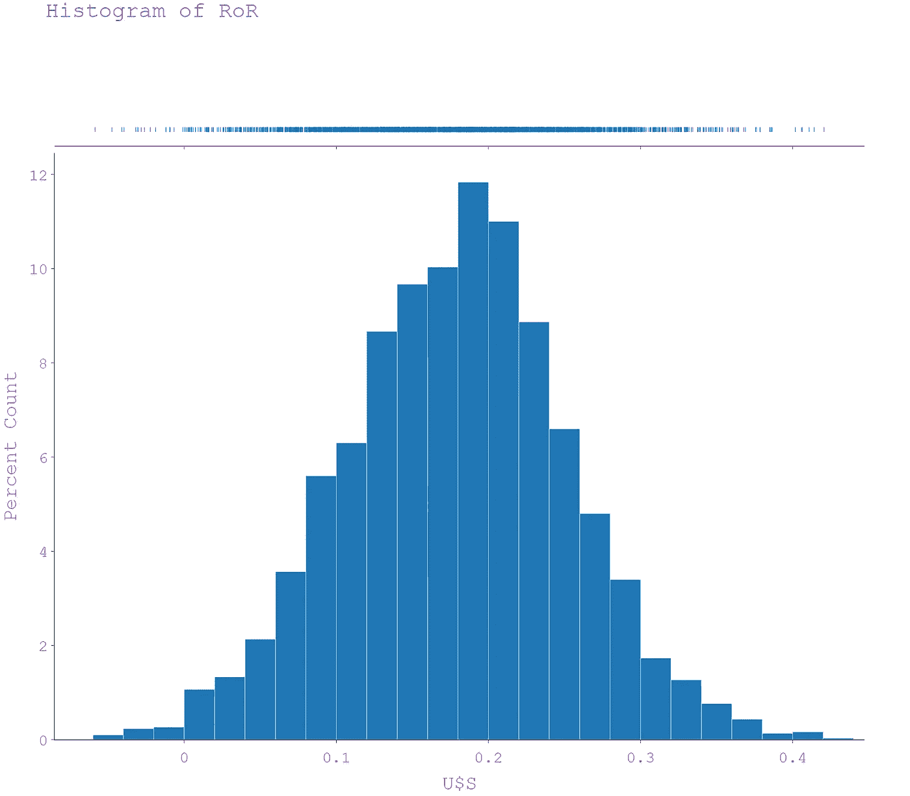
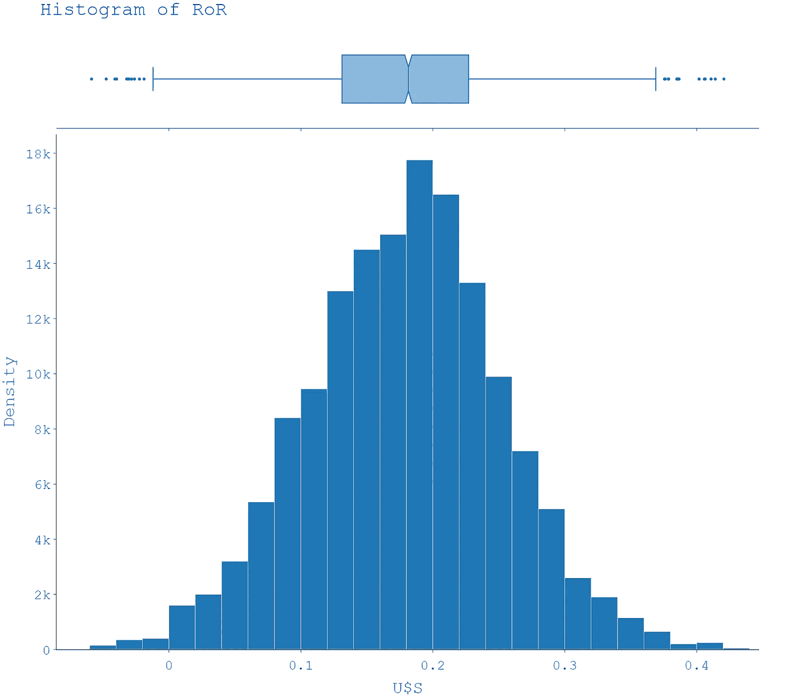
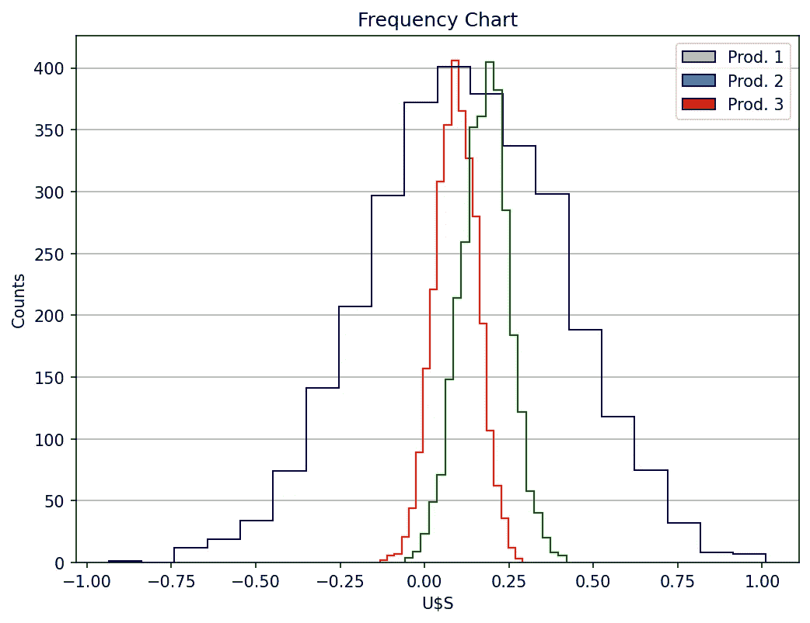
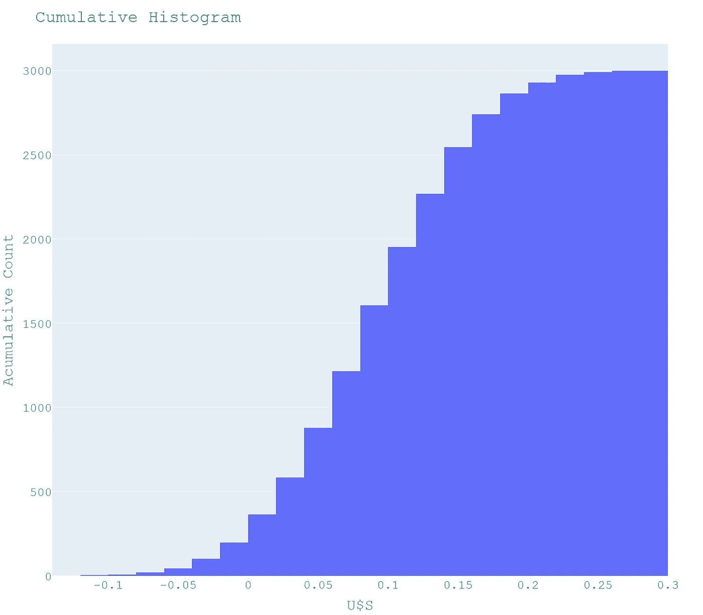
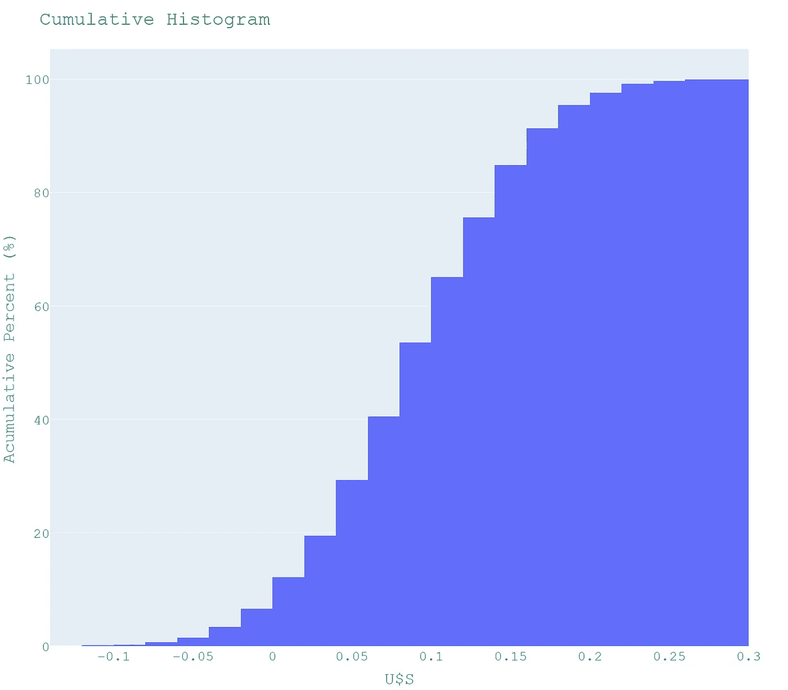
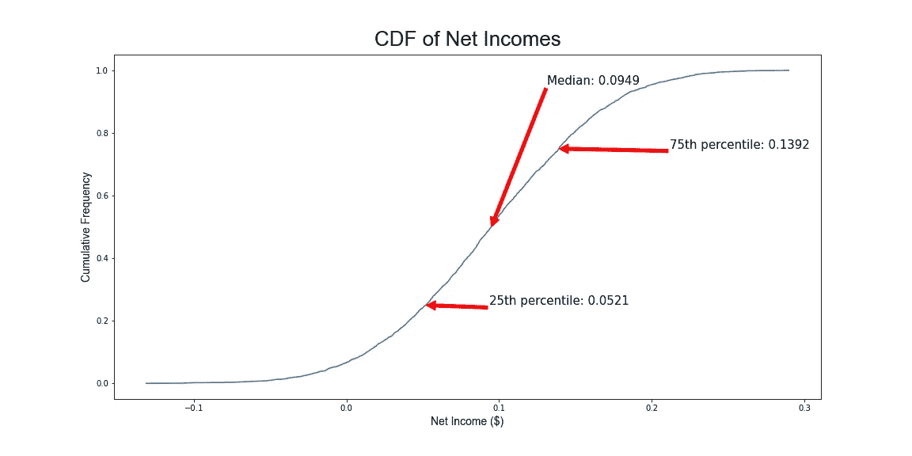

# 蒙特 卡罗模拟

> 原文：<https://towardsdatascience.com/monte-carlo-simulation-1ee81e6991d6>

## **第七部分:制图**

由[埃菲社](https://unsplash.com/@efekurnaz?utm_source=medium&utm_medium=referral)在 [Unsplash](https://unsplash.com?utm_source=medium&utm_medium=referral) 上拍摄的照片

这是第七篇关于蒙特卡罗模拟的文章。我们将重申我们在[之前的文章](https://medium.com/towards-data-science/monte-carlo-simulation-bf31bb78d39c)中的定义:“蒙特卡罗模拟(MCS)是一种抽样实验，其目的是估计取决于一个或多个随机输入变量的感兴趣的量的分布”。

我鼓励您阅读我以前的一些文章( [MCS 第 1 部分](/monte-carlo-simulation-2b24fc810683)、 [MCS 第 2 部分](https://medium.com/p/8db846f3d8ed#09a4-6a25f853d2de)、 [MCS 第 3 部分](/monte-carlo-simulation-7c198d01c531))，以了解该技术的更多方面，特别是如何用 Python 编写一些可以轻松解决的决策问题。

任何 MCS 的最后一个[基本步骤是**分析过程输出**。请记住，在 MCS 中，我们使用大量随机输入数据来复制模拟，从而获得输出变量的大量随机值。](/monte-carlo-simulation-7c198d01c531)

然后，我们使用经典的统计推断方法来获得集中趋势的一些度量，如平均值和中值，并通过其他度量来计算结果的可变性，如方差和[标准差](https://www.investopedia.com/terms/s/standarddeviation.asp)。最后，我们画一个图表来完成故事的讲述。

因此，MCS 为分析师提供了一系列关于所研究的决策问题的可能结果及其相关概率。相应地，分析流程输出的最佳图表是**直方图**。

正如前一篇文章中所指出的:“直方图是一个图表，它让你显示潜在的频率分布或单个连续数值变量的概率分布。”

我还写了另一篇关于直方图的文章，我说:“直方图是有两个轴的二维图；纵轴是频率轴，而横轴被分成一系列数值(间隔或**仓**)或时间间隔。每个仓的频率由垂直矩形条的面积表示。每个柱覆盖了所研究变量的连续数值范围。纵轴显示从每个箱的计数中导出的频率值。

**我推荐阅读这两篇文章，不仅是为了图表的“为什么&如何”，也是为了我们将在本文中使用的一些扩展(重叠直方图、密度图、频率多边形)。**

**在下文中，我们将绘制一组直方图或类似的图表，试图阐明哪一个是具有最佳故事性的 CSM 的图形表示。**

**我们将使用蒙特卡罗模拟列表中第[第四篇](/monte-carlo-simulation-5e58f054bebb)的数据，在该列表中，我们采用了 MCS 技术，根据相应的回报率在不同的备选方案之间进行选择。**

# ****蒙特卡洛模拟直方图****

**使用直方图时要执行的第一个任务是**确定仓或区间的数量**。在以下前提下，应该总是用不同数量的箱**进行实验:如果间隔的数量很小，则确定分布的真实结构是不可行的；相反，如果箱的数量很大，那么采样误差就显得太重要了。****

**图 1 显示了对应于来自第四篇文章的数据的直方图，分别具有 10、20、30 和 40 个间隔**。我认为选择 30 或 40 的区间是合适的，因为它允许我们确认我们正处于单峰、对称分布中，在输出中没有异常值。****

********

****图 1:作者用 Matplotlib 制作的直方图****

****绘制直方图的一个有趣的替代方法是 [Plotly Express](/scatter-plots-with-plotly-express-1b7f5579919b) (PE)。请记住:“Plotly Express 是 Plotly.py 的高级包装器，与 Plotly 生态系统的其余部分完全兼容。”这是一个免费的、开源的、交互式的、基于浏览器的 Python 图形库。****

****数据通信的一个重要方面是图形的整体风格。在这方面，PE 提供了十一个主题或**模板**用于简单快速地设计图表。此外，使用[直方图](/histograms-with-plotly-express-e9e134ae37ad) ( *px.histogram()* )，PE 有四种类型的**归一化**用于呈现数据:a)没有 *histnorm* 参数用于每个 bin 中的标准计数(默认模式， *template = 'ggplot2'* ，图 2)；b)*hist norm =‘percent’*用于百分比计数(每个区间中样本的分数，*template =‘simple _ white’，*图 3)；c)*hist norm =‘density’*用于密度直方图(所有条形面积的总和等于样本点的总数，*template =‘simple _ white’*，图 4)；d)*hist norm =‘概率密度’*对于概率密度直方图(现在，所有条形面积之和等于 1，*template =‘simple _ white’，*图 5)。****

********

****图 2，作者用 Plotly Express 做的。****

****分布的视觉表现可以用**边缘支线剧情来增强。使用关键字 *marginal* ，我们可以给任何用 PE 绘制的直方图添加一个地毯、一把小提琴或者一个盒子支线剧情。rug 图(*marginal =‘rug’*，图 3)就像一个直方图，带有**零宽度条块**和代表输出数据每个值的矩形标记。******

****

**图 3，作者用 Plotly Express 做的。**

**箱形图(*marginal =‘box’*，图 4)显示了五个数字的统计汇总，包括最小值、第一个四分位数、中值、第三个四分位数和最大值。它还显示数据集中出现的任何异常值。**

****

**图 4，作者用 Plotly Express 做的。**

**最后，小提琴图类似于盒子图，在每一侧增加了旋转的核密度图。小提琴图显示了所表示的数据的概率密度，尽管通过核密度估计器进行了平滑[1]。图 5 显示了添加了小提琴子图的概率密度直方图(*marginal =‘violin’*)。**

****

**图 5，作者用 Plotly Express 做的。**

**我更喜欢盒子子图，因为它可以很容易地检测四分位数，中位数，异常值和四分位数之间的范围。它还允许我们容易地想象输出变量的分布是否不对称或偏离正态分布。如果有非常高的最大值或非常低的最小值。**

**在[第 4 篇](/monte-carlo-simulation-5e58f054bebb)中，我们用一个重叠的阶跃直方图表示了三个备选项的频率分布(图 6)。我们指出:“强烈建议使用阶跃直方图同时比较两个以上的频率分布，以避免图表混乱。”在 Matplotlib 中，我们用关键字 histtype ='step '生成一个步长直方图。我没有在 Plotly 中找到一个等价的关键字。**

****

**图 6:作者用 Matplotlib 制作的重叠阶梯直方图。**

**现在，我们将使用**累积频率直方图来分析输出数据。**除了显示累积频率而不是标准频率之外，它们看起来与经典直方图相同。它们计算累计观察次数，直到预先指定的时间间隔。图 7 显示了 3000 次重复的累积直方图(*“累积启用=真”)*。**

****

**图 7:作者用 Plotly Express 制作的标准计数累积直方图。**

**但是毫无疑问，如图 8 所示，使用百分比归一化( *histnorm = 'percent '，cumulative_enabled = True* )可以最好地传达该消息。我们在[第 2 篇](https://medium.com/p/8db846f3d8ed#09a4-6a25f853d2de)(MCS 风险分析)中使用了累积直方图来回答涉及投资项目风险的问题。**

****

**图 8:作者用 Plotly Express 制作的百分比累积直方图。**

**最后，我们借鉴了 BEXGBoost [2]的一些想法，使用 *empiricaldist* 库[3]绘制累积分布函数(CDF)。概念上的想法是显示一个平滑干净的图表，只关注一组统计测量，没有直方图特有的锯齿状。**

****

**图 9:作者用 *empiricaldist* 做的一个累积分布函数。**

# ****结论****

**蒙特卡洛模拟是预测不同结果或输出变量的概率的简单而强大的方法，这些结果或输出变量取决于一个或多个随机输入变量。**

**该方法广泛应用于风险管理、定量分析、金融、工程和科学等领域。**

**MCS 包括以下步骤:1)建立预测模型；2)确定随机输入变量的概率分布；3)用不同的随机输入复制模拟；4)使用推断统计方法分析随机输出，并选择适当的图表以更好地讲述故事。**

**我们指出直方图是分析 MCS 流程输出的最佳图表。特别是带有边缘方框子图的百分比直方图。此外，累积直方图可以帮助决策者和项目经理定量评估风险对项目的影响。**

## **参考**

**[1]:[https://en.wikipedia.org/wiki/Violin_plot](https://en.wikipedia.org/wiki/Violin_plot)**

**[2]: [直方图的 3 个最佳(通常更好)替代方案| BEXGBoost |走向数据科学](/3-best-often-better-alternatives-to-histograms-61ddaec05305)**

**【3】:【https://github.com/AllenDowney/empiricaldist **