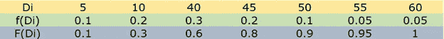
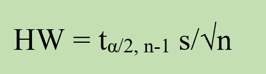
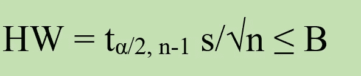
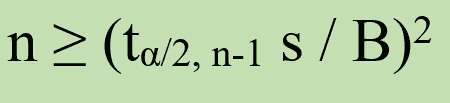
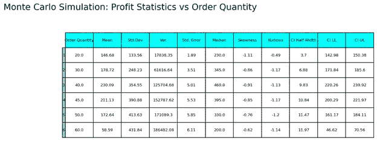
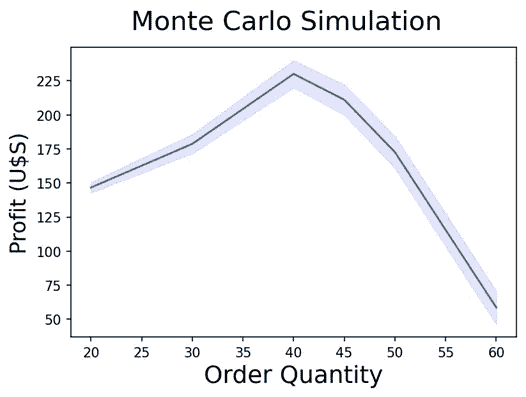

# 蒙特 卡罗模拟

> 原文：<https://towardsdatascience.com/monte-carlo-simulation-2b24fc810683>

# **第一部分:报童问题**


由 [Unsplash](https://unsplash.com?utm_source=medium&utm_medium=referral) 上的[Cup 先生/杨奇煜·巴拉](https://unsplash.com/@iammrcup?utm_source=medium&utm_medium=referral)拍摄

在本系列的第一篇文章[中，我们将**模拟**定义为一种数值技术，包括建立被研究系统的数学和/或逻辑模型，然后对其进行实验，收集数据，使我们能够获得一个估计器来帮助解决复杂的决策问题。](https://medium.com/@dar.wtz/list/simulation-with-simpy-eccba6f32306)

在同一篇文章中，我们将**模型**定义为真实流程或系统的简化但有效的表示，旨在获得对其行为的一些理解。

我们还对模型进行了分类，特别区分了**连续模型**和**离散模型**，前者的行为(**状态变量**)随时间不断变化，后者的状态变量仅在单独的时间点发生变化。另一个重要的分类包括静态模型(T18)和动态模型(T20)，静态模型是系统在特定时间的代表，动态模型是随着时间的推移而发展的。

与上述分类相关的有三种不同类型的模拟:连续事件模拟、离散事件模拟和蒙特卡罗模拟。

关于**离散事件模拟(DES)** 的原理和概念在前面指出的系列中提供。我们用 **SimPy** 编写了几个例子，这是一个基于纯 Python 的面向对象、基于流程的离散事件模拟框架。在以后的文章中，我们将发展与连续事件模拟相关的概念和原则。

在这篇文章中(可能在其他几篇文章中),我们正在处理蒙特卡罗模拟。

# **蒙特卡罗方法**

蒙特卡罗方法( **MCM** )是一组用于解决数学问题的数值方法，其中**随机样本**的使用将它们与等效方法区分开来。

这个术语是希腊裔美国物理学家尼古拉斯·米洛斯发明的，当时他正在洛斯阿拉莫斯国家实验室与 T2·约翰·冯·诺依曼和 T4·斯坦尼斯劳·乌拉姆一起研发第一颗原子弹。这个术语源自位于摩纳哥公国的[著名赌场](https://en.wikipedia.org/wiki/Monte_Carlo_Casino)。

MCM 的概念思想在于通过从计算机中表示的模型中重复采样来估计某些量。两类数学问题通常用这些技术来解决:积分和优化。

关于本系列文章中描述的内容，当我们提到蒙特卡罗模拟模型时，我们谈论的是试图解决优化问题的静态、离散、随机模型。

从方法的角度来看，蒙特卡罗模拟是一种抽样实验，其目的是估计取决于一个或多个随机输入变量的感兴趣的量的分布。我们对计算这些量的点估计和置信区间特别感兴趣。不可避免地，我们的估计量会有抽样误差，我们的首要任务是确定重复次数，以提高估计值的确定性。

我们将通过库存模型中的一个经典例子来说明蒙特卡罗模拟:**新闻供应商库存问题。**

# **报摊问题**

这里的术语是从面临**不确定需求的报纸销售商所面临的日常情况中创造出来的:**在一天开始时有多少报纸可用，以便不至于短缺和失去销售，或者有剩余的报纸而不能在第二天出售(我希望数字本地人知道报纸是什么；以防万一这里有个[链接](https://en.wikipedia.org/wiki/Newspaper)。

许多现实世界的系统类似于上述情况:零售店、飞机座位、时尚商品行业、制造系统。因此，通过解决报童问题获得的洞察力可能有助于在更有价值的商业环境中解决决策问题。

问题的一般设置如下:有一个卖主，一个供应商，和客户。我们只考虑一个**单周期的情况。**在该阶段开始时，供应商有兴趣确定向供应商订购多少个产品( *Q* )来满足客户需求。这个客户需求是随机的，用一个随机变量 *D* 及其对应的概率密度函数 *f(D)* 和累积分布函数 *F(D)* 来表示。

供应商完全知道以下值:购买成本；销售价格(*s*)；残值( *u* )。残值是产品在使用寿命结束时的估计价值。典型的情况是销售价格高于购买成本，而购买成本又高于残值。

供应商必须考虑两种情况:1)订购数量大于日需求量(*Q>D*)；2)订购数量等于或小于日需求( *Q < =D* )。在第一种情况下， *Q — D* 单位剩余，必须由卖方以低于售价的残值回收。在第二种情况下， *D — Q* 单位代表销售损失。

因此，我们为卖方开发了以下利润等式:

*利润=每次销售收入+每次回收收入-每次订单成本*

在哪里

*Revenue _ per _ Sales = s * minimum(D，Q)*

Revenue_per_Salvage = u *。最大值(0，Q — D)

*每订单成本= c * Q*

所以，利润是 *Q* & *D* 的函数。由于需求是随机变量，利润也是随机变量。为了确定向供应商订购多少单位，我们必须计算**利润的最大期望值。**

这种计算可以使用蒙特卡罗方法以非常简单和有效的方式来完成。

# **用 Python 进行蒙特卡洛模拟**

在我们的示例中，供应商以 15.50 美元的价格购买产品，然后以 27.00 美元的价格出售。残值是 2.50 美元。

下表显示了每日单位需求的分配情况:



如前所述，首先我们必须确定样本中的观察值数量。

在[第 5 篇](https://medium.com/p/e27cd7b1ff47)中我们说过估计量的**精度**是指置信区间的半宽度( **HW** )。它由以下等式描述:



其中 n 是样本数， *tα/2，n1*是自由度为 n*1*的 t 分布的上 100(1-α/2)个百分点，而 *s* 是样本标准偏差。

我们希望在置信区间的半宽度值上建立一个**界限** (B)。



求解 n 的结果为:



这是 python 代码，用于确定大小为 n0= 100、界限为 10.00、置信度为 95%的导频样本的观测值数量。

```
[@author](http://twitter.com/author): darwt
"""
# Import Modules
import pandas as pd
import numpy  as npfrom scipy import stats
from scipy.stats import uniform
from scipy.stats import semimport matplotlib.pyplot as plt  
your_path = 'C:/Users/darwt/desktop/'#...................................................................
# initialization module

Price_Per_Unit   = 27.0
Cost_Per_Unit    = 15.50
Salvage_Per_Unit = 2.50list_of_orders = [40]                 ## quantity ordered for the pilot run
length = len(list_of_orders)bound = 10.0                           ## selected by the analyst 
confidence = 0.95                      ## selected by the analyst 
# .........................................
# historical daily demand
daily_demand = [5, 10, 40, 45, 50, 55, 60]# discrete probabilities for daily demand
pr1, pr2, pr3, pr4, pr5, pr6, pr7 = 0.1, 0.2, 0.3, 0.2, 0.1, 0.05, 0.05

pr1 = round(pr1, 2)
pr2 = round(pr1 + pr2,2)
pr3 = round(pr2 + pr3,2)
pr4 = round(pr3 + pr4,2)
pr5 = round(pr4 + pr5,2)
pr6 = round(pr5 + pr6,2)
pr7 = round(pr6 + pr7,2)list_of_probs = [pr1, pr2, pr3, pr4, pr5, pr6, pr7]df1 = pd.DataFrame(daily_demand, columns = ['demand'])
df2 = pd.DataFrame(list_of_probs,columns = ['range'])

df_demand = pd.concat([df1, df2], axis = 1)#....
Number_of_Replications = 100for j in range(length):
    list_of_profits = []
    for run in range(Number_of_Replications):
        # uniform distribution for a random variate
        r_v = uniform.rvs(size=1)

        for i,row in df_demand.iterrows():
            probab = df_demand.loc[i, 'range']

            if r_v < probab:
                Qty_Demand = df_demand.loc[i, 'demand']
                break

        Qty_Ordered = 40   ##list_of_orders[j]

        Qty_Sold = np.minimum(Qty_Demand, Qty_Ordered)
        Qty_Left = np.maximum(0, Qty_Ordered - Qty_Demand)

        Revenue_per_Sales = Qty_Sold * Price_Per_Unit        
        Revenue_per_Salvage = Qty_Left * Salvage_Per_Unit        
        Cost_per_Order =  Qty_Ordered * Cost_Per_Unit

        Profit = Revenue_per_Sales + 
                 Revenue_per_Salvage - Cost_per_Order        
        list_of_profits.append(Profit)

    media = np.mean(list_of_profits)
    stand = np.std(list_of_profits)

    dof  = Number_of_Replications - 1    
    t_crit = np.abs(stats.t.ppf((1-confidence)/2,dof))numb_of_samples = int((stand *t_crit / bound) ** 2)
print('')
print(' The number of samples is %3s' %numb_of_samples)
```

在上面的代码中，特定的随机数流是不可重复的。我们进行了几次试运行，用最后一个方程计算的样本数在 5000 左右波动。所以，我们用这个数字进行生产。

订单数量为 20、30、40、45、50 和 60 单位的新闻供应商问题的 python 代码如下:

```
[@author](http://twitter.com/author): darwt
"""# Import Modules
import pandas as pd
import numpy  as npfrom scipy import stats
from scipy.stats import uniform
from scipy.stats import semimport matplotlib.pyplot as plt  
your_path = 'C:/Users/darwt/desktop/'#...................................................................
# initialization module

Price_Per_Unit   = 27.0
Cost_Per_Unit    = 15.50
Salvage_Per_Unit = 2.50list_of_orders = [20,30,40,45,50,60]
length = len(list_of_orders)bound = 0.10                           ## selected by the analyst 
confidence = 0.95                      ## selected by the analyst 
# .........................................
# historical daily demand
daily_demand = [5, 10, 40, 45, 50, 55, 60]# discrete probabilities for daily demand
pr1, pr2, pr3, pr4, pr5, pr6, pr7 = 0.1, 0.2, 0.3, 0.2, 0.1, 0.05, 0.05

pr1 = round(pr1, 2)
pr2 = round(pr1 + pr2,2)
pr3 = round(pr2 + pr3,2)
pr4 = round(pr3 + pr4,2)
pr5 = round(pr4 + pr5,2)
pr6 = round(pr5 + pr6,2)
pr7 = round(pr6 + pr7,2)list_of_probs = [pr1, pr2, pr3, pr4, pr5, pr6, pr7]df1 = pd.DataFrame(daily_demand, columns = ['demand'])
df2 = pd.DataFrame(list_of_probs,columns = ['range'])

df_demand = pd.concat([df1, df2], axis = 1)column_labels = ["Order Quantity", "Mean","Std.Dev","Var.",
                 "Std. Error","Median", "Skewness", "Kurtosis",
                 "CI Half Width", "CI LL", 'CI UL']df = pd.DataFrame(columns=column_labels)
# ...............................................
Number_of_Replications = 5000for j in range(length):
    list_of_profits = []
    for run in range(Number_of_Replications):
        # uniform distribution for a random variate
        r_v = uniform.rvs(size=1)

        for i,row in df_demand.iterrows():
            probab = df_demand.loc[i, 'range']

            if r_v < probab:
                Qty_Demand = df_demand.loc[i, 'demand']
                break

        Qty_Ordered = list_of_orders[j]

        Qty_Sold = np.minimum(Qty_Demand, Qty_Ordered)
        Qty_Left = np.maximum(0, Qty_Ordered - Qty_Demand)

        Revenue_per_Sales = Qty_Sold * Price_Per_Unit        
        Revenue_per_Salvage = Qty_Left * Salvage_Per_Unit        
        Cost_per_Order =  Qty_Ordered * Cost_Per_Unit

        Profit = Revenue_per_Sales +
                 Revenue_per_Salvage - Cost_per_Order        
        list_of_profits.append(Profit)

    media = np.mean(list_of_profits)
    stand = np.std(list_of_profits)
    var   = np.var(list_of_profits) 
    std_error = sem(list_of_profits)

    median = np.median(list_of_profits)
    skew   = stats.skew(list_of_profits)
    kurt   = stats.kurtosis(list_of_profits)

    dof  = Number_of_Replications - 1    
    t_crit = np.abs(stats.t.ppf((1-confidence)/2,dof))

    half_width=round(stand*t_crit/np.sqrt(Number_of_Replications),2)  
    inf = media - half_width
    sup = media + half_width  

    inf = round(float(inf),2)
    sup = round(float(sup),2)    

    list_of_statistics = []
    list_of_statistics.append(round(Qty_Ordered,2))
    list_of_statistics.append(round(media,2))
    list_of_statistics.append(round(stand,2))
    list_of_statistics.append(round(var,2))
    list_of_statistics.append(round(std_error,2))

    list_of_statistics.append(round(median,2))
    list_of_statistics.append(round(skew,2))
    list_of_statistics.append(round(kurt,2))

    list_of_statistics.append(round(half_width,2))
    list_of_statistics.append(round(inf,2))
    list_of_statistics.append(round(sup,2))

    df.loc[len(df)] = list_of_statistics

fig, ax = plt.subplots(1,1)
ax.axis('tight')
ax.axis('off')runs_table = ax.table(cellText = df.values, 
                      colLabels = df.columns, 
                      rowLabels = df.index +1 ,
                      rowColours =["skyblue"]*(length), 
                      colColours =["cyan"]*11, 
                      cellLoc='center', loc="center",
                      bbox = [0.1, 0, 1.9, 1.0])
ax.set_title("Monte Carlo Simulation: Profit Statistics vs Order Quantity", fontsize=18, y= 1.2 , pad = 4)runs_table.auto_set_font_size(False)
runs_table.set_fontsize(8)
plt.savefig(your_path +'MonteCarlo.png',
            bbox_inches='tight', dpi=150)                 
plt.show()x  = df['Order Quantity']
y  = df['Mean']
ci = df['CI Half Width']fig, ax = plt.subplots()
ax.plot(x,y)
ax.fill_between(x, (y-ci), (y+ci), color='b', alpha=.1)
fig.suptitle('Monte Carlo Simulation', fontsize=20)
plt.xlabel('Order Quantity', fontsize=18)
plt.ylabel('Profit (U$S)', fontsize=16)plt.savefig(your_path +'MonteCarlChart.png',
            bbox_inches='tight', dpi=150)
plt.show()
```

表 1 总结了关键的描述性统计指标。利润的最大期望值对应于 40 个单位的订单数量。记住，偏斜度描述的是分布不对称的程度。我们的计算显示了适度的负偏态分布。另一方面，峰度指的是分布的峰值或平坦性。我们的计算表明，分布相对平坦，具有高度的分散性。对于我们的决策问题，我们的主点估计量的置信区间的半宽度是合理的。



表 1:由作者用 Matplotlib 制作

图 1 显示了 20、30、40、45、50 和 60 个单位的平均利润和相应的置信区间。可以看出，利润最大化的订货量对应 Q = 40，产生的平均利润为 230.09 美元。



图 1:作者用 Matplotlib 制作的

前面的例子显示了蒙特卡罗模拟的本质:通过重复采样来估计随机输出变量的期望值的静态模拟。

在以后的文章中，我们将继续详述 MCMs 的其他应用，特别是风险分析。

不要忘记给作者小费，尤其是当你把这篇文章添加到列表中的时候。