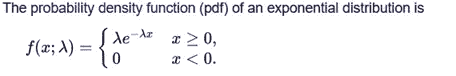
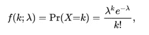
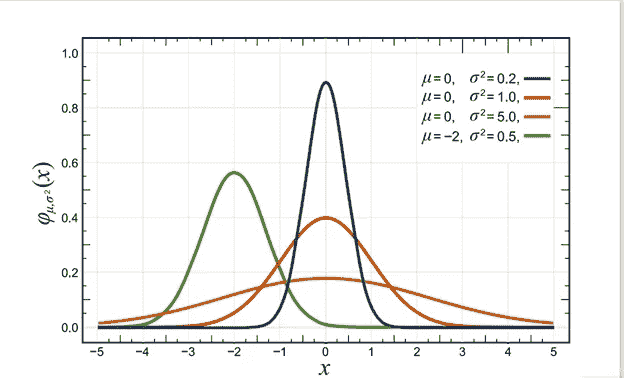
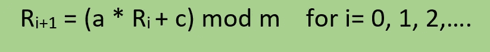
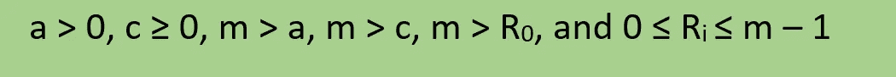
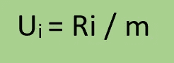
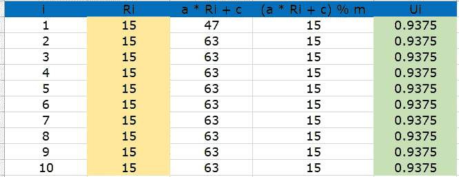
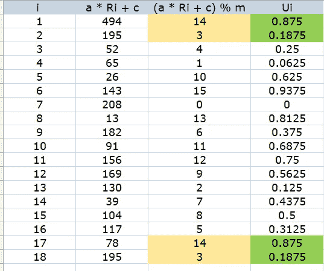
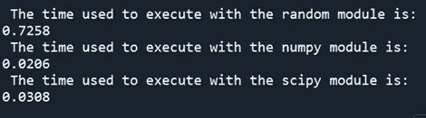

# 蒙特 卡罗模拟

> 原文：<https://towardsdatascience.com/monte-carlo-simulation-421110b678c5>

## **第 5 部分:随机性&随机数生成**


由[埃里克·麦克莱恩](https://unsplash.com/@introspectivedsgn?utm_source=medium&utm_medium=referral)在 [Unsplash](https://unsplash.com?utm_source=medium&utm_medium=referral) 上拍摄的照片

在本系列的[第一篇文章](/monte-carlo-simulation-2b24fc810683)中，我们将**蒙特卡罗方法** ( **MCM** )定义为一组用于数学问题求解的数值方法，其中**随机样本**的使用将它们与等效技术区分开来。这些方法提供了模拟结果的分布，从中可以很容易地获得汇总统计数据和图表。

由于大多数现实生活中的系统表现出大量的随机行为，MCM，特别是**蒙特卡罗模拟(MCSs)** 是分析和解决复杂决策问题的有价值的工具，因为它们可以灵活地将**随机性**融入建模中。

因此，为了使用 MCSs 作为有效的分析工具，清楚地理解与随机性相关的一组概念和基本定义是非常重要的。

# **定义和概念**

《韦氏词典词典》将随机性定义为“随机或看似随机的性质或状态(如缺乏或看似缺乏明确的计划、目的或模式)”。剑桥词典[2]将其定义为“随机的性质(偶然而非按计划发生、完成或选择)”。当然，这两个都是非技术定义，与该术语的常见用法有关。或者，在蒙特卡罗模拟中，通过使用随机数和概率分布来结合随机性。

一个**概率分布**表示某个随机变量可能取的所有可能值，加上这些值的概率总和【3】。有由它们的[密度函数](https://en.wikipedia.org/wiki/Probability_density_function)定义的连续概率分布函数和由[概率质量函数](https://en.wikipedia.org/wiki/Probability_mass_function)定义的离散概率分布函数。MCSs 中最常用的概率分布是均匀分布(连续)、正态分布(连续)、指数分布(连续)、泊松分布(离散)、威布尔分布(连续)和伯努利分布(离散)。



泊松分布的概率质量函数为:



根据平均值 *μ* 和方差 *σ* 的不同值，正态分布的概率密度函数。资料来源:https://en.wikipedia.org/wiki/Normal_distribution。

**随机变量**是实验输出的数字描述。随机变量可以是连续的，也可以是离散的。随机变量的期望值对应于平均值或统计平均值的概念。我以前的文章中描述的蒙特卡洛模拟的结果(第一篇中的[利润，第二篇](/monte-carlo-simulation-2b24fc810683)中的[总成本，第三篇](https://medium.com/p/8db846f3d8ed#09a4-6a25f853d2de)中的[损失时间百分比，第四篇](/monte-carlo-simulation-7c198d01c531)中的[回报率)是随机变量的例子。](/monte-carlo-simulation-5e58f054bebb)

一个**随机变量**是一个随机变量的特定实现(一个实例)。这是一个概率分布的特殊结果。

随机数是“一个从某个特定的分布中随机选择的数，从这些数的大集合中选择出来的一个数可以再现基本的分布”[4]。在模拟中，特别是在 MCS 中，随机数是从 0 和 1 之间的均匀分布中选择的随机变量。

随机数可以通过以下方式获得:1)物理设备(掷骰子、掷硬币、旋转轮盘、看特定的桌子、大气噪声、盖革计数器等)。);2)专门设计的电子器件；3)递归算法。

正如在计算机模拟中，我们需要来自非常不同的概率分布的数千个随机数，唯一合理的解决方案是使用名为随机数生成器的递归算法。这种**递归算法**从前一个随机数生成新的随机数。

由计算机算法生成的数字序列并不是真正随机的，因为它们是由**确定性公式生成的。**所以，他们被称为**伪随机数。那些特定的计算机算法产生的数字流看起来是随机的。**

总之，**随机数生成器**是一种用于生成伪随机数序列的递归算法。

**伪随机数序列**是(0，1)中的确定性数字序列，具有与均匀分布在 0 和 1 [5]之间的真随机数序列**相同的相关统计特性**。

一个好的通用(伪)随机数发生器必须包括以下特性:

*   所有数字必须均匀分布在(0，1)中
*   连续值之间没有序列相关性
*   很长的一段时间(周期的长度)
*   指定起始种子的可重复性
*   简单的实现
*   计算效率高

# **随机数发生器**

最常用于生成(伪)随机数流的递归算法是**线性同余生成器(LCG)** 。如前所述，递归算法需要前一个伪随机数来生成下一个伪随机数。这也意味着需要一个**种子号**来启动序列。

LCG 的基本公式是:



其中 **a** 为常数乘数， **c** 为常数加值(增量)， **R0** 为种子数， **m** 为模数。它们(a，c，R0，m)都是整数，并具有以下附加条件:



**mod** 是数学运算**对**取模，返回一个数除以另一个数后的余数或有符号余数(模数)[6]。比如 10 mod 3 = 1，因为我们可以把 3 除以 10 三次，剩下余数 1；251 mod 17 = 13，因为我们可以将 17 除以 251 的 14 倍，剩下 13 的余数。

由于伪随机数流必须在(0，1)中，我们必须计算如下:



让我们通过几个例子来看看它是如何工作的:

1.  LCG，其中 a = 4，c = 3，m = 16，R0 = 11



可以看出，不可能产生一个以上不同的随机数。显然，这不是一个随机数字序列。

2) LCG，其中 a = 13，c = 13，m = 16，R0 = 37



该算法生成一个由 16 个不同随机数组成的序列，然后该序列开始重复。序列的长度称为 LCG 的**周期**。我们想要一个非常长的周期，理想情况下等于模数 **m** (本例中为 16)，其中产生每个小于 **m** 的正整数。当这种情况发生时，该算法被认为实现了其**全周期**或**全周期。**

当然，只有 16 个不同的随机数对于蒙特卡罗模拟是没有用的，因为蒙特卡罗模拟需要数千个独立的重复，每个重复都有不同的随机变量。大量的数学家和统计学家研究了如何开发具有完整周期和数百万不同随机数序列的算法。这些发展超出了本文的范围。我只想指出，有几个算法使用质数来表示模数，常数乘数 **a** 必须以 01、21、41、64 或 81 结尾，增量 **c** 必须以数字 1、3、7 或 9 结尾。

*梅森扭结器*是松本诚和西村拓治在 1997 年开发的一种强伪随机数发生器【7】。这是一个经过充分测试的生成器，基于**梅森素数**2 * *(19937)-1，它在令人印象深刻的 2 * *(19937)-1 周期内产生 53 位精度浮点。像 Python，R 这样的软件，以及在更近的版本中，MATLAB 提供了*梅森图*作为标准，因为它具有不可思议的周期和极好的统计特性。然而，由于生成器是完全确定的，因此它并不适用于所有目的。显然，你不能将它用于加密或高安全性的目的。

其他优秀的伪随机发生器包括*滞后斐波那契*发生器和 *L'Ecuyer* 发生器(“一个普通桌面大约需要 219 年才能耗尽算法的周期”)[8]。

一个**随机变量生成器**是一个算法函数，用于从特定的概率分布中生成一个随机观察流。

在 Python 中，有两组随机变量生成函数:(1)来自 Python 标准库中的 **random** 模块。它使用*梅森捻线机*作为核心发电机；(2)来自 **Numpy** 的随机变量发生器。在 Numpy 中，随机数生成分为两个部分，一个位生成器和一个随机生成器。位生成器的职责有限。它管理状态，并提供产生随机双精度值和随机无符号 32 位和 64 位值的函数。随机发生器采用位发生器提供的流，并将它们转换成更有用的分布，例如模拟的正态随机值[9]。

库 **Scipy** 没有随机数生成器。它使用 Numpy 模块。scipy.stats 模块包括 80 多个连续随机变量和至少 10 个离散随机变量。产生随机变量的方法是 *rvs* 。使用 Scipy 的最大优势在于，每个发行版都从它继承了一组泛型方法。例如，指数连续随机变量继承了计算分布的平均值、中值、方差、标准差、峰度和偏斜度的方法。其他方法计算 pdf、CDF、生存和逆生存函数[10]。

在模拟研究中，经常需要再现随机数序列，特别是当试图使用一种称为**普通随机数的技术来比较模型对不同备选方案的响应时。**为此，发生器需要一个数字来启动序列(**一个**一个**种子值**)。默认情况下，它使用当前系统时间。但是，如果需要再现流，每次需要重新开始序列时，都必须编写类似于 *random.seed(1234)* 的代码。

让我们看看它是如何工作的:

首先，你导入模块*(导入随机*)然后调用相应的函数( *random.random()* )

没有种子编号:

```
import randomr1 = random.random()
print(r1)r2 = random.random()
print(r2)
```

你会得到两个不同的均匀分布的随机数:

*0.007491470058587191*

*0.9109759624491242*

带有种子编号

```
random.seed(1234)r3 = random.random()
print(r3)
r4 = random.random()
print(r4)print()random.seed(1234)r5 = random.random()
print(r5)
r6 = random.random()
print(r6)
```

## 现在，您将生成相同的观察流:

0.9664535356921388

0.4407325991753527

*0.9664535356921388*

*0.4407325991753527*

以下代码尝试使用 Python 标准库、Numpy 库和 Scipy 库中的 **random** 模块，比较从指数分布生成 500.000 个随机观测值和从正态分布生成另外 500.000 个随机观测值所需的时间。

```
import numpy as np
from scipy.stats import norm
from scipy.stats import expon
import timemu = 5
sigma = 2lamb = 1.2
#........................................................start1 = time.time()list_of_normal, list_of_expon = [], []
for i in range(500000):
    expon_with_random_module  = random.expovariate(1/lamb)
    normal_with_random_module = random.gauss(mu, sigma)
    list_of_expon.append(expon_with_random_module)
    list_of_normal.append(normal_with_random_module)end1 = time.time()delta1 = round(float(end1 - start1), 4)
print(" The time used to execute with the random module is:")
print(delta1)start2 = time.time()expon_with_numpy  = np.random.exponential(1/lamb, 500000)
normal_with_numpy = np.random.normal(mu, sigma,   500000)end2 = time.time()delta2 = round(float(end2 - start2), 4)
print(" The time used to execute with the numpy module is:")
print(delta2)start3 = time.time()expon_with_scipy = expon.rvs(scale = 1/lamb, size = 500000)   
normal_with_scipy = norm.rvs(loc = mu, scale = sigma, size= 500000)end3 = time.time()delta3 = round(float(end3 - start3), 4)
print(" The time used to execute with the scipy module is:" )
print(delta3)
```



我的计算清楚地显示了使用 Numpy 库的优势。

在蒙特卡罗模拟中使用伪随机序列之前，应该对序列的随机性进行彻底的分析。首先，你必须通过应用[卡方](https://en.wikipedia.org/wiki/Chi-squared_test)和[科尔莫戈罗夫-斯米尔诺夫](https://en.wikipedia.org/wiki/Kolmogorov%E2%80%93Smirnov_test)测试来测试**的一致性**。**序列相关性**(与自相关相同)可以用[德宾-沃森测试](https://en.wikipedia.org/wiki/Durbin%E2%80%93Watson_statistic)进行测试。必须对每个随机序列进行**运行**测试，例如使用 [Wald-Wolfowitz 测试。](https://en.wikipedia.org/wiki/Wald%E2%80%93Wolfowitz_runs_test)您还必须使用间隙测试和/或[扑克测试](https://ioesolutions.esign.com.np/notes/text-notes-show/Poker-Test-(Numerical-Solution-))来测试**数字模式**。

别忘了给小费，尤其是当你把文章添加到列表中的时候。

# **结论**

随机性与任何结果不可预测的过程有关。几乎所有现实世界的系统都表现出一定程度的随机性。由于这个原因，像蒙特卡罗模拟这样的技术对于分析这样的系统是非常有价值的工具。但是在使用它们之前，最好先弄清楚与随机性和随机数生成相关的某些定义和概念。

# **参考文献**

[1][https://www.merriam-webster.com/dictionary/randomness](https://www.merriam-webster.com/dictionary/randomness)

[2][https://dictionary . Cambridge . org/dictionary/English/randomnes](https://dictionary.cambridge.org/dictionary/english/randomness)

[https://medium.com/@dar.wtz/histograms-why-how-431a5cfbfcd5](https://medium.com/@dar.wtz/histograms-why-how-431a5cfbfcd5)

[https://mathworld.wolfram.com/RandomNumber.html](https://mathworld.wolfram.com/RandomNumber.html)

[5] B.D. Ripley，随机模拟(Wiley，纽约，1987 年)。

[https://en.wikipedia.org/wiki/Modulo_operation](https://en.wikipedia.org/wiki/Modulo_operation)

[7][https://en.wikipedia.org/wiki/Mersenne_Twister](https://en.wikipedia.org/wiki/Mersenne_Twister)

[8] [皮埃尔·勒古耶](https://www.chessprogramming.org/Mathematician#PLEcuyer) ( **1988** )。 [*高效便携的组合随机数发生器*](http://dl.acm.org/citation.cfm?id=62969) 。美国计算机学会通讯第 31 卷第 6 期

[9][https://numpy.org/doc/stable/reference/random/index.html#](https://numpy.org/doc/stable/reference/random/index.html)

[10][https://docs . scipy . org/doc/scipy/reference/generated/scipy . stats . expon . html？highlight = scipy % 20 stats % 20 expon](https://docs.scipy.org/doc/scipy/reference/generated/scipy.stats.expon.html?highlight=scipy%20stats%20expon)