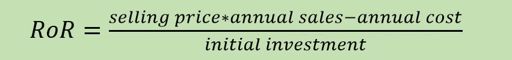
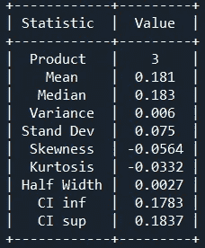
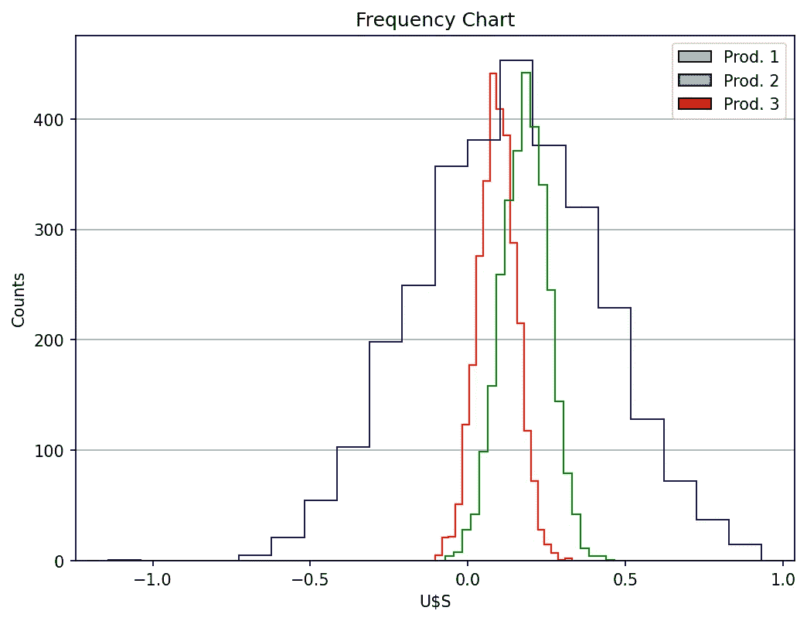

# 蒙特 卡罗模拟

> 原文：<https://towardsdatascience.com/monte-carlo-simulation-5e58f054bebb>

## **第四部分:回报率**


由 [Unsplash](https://unsplash.com?utm_source=medium&utm_medium=referral) 上 [GuerrillaBuzz Crypto PR](https://unsplash.com/@theshubhamdhage?utm_source=medium&utm_medium=referral) 拍摄的照片

蒙特卡罗方法是一组基于重复随机抽样确定多种可能结果概率的数值技术**。这是一个非常简单而有效的工具，用于解决工程、科学、商业和管理问题。**蒙特卡罗模拟(MCS)** 是一种处理静态、离散、随机模型的特殊技术，试图解决优化问题。你可以阅读我以前的文章( [MCS 第一部分](/monte-carlo-simulation-2b24fc810683)、 [MCS 第二部分、](https://medium.com/p/8db846f3d8ed#09a4-6a25f853d2de)、 [MCS 第三部分](/monte-carlo-simulation-7c198d01c531))了解更多关于该技术的细节。**

为了创建 MCS，您必须执行以下三(或四)个基本步骤:

1.建立数学模型:定义将输入变量与输出变量相关联的适当公式或方程。习惯上，MCS 涉及的数学模型从基本的商业公式到复杂的科学方程。

2.确定输入值:当我们处理随机变量时，我们必须确定它们的概率分布(将历史或经验数据拟合到相应的理论或经验分布)。

3.为每个随机输入变量创建一个非常大的数据集。**如本文和之前文章所述，通过对算法进行适当编码，可以绕过**这一步。

4.使用大量随机输入数据复制模拟，以获得输出或结果变量的随机值。使用统计方法计算结果的一些描述性统计度量(均值、中值、置信区间、偏度、峰度)。使用图表库分析输出，特别是绘制直方图来显示随机输出的基本频率分布。

# **根据收益率选择产品**

蒙特卡洛模拟的另一个实际应用包括根据不同产品相应的回报率在它们之间进行选择。回报率是特定投资在特定时期内的净收益或净损失。

假设我们有可能只生产三种产品中的一种。我们知道每种产品的售价、年销售额和成本，以及各自的初始投资。

以下是计算收益率(RoR)的经典公式:



然而，我们知道我们的成本和销售预测并不准确；有一些随机组件可以修改它们的值。因此，在做出决策之前，开发一个蒙特卡罗模拟来帮助确定最佳解决方案是很方便的。

基于历史数据，我们假设销售额正态分布，标准差等于预测年值的 10%。我们还假设年度成本均匀分布在预测年度价值的+10%和-10%之间。

现在，我们可以使用以下 Python 代码进行计算:

首先，我们导入了几个 Python 库:

```
[@author](http://twitter.com/author): darwt
"""# Import Modules

import numpy  as npfrom scipy import stats
from scipy.stats import semimport matplotlib.pyplot as plt
from matplotlib.patches import Rectangle
from prettytable import PrettyTable

your_path = 'your_path'
```

在初始化模块中，我们指出了产品销售价格、预测的年销售额、预测的年成本以及相应的初始投资。我们还指出了正态分布和均匀分布的相应参数。基于几次试运行，我们决定对生产运行使用 3000 次复制。最终置信区间的置信水平为 95%。

```
# initialization module

Number_of_Prods = 3Prod_Text          = ["Prod. 1","Prod. 2", "Prod. 3"]
Prod_Selling_Price = [54,12,5100] 
Prod_Yearly_Sales  = [10000, 500000, 200]
Prod_Yearly_Cost   = [450000,5700000,750000] 
Prod_Init_Invest   = [960000,2400000,1500000]Sales_std_dev = 0.1
Cost_unif_scale = 0.2Number_of_Replications = 3000
confidence = 0.95
```

MCS 背后的逻辑在下面几行代码中描述。我们在这些方面发展了重复随机抽样。每个样品的回报率( *ror* )用前面指出的公式计算。

```
list_of_rors = []
for j in range(Number_of_Prods):
    list_of_rors.append([])
    for run in range(Number_of_Replications):
        cost = np.random.uniform(Prod_Yearly_Cost[j]*(1-Cost_unif_scale/2), Prod_Yearly_Cost[j]*(1+Cost_unif_scale/2), 1)
        sale = np.random.normal(loc= Prod_Yearly_Sales[j], scale =Prod_Yearly_Sales[j]*Sales_std_dev, size =1)
        ror  = round(float((Prod_Selling_Price[j] * sale - cost)/ Prod_Init_Invest[j]),4)

        list_of_rors[j].append(ror)
```

我们使用 NumPy 和 SciPy 来计算经典的描述性统计量。然后，我们使用库 *PrettyTable* 来打印每个产品的统计报告。

```
 media = round(float(np.mean(list_of_rors[j])),3)
    stand = round(float(np.std(list_of_rors[j])),3)
    var   = round(float(np.var(list_of_rors[j])),3) 
    std_error = round(float(sem(list_of_rors[j])),3)

    median = round(float(np.median(list_of_rors[j])),3)
    skew   = round(float(stats.skew(list_of_rors[j])),4)
    kurt   = round(float(stats.kurtosis(list_of_rors[j])),4)

    dof  = Number_of_Replications - 1    
    t_crit = np.abs(stats.t.ppf((1-confidence)/2,dof))

    half_width=round(stand*t_crit/np.sqrt(Number_of_Replications),4)  
    inf = media - half_width
    sup = media + half_width  

    inf = round(float(inf),4)
    sup = round(float(sup),4)

    t = PrettyTable(['Statistic', 'Value'])
    t.add_row(['Product', j+1])
    t.add_row(['Mean', media])
    t.add_row(['Median', median])
    t.add_row(['Variance', var])
    t.add_row(['Stand Dev', stand])
    t.add_row(['Skewness', skew])
    t.add_row(['Kurtosis', kurt])
    t.add_row(['Half Width', half_width])
    t.add_row(['CI inf', inf])
    t.add_row(['CI sup', sup])

    print(t)
```

最后，我们用 Matplotlib 编码了一个**重叠阶梯直方图**，以显示三种产品的 RoR 的频率分布:

```
# Overlapping Step Histogramsn_bins = 20
list_of_colors = ['red', 'darkblue', 'green']fig, ax = plt.subplots(figsize=(8, 6))
ax.set_title('Frequency Chart')
ax.set_ylabel('Counts')
ax.set_xlabel('U$S')
ax.grid(axis = 'y')for j in range(Number_of_Prods):
    ax.hist(list_of_rors[j],  histtype ='step', 
            bins= n_bins, stacked = True, 
            fill = False, edgecolor= list_of_colors[j],
            density = False)# create legends
cmap = plt.get_cmap('jet')
low =  cmap(0.5)
medium=cmap(0.25)
high = cmap(0.8)handles = [Rectangle((0,0),1,1,color=c,ec="k") for c in [low,medium,high]]
labels  = Prod_Text
plt.legend(handles, labels)

plt.savefig(your_path +'MC4',bbox_inches='tight', dpi=150)
plt.show()
```

# **输出分析**

每种产品我们复制了 3000 份。我们将为每个样本计算的 RoR 添加到列表 *list_of_rors[j]* 中。然后，我们计算了经典的统计度量，并用相应的*统计报告显示出来:*



作者用 PrettyTable 做的。

图 1 将每种产品的频率分布显示为重叠的阶梯直方图。请记住，重叠直方图用于比较连续变量在两个或更多类别中的频率分布。强烈建议使用阶跃直方图同时比较两个以上的频率分布，以避免图表混乱。



图 1:作者用 Matplotlib 做的。

现在是你做决定的时候了:如果你是一个风险承受能力强的投资者，产品 2 为你提供了最高的正回报率，但也很有可能带来重大损失。另一方面，如果你是一个规避风险的投资者，产品 1 为你提供了一个相对较低的回报率，但物质损失的可能性最小。

这是如何使用蒙特卡罗模拟来预测具有随机组件的真实世界系统的可能结果范围的另一个例子。

不要忘记给小费，尤其是当你把文章添加到列表中的时候。