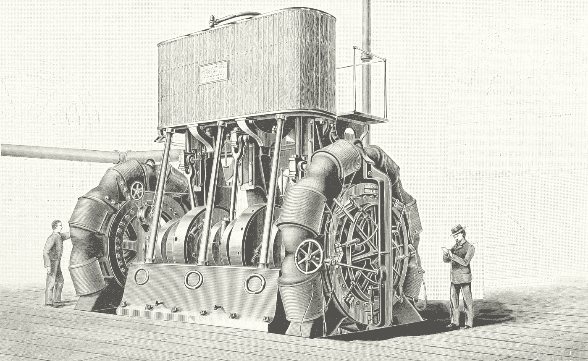
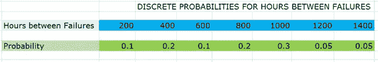
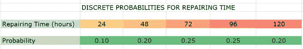
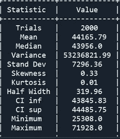
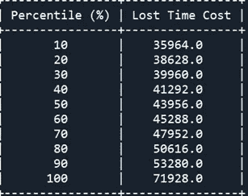
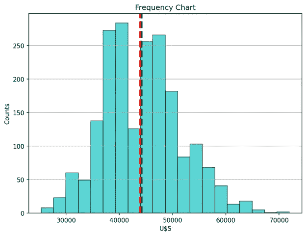
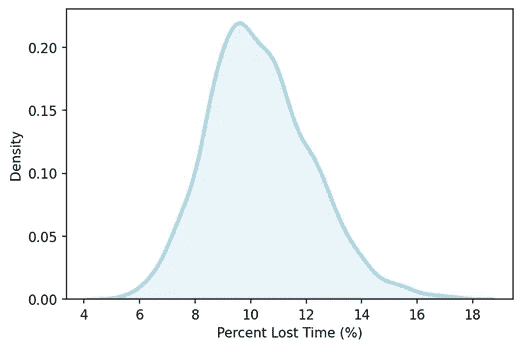

# 蒙特 卡罗模拟

> 原文：<https://towardsdatascience.com/monte-carlo-simulation-7c198d01c531>

## **第 3 部分:直方图&密度图**



由[大英图书馆](https://unsplash.com/@britishlibrary?utm_source=medium&utm_medium=referral)在 [Unsplash](https://unsplash.com?utm_source=medium&utm_medium=referral) 上拍摄的照片

[蒙特卡洛模拟](/monte-carlo-simulation-2b24fc810683) (MCS)是一种抽样实验，其目的是估计取决于一个或多个随机输入变量的感兴趣的量的分布。

MCS 的开发包括**三个基本步骤**:

1.建立一个预测模型，明确识别因变量(结果、未知的关注量、待评估的函数)和自变量(随机输入变量)。

2.确定输入变量的概率分布。标准程序包括分析经验或历史数据，并使数据符合特定的分布。当这些数据不可用时，选择一个合适的概率分布并明智地选择其参数。

3.多次重复模拟，获得输出或因变量的随机值。使用统计方法计算一些描述性的统计指标，并绘制图表，如结果变量的直方图或密度图。

正如在[之前的一篇文章中所指出的，](https://medium.com/p/8db846f3d8ed#09a4-6a25f853d2de)我们可以使用蒙特卡洛模拟来定量说明业务或运营管理任务中的风险。

# **机器故障&修理**

蒙特卡洛模拟的实际应用包括制造操作，其中机器故障之间的时间和它们相应的修理时间是随机变量。

假设一个大工厂，其中一个处理单元每年 335 天每天 24 小时运行(30 天用于人员休假和年度维护)。管理层希望购买另一个处理单元来生产另一个最终产品。他们知道这样的处理单元会导致随机的机械故障，这需要非常熟练的维修团队。因此，每一次故障都代表着一笔重要的成本。

管理层决定进行蒙特卡洛模拟，从数字上评估与新项目相关的风险。

当前处理单元的历史数据显示，机器故障间隔时间具有以下经验分布:



修理这种处理单元所需的时间具有以下经验分布:



# **用于蒙特卡洛模拟的 Python 代码**

下面的 Python 代码允许我们开发一个 MCS 来对新投资所涉及的风险进行数字评估:

首先，我们导入了几个 Python 库:

NumPy:Python 编程语言的一个库，为创建大型多维向量和矩阵提供支持，并提供大量高级数学函数来操作它们。

*SciPy*:Python 的免费开源库。基于 NumPy，包含统计、线性代数、最优化、插值、信号处理和其他科学和工程常用方法的模块。

*Matplotlib* 和 *Seaborn* 是用于制图的传统 Python 库。

*PrettyTable* 是一个 Python 库，用于以视觉上吸引人的 ASCII 表格格式轻松显示表格数据。

```
[@author](http://twitter.com/author): darwt
"""# Import Modules
import numpy  as npfrom scipy import stats
from scipy.stats import semimport matplotlib.pyplot as plt
import seaborn as sns 
from prettytable import PrettyTable

your_path = 'your path'
```

现在我们指出每年的运行小时数、维修团队产生的每小时成本、故障间隔运行小时数的经验分布以及维修所需的经验分布。

```
# initialization module

Operating_hours_year = 335 * 24Cost_LostTime_hour = 55.50    
# .........................................
# historical data of hours of operation between failures (HbF)
Hours_between_Failures = [200, 400, 600, 800, 1000, 1200, 1400]# discrete probabilities for hours of operation between failures
probabilities_HBF = [0.1, 0.2, 0.1, 0.2, 0.3, 0.05, 0.05]# historical data of hours needed to repair (TTR)
Time_to_Repair = [24, 48, 72, 96, 120]probabilities_TTR =[0.10, 0.20, 0.25, 0.25, 0.20]
```

我们设置了大量的重复，因此我们的样本平均值将非常接近预期值。我们还定义了置信区间(CI)的置信水平。

```
Number_of_Replications = 2000confidence = 0.95                      ## selected by the analyst# Lists to be filled during calculations
list_of_HBF,    list_of_TTR = [], []
list_Lost_Time, list_cost_TTR = [], []
list_Hours_Prod = []
```

MCS 背后的逻辑在下面几行代码中描述。我们有两个循环:外部循环(*用于在范围(复制次数)内运行)*与运行或复制次数相关；内环(*而 acum _ time<= Operating _ hours _ year*)与年度生产和故障有关。我们用了两次 *np* 。 *random.choice* 根据相应的概率，从两个经验分布中产生一个大小为 1 的随机样本。

```
for run in range(Number_of_Replications):
    acum_time, acum_hbf, acum_ttr = 0, 0, 0
    while acum_time <= Operating_hours_year:
        HBF = np.random.choice(Hours_between_Failures, 
                               1, p=list(probabilities_HBF)) 
        TTR = np.random.choice(Time_to_Repair,
                               1, p=list(probabilities_TTR))
        acum_time += (HBF + TTR)
        acum_hbf  += HBF
        acum_ttr  +=TTR

    Total_HBF = round(float(acum_hbf),4)
    Total_TTR = round(float(acum_ttr),4)
    Perc_lost_Time = round(float(Total_TTR/Total_HBF * 100),2)
    Hours_Prod = Operating_hours_year - Total_TTR
    Cost_TTR   = Total_TTR * Cost_LostTime_hour

    list_of_HBF.append(Total_HBF)
    list_of_TTR.append(Total_TTR) 
    list_Lost_Time.append(Perc_lost_Time)

    list_cost_TTR.append(Cost_TTR)
    list_Hours_Prod.append(Hours_Prod)
```

我们使用 NumPy 和 SciPy 来计算关键的描述性统计指标，特别是我们的主要结果*Cost _ TTR = Total _ TTR * Cost _ lost time _ hour*的百分位表*。此输出变量表示与机器故障和相应维修时间相关的成本。媒体代表了这种成本的预期值。*

```
media =  round(np.mean(list_cost_TTR),2)
median = round(np.median(list_cost_TTR),2)
var   = round(np.var(list_cost_TTR), 2) 
stand = round(np.std(list_cost_TTR),2)std_error = round(sem(list_cost_TTR),2)skew   = round(stats.skew(list_cost_TTR),2)
kurt   = round(stats.kurtosis(list_cost_TTR),2)minimum = round(np.min(list_cost_TTR),2)
maximum = round(np.max(list_cost_TTR),2)dof  = Number_of_Replications - 1    
t_crit = np.abs(stats.t.ppf((1-confidence)/2,dof))half_width =  round(stand *t_crit/np.sqrt(Number_of_Replications),2)  
inf = media - half_width
sup = media + half_width  

inf = round(float(inf),2)
sup = round(float(sup),2)
```

我们将 *PrettyTable* 用于统计报告和百分比报告:

```
t = PrettyTable(['Statistic', 'Value'])
t.add_row(['Trials', Number_of_Replications])
t.add_row(['Mean', media])
t.add_row(['Median', median])
t.add_row(['Variance', var])
t.add_row(['Stand Dev', stand])
t.add_row(['Skewness', skew])
t.add_row(['Kurtosis', kurt])
t.add_row(['Half Width', half_width])
t.add_row(['CI inf', inf])
t.add_row(['CI sup', sup])
t.add_row(['Minimum', minimum])
t.add_row(['Maximum', maximum])
print(t)percents = np.percentile(list_cost_TTR, [10, 20, 30, 40, 50, 60, 70, 80, 90, 100])p = PrettyTable(['Percentile (%)', 'Lost Time Cost'])
p.add_row(['  10  ', percents[0]])
p.add_row(['  20  ', percents[1]])
p.add_row(['  30  ', percents[2]])
p.add_row(['  40  ', percents[3]])
p.add_row(['  50  ', percents[4]])
p.add_row(['  60  ', percents[5]])
p.add_row(['  70  ', percents[6]])
p.add_row(['  80  ', percents[7]])
p.add_row(['  90  ', percents[8]])
p.add_row([' 100  ', percents[9]])
print(p)
```

最后，我们使用 Matplotlib 和 Seaborn 制作图表:一个直方图显示了每年预期损失时间成本的潜在频率分布，一个密度图显示了由于故障和维修造成的损失时间百分比的概率密度函数。

```
# Lost Time Cost Histogramn_bins = 20fig, ax = plt.subplots(figsize=(8, 6))
ax.hist(list_cost_TTR,  histtype ='bar', bins=20, color = 'c',
         edgecolor='k', alpha=0.65, density = False)  # density=False show countsax.axvline(media,  color='g', linestyle='dashed', linewidth=3)
ax.axvline(median, color='r', linestyle='dashed', linewidth=3)

ax.set_title('Frequency Chart')
ax.set_ylabel('Counts')
ax.set_xlabel('U$S')
ax.grid(axis = 'y')plt.savefig(your_path +'Expected Lost Time Cost per Year',
            bbox_inches='tight', dpi=150)
plt.show()# Percent Lost Time Cost Density Plotsns.distplot(list_Lost_Time, hist=False, kde=True, 
             bins=int(180/5), color = 'lightblue', 
             axlabel = 'Percent Lost Time (%)',
             hist_kws={'edgecolor':'black'},
             kde_kws = {'shade': True, 'linewidth': 3})plt.savefig(your_path + 'Percent Lost Time' , 
            bbox_inches='tight', dpi=150)          
plt.show()
```

# **输出分析**

我们做了 2000 次复制，附加了几个列表。然后，我们计算了与机器故障和相应维修时间相关的成本的关键描述性统计指标。下表显示了*统计报告:*



表 1，作者用 PrettyTable 做的。

表 1 显示平均值和中值之间的差异很小，半宽度区间几乎可以忽略不计。结果分布是正偏的，峰度可以忽略不计。

表 2 显示了百分位数报告。我们可以看到，损失的时间成本超过 5000 万美元的可能性超过 20%。



表 2，作者用 PrettyTable 做的。

图 1 显示了我们的结果的分布(*损失时间成本*)作为一个有 20 个箱的直方图。平均值和中值分别用绿色和红色垂直线表示。像往常一样，直方图提供了我们感兴趣的量的分布的可视化表示:它的位置、分布、偏斜度和峰度。我们声称期望值(95%置信水平)在 44.000 美元左右。



图 1，作者用 Matplotlib 做的。

图 2 显示了输出变量*百分比损失时间的密度图。*请记住，密度图的关键思想是消除直方图的锯齿特征，从而更好地显示分布形状。

显然，分布是单峰的。我们声称，由于机器故障，平均会损失 10%的工作时间。



图 2，作者和 Seaborn 一起做的。

蒙特卡洛模拟是决策者和项目经理用来定量评估风险影响的计算技术。任何模拟研究的基本步骤是对输出数据进行适当的统计分析。统计报告和分布图(直方图和密度图)对于评估风险暴露水平是强制性的。

不要忘记给小费，尤其是当你把文章添加到列表中的时候。