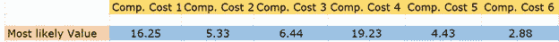
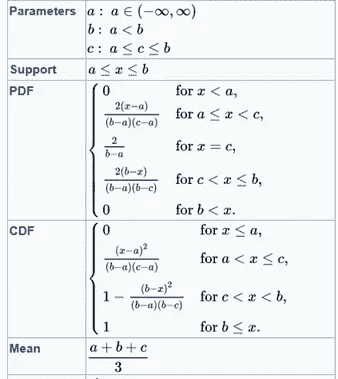
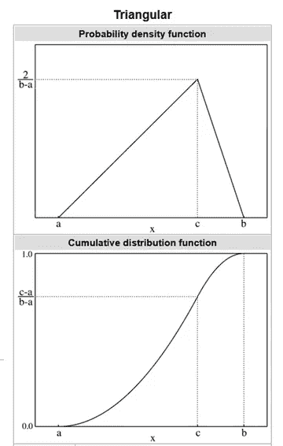
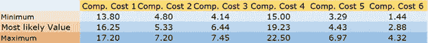
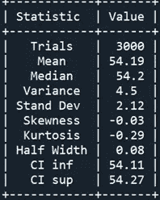
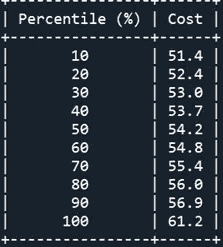
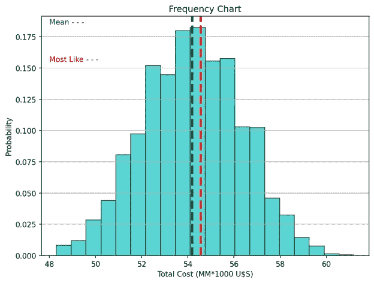
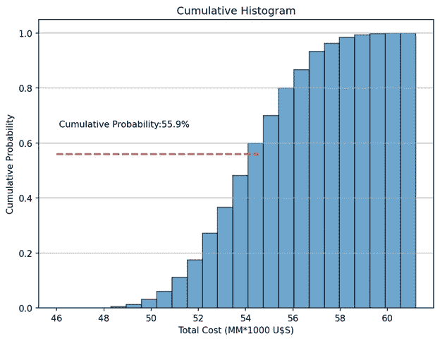

# 蒙特 卡罗模拟

> 原文：<https://towardsdatascience.com/monte-carlo-simulation-8db846f3d8ed>

## **第二部分:风险分析**


[梅里达勒](https://unsplash.com/@meric?utm_source=medium&utm_medium=referral)在 [Unsplash](https://unsplash.com?utm_source=medium&utm_medium=referral) 上的照片

在本系列的[上一篇文章](/monte-carlo-simulation-2b24fc810683)中，我们将**蒙特卡罗模拟** (MCS)定义为“一个抽样实验，其目的是估计取决于一个或多个随机输入变量的感兴趣的量的分布”。我们为研究中的问题建立一个数学模型，并通过重复采样来估计其结果。该方法提供了模拟结果的分布，从中可以很容易地获得图表和汇总统计数据。

另一方面，**风险**被定义为不良结果发生的概率。**定量风险分析**是用数字资源估计任何项目风险的数值程序。

因此，如果蒙特卡洛模拟提供了一系列可能的结果及其相应的概率，我们就可以用它来量化决策中的风险。

我们将举例说明蒙特卡罗模拟来说明投资项目中的风险。

# **投资项目的风险分析**

大型投资项目、股票投资组合的回报、规划建设时间表以及类似项目都是必须进行风险分析的典型情况。我们必须能够回答这样的问题:成本超过收益的可能性有多大？我们遭受财务损失的可能性有多大？这个项目按时完成的可能性有多大？在我们投资第一美元之前，我们应该对这些问题进行评估。

让我们假设实施一个重要投资项目的决定权在我们手中。该项目有六个成本组成部分:国际贸易商品、当地贸易商品、劳动力、设备和机械、土地征用、税收和财务成本。这些组成部分的总和就是项目的最终成本。

我们的首要任务是获得每项成本的**最可能值**的估计值。表 1 显示了每个成本组成部分最可能的值。相应的总成本为 54.56 百万美元



表 1:最可能的值

当然，如果我们完全确定成本计算的准确性，剩下的唯一任务就是将六个组成部分相加以显示最终成本。但当项目达到一定规模时，这种情况在实践中很少出现。在一个真实的项目中，每一个组成部分都会表现出一定程度的随机性，**我们必须进行风险分析** **来量化不良结果的概率。**

在缺乏严格数据的情况下，习惯上使用**三角分布**作为未知输入分布**的粗略近似值。**三角分布只取决于三个参数:最小值(a)、最大可能性和最大值(b)。这种分布简单、灵活，并且可以呈现各种形状。



三角形分布的参数和公式，来源:维基百科[1]



三角形分布的 PDF 和 CDF 图表，来源:维基百科[1]

表 2 显示了每个成本构成的参数值。



表 2:每个组件的参数

# **MCS 的 Python 代码**

以下 Python 代码允许我们开发一个带有统计摘要和频率直方图的 MCS:

首先，我们将 Numpy 库作为 *np* 导入，将 Scipy 用于一些统计计算，将 Matplotlib 和 PrettyTable 用于最终输出。

```
[@author](http://twitter.com/author): darwt
"""# Import Modulesimport numpy  as npfrom scipy import stats
from scipy.stats import sem
from scipy.stats import percentileofscoreimport matplotlib.pyplot as plt
from prettytable import PrettyTable

your_path = your path 
```

以下三个列表描述了三角形分布的参数:

```
minimum   = [13.80, 4.80, 4.14, 15.00, 3.29, 1.44]
most_like = [16.25, 5.33, 6.44, 19.23, 4.43, 2.88]
maximum   = [17.20, 7.20, 7.45, 22.50, 6.97, 4.32]Sum_most_like = sum(most_like)

Number_of_Component_Costs = 6
```

为了用 MCS 获得有效的结果，我们需要进行大量的重复。我们还定义了置信区间(CI)的置信水平。

```
Number_of_Replications = 3000confidence = 0.95
```

MCS 背后的逻辑在以下代码行中描述:

```
list_of_costs = []
for run in range(Number_of_Replications):
    acum_cost = 0
    for i in range(Number_of_Component_Costs):
        cost = np.random.triangular(minimum[i], 
                                    most_like[i],  maximum[i], 1)
        acum_cost +=cost

    Total_Cost = round(float(acum_cost),1)

    list_of_costs.append(Total_Cost)
```

我们使用 Numpy 和 Scipy 获得关键描述性统计指标的汇总，特别是一个*百分位表。*

```
media = round(np.mean(list_of_costs),2)
stand = round(np.std(list_of_costs),2)
var   = round(np.var(list_of_costs),2) 
std_error = round(sem(list_of_costs),2)median = round(np.median(list_of_costs),2)
skew   = round(stats.skew(list_of_costs),2)
kurt   = round(stats.kurtosis(list_of_costs),2)dof  = Number_of_Replications - 1    
t_crit = np.abs(stats.t.ppf((1-confidence)/2,dof))half_width =  round(stand *t_crit/np.sqrt(Number_of_Replications),2)  
inf = media - half_width
sup = media + half_width  

inf = round(float(inf),2)
sup = round(float(sup),2)t = PrettyTable(['Statistic', 'Value'])
t.add_row(['Trials', Number_of_Replications])
t.add_row(['Mean', media])
t.add_row(['Median', median])
t.add_row(['Variance', var])
t.add_row(['Stand Dev', stand])
t.add_row(['Skewness', skew])
t.add_row(['Kurtosis', kurt])
t.add_row(['Half Width', half_width])
t.add_row(['CI inf', inf])
t.add_row(['CI sup', sup])
print(t)percents = np.percentile(list_of_costs,[10, 20, 30, 40, 50, 
                                        60, 70, 80, 90, 100])p = PrettyTable(['Percentile (%)', 'Cost'])
p.add_row(['  10  ', percents[0]])
p.add_row(['  20  ', percents[1]])
p.add_row(['  30  ', percents[2]])
p.add_row(['  40  ', percents[3]])
p.add_row(['  50  ', percents[4]])
p.add_row(['  60  ', percents[5]])
p.add_row(['  70  ', percents[6]])
p.add_row(['  80  ', percents[7]])
p.add_row(['  90  ', percents[8]])
p.add_row([' 100  ', percents[9]])
print(p)
```

最后，我们绘制了两个图表:结果变量(*总成本*)的直方图，包括一条指示媒体的绿色垂直线，以及另一条指示最可能值的垂直线(红色)。第二个图表是累积直方图，显示了最终成本低于最可能值的概率。

```
percentile_of_most_like = round(percentileofscore(list_of_costs, Sum_most_like),2)n_bins = 20fig, ax = plt.subplots(figsize=(8, 6))
ax.hist(list_of_costs,  histtype ='bar', bins=20, color = 'c',
        edgecolor='k', alpha=0.65,
        density = True)  # density=False show countsax.axvline(media, color='g', linestyle='dashed', linewidth=3)
ax.axvline(Sum_most_like, color='r', 
           linestyle='dashed', linewidth=3)
ax.text(48,0.185, 'Mean - - -', color = 'green'  )
ax.text(48,0.155, 'Most Like - - -', color = 'red'  )ax.set_title('Frequency Chart')
ax.set_ylabel('Probability')
ax.set_xlabel('Total Cost (MM*1000 U$S)')
ax.grid(axis = 'y')plt.show()fig, ax = plt.subplots(figsize=(8, 6))
n, bins, patches = ax.hist(list_of_costs, n_bins,
                           density=True, histtype='bar',
                           cumulative=True, edgecolor='k',
                           alpha = 0.65)
ax.hlines(percentile_of_most_like/100, 46, Sum_most_like, 
          color='r', linestyle='dashed', linewidth=2)
ax.text(46 + 0.1, percentile_of_most_like/100 + 0.1, 
        'Cumulative Probability:' + str(percentile_of_most_like) +'%',rotation=360)ax.set_title('Cumulative Histogram')
ax.set_ylabel('Cumulative Probability')
ax.set_xlabel('Total Cost (MM*1000 U$S)')
ax.grid(axis = 'y')plt.show()
```

# **分析**

我们进行了 3000 次复制，将每次复制的总成本附加到一个列表中(*list _ of _ costs . append(Total _ Cost*)。然后，我们计算了关键的描述性统计指标:



表 3:统计报告

表 3 显示，平均值和中值实际上具有相同的值，半宽度区间几乎可以忽略不计，并且分布具有零偏斜度和几乎为零峰度。



表 4:百分位报告

表 4 显示了百分比报告。我们认为总成本低于 5300 万美元的可能性等于或小于 30%。

图 1 显示了我们的结果的分布(*总成本*)作为一个有 20 个箱的直方图。平均成本和最可能成本分别用绿色和红色垂直线表示。请记住，直方图提供了数据集分布的可视化表示:数据的位置、分布、偏斜度和峰度。显然，分布的外观与统计报告中指示的值相匹配。



图 1:作者用 Matplotlib 做的频率表

**涉及风险的问题可以用累积直方图**来回答(图 2)。红色水平线对应最可能值的百分位数。超出我们预测成本的概率为 44.1%(100–55.9)。现在，**我们可以用数字来评估与我们投资项目相关的风险。**



图 2:作者用 Matplotlib 制作的累积直方图

如果开发得当，蒙特卡罗模拟是一种相对简单的数值技术，可以对极具挑战性的项目进行风险分析。

不要忘记给作者小费，尤其是当你把这篇文章添加到列表中的时候。

# 参考

[1]:[https://en.wikipedia.org/wiki/Triangular_distribution](https://en.wikipedia.org/wiki/Triangular_distribution)