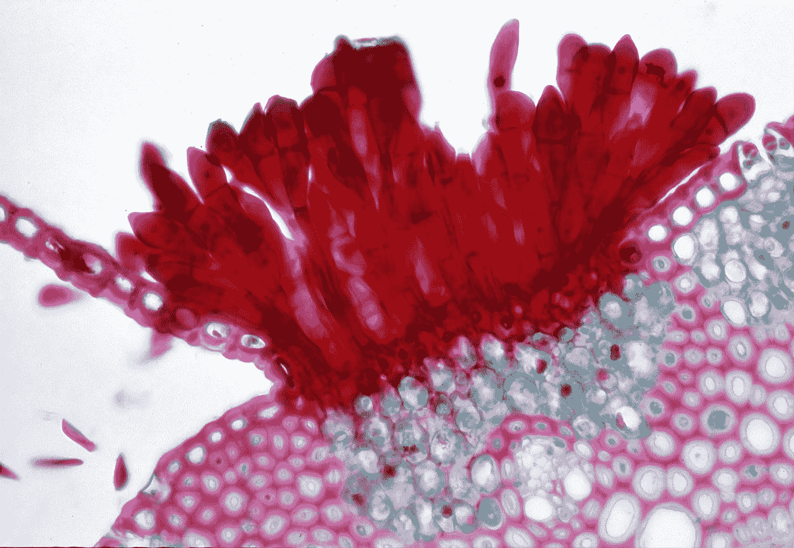
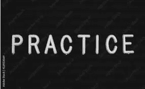
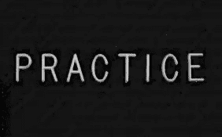
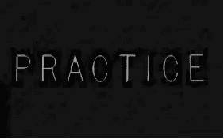
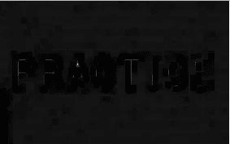
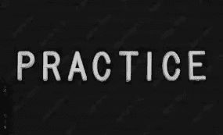
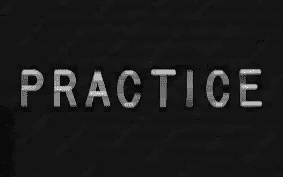
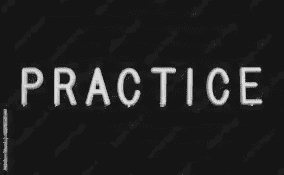
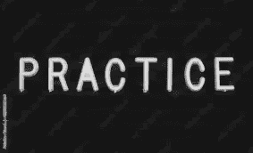
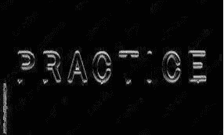

# OpenCV 中图像预处理的形态学操作，详细

> 原文：<https://towardsdatascience.com/morphological-operations-for-image-preprocessing-in-opencv-in-detail-15fccd1e5745>



[疾控中心](https://unsplash.com/@cdc?utm_source=medium&utm_medium=referral)在 [Unsplash](https://unsplash.com?utm_source=medium&utm_medium=referral) 拍摄的照片

## 侵蚀、扩张、打开、关闭、形态梯度、tophat / whitehat 和 blackhat 用例子解释

在我的上一篇文章中，我写了关于 OpenCV 中[的一些基本图像处理。今天，我们将进一步研究图像处理中常用的形态学运算。形态学操作用于提取区域、边缘、形状等。](/some-basic-image-preprocessing-operations-for-beginners-in-python-7d297316853b)

## 什么是形态学运算？

对二值图像执行形态学操作。二进制图像可能包含许多缺陷。尤其是通过一些简单的阈值化操作(如果你不熟悉阈值化，现在不用担心它)产生的二值图像可能包含大量的噪声和失真。OpenCV 库中提供了不同的形态学操作来处理这些噪声和缺陷。

形态学操作生成与原始图像形状相同的图像。形态学操作将结构化元素应用于输入图像。结构化元素可以是任何形状。在我们今天将要学习的所有形态学运算中，输入图像的每个像素都与相邻像素进行比较，以产生输出图像。

对于不同的形态学操作，比较发生的方式不同。我们将详细讨论这一点。

在深入研究这个问题之前，下面是我们将在本教程中使用的图片:



作者图片

在这里，我们导入必要的包，将图像作为数组读取，并将其转换为二进制图像。正如我们前面提到的，形态学运算应用于二进制图像:

```
import cv2 
import matplotlib.pyplot as plt
#Reading the image to an array
image = cv2.imread('practice.jpg')

#converting it to a binary image
gray = cv2.cvtColor(image, cv2.COLOR_BGR2GRAY)
```

这是“灰色”的样子:


作者图片

我们将使用这个灰度图像来看看形态学操作是如何工作的。

在深入例子之前，我想**创建一个 3x3 内核和一个 6x3 内核**:

```
kernel = cv2.getStructuringElement(cv2.MORPH_RECT, (3, 3))
kernel1 = cv2.getStructuringElement(cv2.MORPH_RECT, (6, 3))
```

我们将在下面的形态学操作中使用这两个内核。如果有必要，我们以后会创建更多的内核。

> 核仁可以是任何形状。请尝试其他不同形状的内核，如 1x4、4x4、5x5、7x18 或更多。根据您的项目，内核的形状和大小会有很大的不同。

## 侵蚀

侵蚀就像它听起来那样。它侵蚀一幅图像就像水侵蚀河岸一样。在腐蚀操作中，它从左到右和从上到下滑动输入图像的结构元素。如果结构元素内的所有像素都大于 0，则保持原始像素值。否则，像素被设置为 0。

腐蚀用于去除被认为是噪声的小斑点。

侵蚀的语法如下:

```
eroded1 = cv2.erode(gray.copy(), kernel, iterations = 1)
cv2.imwrite('erode1.jpg', eroded1)
```

侵蚀函数 cv2.erode()使用图像、结构化元素和迭代次数。“迭代”参数在这里是可选的。如果您不提供“迭代次数”值，它会自动进行一次迭代。

以下是“erode1”的样子:



作者图片

与原始图像进行比较。它被侵蚀掉了。此外，原始图像中的其他小元素也被删除。

> 在任何 OCR(光学字符识别)项目中，我们只想识别字母或数字。但是图像中可能有其他更小的字母和元素会混淆你的算法。侵蚀可以消除这些噪音。

如果我们尝试 2 或 3 次迭代，它将被更多地侵蚀:

```
eroded2 = cv2.erode(gray.copy(), kernel, iterations = 2)
cv2.imwrite('erode2.jpg', eroded2)

eroded3 = cv2.erode(gray.copy(), kernel, iterations = 3)
cv2.imwrite('erode3.jpg', eroded3)
```

这些分别是 2 次和 3 次迭代的结果:



作者图片



作者图片

正如你所看到的，随着迭代次数的增加，图像越来越模糊。因此，如果您需要提取粗体且周围有大量噪声的字母，可以通过侵蚀图像来消除噪声。

## 扩张

膨胀的作用与侵蚀正好相反。它增加了前景，从而有助于连接断裂的部分。腐蚀后可以用它来连接破损的部分。在膨胀中，如果结构元素中的任何像素大于 0，则结构元素中的像素值被设置为白色或 255。我们在这里使用 1 次和 3 次迭代的膨胀来查看差异并理解它是如何工作的。

```
dilated1 = cv2.dilate(gray.copy(), kernel, iterations=1)
cv2.imwrite('dilate1.jpg', dilated1)

dilated3 = cv2.dilate(gray.copy(), kernel, iterations=3)
cv2.imwrite('dilate3.jpg', dilated3)
```

这些分别是 1 次迭代(第二次图像)和 3 次迭代(第三次图像)膨胀后的图像。原来的灰色图像在上面。


作者图片


作者图片


作者图片

如果我们将顶部的原始图像与具有一次膨胀迭代的第二图像进行比较，则存在微小的差异，并且在 3 次迭代之后，差异变得更加显著。根据您的项目，您可以根据需要使用任意多的迭代。

## 开始

开口也是从图像中去除噪声的另一种方式。在一次迭代中，它先腐蚀，然后膨胀。这里有两个例子，我使用了我们在开始时准备的 kernel 和 kernel1:

```
opening1 = cv2.morphologyEx(gray, cv2.MORPH_OPEN, kernel)
cv2.imwrite('open1.jpg', opening1)

opening2 = cv2.morphologyEx(gray, cv2.MORPH_OPEN, kernel1)                         )
cv2.imwrite('open2.jpg', opening2)
```

在这里，我将原始图像放在顶部，然后是“打开 1”操作的图像，在底部是“打开 2”操作的图像。


作者图片



作者图片



作者图片

正如你所看到的，在中间的图片中，我们使用了一个 3x3 的内核，左下角的小文本不见了，在底部的图片中，我们使用了 6x3 大小的内核 1，添加了一个黑色的阴影

## 关闭

听起来，关闭是打开的反义词。在闭合时，膨胀首先发生，然后是侵蚀。

让我们来看一些例子:

```
closing1 = cv2.morphologyEx(gray.copy(), cv2.MORPH_CLOSE, kernel, iterations=1)
cv2.imwrite('close1.jpg', closing1)

closing3 = cv2.morphologyEx(gray.copy(), cv2.MORPH_CLOSE, (3, 3), iterations=3)
cv2.imwrite('close3.jpg', closing3)
```

像以前一样，我将原始的灰色图像放在顶部进行比较，然后是“关闭 1”和“关闭 2”的输出。


作者图片



作者图片



作者图片

## 形态梯度

形态学梯度对于检测物体的轮廓是有用的。它可以用于边缘检测。基本上，这是膨胀和腐蚀操作之间的区别。

这是两个使用 kernel 和 kernel1 的例子:

```
grad1 = cv2.morphologyEx(gray.copy(), cv2.MORPH_GRADIENT, kernel)
cv2.imwrite('grad1.jpg', grad1)

grad2 = cv2.morphologyEx(gray.copy(), cv2.MORPH_GRADIENT, kernel1)
cv2.imwrite('grad3.jpg', grad2)
```

这些是来自“梯度 1”和“梯度 2”的输出图像:


作者图片



作者图片

如你所见，两种不同形状的内核为我们提供了两种不同类型的输出。

## 托哈特/怀特哈特

tophat 操作是原始二进制图像和开之间的差异。当你需要从黑暗的背景中找到一个明亮的区域时，这是很有帮助的。

我们将为这个操作和其余操作使用不同的输入图像:

以下是输入图像:


作者图片

这辆车的号牌是白的比车亮。让我们看看如何提取白色区域。像往常一样，我们应该把它转换成灰度图像，我们将定义两个不同的内核。

```
image = cv2.imread('car.jpg')
gray = cv2.cvtColor(image, cv2.COLOR_BGR2GRAY)

kernel = cv2.getStructuringElement(cv2.MORPH_RECT, (23, 5))

kernel1 = cv2.getStructuringElement(cv2.MORPH_RECT, (35, 8))
```

我尝试了几种不同形状的内核，然后使用这两种内核大小。请随意尝试其他内核大小并比较结果。下面是 tophat 的操作:

```
tophat1 = cv2.morphologyEx(gray.copy(), cv2.MORPH_TOPHAT, kernel1)
cv2.imwrite('tophat1.jpg', tophat1)
```

以下是输出图像:


作者图片

看，它从车本身检测出车牌的亮区。

## 黑帽子

黑帽行动正好相反。

```
blackhat1 = cv2.morphologyEx(gray.copy(), cv2.MORPH_BLACKHAT, kernel)
cv2.imwrite('blackhat1.jpg', blackhat1)
```

这是 blackhat 操作的输出:


作者图片

如果你注意到，它集中在号码牌的字母上。

> 在 tophat 之后，车牌区域被检测到，在 blackhat 之后，白色车牌上的黑色字母被突出显示。

因此，如果我们想从号码牌中检测出数字，我们将执行 tophat 操作，然后执行黑帽操作。

## 结论

本文试图举例说明一些著名的形态学运算。在以后的一些文章中，我会用它们来解决一些现实问题。那会更有趣。

## 更多阅读

[](/some-basic-image-preprocessing-operations-for-beginners-in-python-7d297316853b) [## Python 初学者的一些基本图像预处理操作

### OpenCV 初学者:移动或平移、调整大小和裁剪

towardsdatascience.com](/some-basic-image-preprocessing-operations-for-beginners-in-python-7d297316853b) [](/how-to-define-custom-layer-activation-function-and-loss-function-in-tensorflow-bdd7e78eb67) [## 如何在 TensorFlow 中定义自定义图层、激活函数和损失函数

### 一步一步的解释和完整代码的例子

towardsdatascience.com](/how-to-define-custom-layer-activation-function-and-loss-function-in-tensorflow-bdd7e78eb67) [](/a-step-by-step-tutorial-to-develop-a-multi-output-model-in-tensorflow-ec9f13e5979c) [## 在 TensorFlow 中开发多输出模型的分步教程

### 有完整的代码

towardsdatascience.com](/a-step-by-step-tutorial-to-develop-a-multi-output-model-in-tensorflow-ec9f13e5979c) [](https://pub.towardsai.net/some-simple-but-advanced-styling-in-pythons-matplotlib-visualization-107f3be56a24) [## Python 的 Matplotlib 可视化中的一些简单但高级的样式

### 给你的 Python 图添加一些额外的味道

pub.towardsai.net](https://pub.towardsai.net/some-simple-but-advanced-styling-in-pythons-matplotlib-visualization-107f3be56a24) [](/precision-recall-and-f1-score-of-multiclass-classification-learn-in-depth-6c194b217629) [## 多类分类的精确度、召回率和 F1 分数—深入学习

### 从混淆矩阵手动计算和 sklearn 库的语法

towardsdatascience.com](/precision-recall-and-f1-score-of-multiclass-classification-learn-in-depth-6c194b217629) [](/complete-explanation-on-sql-joins-and-unions-with-examples-in-postgresql-cbd868fe9e95) [## 用 PostgreSQL 中的例子完整解释 SQL 连接和联合

### 所有常用的连接类型和一些有趣的类型

towardsdatascience.com](/complete-explanation-on-sql-joins-and-unions-with-examples-in-postgresql-cbd868fe9e95)