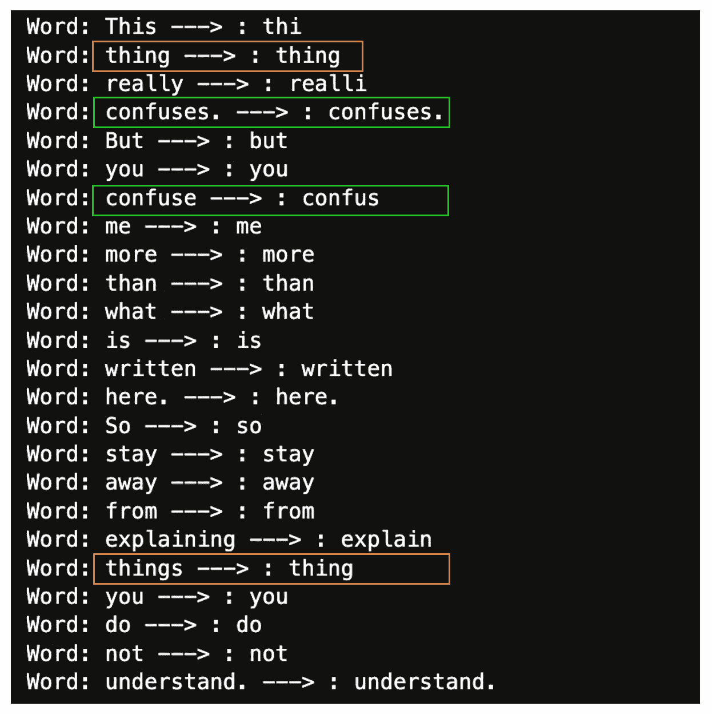
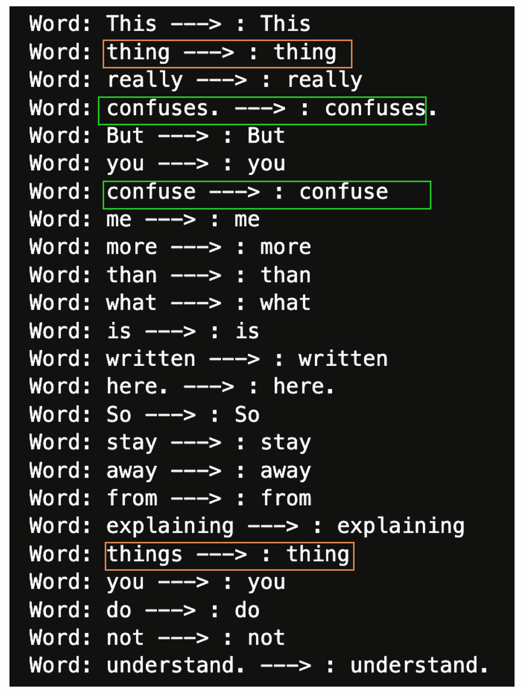
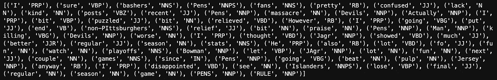

# 自然语言处理中最常见的文本处理任务

> 原文：<https://towardsdatascience.com/most-common-text-processing-tasks-in-natural-language-processing-d8cd7a076b79>

## 计算机没有人类的能力，文本数据需要处理，以便更好地理解和解释

# 介绍

人类具有理解书面文本信息的能力。另一方面，机器不具备这种内在能力。这就是文本处理变得重要的地方，因为它允许这些机器理解和分析自然语言。

在这篇概念性文章中，我们将解释如何使用流行的 Python 库(如 NLTK 和 Spacy)执行最常见的文本处理任务。

# 最常见的任务

文本预处理包括标记化、停用词去除、词干化和词条化、词性标注和命名实体识别。本节重点解释它们中的每一个及其 python 实现。

## 先决条件

首先，您需要在计算机上安装 Python 以及以下库:

*   NLTK
*   空间
*   sci kit-学习

您可以使用 Python 包管理器`pip`安装这些库，如下所示:

```
# Install NLTK
pip install nltk

# Install Spacy
pip install spacy

# Install Scikit-learn
pip install scikit-learn
```

现在，让我们导入必要的模块并加载用于实验的数据集。我们将使用 Scikit-learn 中内置的新闻文章数据。

```
import nltk
import spacy
nltk.download('punkt')
from sklearn.datasets import fetch_20newsgroups
```

然后，我们可以使用`fetch_20newsgroups`函数通过访问`data`属性来下载和加载新闻数据，如下所示:

```
news_data = fetch_20newsgroups(subset='all')
articles = news_data.data
```

让我们看看第一条:

```
print(articles[0])
```

这将生成以下输出:

```
From: Mamatha Devineni Ratnam <@andrew.cmu.edu">mr47+@andrew.cmu.edu>
Subject: Pens fans reactions
Organization: Post Office, Carnegie Mellon, Pittsburgh, PA
Lines: 12
NNTP-Posting-Host: po4.andrew.cmu.edu

I am sure some bashers of Pens fans are pretty confused about the lack
of any kind of posts about the recent Pens massacre of the Devils. Actually,
I am  bit puzzled too and a bit relieved. However, I am going to put an end
to non-PIttsburghers' relief with a bit of praise for the Pens. Man, they
are killing those Devils worse than I thought. Jagr just showed you why
he is much better than his regular season stats. He is also a lot
fo fun to watch in the playoffs. Bowman should let JAgr have a lot of
fun in the next couple of games since the Pens are going to beat the pulp out of Jersey anyway. I was very disappointed not to see the Islanders lose the final
regular season game.          PENS RULE!!!
```

既然一切都设置好了，是时候深入每个任务了，从标记化开始。

## 标记化

这是文本处理中最简单的步骤，包括将文本分割成标记。生成的令牌取决于底层的令牌化方法。例如:

*   单词标记化生成单词。
*   句子标记化将文本分割成句子。

使用`NLTK`库中的`work_tokenize()`和`sent_tokenize()`函数分别执行单词和句子的分词。

```
# Import word and sentence tokenizers
from nltk.tokenize import word_tokenize, sent_tokenize
```

在用前一篇文章的第二个代码块初始化变量`first_article`之后，我们可以继续进行标记化，如下所示:

```
# Generate Word tokens
word_tokens = word_tokenize(first_article)

# Generate Sentence Tokens
sentence_tokens = sent_tokenize(first_article)

# Print the results
print(word_tokens)
print(sentence_tokens)
```

前面的`print`语句应该会生成这些输出。第一个是单词标记，第二个是句子标记。

```
['I', 'am', 'sure', 'some', 'bashers', 'of', 'Pens', 'fans', 'are', 'pretty', 'confused', 'about', 'the', 'lack', 'of', 'any', 'kind', 'of', 'posts', 'about', 'the', 'recent', 'Pens', 'massacre', 'of', 'the', 'Devils', '.', 'Actually', ',', 'I', 'am', 'bit', 'puzzled', 'too', 'and', 'a', 'bit', 'relieved', '.', 'However', ',', 'I', 'am', 'going', 'to', 'put', 'an', 'end', 'to', 'non-PIttsburghers', "'", 'relief', 'with', 'a', 'bit', 'of', 'praise', 'for', 'the', 'Pens', '.', 'Man', ',', 'they', 'are', 'killing', 'those', 'Devils', 'worse', 'than', 'I', 'thought', '.', 'Jagr', 'just', 'showed', 'you', 'why', 'he', 'is', 'much', 'better', 'than', 'his', 'regular', 'season', 'stats', '.', 'He', 'is', 'also', 'a', 'lot', 'fo', 'fun', 'to', 'watch', 'in', 'the', 'playoffs', '.', 'Bowman', 'should', 'let', 'JAgr', 'have', 'a', 'lot', 'of', 'fun', 'in', 'the', 'next', 'couple', 'of', 'games', 'since', 'the', 'Pens', 'are', 'going', 'to', 'beat', 'the', 'pulp', 'out', 'of', 'Jersey', 'anyway', '.', 'I', 'was', 'very', 'disappointed', 'not', 'to', 'see', 'the', 'Islanders', 'lose', 'the', 'final', 'regular', 'season', 'game', '.', 'PENS', 'RULE', '!', '!', '!']
```

显示每个单词标记可能太多了，但我们可以按如下方式显示所有句子:

```
I am sure some bashers of Pens fans are pretty confused about the lack
of any kind of posts about the recent Pens massacre of the Devils.

Actually, I am  bit puzzled too and a bit relieved.

However, I am going to put an end to non-PIttsburghers' relief with a bit of praise for the Pens.

Man, they are killing those Devils worse than I thought.

Jagr just showed you why he is much better than his regular season stats.

He is also a lot
fo fun to watch in the playoffs.

Bowman should let JAgr have a lot of
fun in the next couple of games since the Pens are going to beat the pulp out of Jersey anyway.

I was very disappointed not to see the Islanders lose the final regular season game.

PENS RULE!!
```

句子分词器在`.`符号后识别一个新句子。

## 停止单词删除

查看之前的单词标记，我们可以看到一些术语，如`an, a, of, the,`等。这些单词被称为`stop words`,因为与其他单词相比，它们没有太多的含义。因此，删除它们可以使信息更容易处理。这可以通过使用`nltk.corpus.stopwords`模块中的`words()`功能来实现。

```
from nltk.corpus import stopwords
```

由于我们正在处理一个英文文本，我们需要如下加载底层停用词:

```
# Acquire the stop words
english_stw = stopwords.words("english")
```

最后，我们可以过滤所有单词标记，只保留不间断的单词。

```
non_stop_words = [word for word in word_tokens if word not in english_stw]

# Show the final stop words
print(non_stop_words)
```

前面的`print`语句显示了以下结果:

```
['I', 'sure', 'bashers', 'Pens', 'fans', 'pretty', 'confused', 'lack', 'kind', 'posts', 'recent', 'Pens', 'massacre', 'Devils', '.', 'Actually', ',', 'I', 'bit', 'puzzled', 'bit', 'relieved', '.', 'However', ',', 'I', 'going', 'put', 'end', 'non-PIttsburghers', "'", 'relief', 'bit', 'praise', 'Pens', '.', 'Man', ',', 'killing', 'Devils', 'worse', 'I', 'thought', '.', 'Jagr', 'showed', 'much', 'better', 'regular', 'season', 'stats', '.', 'He', 'also', 'lot', 'fo', 'fun', 'watch', 'playoffs', '.', 'Bowman', 'let', 'JAgr', 'lot', 'fun', 'next', 'couple', 'games', 'since', 'Pens', 'going', 'beat', 'pulp', 'Jersey', 'anyway', '.', 'I', 'disappointed', 'see', 'Islanders', 'lose', 'final', 'regular', 'season', 'game', '.', 'PENS', 'RULE', '!', '!', '!']
```

## 标点符号删除

如果停用词不相关，标点符号也不相关！我们可以很容易地去掉标点符号(`.,;`等)。)使用 Python 中的原生`string`模块。

```
import string

without_punct = list(filter(lambda word: word not in string.punctuation, non_stop_words))

print(without_punct)
```

```
['I', 'sure', 'bashers', 'Pens', 'fans', 'pretty', 'confused', 'lack', 'kind', 'posts', 'recent', 'Pens', 'massacre', 'Devils', 'Actually', 'I', 'bit', 'puzzled', 'bit', 'relieved', 'However', 'I', 'going', 'put', 'end', 'non-PIttsburghers', 'relief', 'bit', 'praise', 'Pens', 'Man', 'killing', 'Devils', 'worse', 'I', 'thought', 'Jagr', 'showed', 'much', 'better', 'regular', 'season', 'stats', 'He', 'also', 'lot', 'fo', 'fun', 'watch', 'playoffs', 'Bowman', 'let', 'JAgr', 'lot', 'fun', 'next', 'couple', 'games', 'since', 'Pens', 'going', 'beat', 'pulp', 'Jersey', 'anyway', 'I', 'disappointed', 'see', 'Islanders', 'lose', 'final', 'regular', 'season', 'game', 'PENS', 'RULE']
```

## 词干化和词汇化

有时候在同一个文档里，我们可以找到类似`confused, confusing, confused, confuses, confuse, confused`这样的词。在性能至关重要的大型数据集的情况下使用它们可能会有问题。这就是词干化和词汇化有用的地方。他们的目标是将这些单词减少到基本单词。

你可以从我的文章[词干化、词汇化中深入了解这些技术，以及它们的区别——哪一个更值得一试？](/stemming-lemmatization-which-one-is-worth-going-for-77e6ec01ad9c)

让我们考虑本节的以下示例文本:

```
sample_text = """This thing really confuses. 
                 But you confuse me more than what is written here.  
                 So stay away from explaining things you do not understand. 
              """
```

然后，我们可以使用`nltk.stem`来导入`PorterStemmer`和`WordNetLemmatizer`，以使用这两个辅助函数分别执行词干化和词汇化。

```
def stem_words(sentence, model=my_stemmer):

    for word in sentence.split():
      stem = model.stem(word)
      print("Word: {} --->: {}".format(word, stem))

def lemmatize_words(sentence, model = my_lemmatizer):

    for word in sentence.split():
      lemma = model.lemmatize(word)
      print("Word: {} --->: {}".format(word, lemma))
```

`stem_words`通过在箭头的左侧和右侧显示原始单词和已词干化的单词来执行词干化。同样的方法也适用于使用`lemmatize_words`函数的词汇化。

在使用这两个函数之前，我们需要设置如下所示的两个模型:

→**Lemmatizer:**Lemmatizer 需要使用多语言 wordnet 的`wordnet`词典数据库和`OMW`模块，因此它们也需要下载。

```
# Import the Lemmatizer module
from nltk.stem import WordNetLemmatizer

# Download wordnet lexicon database
nltk.download('wordnet')
nltk.download('omw-1.4')

# Instanciate Lemmatizer
my_lemmatizer = WordNetLemmatizer()
```

→ **斯特梅尔**:这很简单，配置如下:

```
Import the Stemmer module
from nltk.stem.porter import PorterStemmer

# Create instance of stemmer
my_stemmer = PorterStemmer()
```

现在我们已经配置了两个模型，让我们在示例文本上运行它们。

```
# Run the stemming
stem_words(sample_text, model=my_stemmer)
```

这应该会显示以下结果



词干插图(图片由作者提供)

类似地，我们可以如下执行术语化:

```
lemmatize_words(sample_text, model = my_lemmatizer)
```



词汇化插图(图片由作者提供)

从每个输出中，我们可以在右侧观察到，一些世界已经被认为与它们的词干 lemma 相同，而一些则完全被转换，尤其是`things, confuse`。

## 词性标注

对于给定的句子，如何知道哪个是名词、动词、形容词、代词等？这些部分被称为`Part of Speech`，它们可以帮助你理解句子的结构和潜在含义。这个任务叫做`Part of speech tagging`。它会自动为句子中的每个单词分配词性。

使用标记列表，我们可以使用`pos_tag`函数为每个标记分配相应的词性。`pos_tag`的最终结果是一个元组列表，其中每个元组都有一个标记，并且是语音标签的一部分。下面是一个插图。

标签员需要模块`averaged_perceptron_tagger`，其中包含预先培训的英语。

```
# Import the module
from nltk.tag import pos_tag

# Download the tagger
nltk.download('averaged_perceptron_tagger')

# Perform the post tagging
tagged_tokens = pos_tag(without_punct)

# Show the final result
print(tagged_tokens)
```

前面的`print`语句显示了以下结果:



术语和标签(作者图片)

在我们之前的例子中:

*   **我**是一个`Pronoun (PRP)`
*   **糊涂了**是个`adjective (JJ)`
*   **非匹兹堡人**是一个`Noun, Plural (NNS)`
*   **因为**是一个`preposition or subordinating conjuction (IN)`

你可以找到[词性标签集](https://www.ibm.com/docs/en/wca/3.5.0?topic=analytics-part-speech-tag-sets)。

## 命名实体识别

命名实体识别(简称 NER)和词性标注有时会混淆。尽管它们是两个相关的任务，但它们是完全不同的。NER 包括对命名实体(如个人、组织、地点等)的识别和分类。一条短信。

我的文章[用 Spacy 和强大的 roBERTa 命名实体识别](https://medium.com/towards-data-science/named-entity-recognition-with-spacy-and-the-mighty-roberta-97d879f981)提供了对 NER 的清晰简明的解释，以及 Python 代码。

# 结论

在这篇概念性文章中，您了解了一些在自然语言处理中执行常见文本处理任务的常用方法。

此外，如果你喜欢阅读我的故事，并希望支持我的写作，请考虑成为一个媒体成员。每月支付 5 美元，你就可以无限制地阅读媒体上的故事。

欢迎在[媒体](https://zoumanakeita.medium.com/)、[推特](https://twitter.com/zoumana_keita_)和 [YouTube](https://www.youtube.com/channel/UC9xKdy8cz6ZuJU5FTNtM_pQ) 上关注我，或者在 [LinkedIn](https://www.linkedin.com/in/zoumana-keita/) 上打招呼。讨论人工智能、人工智能、数据科学、自然语言处理和人工智能是一种乐趣！