# 贝叶斯定理的简单直观解释

> 原文：<https://towardsdatascience.com/most-intuitive-explanation-of-bayes-theorem-b19eb168555b>

## 用一盒巧克力理解数据科学中的一个重要定理

杰西卡·约翰斯顿在 [Unsplash](https://unsplash.com?utm_source=medium&utm_medium=referral) 上的照片

每个从事统计和数据科学的人都知道贝叶斯定理。如果你不知道，那么你一定要了解它。

很久以前我自己也努力去理解它的数学。

相信我，看数学公式和计算不会让它更容易理解。

但是，有一个简单而直观的方法来理解它。

***让我们开门见山，看看如何！***

# **想象一下这个场景**

有个浪漫的家伙斯科特给他的女朋友简买了一盒巧克力。

盒子里有两种口味——5 种是焦糖口味，20 种是奶糖口味。

巧克力外面有相同颜色的涂层，你真的看不出哪种口味是哪种。

作为顽皮的一对，斯科特抱着琼，从盒子里随意拿起巧克力，放进她的嘴里。

让惊叹道:

> 嗯，美味可口的焦糖，我最喜欢的味道！

但是斯科特知道吉恩通常不善于辨别味道。

*   **她 80%** 的时间 ***正确识别焦糖为焦糖。***
*   但只有 60%的时间她可以说这不是焦糖，而实际上这不是 T21。

斯科特想知道——她真的得到焦糖味巧克力的几率有多大？

*他轻松计算出她实际吃焦糖的几率是* ***的三分之一(33.33%)。***

***究竟如何？！***

你也能这么快吗？

这真的很容易。

但是在我们深入到斯科特使用它的直观方式之前，让我们先看看数学。

# 贝叶斯定理

贝叶斯定理是统计、概率和数据科学领域中最重要的定理之一。

所以，让我们戴上数学眼镜。

我想，所有读到这篇文章的人都熟悉概率。

**从盒子里得到焦糖的几率或者得到焦糖的概率:**

这叫做**先验概率。**

接下来，我们可以把 Jean 想象成一台有一定容错能力的测试机器。

比方说，阳性测试结果意味着焦糖口味被识别。

**当它真的是焦糖时，机器检测为阳性的几率:**

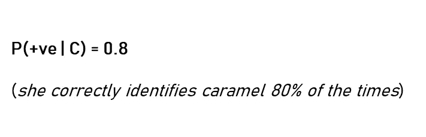

这被称为测试的**灵敏度**。

**现在，当它不是焦糖的时候，机器测试为阴性的几率是:**

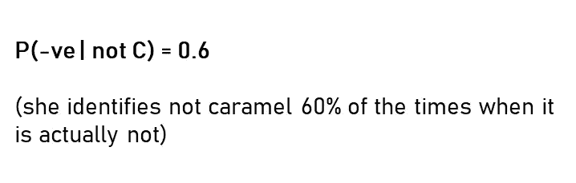

这被称为测试的**特异性**。

***假设测试结果为阳性，我们最终需要计算的是得到焦糖的概率。***

根据贝叶斯定理，计算如下:

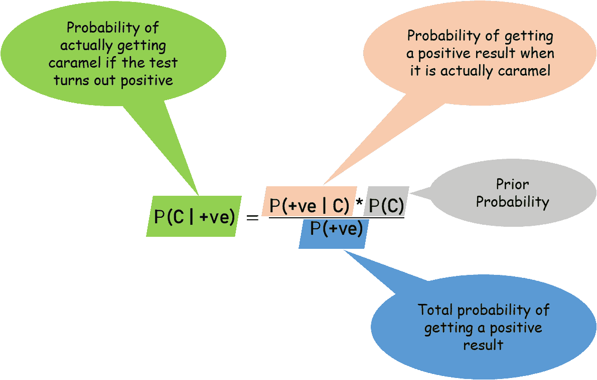

我们得到 **P(+ve)** ，即通过加上**用实际焦糖得到阳性结果的几率**和**即使不是焦糖也得到阳性结果的几率，测试为阳性的总概率。**

数学上:

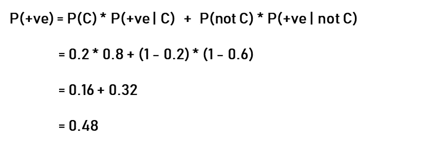

代入贝叶斯公式:

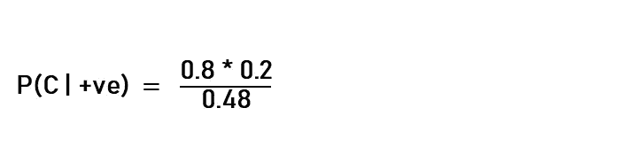

这给出了 **0.3333**

即 **33.33%**

这也叫**后验概率。**

但是你可能想知道:

***几率怎么会这么少，也就是 33.33%？***

其实比 Jean 猜对焦糖 80%的命中率*低多了*！

这是因为挑选焦糖本身的几率很小(25 块巧克力中只有 5 块)。这影响到 Jean 猜对的最终几率。

**还有那个朋友，是贝叶斯定理！**

如果我们用文字来表达数学，

> 贝叶斯定理描述了一个事件发生的概率，基于可能与该事件相关的条件的先验知识

现在让我们试着更直观地理解一下*！*

# *直观的解释*

*有一种简单的方法来看待 Scott 的问题，他想知道 Jean 实际上有焦糖的几率是多少。*

*有 25 种巧克力，其中 5 种是焦糖味的。*

*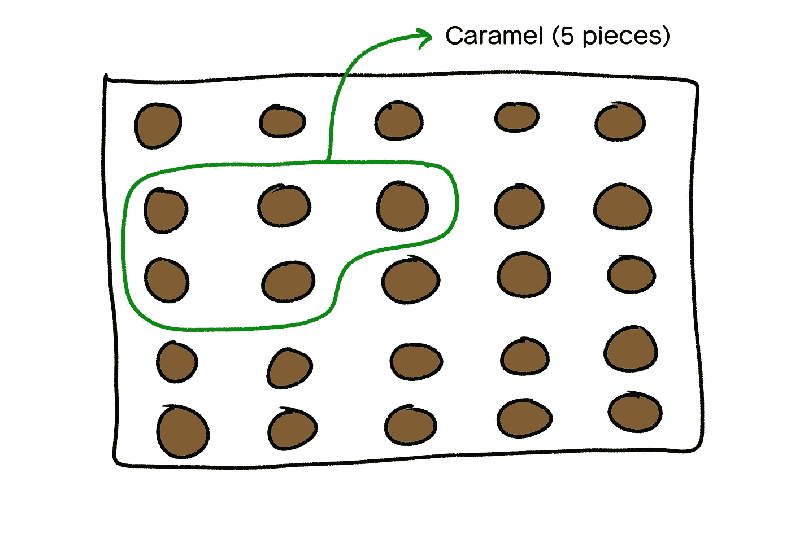*

*Jean 在 80%的情况下都能正确检测出焦糖:*

*   ****那是 5 块焦糖巧克力中的 4 块。****

*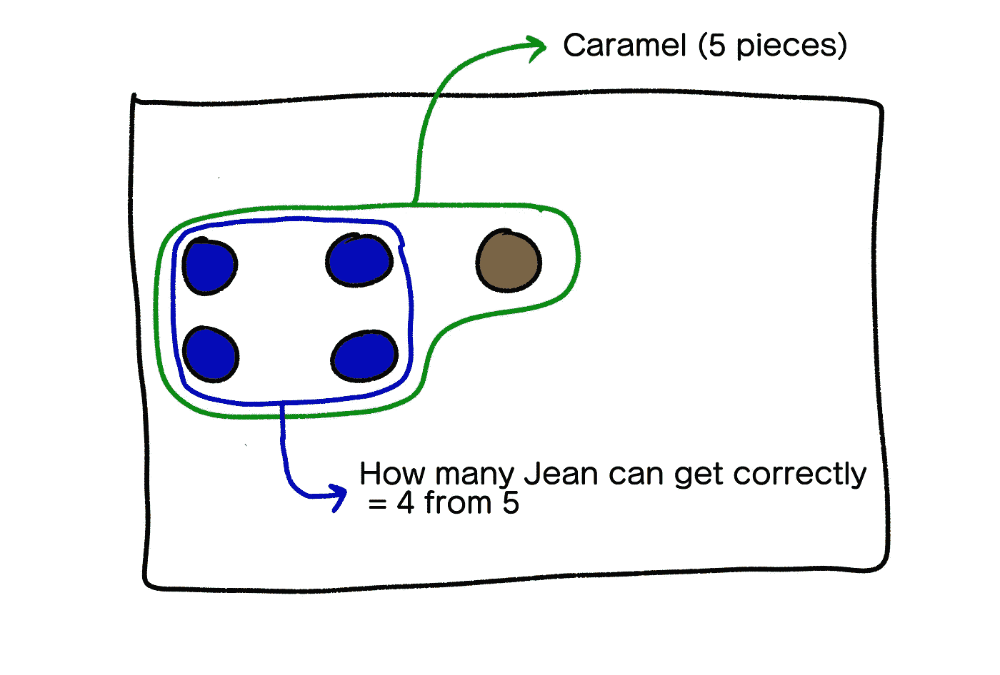*

*剩下的 20 块巧克力是奶糖味的。*

*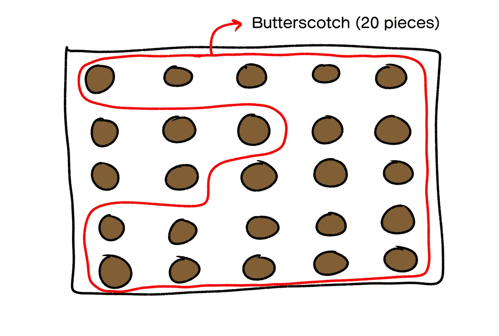*

*珍有 60%的可能说它不是焦糖，而实际上它不是——所以她很可能会把 40%的奶油糖果巧克力误认为是焦糖！*

*   ****那是 20 颗奶糖巧克力中的 8 颗。****

*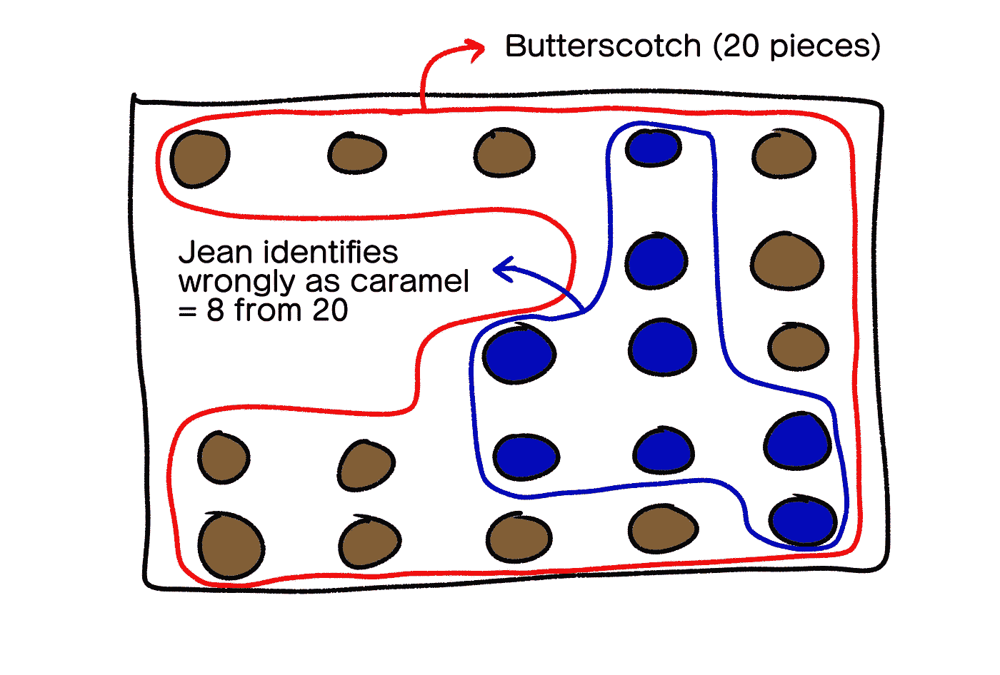*

*所以我们要关心的总样本只有 **4+8** ，也就是 **12** 。*

*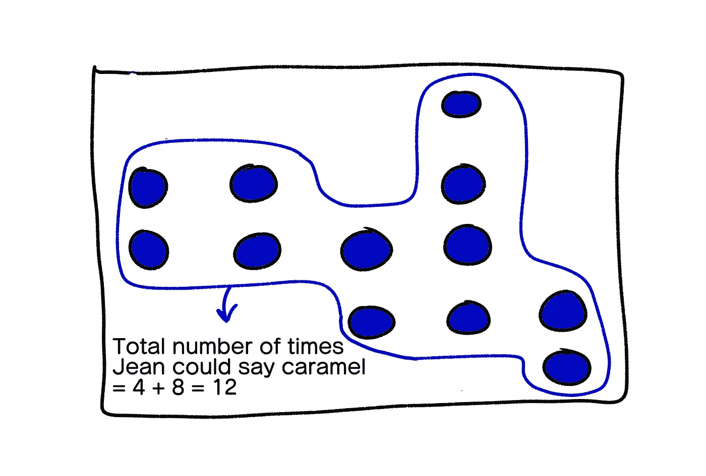*

*现在，鉴于她兴奋地声称焦糖是焦糖，她真的吃了焦糖的可能性有多大？*

*简单— ***她能从关注的全部样本中正确猜出焦糖的次数*** ，即 4/12 简化为三分之一或:*

****33.33%****

*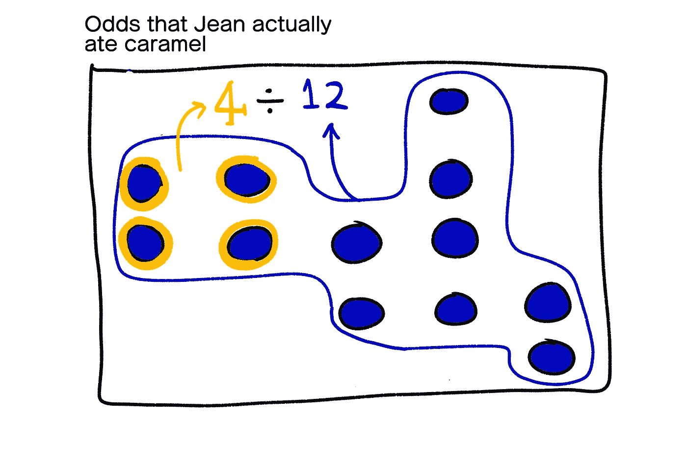*

**没错，就是这么简单！**

*你只是非常直观地计算了贝叶斯概率，而不需要数学公式！*

*如果你很好地了解它，你将永远拥有优势。*

****因为它有很多现实世界的优势！****

# *贝叶斯定理的好处*

*除了计算你的女朋友得到正确口味巧克力的几率之外，这个定理还被用在了几个高层次的问题上！*

*   *测试疫苗的有效性*
*   *识别疾病的医学诊断*
*   *根据证据识别罪犯*
*   *在约会应用程序上找到合适的人(*也许不适合斯科特，因为珍喜欢巧克力**
*   *几种预测应用*

*贝叶斯定理在机器学习中非常重要，因为它可以对不确定的信息进行推理，从而让计算机根据概率做出正确的决定。*

****这使得它成为数据科学和统计学中的重要支柱之一。****

*一些你现在能真正理解的事情！*

*我希望你像我喜欢写这篇文章一样喜欢这篇文章的解释。*

*敬请关注更多内容！*

*干杯！*

***注释和来源:***

*   *所有未加字幕的图像都是作者创作的*
*   *[1]来自[维基百科](https://en.wikipedia.org/wiki/Bayes%27_theorem)的描述*