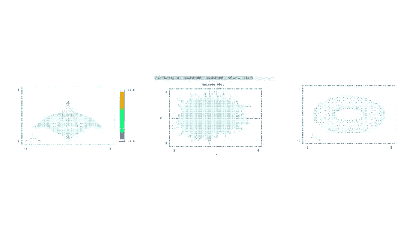
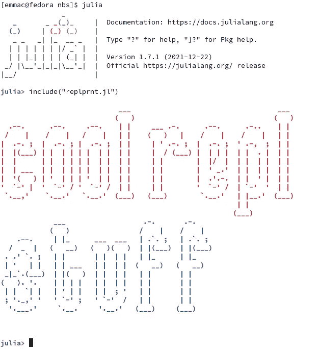

# 使用这些 Julia 软件包将数据科学迁移到 REPL

> 原文：<https://towardsdatascience.com/move-data-science-to-the-repl-with-these-julia-packages-d9dd739bfaf1>

## 为了朱莉娅，抛弃朱庇特的一些最好的工具

能够动态操作和处理代码内类型的反应式环境无疑是大多数数据科学家工作所需要的。虽然许多科学家可能会在他们基于 web 的笔记本服务器中逗留，但也有许多数据科学家在读取评估打印循环或 REPLs 中完成大部分或全部工作。这当然有一些好处。笔记本有一些数据科学家经常强调的基本问题。首先，典型笔记本会话的状态可以在没有视觉反馈的情况下改变，屏幕上的代码不需要与应用程序的状态实际对应，这可能会有问题。另一个重要的问题是内核，简单地说，这是因为很难获得很好的性能，或者当内核不断有死亡的可能性时，不用担心超时。尽管内核的抽象层很棒，但它仍然带来了一些缺点。

另一方面，REPLs 通常不会遇到这类问题，因为它们通常是直接的输入和输出流。总的来说，除了使用 REPL 实际编程之外，朱莉娅·REPL 对各种不同的事情都非常有用。特别是在 Julia 的案例中，REPL 经常专门致力于添加包和创建项目环境。

与其他类似的语言相比，比如 Python，Julia 有一个非常棒的 REPL，有很多不同的特性。作为一名 Julia 程序员，我经常发现 REPL 能够方便我的大部分工作。在 REPL 工作时，总是在目录周围 CD 和使用 readdir()是很烦人的，所以 Julia 用 pressing 覆盖了你；进入巴什或批处理 REPL，这是如此方便，几乎感觉犯罪。需要加个包？按]并输入 Pkg REPL，不需要导入甚至键入 Julia 语法——您可以只键入简单的命令和参数，就像它是 Bash 一样。

因此，朱莉娅·REPL 的出色是不争的事实。更棒的是，REPL 只是一个 Julia 包，这意味着你可以查看它的代码并操作它…或者在某些情况下，你可以直接使用它来产生完全独特的结果！后者是 Julia 生态系统中一些非常棒的软件包的情况，它们可以非常有效地最大化您在 Julia 的 REPL 体验。当然，总有一个问题，为什么在 REPL 工作而不是在笔记本上？

# UnicodePlots



(图片由作者提供)

我想在这个列表中展示的第一个包是 UnicodePlots.jl。该软件包有一套通用的功能，客观上真的很酷。该模块具有各种统计和其他可视化功能，这意味着如果他们真的想的话，甚至可以完全在 REPL 外工作并进行数据科学研究。如果您想进一步了解如何实际使用该模块，我有一篇完整的文章，您可以在这里阅读:

</create-fast-versatile-visualizations-with-julias-unicode-plots-8750bb7d7450>  

关于这个模块，我注意到了几件事。首先，假设可视化是 Unicode 的，它们比典型的可视化更加通用。首先，阅读和重新解释这些数据要容易得多。更进一步说，这可以在任何可以使用文本的地方使用，基本上是在任何地方。这意味着您可以在 REPL 或任何可以打印文本的地方可视化您的数据。在正常情况下，为了查看可视化效果，您需要显示一个图像。这意味着通过 REPL 和其他基于文本的解决方案，通过可视化进行分析是完全可能的。

与传统的可视化库相比，该模块的另一个巨大优势是性能明显更好。该软件包也是相对良好的编程和 API 非常容易使用。也就是说，如果你想把你的数据科学经验带到朱莉娅·REPL，这可能是一个值得尝试的有效选择！

# 蜡笔



(图片由作者提供)

Crayons.jl 包是一个非常基本的包，它提供了一个可以修改的类型，以及像 print()和 write()这样的函数的调度。Crayons.jl 允许你改变 REPL 中不同字符串的颜色。这在许多不同的情况下都很有用。实际上，我最近在自己的模块 Toolips.jl 上使用了蜡笔模块。蜡笔模块用于帮助演示终端内部的日志级别，下面是实现这一功能的代码:

```
println(Crayon(foreground = :light_gray, bold = true), "[", levels[level],
     string(time), Crayon(foreground = :light_gray, bold = true), "]: ",
     message)
```

这里被索引的“级别”实际上调用了一个蜡笔字典，其中的键对应于不同的蜡笔配置。

# 复制器

另一个很棒的包是 REPLMaker.jl，这个模块可以让你制作自己的 Julia REPLs。这非常容易做到，真正需要的只是一些解释字符串的函数。例如，我们可以从文档中的朱莉娅·REPL 内部创建一个 Lisp REPL:

```
using LispSyntax, ReplMaker
using REPL: REPL, LineEdit; using LispSyntax: ParserCombinator

lisp_parser = LispSyntax.lisp_eval_helper

function valid_sexpr(s)
  try
    LispSyntax.read(String(take!(copy(LineEdit.buffer(s)))))
    true
  catch err
    isa(err, ParserCombinator.ParserException) || rethrow(err)
    false
  end
end
```

然后，我们只需使用 initrepl()方法完成它。

```
initrepl(LispSyntax.lisp_eval_helper,
                valid_input_checker=valid_sexpr,
                prompt_text="λ> ",
                prompt_color=:red,
                start_key=")",
                mode_name="Lisp Mode")
```

这不仅很棒，而且非常有用。虽然它可以是一个有趣的玩具，但您也可以制作自己的 REPLs 来完成各种任务，这意味着您可以轻松地用最少的努力获得某个版本的用户界面，而不需要遵循 Julian 语法。虽然这看起来不像是一个能让你远离网络浏览器和笔记本电脑的属性，但它实际上可以达到一些可能的目的。使用这个包，您可以创建一个 REPL 来做任何事情，例如，如果您想在 Julia 中使用 conda 包管理器，或者在 Julia 中使用 Pip(虽然您可以通过输入 Bash 的 REPL 来完成这两个任务；。)

# OhMyREPL


我想谈论的朱莉娅·REPL 的下一个很酷的包是 OhMyREPL.jl。如果你真的想用朱莉娅·REPL 取代 IDE 或笔记本，OhMyREPL.jl 是一个非常重要的模块。最重要的是，一般来说，在你的 REPL 里有这样的东西是件好事。该模块附带了一系列工具，使 REPL 更适合作为 IDE，最值得注意的可能是语法高亮。它还允许自动完成分隔符，如“，”分隔符，这通常由优秀的文本编辑器提供。

很容易理解为什么人们想要在朱莉娅·REPL 的程序中突出显示语法和这种自动格式化。对于那些想用 REPL 取代笔记本的人来说尤其如此。我要注意的一点是，如果你的终端有一个浅背景，就像我的一样，语法高亮可能与你的配色方案不一致，就像我的情况一样。要解决这个问题，您可以随时重写蜡笔，并从本质上制作您自己的 OhMyREPL 版本。总的来说，这个包非常棒，如果你想提高你在 REPL 的开发体验，它绝对是必须的。

# Revise.jl

另一个可能彻底改变你使用朱莉娅·REPL 的方式的包是 Revise.jl。不能使用内核的问题是，当状态变得混乱时，你几乎必须命令+D 你的整个会话，因此；你会失去不同的你不想失去的东西。最重要的是，很难在 REPL 的文本文件中工作。通常，REPL 工作不是保存的工作。但是，Revise.jl 模块允许您动态地更改代码。

这样做的好处是，您不再需要编辑文件，然后跳回 REPL，然后编辑文件，然后重新启动您的 REPL，找到您的环境，然后编辑更多的文件。所有这些听起来都很乏味，Revise 巧妙地解决了这个问题，它允许您在环境中用新的字段重新定义名称。不用说，如果您想利用声明性的特性来改变您想要的任何代码段并独立地执行它，这可能是一条可行之路。对于数据科学来说，Revise.jl 绝对是进入 REPL 的一个必不可少的有价值的工具。

# DrWatson.jl

今天我想看的最后一个模块是 DrWatson.jl. DrWatson 是 Scientific Julia 项目的项目组织者，工作非常出色。虽然它主要面向科学，但它肯定可以应用于人们决定在 Julia 中构建的任何软件。该项目也建立在 DataFrames.jl 之上，这是一个数据管理框架，大多数基于 Julia 的数据科学家可能都很熟悉。

DrWatson 能够防止加载错误，为您命名和运行不同的代码，并自动化许多我们作为软件开发人员经常遇到的小文件操作和更改。

# 还有— Startup.jl

在今天的专题节目《Julia 是如何定制的——Startup.jl 中，虽然你可以在不了解任何 Julia 的情况下编写自己独立版本的 Julia 及其 REPL 来完成任务，但你也可以使用 startup . JL 来避免使用与其他人不同版本的 Julia，但仍然可以获得定制的体验。无论 Julia 是否是 REPL，Startup.jl 中的代码都会在 Julia 启动时运行，所以这一点需要记住。

如果这个列表中有一个模块是我推荐放入他们的 startup.jl 文件中的，它可能是 OhMyREPL。原因是在 REPL 更好的语法理解只适用于 REPL 内部。因此，在其他地方工作时，已经加载的包不会导致很多问题。对于这个文件，Revise 可能也是一个不错的选择，但是如果有一个软件包是我推荐的，那就是 OhMyREPL。我也曾几次尝试在 startup.jl 中加入 REPL，这样我就可以在运行其他命令或使用类似命令的界面来完成某项计算机任务之间切换，但这对我来说从未奏效。

startup.jl 文件位于`~/.julia/config/startup.jl`中，或者 Julia 目录所在的任何地方。如果文件不存在，那也没关系，不用担心，您只需要创建一个文件。我无法告诉你当我第一次这么做时，我花了多长时间才明白。当然，那时关于朱莉娅的信息更少。

# 结论

我认为笔记本是数据科学的伟大工具，我喜欢使用它们。然而，我确实看到了 Jupyter 笔记本在再现性和状态方面可能存在的问题。也就是说，在笔记本上工作仍然有一些优势，但最棒的是你仍然有选择的自由。对于某些项目，REPL 可能更理想，对于其他项目，基于网络的笔记本服务器可能是唯一的选择。

在这种情况下，朱莉娅和朱莉娅 REPLs 的伟大之处在于，它可能是从事数据科学工作的最可行的副本之一。这有很多好处，例如 Revise.jl 和 DrWatson 的代码可再现性，以及快速方便地使用所有 REPL 和终端带来的额外便利。桌子的两边肯定都有理由支持用 REPL 替换笔记本和不要用 REPL 替换笔记本。不管你站在哪一边，或者如果你像我一样是不可知论者，并且两者都喜欢，我想我们都会同意，一个如此小的社区开发出如此棒的工具是非常酷的！