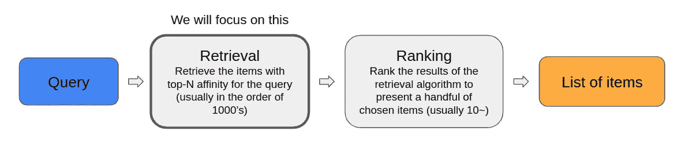
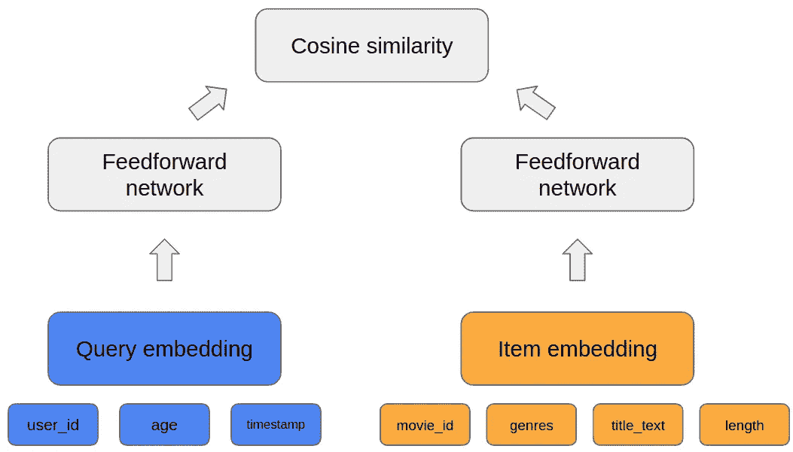
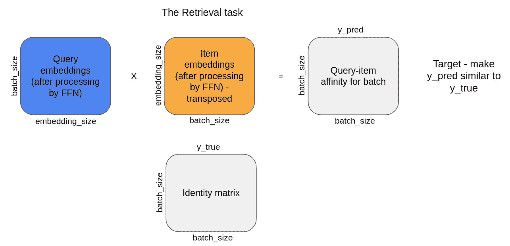
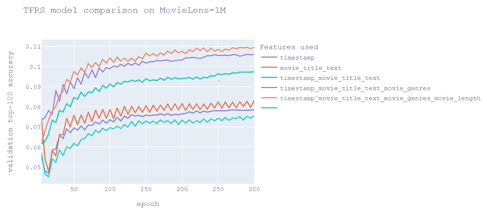

# MovieLens-1M 深潜—第二部分，Tensorflow 推荐工具

> 原文：<https://towardsdatascience.com/movielens-1m-deep-dive-part-ii-tensorflow-recommenders-4ca358cc886e>


Nathan Engel 的照片:[https://www . pexels . com/photo/time-lapse-photography-of-car-lights-in-front-of-cinema-436413/](https://www.pexels.com/photo/time-lapse-photography-of-car-lights-in-front-of-cinema-436413/)

读者们好，

对于那些没有读过前一部分的人，这里是链接:

</movielens-1m-deep-dive-part-i-8acfeda1ad4>  

在那篇文章中，我展示了 MovieLens-1M [1]数据集(一个电影推荐数据集，包含不同用户对电影的 100 万个评级)以及一些探索性的数据分析，并尝试了一些经典的推荐系统算法。虽然，那篇文章不是先决条件，你不读它也能理解这里的内容。

在 MovieLens 深潜系列的第二部分中，我们将使用 TensorFlow 推荐器(TFRS)。TFRS 将允许我们抽象出处理推荐系统时涉及的许多血淋淋的细节，如评估指标和模型训练程序。我们的模型将基于双塔架构，我们将在深入研究代码之前对其进行回顾。

在编码部分，我将稍微扩展一个现有的官方 TFRS 教程— [构建深度检索模型](https://www.tensorflow.org/recommenders/examples/deep_recommenders) [3]。在本教程中，目标是使用项目(电影)和用户的丰富上下文特征来构建一个检索推荐系统。我们将测试添加不同功能的影响，并尝试通过将更智能和更相关的功能引入手头的任务来获得改进。

文章的提纲如下:

1.  现代推荐系统方法概述
2.  了解 TFRS 和检索任务——我们将使用的基本构件
3.  超越基准——通过使用更多上下文相关的特性，尝试超越最初的 TFRS 教程模型
4.  超越基准—结果
5.  结论和未来思考

让我们开始吧！

# 第一部分——现代推荐系统方法概述

推荐系统管道通常分为两个阶段——检索和排名。在检索阶段，我们为系统中的项目和用户生成表示(通常以嵌入的形式)，并选择用户可能感兴趣的项目子集。这一阶段可能处理数百万用户/项目，因此计算效率必须很高。在排序阶段，我们获取检索阶段的输出，并对它们进行排序，以选择将被推荐给用户的最后几个项目。该模型可能计算量更大，因为它必须处理的数据要少得多。这个过程的描述如图 1 所示。



图 1:推荐系统过程

在本演练中，我们将重点关注检索阶段，并通过在嵌入生成过程中考虑不同的上下文特征，尝试使其更加高效和准确。

现在来看一些术语:

*   项目—这些是我们将向用户推荐的项目。就我们而言——电影。
*   查询—这是我们的系统将用来推荐商品的信息。在我们的例子中，这将包括我们推荐的用户的 ID 和其他特征，例如用户的年龄和性别。我们也将在这里包括它

# 第二部分——了解 TFRS 和检索任务

进入 TFRS，这是一个基于 Tensorflow 构建的推荐系统库，旨在简化构建、培训和部署推荐系统的过程。

我们在 TFRS 生产的车型将继承 [tfrs。模型。型号](https://www.tensorflow.org/recommenders/api_docs/python/tfrs/models/Model)级。这个类本身是围绕`tf.keras.Model`的包装器，为我们省去编写 train_step 和 test_step 方法的麻烦。作为用户，我们要做的是编写 compute_loss 函数，它接收一批输入查询和条目，并计算模型的损失。

在我们的教程中，我们将构建一个双塔架构模型。这个模型包含一个用于项目的塔和一个用于查询的塔。如图 2 所示，双塔架构非常简单。嵌入被创建来表示查询和用户，最后，我们对两个嵌入向量执行余弦相似性操作来预测它们的相似性(查询是这个项目的良好匹配吗？).通过使用嵌入每个项目的余弦相似性对特定查询的结果进行排序，系统可以检索该用户的顶部项目(通常大约 1000 个)，然后最有可能将这些项目馈送到排序模型中，用于对将呈现给用户的最终项目(通常多达 10 个项目)进行细粒度控制。



图 2:双塔架构的简单示意图

从上面的解释中我们不明白的是，模型是如何学习的？当然是通过梯度下降。有正面的例子(在我们的例子中，是某个用户评级的电影)和负面的例子(不是某个用户评级的电影)。我们的算法将把这视为多类分类任务，并试图最大化已评级项目和查询之间的相似性，最小化未评级项目和查询之间的相似性。这个操作是在每个批处理中完成的(每个批处理只包含正例，负例是通过将批处理中的不同查询和项目配对生成的，如图 3 所示)。



图 3:检索任务(FFN =前馈网络)

# 第三部分——超越基准

在这一部分中，我将向您展示我的代码，我们将通过使用额外的上下文特性来丰富项目和查询表示，从而尝试改进我们的深度检索模型的性能。

让我们回顾一下我们将用于条目和查询的特性。对于每个特性，我将指定它是否在最初的 TFRS 教程中使用过。

**查询功能(用户+上下文信息):**

*   user_id [int] —最基本的特性。用于索引到用户嵌入矩阵中。(在原始教程中使用)
*   timestamp [int] —用户执行查询的时间，以 UNIX 时间戳格式表示。这可以帮助我们捕捉数据中的季节性趋势(例如，在周末，人们可能更喜欢较长的电影)。(在原始教程中使用)
*   user_age [int] —一个额外的数字特征，可能暗示用户首选项中的模式。(原始教程中未使用)

**物品特征(电影信息):**

*   movie_title [string] —项目的唯一标识符。用于索引到项目嵌入矩阵中。该特性还将用于创建嵌入电影标题文本的句子(而不是仅仅将其用作简单的标识符)。(在原始教程中使用)
*   movie _ genders[list<int>]—每部电影都与一个或多个流派相关联，其中每个流派都由一个唯一的整数定义。我们将使用这些整数索引到一个流派嵌入矩阵中。对于每部电影，我们将对其所有类型的嵌入进行平均。(原始教程中未使用)</int>
*   movie_length [int] —电影的长度，以分钟为单位。这些信息是使用 [Cinemagoer](https://cinemagoer.github.io/) [2] python 包收集的。一些电影长度数据丢失了，对于这些电影，我给出了 90 分钟的默认长度。

**代码:**

我在这里展示了一种非常规的探索性数据科学工作方式，那就是通过脚本而不是通过 Jupyter 笔记本。我认为脚本相对于笔记本的优势在于:

1)更清洁的代码。鼓励您使用良好的编程实践，例如将公共过程提取到函数中，而不是在单元格之间复制粘贴。

2)以合理的方式跟踪你的工作的能力，这是最重要的，尤其是在与其他人合作的时候。

缺点是它可能会引入对缓存机制的需求，正如我在本例中所做的那样(这样您就不必为您希望执行的每个实验运行繁重的数据加载/模型训练过程)。在这个例子中，我保存了每个配置的训练模型，这样我就不必在每次运行脚本时都重新运行训练。此外，我使用`tf.data.Dataset.save`和`tf.data.Dataset.load`保存和加载数据集，因为数据集创建过程可能需要一段时间。最后，我利用了 [cachier](https://pypi.org/project/cachier/) python 包，当从`Cinemagoer`加载电影长度信息时，它在磁盘上生成函数结果的持久缓存，因为这是一个非常漫长的过程，我们希望避免对每部电影运行这个函数超过一次。

运行这个脚本需要的非标准包如下:`tensorflow, tensorflow_datasets, tensorflow_recommenders, plotly, numpy`。注意，该脚本假设您的主目录中有两个子目录，分别名为`datasets`和`saved_models`。

培训过程将由`MovieLensTrainer`班管理。给定训练设置，如图层大小、嵌入大小和要使用的特征，它将训练模型或从磁盘加载相关模型。在通过命令行参数获得我们定义的所有特征组合的训练模型后，我们将运行函数`plot_training_runs`,该函数将返回每次运行的前 100 个分类准确度的曲线图，并允许我们比较我们使用的不同设置。

从最初的 TFRS 教程开始，我对模型做了一个重要的改变，那就是能够在`MovieModel`(物品塔)中使用额外的功能。在本教程中，这个模型只将`movie_title`作为输入。在这个项目中，它可以接受任何额外的特性，最终创建一个所有特性嵌入的连接。这很重要，因为它使我们能够利用额外的电影信息，如类型，电影长度，在 IMDB 上的平均评级，以及您可能想到的任何其他功能。

## 命令行参数+运行示例

我们有几个命令行参数来控制我们的脚本做什么。我将讨论一些不太明显的问题:

`layer_sizes (list[int])` —为两个塔(查询和项目模型)中的每一个定义嵌入层之后的层的数量和大小。我们添加的层越多，给它们的神经元越多，我们的模型就会变得越复杂(因此也更容易过度拟合)

`additional_feature_sets (list[list[string]])` —该参数是一个列表列表，其中每个内部列表是我们希望训练 TFRS 模型的一组特征。例如，使用这个参数我们可以训练两个模型，其中一个训练使用`movie_genres, timestamp`特性，另一个训练使用`movie_title_text, timestamp`特性。

`--retrain (bool)` —这是一个二元切换。关闭时，如果我们以前已经训练过(从文件系统加载)，我们将使用选定的设置加载以前训练过的模型。如果启用，我们将总是重新训练并覆盖当前在磁盘上的模型。

`--generate_recommendations_for_user (int)` —这是一个用户的 ID，我们将为其生成我们生成的每个训练模型的推荐。这意味着让我们的模型“脚踏实地”，并看到它为偏好已知的用户生成推荐的真实示例。

此流程的一组命令行参数示例(本次运行将训练 6 个不同的模型，每个模型训练 300 个时期。它将为每个训练模型的 ID 为 1 的用户生成推荐):

```
--num_epochs
300
--additional_feature_sets
None
--additional_feature_sets
timestamp
--additional_feature_sets
movie_title_text
--additional_feature_sets
timestamp
movie_title_text
--additional_feature_sets
timestamp
movie_title_text
movie_genres
--additional_feature_sets
timestamp
movie_title_text
movie_genres
movie_length
--embedding_size
32
--layer_sizes
64
32
--generate_recommendations_for_user
1
```

让我们来看看这次运行的输出(为了清楚起见，删除了警告):

`These are the ratings for user 1:`

```
 **Recommendations for model ('timestamp',), user 1:**
 [b'Alien (1979)' b'Sense and Sensibility (1995)' b'Sea Wolves, The (1980)'
 b'Ninth Gate, The (2000)' b'Beautiful (2000)' b'Sweet Nothing (1995)'
 b'Titan A.E. (2000)' b'Saint, The (1997)'
 b'Killer: A Journal of Murder (1995)' b'Man of the Year (1995)']
Recommendations for model ('movie_title_text',), user 1:
 [b'Angel and the Badman (1947)' b'Alien (1979)' b'Shadows (Cienie) (1988)'
 b'Two Moon Juction (1988)' b'Sea Wolves, The (1980)' b'Booty Call (1997)'
 b'Apple Dumpling Gang Rides Again, The (1979)'
 b'Psycho Beach Party (2000)' b'Local Hero (1983)'
 b"Shaft's Big Score! (1972)"]
**Recommendations for model ('timestamp', 'movie_title_text'), user 1:**
 [b'Fried Green Tomatoes (1991)' b'Alien (1979)'
 b'Angel and the Badman (1947)' b'Sarafina! (1992)'
 b'Color Purple, The (1985)' b'Sea Wolves, The (1980)'
 b'Madame Sousatzka (1988)' b'Little Shop of Horrors (1986)'
 b"One Flew Over the Cuckoo's Nest (1975)" b'L.A. Story (1991)']
**Recommendations for model ('timestamp', 'movie_title_text', 'movie_genres'), user 1:
** [b'Being There (1979)' b'Alien (1979)' b'Crimes and Misdemeanors (1989)'
 b'Two Moon Juction (1988)' b'Psycho (1998)'
 b'Apple Dumpling Gang Rides Again, The (1979)' b'Me Myself I (2000)'
 b'Loser (2000)' b'Killer: A Journal of Murder (1995)'
 b"Barney's Great Adventure (1998)"]
**Recommendations for model ('timestamp', 'movie_title_text', 'movie_genres', 'movie_length'), user 1:
** [b'Sid and Nancy (1986)' b'Angel and the Badman (1947)' b'Alien (1979)'
 b'Two Moon Juction (1988)' b'Crimes of the Heart (1986)'
 b'Sea Wolves, The (1980)' b'One False Move (1991)'
 b'Rich and Strange (1932)' b'Storefront Hitchcock (1997)'
 b'Celebration, The (Festen) (1998)']
**Recommendations for model (), user 1:**
 [b'Alien (1979)' b'Booty Call (1997)'
 b'Day the Earth Stood Still, The (1951)' b'Angel and the Badman (1947)'
 b'Sea Wolves, The (1980)' b'Celebration, The (Festen) (1998)'
 b'Midnight Cowboy (1969)' b'Desperado (1995)' b'Tingler, The (1959)'
 b'Blue Chips (1994)']
```

这只是个人想法，但是作为用户 1，我想我会非常失望。出现在所有推荐中的唯一的儿童电影是“巴尼大冒险(1998)”，尽管用户对这些类型的电影有明显的亲和力。另外，我们甚至可以看到一些不合适的电影(用户 1 被归类为 K-12 岁)。在这个系统投入生产之前，还需要更多的建模改进和启发式布局。

现在，让我们查看一些准确性结果，看看我们是否通过在训练过程中包含更多功能来击败教程基准。

# 第四部分——超越基准——结果

我们将训练具有以下特征组合的模型:

1.  `movie_title, user_id`
2.  `movie_title, user_id, timestamp`
3.  `movie_title, user_id, movie_title_text`
4.  `movie_title, user_id, timestamp, movie_title_text **(this setting was used in the official tutorial)**`
5.  `movie_title, user_id, timestamp, movie_title_text, movie_genres`
6.  `movie_title, user_id, timestamp, movie_title_text, movie_genres, movie_length`

并使用以下图层大小:

`[64, 32]`

总共 6 个训练好的模型。我们将为每个模型训练 300 个历元，并对所有嵌入层使用 32 的嵌入大小。我假设额外的特性将丰富项目/查询嵌入，并帮助生成更准确的表示。我们将用于比较模型的指标是前 100 名的准确度(越高=越好)。这意味着，对于验证集中的每个项目/查询对，是否为该查询生成了前 100 对中的配对的相似性？

图 4 所示(包括静态图像和交互图，因为移动设备上的可见性问题)是每个模型训练的验证前 100 名准确度(在 5 个时期间隔内)。



图 4(静态):模型比较结果

图 4(交互式):模型比较结果

我们可以始终如一地看到，随着我们添加更多的功能，验证的准确性会增加。这是令人鼓舞的，因为这意味着我们的工作产生了积极的影响！请注意，整体准确性似乎很低，这是因为这是一个非常困难的问题(需要从大约 6000 部电影中猜出正确的电影)。就验证准确性而言，最好的方法是使用所有建议特性的方法，实际上，在 300 个时期后，它比本教程中的基准高出大约 0.015。

# 第五部分——结论和展望

在这篇文章中我们已经看到:

1.  如何用 tensorflow 推荐器搭建推荐系统？
2.  如何将上下文特性添加到项目和查询中以获得更好的性能。
3.  如何通过简单的脚本而不是使用 Jupyter 笔记本进行研究。

我们可以看到，查询和项目的额外上下文可以提高我们的推荐性能(即使在相对密集的数据集上，如 MovieLens-1M)。当构建你自己的推荐系统时，试着想想你是否可以在你的嵌入中加入更多的上下文，而不仅仅是使用用户和商品标识符:)

下次见，

埃拉德

**参考文献:**

[1] *麦克斯韦·哈珀和约瑟夫·a·康斯坦。2015.电影镜头数据集:历史和背景。美国计算机学会交互式智能系统汇刊 5，4:19:1–19:19。*[*https://doi.org/10.1145/2827872*](https://doi.org/10.1145/2827872)

[2] Tensorflow 深度检索系统教程—[https://www . tensor flow . org/re commenders/examples/deep _ re commenders](https://www.tensorflow.org/recommenders/examples/deep_recommenders)

[3] Cinemagoer python 包—[https://cinemagoer.github.io/](https://cinemagoer.github.io/)