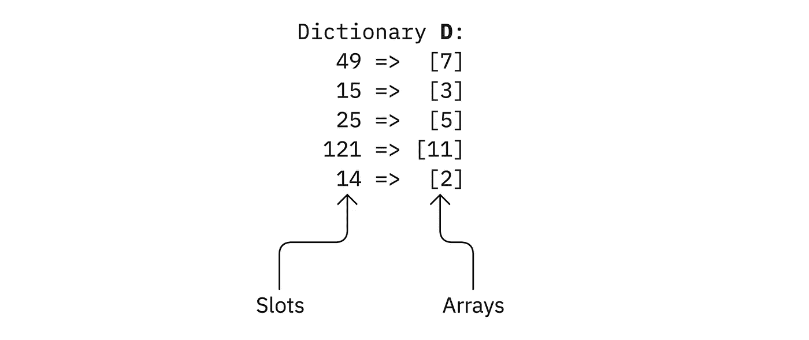
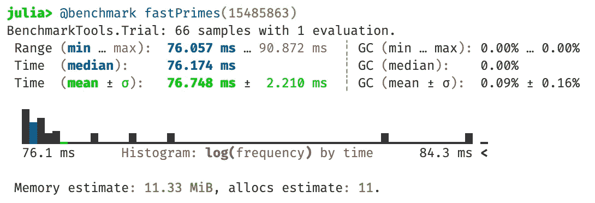
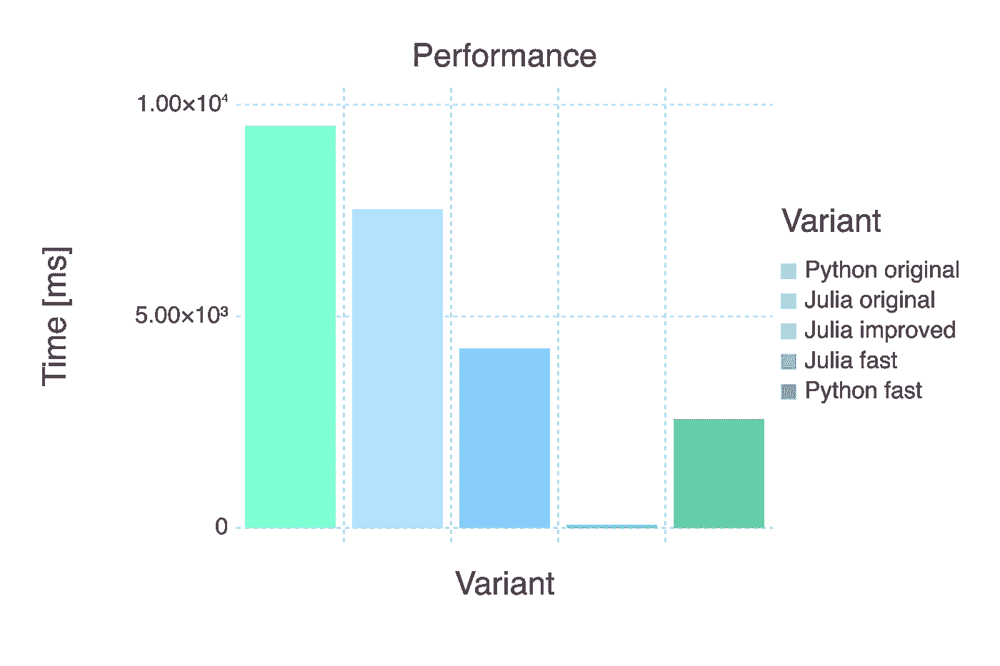
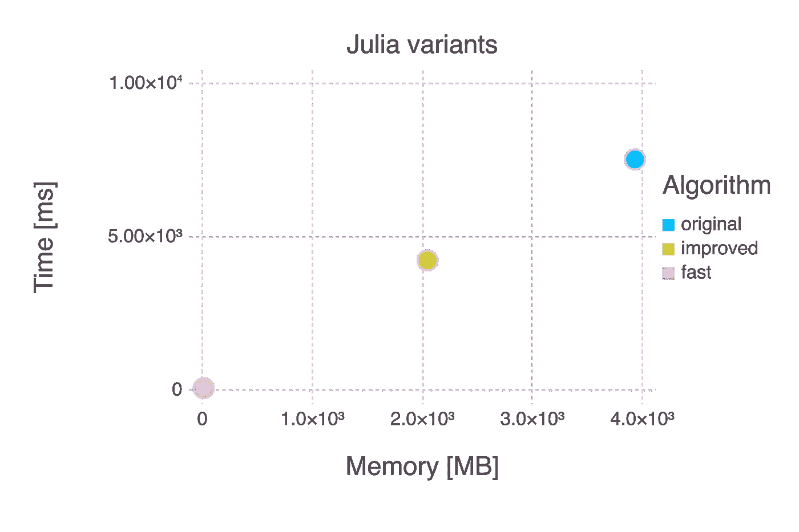

# 将代码从 Python 移植到 Julia:小心虚假的朋友

> 原文：<https://towardsdatascience.com/moving-code-from-python-to-julia-beware-of-false-friends-160573a5d552>


照片由[布伦丹·丘奇](https://unsplash.com/@bdchu614?utm_source=unsplash&utm_medium=referral&utm_content=creditCopyText)在 [Unsplash](https://unsplash.com/?utm_source=unsplash&utm_medium=referral&utm_content=creditCopyText) 上拍摄

## 一般来说，将代码从 Python 转移到 Julia 是很容易的。但是有些陷阱你应该知道。

# 虚假的朋友

学习外语时，你会遇到拼写和发音与母语中你所知道的单词相似的单词。但有时这些看似熟悉的词在另一种语言中却有着完全不同的含义。例如德语动词“ *bekommen* ”看似等同于英语“t *o 成为*”，实际上是“t *o 获得*”或“t *o 接收*”。当说德语的人学习英语时，这有时会导致一些相当有趣的句子，比如“*她在 11 岁生日时变成了一只猫*”。当然这里的意图不是表达女孩在生日那天变异成了一只猫，而是她得到了一只猫作为生日礼物。这种看似相关的词就叫做“*假朋友*”。

当您从一种您熟悉的编程语言切换到一种新的编程语言时，例如当您从 Python 切换到 Julia 时，也会出现同样的情况。这两种语言有一些概念上的差异，但也有一些方面非常相似，似乎可以互换——但实际上并不是所有的都可以互换！

# Python 列表和 Julia 数组

最近，我在阅读 René的文章《Julia 和 Python 的黄金时间》时，遇到了一个很好的例子。他展示了一个计算质数的 Python 函数(最初来自[这里是](https://code.activestate.com/recipes/117119/)),将它 1:1 地翻译给 Julia，做了一些基准测试，当注意到 Julia 实现的性能低于预期时有点失望(Python ca。7.5 秒，朱莉娅·卡。4.5s；我在我的环境中重复了基准测试，分别得到了 9.5 s 和 7.5 s)。

让我们看一下这段代码，看看发生了什么，可以做些什么来改善这种情况(*注*:对于进一步的分析，完全理解这段代码并不重要。我们只会对它的某些方面有更深入的了解；尤其是使用的数据结构。)

首先是 Python 代码:

上述文章中的原始 Python 代码

这是对朱莉娅的翻译:

上面引用的文章中的原始 Julia 代码

*注*:茱莉亚版本有小错误。第 15 行中的`delete!`语句必须放在 for 循环之后，以便与 Python 代码相同。在本文中，已经使用了修正的版本来创建基准数字。

## 使用的数据结构(ab)

这些函数中使用的主要数据结构是

*   在 Python 中:一个*字典*中的`D`列出了
*   在 Julia 中:一个*字典* `D`中的*数组*
    (或者更确切地说是`Vector` s，它是一维数组的同义词)。



上面代码中使用的数组字典 D[图片由作者提供]

分析(Julia-)代码，我们看到，这个字典`D`最初是空的，它的槽被递增地填充，或者通过分配一个具有一个元素的数组(第 8 行)，分配一个空数组(第 13 行)，或者通过使用`push!`(第 9 行和第 14 行)向这些数组添加单个数字(如果它们已经存在)。如上图中的例子所示，在函数执行过程中，大多数数组只包含一个元素。随着时间的推移，一些数组不再需要并被删除(第 15 行)。

所以基本上，下面的“翻译”步骤已经完成:在 Julia 版本中，数组已经被用作 Python 列表的“替代物”。这两种数据结构在几个方面非常相似，如示例所示，甚至可以或多或少以相同的方式使用。

但是:Python 列表被设计成动态的数据结构，可以在生命周期中以很小的增量增长和收缩。用 Julia 数组也可以这样做，但是不应该这样做！Julia 数组(正如它们的名字已经告诉我们的那样)不是列表，而是数组，传统上是静态的*结构。所以它们的设计有着不同的目的。*

以上面例子中的方式使用 Julia 数组是最低效的使用方式之一。Julias `@time`宏显示，在超过 6500 万次单独的分配调用中，`n` = 1，000，000 的函数调用分配了大约 4 GB 的内存。那不可能有效率！

```
7.532386 seconds (65.79 M allocations: 3.933 GiB, 19.15% gc time)
```

## 丰富

让我们深入了解一些细节，看看在第 13 & 14 行中发生了什么，以展示这些用于创建和增长数据结构的微小步骤对性能的影响有多大:

*   在第 13 行中，函数`get!`被调用仅仅是因为它的副作用:如果插槽`p+q`为空，开发人员想要在插槽`D`处为字典`D`分配一个空数组，或者如果已经有一个数组，则什么也不做。
    `get!`的实际用途是读取特定槽位的值。
*   这样做是为了在第 14 行将值`p`追加到数组中。即第 13 行保证了在任何情况下该位置都存在一个数组。

我们可以用下面的代码替换这两行，这样可以更清楚地表达这些意图:

```
if haskey(D, p+q)
    push!(D[p+q], p)   # append `p` to the array, if there is one
else
    D[p+q] = [p]       # assign a new array `[p]`, if there is none
end
```

因此，如果`p+q`处的槽为空(即`else`部分)，则在*一个*步骤中分配一个包含`p`的新数组，而不是原始代码中的*两个*。

这个小小的改变，用一个(稍微大一点的)步骤代替了两个小步骤，减少了大约 43%的运行时间和 50%的内存分配！

```
4.242410 seconds (26.15 M allocations: 2.047 GiB, 13.62% gc time)
```

除此之外，仅仅为了副作用而使用函数(如第 13 行)无论如何都是不好的做法，因为它隐藏了真正的意图。这使得代码更难阅读和理解。此外，如果没有清楚地表达出来，编译器应该如何理解真正的含义(并生成最佳代码)？

# 移动算法，而不是代码

但这不是你应该改进代码的方式。决定性的一点是，Python 代码不应该被逐行翻译(这将导致一些类似 Python 的 Julia 代码)，而是算法作为一个整体应该以 Julian 的方式来考虑和实现。

> 算法，而不是代码，应该从一种语言转移到另一种语言。

## 厄拉多塞筛

让我们这样做:上面使用的算法是著名的厄拉多塞的[筛子。是的，如果你想知道，上面的代码是“筛子”的一个相当特殊的实现。](https://en.wikipedia.org/wiki/Sieve_of_Eratosthenes)

计算 1 到 *n* 范围内素数的厄拉多塞筛的主要思想如下:

*   列出从 1 到 n 的所有数字。
*   最初我们假设所有这些数字都是质数。我们可以省略 1，因为根据定义，2 是最小的素数。
*   丢弃所有已经识别的素数的倍数的数:
    -丢弃所有 2 的倍数
    -丢弃所有 3 的倍数
    -省略 4，因为它已经被识别为 2 的倍数
    -丢弃所有 5 的倍数…等等。
*   当我们到达`sqrt(n)`时，我们可以停止这个过程，因为此时我们已经检查了所有大于该阈值的倍数。例如，对于 *n* = 100(此阈值为 10)，我们不必检查 11 的倍数，因为我们在检查 2 的倍数时已经检查了 2 x 11，在检查 3 的倍数时已经检查了 3 x 11，等等。
*   当检查一个数 *k* 的倍数时，我们不必从 1 x *k* 开始。从 *k* x *k* 开始就足够了，因为已经检查了所有较低的倍数。例如，当检查 5 的倍数时，我们可以从 25 开始，因为 2 x 5、3 x 5 和 4 x 5 已经在之前的过程中检查过了。

*注*:本说明中的参数 *n* 与上述代码中的含义不同。这里它表示素数搜索范围的上限。在上面的实现中， *n* 是将被识别的素数的数量。所以用 *n* = 1，000，000 产生一百万个质数。在接下来的部分中，我们将实现一个函数`fastPrimes`，它遵循这里给出的算法的“经典”版本，其中 *n* 是上限。为了用`fastPrimes`得到与上面代码相同的结果，我们必须用 *n* = 15，495，863 来调用它，因为这是前一百万个素数中最大的一个。

## 在 Julia 中实现

实现“筛子”算法的基础是一个适当的数据结构。一个直接反映一串数字的概念连同信息“*的结构是质数？*"是一个布尔值数组。如果我们希望实现也是内存高效的，那么我们选择一个`BitArray`。这是一个布尔数组的变体，它只使用一位内存存储每个布尔。

这种考虑和上面的算法描述直接导致了下面的代码:

*   在第 2 行中，我们创建了一个具有 *n* 个元素的`BitArray`(所有元素都设置为*真)*和，我们省略了 1(第 3 行)。
*   从第 4 行开始的 for 循环检查从 2 到`sqrt(n)`的所有倍数。
*   已经被标记为不是质数的数字被省略(第 5 行)。
*   从第 6 行开始的 for 循环遍历从 *i x i* 开始的所有 *i* 的倍数，并将它们标记为非质数。
*   就是这样！第 10 行的语句只是用来将所有质数都标有 *true* 的`BitArray`转换成一个质数数组。

这个函数的运行时间大约是 76 ms，并且它只使用大约 11 MB 的内存，正如`BenchmarkTools`包的结果所示。与最初的实现相比，使用不到 0.3%的内存，速度快了近 100 倍。



“fastPrimes”的基准测试结果[图片由作者提供]

## 用 Python 实现

这种方法当然也导致了 Python 中更好的数字。代码如下:

由于 Python 中数组的索引从 0 开始，我们在这里创建一个大小为 *n+1* 的数组，并忽略索引 0 处的元素。

这段代码使用与 Julia 示例中相同的参数化运行了大约 2.5 s。所以比原代码快了差不多 4 倍。不幸的是，用于进行基准测试的 Python `timeit`模块并没有产生关于所分配内存的信息。

## 结果

下图总结了本文介绍的不同变体的性能，并再次显示了正确使用 Julia 可以获得哪些出色的结果。



不同变体的性能[图片由作者提供]

基准测试使用了以下环境:苹果 M1，8 GB 内存，Julia 1.7.1，Python 3.9.7。

对于 Julia 变体，我们还可以看到与分配的内存相关的性能。这两项措施都有可能取得重大进展。



# 旁注

Julia 相对于 Python 的主要优势是性能和奇特的概念，比如多重调度。但是我认为还有更多:它也是关于日常使用中更重要的实际的东西，比如简单性、一致性和运行良好的包管理器。

当我准备这篇文章时，我再次被这些问题绊倒。几年前促使我寻找 Python 替代品的问题，为什么我想与你分享它们。

## 朱莉娅

在 Julia 中可以使用`@time`宏对函数进行计时，该宏包含在基本库中，如下所示:

```
@time fastPrimes(100)
```

使用相同的模式，您可以通过详细版本`@timev`获得更多的信息:

```
@timev fastPrimes(100)
```

如果您想要“真正的”基准测试，自动进行几次迭代并获得一些有用的统计数据等。，可以使用`BenchmarkTools`包。因为它是第三方软件包，所以必须先安装。因此我切换到包模式，输入`add BenchmarkTools`，包管理器在不到一分钟的时间内下载、安装并预编译了这个包。Julia 有一个*包管理器，它是根据该语言设计和开发的。*

进入`using BenchmarkTools`后，可以使用该包的功能。它和上面的宏有着相同的使用模式(尽管是完全不同的包，由不同的人开发)。你称之为:

```
@benchmark fastPrimes(100)
```

## 计算机编程语言

在 Python 中，您可以利用来自同名模块的`timeit`-方法。它也包含在基本库中。为了给`fastPrimes`函数计时，我不得不使用下面的表达式:

```
timeit.Timer(‘fastPrimes(100)’, setup=’from __main__ import fastPrimes; gc.enable()’).timeit(number = 1)
```

`from __main__ import`是必要的，这样`timeit`就可以“看到”`fastPrimes`功能。`gc.enable()`打开垃圾收集器，因为`timeit`在默认情况下关闭它，这既不是真实情况，也不能与 Julia 设置相比。

不，这既不容易理解也不容易使用。我花了很长时间才弄明白如何正确使用`timeit`！

由于`timeit`只测量运行时间，但不给出关于内存分配的信息(像 Julia 工具那样)，我在寻找一个更好的替代方法。网上不同地方提到的另外两个 Python 基准测试函数不符合这些要求。但是第三个模块`benchmarkit`似乎做到了。所以我试着安装了它。Python 有*两个*包管理器(PIP 和 Conda)；两者都是独立于语言开发的。

因为我的计算机上有一个 Anaconda 环境，所以我首先尝试用`conda`进行安装。但是在康达宇宙中`benchmarkit`模块是未知的。所以我切换到`pip`，它开始在我的电脑上加载兆字节的软件。几分钟后，它通知我它现在将安装`pandas`模块，这让我很恼火，因为那个模块已经安装好了。时间一分一秒地过去了……然后几十条错误信息淹没了我的屏幕。此后，它报告说在我的电脑上发现了一个`pandas`安装，这让我的心情有所好转。大约 15 分钟后(使用 M1 iMac 和 100 MBit/s 的互联网连接！)一切似乎都准备好了。所以我输入了`import benchmarkit` …导致一条消息告诉我，这个模块没有安装。也就是说，在摆弄了这么长时间之后，我除了一个可能更乱的 Python 装置之外一无所有！

我想我不必提及使用`benchmarkit`的基准测试将遵循与使用`timeit`完全不同的模式。