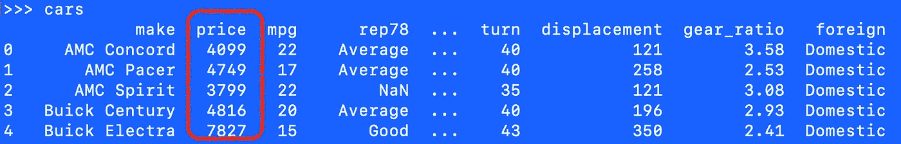
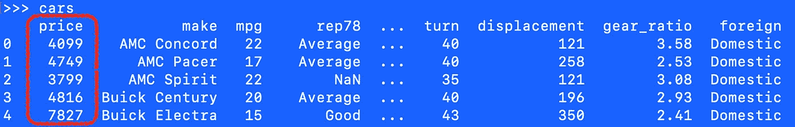
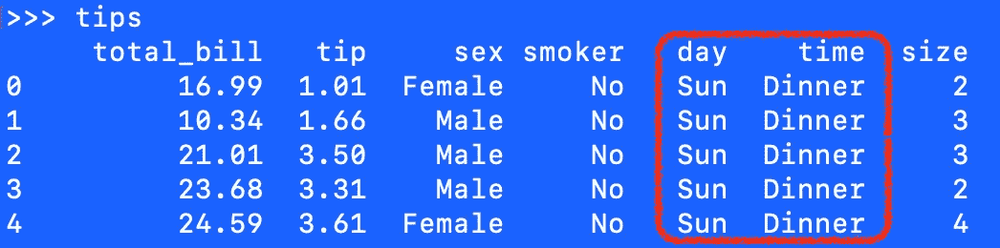
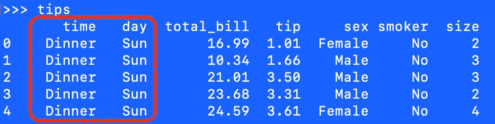

# 四处移动熊猫柱

> 原文：<https://towardsdatascience.com/moving-pandas-columns-around-c0fad1043d3a>

## 简化更改数据帧中列顺序的过程

# 概观

有几个原因可能会让你改变你的熊猫专栏的顺序。

*   你希望目标变量在最右边。
*   您希望逐列跟踪数据准备的进度，在处理数据时按顺序移动它们。
*   您(匆忙地)创建了一些测试列……现在是时候整理一下了。
*   您有一个感兴趣的变量，它被埋在 400 列中的第 332 列。将它放在零位置会提高输出的可读性。

有几种方法可以完成这项任务。有些人比其他人更好。

本文展示了一些优雅地利用原生 Python `list.remove()`和`list.insert()`方法的例子。

# 数据+设置

为了便于参考，本文引用了 Seaborn 和 Stata 示例数据(全部在线提供)。我们从导入 Pandas、Seaborn 的标准设置开始，然后加载数据(auto2.dta 和 tips.csv)。*参见本文末尾的数据许可*。

```
import pandas as pd
import seaborn as snscars = pd.read_stata('http://www.stata-press.com/data/r15/' + /
                      'auto2.dta')
tips = sns.load_dataset('tips')
```


图片鸣谢:作者使用 Jasper.Ai 创作。

# 汽车:将价格移到最左边

当它第一次加载时，你会在汽车数据的最左边找到价格。



图片鸣谢:作者插画。屏幕截图。

我们的任务是将价格移动到数据集中的第一个位置。我们只需要四行代码。

```
# Get the column names in their current order.
new_order = cars.columns.to_list()# Remove price from the list.
new_order.remove('price')# Place price at the beginning of the list.
new_order.insert(0, 'price')# Redefine the data frame with the new column order.
cars = cars[new_order]
```

我们现在在最左边的列(第一列，或者零列)中找到价格。



图片鸣谢:作者插画。屏幕截图。

# 提示:将日期+时间移到最左边

一次移动两列(如下所示)与移动一列(如上所示)大致相同。当第一次加载该数据时，我们看到日期和时间分别位于位置 4 和位置 5。



图片鸣谢:作者插画。屏幕截图。

我们希望将它们移动到最左边的位置 0 和 1。在此过程中，我们还将颠倒它们的顺序，使时间位于第一位，位置为 0，而日期位于第二位，位置为 1。

`list.remove()`和`list.insert()`方法不接受列表作为参数。这意味着移动多列需要相应增加代码。

```
# Get the column names in their current order.
new_order = cars.columns.to_list()# Remove the columns from their original positions.
new_order.remove('day')
new_order.remove('time')# Add the columns back but in desired positions.
new_order.insert(0, 'day')
new_order.insert(0, 'time')
```

这里显示的结果。



图片鸣谢:作者插画。屏幕截图。

请注意，要实现这些结果，您可以按任何顺序执行删除。然而，要使`time`在列中的顺序在`day`之前，插入方法必须按照所示顺序。

# 结论

本文演示了两个代码示例，可以让您快速更改 Pandas 数据帧的顺序。其他工具提供现成的解决方案来实现这一功能。对熊猫来说，有趣的是，你必须发明自己的方式。

我之前写道:

> 在合并多个数据源之后，拥有一个可以快速排序和重新排序列的方法是很方便的。这样做是对未来审查你的工作的科学家的一种常见的礼貌。如果我们把最重要的栏目放在左边，其他人会花更少的时间寻找必要的信息来理解我们的工作。当我们知道我们将返回到我们的工作中以供将来参考时，这个额外的步骤对我们自己也是有帮助的。(来源:[重新排序熊猫数据框列:否定标准解决方案](/reordering-pandas-dataframe-columns-thumbs-down-on-standard-solutions-1ff0bc2941d5))

您使用过哪些解决方案来移动列？

# 感谢阅读

感谢阅读。把你的想法和主意发给我。你可以写信只是为了说声嗨。如果你真的需要告诉我是怎么错的，我期待着尽快和你聊天。推特:[@ adamrossnelson](https://twitter.com/adamrossnelson)| LinkedIn:[亚当·罗斯·纳尔逊](http://www.linkedin.com/in/arnelson) |脸书:[亚当·罗斯·纳尔逊](http://www.facebook.com/adamrossnelson)。

# 数据许可

[Seaborn 数据许可](https://github.com/mwaskom/seaborn/blob/master/LICENSE.md)。Seaborn 提供这些数据用于教学、培训、演示和测试目的。你可以在[文档](https://seaborn.pydata.org/generated/seaborn.load_dataset.html)或[相关知识库](https://github.com/mwaskom/seaborn-data/blob/master/tips.csv)中阅读更多关于这些数据的信息。

[Stata 数据许可](https://www.stata-press.com/data/r15/u.html)。Stata 提供这些以及其他数据，用于教学、培训、演示和测试目的。[你可以在之前的文章](/three-datasets-i-often-use-as-examples-c70ec5b2f793)中读到更多关于这些和其他数据的信息。