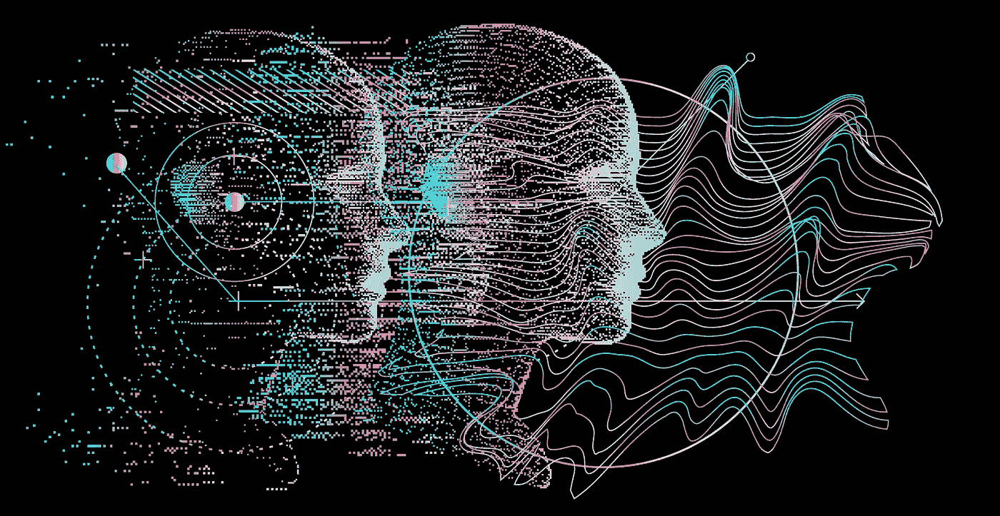
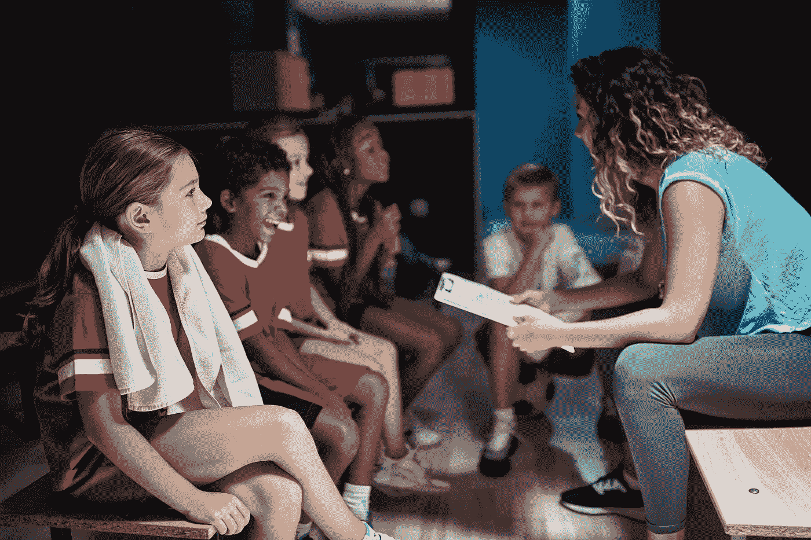

# 多智能体模拟:推理时间智能中的关键功能

> 原文：<https://towardsdatascience.com/multi-agent-simulation-a-key-function-in-inference-time-intelligence-f032dabf9a16>

## **在涉及多人或智能机器的假设场景中避免组合爆炸**

*图片来源:* [*本地 _ 医生*](https://stock.adobe.com/contributor/208604266/local-doctor?load_type=author&prev_url=detail) *途经* [*土坯股票*](https://stock.adobe.com/) *。*

我们将看到[模拟](https://en.wikipedia.org/wiki/Simulation)的角色发生重大变化，以评估实现机器智能的实时假设场景。我相信，如果扩展到推理时包括基于代理的模拟，它可以发挥更有意义的作用。这种类型的计算寻求基于来自多个代理(人类或其他人工智能)的输入迭代地解决问题，这是更真实世界学习的特征。因此，它有可能在机器学习过程中传授多种“思维模式”，并推动下一代人工智能的发展。

# **什么是模拟，真的吗？**

为了给下面的讨论打下基础，我们需要在讨论的上下文中从模拟的定义开始。

在这里，我们将[模拟](https://www.twi-global.com/technical-knowledge/faqs/faq-what-is-simulation)定义为一种方法，该方法使用专门的模型来模拟真实的或提议的系统操作，以在各种场景或过程变化下为决策提供证据。

> **模拟使用专门的模型来模拟真实的或建议的系统操作，为各种场景或过程变化下的决策提供依据。**

为了更好地理解模拟与人类认知的关系，考虑一个人类经常遇到的情况——一个中等规模的个人团体的会议。例如，这可能是一个学校运动队和他们的教练在一场重要的比赛或比赛之前的一次会议。会议中的所有人都有稍微不同的背景和目标。

*图一。教练有每个队员个性的详细模型。图片来源:* [*土坯股票*](https://stock.adobe.com/contributor/201048989/luckybusiness?load_type=author&prev_url=detail) *。*

教练将能够以相当高的精确度模拟会议的展开，并将积极利用这种模拟能力来计划说什么以及如何达到最佳效果。这个模拟需要哪些认知功能？

*   教练必须能够跟踪哪些个人可以获得哪些信息。一些信息是公开的，比如对方球队的名称和比赛日期，而其他信息是私人的，比如球员个人的健康记录。她知道不要重复不必要的公开信息，也不要隐瞒私人信息。
*   她需要模拟每个玩家的精神和身体状态，以及他们的目标。她知道哪些球员最近受伤了，哪些球员打破了他们的个人记录。她明白，有些人是在捍卫自己已经很强大的地位，而有些人则希望有一个展示自己的机会。她还知道哪些球员对挑战的反应很好，哪些球员需要额外的鼓励。
*   在整个会议期间，她将继续构建她的玩家模型。例如，如果一个孩子表现出强烈的个人成长，教练会注意到这一点，并相应地调整她未来的行为。
*   最后，教练可以模拟一系列潜在的互动。例如，她知道批评一个玩家一次与连续批评同一个玩家三次会有不同的效果。

这种因果多主体模拟能力是人类社会认知的核心。如果我们要将上述特征翻译和提炼为更专业的术语，我们需要推断出以下特征，这些特征是人工智能必须具有的，以更类似于人类的方式进行模拟:

*   能够建模、实例化和更新环境中单独的、可区分的代理和其他复杂对象。
*   迭代环境和代理状态的能力——也就是说，人工智能需要能够迭代地完成代理本身和代理与环境之间的相关行为和交互序列。
*   能够将每个代理/对象的行为建模为通用和潜在自定义功能的组合(即，所有孩子的行为都像 *F(x)* ，特别是凯利，具有 *F(x=a)* 行为)。
*   跟踪每个代理的相关输入序列和内部状态(包括知识状态)的能力。

在现代人工智能的标准环境中，模拟通常不包括上述能力，尤其是在推理时。

# **环境模拟及其局限性**

今天，大多数基于模拟的人工智能研究都集中在像环境模拟这样的问题上，用于[机器人](https://www.sciencedirect.com/science/article/pii/S1270963820311287)或[自动驾驶汽车](https://link.springer.com/article/10.1007/s11042-021-11437-3)的运动训练。它还被用于计算视频游戏等强化学习场景中的最佳动作。这种类型的模拟基于一个整体模型，这意味着所有的推断都基于内部存储的数据。它通常以明确定义的目标为特征(例如赢得比赛)。人工智能代理的目标不考虑环境中潜在的质量变化，也不考虑它必须与之交互的其他代理的目标。

环境模拟已经取得了几个令人印象深刻的里程碑。其中值得注意的是[教授约书亚·特南鲍姆](https://mitibmwatsonailab.mit.edu/people/joshua-tenenbaum/)和麻省理工学院大脑和认知科学系团队的工作，他们在发展里程碑和[物理场景理解](https://www.pnas.org/doi/epdf/10.1073/pnas.1306572110)的背景下研究模拟。同样，谷歌大脑的研究人员通过注入来自物理模拟引擎的信息，在大型语言模型中实现了更强大的推理能力。OpenAI 的 [Dota 机器人](https://cdn.openai.com/dota-2.pdf)是第一个在 Dota 2 中[击败世界冠军电子竞技队的人工智能机器人，Dota 2 是一款在线多人对战竞技场游戏。](https://www.vox.com/2019/4/13/18309418/open-ai-dota-triumph-og)

然而，机器学习的标准方法缺乏几个特征:

*   模拟通常在训练时间而不是在推理时间运行。
*   模拟环境通常是“无面孔”的，因为它不包括复杂的、不断进化的代理，这些代理的行为会根据前面的交互序列而变化。
*   他们不能模拟作用于不同目标的代理，而这是人类可以轻易做到的。这将需要一种融入更复杂的世界模型和心理理论的模拟——这些高级智能的关键原则如此无缝地嵌入儿童发育中的大脑，并在幼儿园小朋友的蜡笔画中表现出来。

开放的现实世界的相互作用涉及代理人对各种目标的行动，因此不能容易地使用给定环境状态的最佳可能行动的范例来模拟。此外，强化学习(这是传统上在这种情况下使用的范式)已经被巨大的状态空间所困扰，即使对于目前使用的狭窄定义的环境也是如此。

# 聚焦于基于因果代理的模拟

大多数机器学习不包含多智能体模拟，这在很大程度上是计算上禁止的，因为它会导致样本空间大小的爆炸。这是一个必须跨越的障碍，以赋予人工智能解决世界上一些更重要的问题所需的预测能力。

有没有一种方法可以克服开放式多智能体环境的计算困难，并允许人工智能智能智能体有效地集成到这样的环境中？

首先，让我们更精确地描述传统端到端方法的计算困难性来自哪里。

今天，基于人工智能的解决方案所针对的大多数智能任务都是非情境性的，也就是说，输出是*而不是*依赖于进行查询的上下文或特定情境。它们也不跟踪特定个人或其环境中复杂物体的近期历史。相比之下，人类总是在非常强的语境/情境设置中应用他们的智力；他们的回答很少是“通用的”。下一代人工智能必须结合代表性结构和功能建模来弥补这一差距。

当一个具有情景智能的 AI 被置于一个有多个复杂代理的环境中时，它必须能够执行两个关键功能:

*   跟踪这些代理的输入和以前的行为；
*   模拟具有潜在响应序列的假设情景，并确定这些序列可能如何影响环境和那些代理。

在当前的方法中，系统试图创建综合的输入-输出函数(例如，实现为大规模神经网络)，使得当呈现一种情况时，它可以预测或推荐下一步。为了将多主体设置映射到这样一个“平面”输入输出函数，需要在训练期间展开所有潜在的序列和多主体交互，这可能很快变得难以处理。

然而，如果范式被改变为在推理过程中使用“假设”情景的模拟，则没有必要展开大的组合空间。人们只能在推理时模拟要评估的相关序列。这将包括无限小数量的序列，从而避免组合爆炸。

在这种情况下，使用封装的代理模型进行因果模拟不仅是实现预期结果的最有效方式，也是唯一的方式。这种模拟将允许代理与部分假设场景进行交互，而不需要立即展开整个环境。然后，可以通过从不可行到可行的场景迭代地进行推理。

为了说明这个过程，考虑我们前面的运动队和教练的例子。假设我们有十个玩家(代理)，每个玩家有 100 种可能的行为。我们的人工智能试图生成潜在的假设场景，以选择最佳行动方案。如果一个人工智能试图学习十个智能体中的每一个的模型，为每个可能的环境状态执行每个可能的行为，这将导致大规模的组合爆炸。但是在任何现实场景中，只有一小部分代理的行为和世界状态是相关的。如果代理模型被单独封装并与世界模型分离，AI 可以执行搜索以首先选择相关的行为和世界状态，然后仅展开那些因果上可能相关的模拟场景。

这将类似于一个整体嵌入空间(由端到端网络学习),它被分解成离散的单元，每个单元保存相关环境或个体代理的表示。然后，这些离散的单元可以被查询以生成反事实的场景，从而包含组合爆炸。

# **总结**

随着人工智能系统从实验室走向企业和家庭，它们将需要新的能力来变得更具适应性、情境性、[深度情境性](/advancing-machine-intelligence-why-context-is-everything-4bde90fb2d79)，并擅长与周围的人和实体进行持续互动。基于因果代理的模拟是下一代人工智能解决方案的关键。它解决了两个巨大的需求:需要用基于人工智能的合作代理来支持人类劳动力，并执行依赖于情况意识但超出人类能力的任务。使这些进步易于处理和扩展将不可避免地要求人工智能体系结构的模块化，以实现推理时间模拟能力。

# 参考

1.  维基百科贡献者。(2022 年 10 月 10 日)。模拟。维基百科。[https://en.wikipedia.org/wiki/Simulation](https://en.wikipedia.org/wiki/Simulation)
2.  *什么是模拟？这是什么意思？*(定义和例子)。(未注明)。TWI。检索于 2022 年 10 月 24 日，来自[https://www . twi-global . com/technical-knowledge/FAQ/FAQ-what-is-simulation](https://www.twi-global.com/technical-knowledge/faqs/faq-what-is-simulation)
3.  李玉英，郝，谢，佘玉英，李树生，于，米(2021)。基于深度强化学习的自由漂浮双臂空间机械臂约束运动规划。航天科技，109，106446。
4.  佩雷斯-吉尔。(2022 年)。基于深度强化学习的自主车辆控制。多媒体工具和应用，81(3)，3553–3576。
5.  约书亚·特南鲍姆。(2022 年 10 月 6 日)。麻省理工学院-IBM 沃森人工智能实验室。[https://mitibmwatsonailab.mit.edu/people/joshua-tenenbaum/](https://mitibmwatsonailab.mit.edu/people/joshua-tenenbaum/)
6.  巴塔格利亚，P. W .，汉姆里克，J. B .，&特南鲍姆，J. B. (2013)。模拟作为物理场景理解的引擎。美国国家科学院学报，110(45)，18327–18332。
7.  刘，魏军，顾，吴，吴，崔，崔，戴(2022)。通过模拟的基础语言模型推理。arXiv 预印本 arXiv:2210.05359。
8.  Berner，c .、Brockman，g .、Chan，b .、Cheung，v .、Dę biak，p .、Dennison，c .……、张，S. (2019)。大规模深度强化学习的 Dota 2。arXiv 预印本 arXiv:1912.06680。
9.  派珀，K. (2019，4 月 14 日)。OpenAI 的 Dota AI 击败职业队 OG，成为第一个击败卫冕世界冠军的 AI。Vox。[https://www . vox . com/2019/4/13/18309418/open-ai-dota-triumph-og](https://www.vox.com/2019/4/13/18309418/open-ai-dota-triumph-og)
10.  歌手 g(2022 年 8 月 17 日)。超越输入输出推理:认知人工智能的四个关键特性。中等。[https://towards data science . com/beyond-input-output-reasoning-four-key-properties-of-cognitive-ai-3f 82 CDE 8 cf 1e](/beyond-input-output-reasoning-four-key-properties-of-cognitive-ai-3f82cde8cf1e)
11.  歌手 g(2022 b，10 月 7 日)。推进机器智能:为什么语境决定一切。中等。[https://towards data science . com/advancing-machine-intelligence-why-context-is-everything-4 bde 90 FB 2d 79](/advancing-machine-intelligence-why-context-is-everything-4bde90fb2d79)