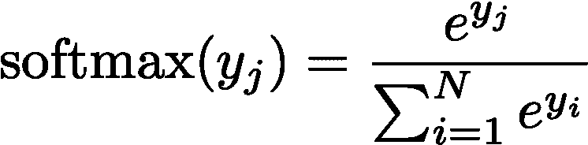
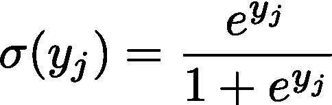
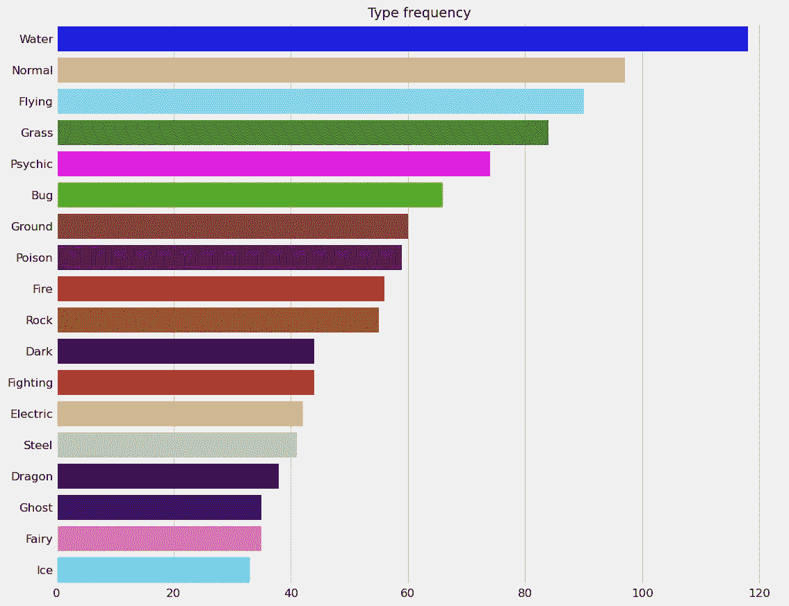
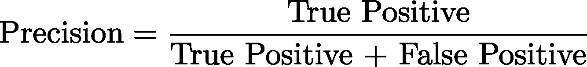
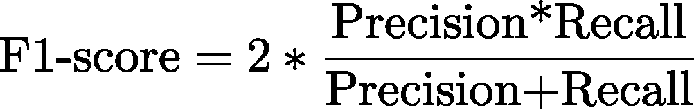
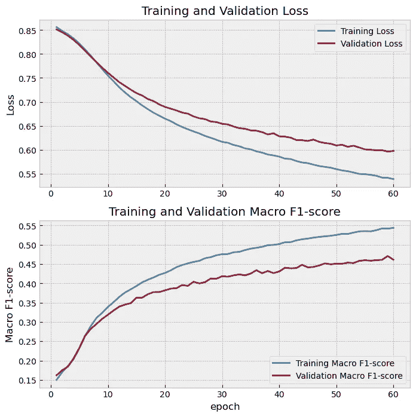

# 基于 TensorFlow 的口袋妖怪类型多标签分类

> 原文：<https://towardsdatascience.com/multi-label-classification-of-pokemon-types-with-tensorflow-8217a38038a6>

## 用深度学习创建 Pokedex


布兰登·斯凯利在 [Unsplash](https://unsplash.com/s/photos/pokemon?utm_source=unsplash&utm_medium=referral&utm_content=creditCopyText) 上的照片

为了庆祝新口袋妖怪游戏*口袋妖怪传说:阿尔宙斯*的发布，我认为做[另一个](/determining-the-optimal-pokemon-team-for-pokemon-brilliant-diamond-and-shining-pearl-with-pulp-d589ae9b2e68)口袋妖怪主题的数据科学项目会很有趣:训练一个神经网络，它将口袋妖怪的图像作为输入，并输出它们的类型。

# 底漆

在我继续之前，先给那些不熟悉的人简单介绍一下口袋妖怪。口袋妖怪是像动物一样的生物，可以被捕获并训练来与其他口袋妖怪战斗。每个口袋妖怪都有一两个元素类型，表示它可以使用的最强的移动类型，以及它在战斗中对什么类型的口袋妖怪有优势或劣势。比如《口袋妖怪》系列的标志性吉祥物皮卡丘就是电动型的。这意味着它对地面型口袋妖怪有弱点，对水和飞行型口袋妖怪有优势。在游戏中，你可以捕捉野生口袋妖怪，并使用一种名为 Pokedex 的类似百科全书的设备记录它们的类型和其他信息。大多数游戏的目标之一是捕捉和记录土地上每一个口袋妖怪的数据，但我们如何能仅仅通过看它来确定口袋妖怪的类型？这是本文的重点。

# 数据

我们将在口袋妖怪游戏的各种迭代或世代中使用精灵图像，这些精灵图像来自 Github 资源库，名为 [PokeAPI](https://github.com/PokeAPI/sprites) ，可以免费使用，图像属于任天堂。我们还将使用来自 Kaggle 的数据集[,它列出了国家 Pokedex 中每个口袋妖怪的类型和数量，我们将使用它来索引和标记我们的图像。总共有 18 种。以前的读者可能还记得，我们使用这个数据集来确定口袋妖怪的最佳团队，在最近的两个游戏中使用。](https://www.kaggle.com/abcsds/pokemon)

图像组织如下:

```
sprites
\- pokemon
    \- other
        \- dream world (SVGs)
        \- official artwork (PNGs)
    \- versions
        \- generation i
            \- red and blue (PNGs with back, gray, transparent, back-gray variants)
            \- yellow (PNGs with back, gbc, gray, transparent, back-gbc, back-gray, back-transparent variants)
        \- generation ii
            \- crystal (PNGs with back, shiny, back-shiny, transparent, transparent-shiny, back-transparent, back-transparent-shiny variants)
            \- gold (PNGs with back, shiny, transparent, back-shiny variants)
            \- silver (PNGs with back, shiny, transparent, back-shiny variants)
        \- generation iii
            \- emerald (PNGs with shiny variants)
            \- fire red and leaf green (PNGs with back, shiny, back-shiny variants)
            \- ruby and sapphire (PNGs with back, shiny, back-shiny variants)
        \- generation iv
            \- diamond and pearl (PNGs with back, female, shiny, back-female, back-shiny, shiny-female variants)
            \- heart gold and soul silver (PNGs with back, female, shiny, back-female, back-shiny, shiny-female variants)
            \- platinum (PNGs with back, female, shiny, back-female, back-shiny, shiny-female variants)
        \- generation v
            \- black and white (PNGs with back, female, shiny, back-female, back-shiny, shiny-female, animated variants)
        \- generation vi
            \- omega ruby and alpha sapphire (PNGs with female, shiny, shiny-female variants)
            \- x and y (PNGs with female, shiny, shiny-female variants)
        \- generation vii
            \- ultra sun and ultra moon (PNGs with female, shiny, shiny-female variants)
            \- icons (PNGs)
        \- generation viii
            \- icons (PNGs with female variants)
    \- default PokeAPI sprites (PNGs with back, female, shiny, back-female, back-shiny, shiny-female variants)
\- items
    \- default PokeAPI items (PNGs)
```

一些关键术语需要澄清:“闪亮的”是指口袋妖怪有一种不同于正常外观的颜色。例如，[闪亮的皮卡丘](https://github.com/PokeAPI/sprites/blob/master/sprites/pokemon/versions/generation-iv/platinum/shiny/25.png)被太阳晒成了橙色，而不是标志性的黄色皮卡丘。女性口袋妖怪是不言自明的:一些口袋妖怪根据他们的生物性别有不同的外表。例如，雌性皮卡丘有一条[心形尾巴](https://github.com/PokeAPI/sprites/blob/master/sprites/pokemon/versions/generation-iv/platinum/female/25.png)，而不是[闪电尾巴](https://github.com/PokeAPI/sprites/blob/master/sprites/pokemon/versions/generation-iv/platinum/25.png)。最后，“back”指的是口袋妖怪的 [back-sprite](https://github.com/PokeAPI/sprites/blob/master/sprites/pokemon/versions/generation-iv/platinum/back/25.png) ，用户在与对手的口袋妖怪战斗中挥舞，对手的前面 sprite 被显示。当我们训练我们的模型时，同一只口袋妖怪的这些不同视图将非常有用，因为截至 2021 年只有 898 只口袋妖怪，这本身并不构成一个大数据集。通过包括来自不同游戏和世代的精灵，考虑到前后精灵、闪亮的口袋妖怪和两性异形的口袋妖怪，我们有了一个更大的数据集，这将对训练我们的模型非常有帮助。在这一点上，让我们过渡到如何使用这些数据来训练我们的分类器。

# 机器学习方法

由于每个口袋妖怪可以有 1 或 2 个类型，我们将这建模为机器学习中的多标签分类问题。在这里，我们可以为一个目标输入分配多个标签。例如，将一条牛仔布裤子的图像分类为“蓝色”和“牛仔裤”。这需要与更简单的多类分类问题不同的架构，在多类分类问题中，我们有单个互斥的类来分配目标(例如，确定图像中的动物是猫还是狗)。

在多标签场景中，我们定义了一组标签，在本例中为 18 种类型，我们的模型为每个标签分配了一个概率，如果标签概率超过某个阈值(在本例中为 0.5)，就可以将我们的目标分类为多个标签。在许多神经网络架构中，我们获得原始输出值的向量。由于口袋妖怪有 18 种可能的类型，我们的分类器将为我们输入模型的每个口袋妖怪图像输出 18 个输出。这些值被转换成概率，允许我们基于这些值和阈值对口袋妖怪的类型进行预测。在我们只是给每个输入分配一个类的情况下(例如，拍摄一个宠物的图像并确定它是猫还是狗)，我们经常使用一个 **softmax** 函数来转换这些原始输出。



这实质上是对输出应用指数变换，并通过对分母中每个原始输出的指数求和来计算概率，分子中是指数化的目标输出。这类似于我们通常通过考虑所有其他事件的概率来计算单个事件的概率。然而，在我们的例子中，由于一些口袋妖怪有不止一种类型，彼此独立，我们需要使用不同的方法。这就是 **sigmoid** 函数的用武之地。



与 softmax 一样，原始输出也经过指数变换，但请注意，这些概率是相互独立计算的(即，它们的总和不需要等于 1)。所以，比方说，[Charizard](https://github.com/PokeAPI/sprites/blob/master/sprites/pokemon/versions/generation-iv/platinum/6.png)——火/飞行型口袋妖怪——成为火型的概率与其成为飞行型的概率没有关系，反之亦然。因此，我们有 83%的几率它会着火，74%的几率它会飞起来。因此，我们将在训练阶段评估我们的预测并相应地微调模型时使用该函数。

我们需要考虑的另一个因素是我们将如何评估我们的模型。出于与为什么我们不能使用 softmax 函数来推导概率类似的原因，我们不能简单地使用传统的准确性度量作为我们的模型在训练和验证期间表现如何的手段；准确性本质上是我们正确分类的案例的分数。数学上，这被定义为:


像 softmax 一样，这在我们每个类只有一个正确答案的情况下很有用，但在我们有多个像 Pokemon 模型一样的正确答案的情况下，如果输入不完全正确，它会严重惩罚损失函数，从而导致糟糕的性能。所以回到我们的 Charizard 例子，它不会因为猜对了其中一种类型而给予部分奖励:要么全有，要么全无。当标签分布不均匀时，这尤其成问题，如下所示:



从第 1 代到第 6 代的口袋妖怪类型的频率。作者图片

相反，我们将使用**F1-得分**指标。这是**精度**和**召回**的调和平均值，分别测量所有预测阳性病例中正确预测阳性病例和所有实际阳性病例中正确预测阳性病例的比例:



通过使用来自这两个指标的信息，我们可以得到一个更可靠的衡量模型性能的方法。

在我们转到本文的编码部分之前，还有两件关于 F1 分数的事情。**先说**，以上 F1 分具体到每个类型。为了获得我们的分类器在所有这些类中表现如何的总体感觉，我们可以取 F1 分数的平均值。有几种方法可以做到这一点，但你可以在这里阅读更多的和。在我们的例子中，我们将取 F1 分数的全球平均值，称为宏观 F1 分数**。这一指标对所有类型的权重相等，因此不受类别不平衡的影响，这是我们数据的一个挑战:例如，我们有过多的水和正常类型，但很少有幽灵和冰类型的口袋妖怪。通过平等地权衡类型，我们不会受到数据集中主要类型的严重影响。**其次**，我们将使用一个称为**软 F1 分数**的损失函数来评估我们的模型性能。这是 F1 分数的修改版本，它是可微分的(这是损失函数允许反向传播的重要先决条件)。为了简洁起见，我不会在这里讲太多细节，但是你可以在这里和[这里](https://www.kaggle.com/rejpalcz/best-loss-function-for-f1-score-metric)了解更多信息。**

# 模型实现

我们将使用 TensorFlow 库对我们的神经网络进行编程。我将首先说明，该模型的大部分实现改编自 Ashref Maiza 的[教程](/multi-label-image-classification-in-tensorflow-2-0-7d4cf8a4bc72)，用于 TensorFlow 的[多标签分类](https://github.com/ashrefm/multi-label-soft-f1/blob/master/LICENSE)，此外还有将在本文结尾链接的其他重要资源。

让我们从加载我们的库开始，这将是相当多的:

接下来，我们将对口袋妖怪类型字典及其在 Pokedex 中的索引进行一些数据清理。


作者图片

现在，我们可以开始创建我们的训练数据集。我们将使用 get_images()函数加载从第 1 代到第 5 代的口袋妖怪精灵的图像，该函数将每代的文件夹作为输入，因此我们将总共运行该函数 5 次:

回想一下，由于单个口袋妖怪的数量相当少，我们使用来自多个世代和游戏的口袋妖怪精灵，除了背部精灵、闪亮的变体和雌性口袋妖怪，作为增加我们训练数据大小的内置方式。通过这种方式，我们的训练数据集包含超过 15，000 张图像。

接下来，我们将使用 one-hot 编码将我们的类型二进制化，并使用`tf.data` API 将我们的数据转换成适合多标签分类的格式。

```
Labels:
0\. Bug
1\. Dark
2\. Dragon
3\. Electric
4\. Fairy
5\. Fighting
6\. Fire
7\. Flying
8\. Ghost
9\. Grass
10\. Ground
11\. Ice
12\. Normal
13\. Poison
14\. Psychic
15\. Rock
16\. Steel
17\. Watersprites/sprites/pokemon/versions/generation-iv/diamond-pearl/125.png [0 0 0 1 0 0 0 0 0 0 0 0 0 0 0 0 0 0]
sprites/sprites/pokemon/versions/generation-i/yellow/back/gbc/67.png [0 0 0 0 0 1 0 0 0 0 0 0 0 0 0 0 0 0]
sprites/sprites/pokemon/versions/generation-ii/silver/180.png [0 0 0 1 0 0 0 0 0 0 0 0 0 0 0 0 0 0]
```

`sprites/sprites/pokemon/versions/generation-iv/diamond-pearl/125.png`下的口袋妖怪是电动型口袋妖怪，名为[电击兽](https://github.com/PokeAPI/sprites/blob/master/sprites/pokemon/versions/generation-iv/diamond-pearl/125.png)，所以在二值化的类型向量中，它在对应于该类型的索引 3 处有一个 1。类似地，`sprites/sprites/pokemon/versions/generation-i/yellow/back/67.png`和`sprites/sprites/pokemon/versions/generation-ii/silver/180.png`分别是战斗型、[豪力](https://github.com/PokeAPI/sprites/blob/master/sprites/pokemon/versions/generation-i/yellow/back/67.png)和电动型、[弗拉菲](https://github.com/PokeAPI/sprites/blob/master/sprites/pokemon/versions/generation-ii/silver/180.png)，它们的标签向量也相应格式化。最后，我们将格式化该数据集，以便以 TensorFlow 可以处理的方式将图像和标签链接到该数据集。

既然我们的训练和验证数据集已经相应地准备好并格式化了，我们终于准备好创建和训练我们的模型了！尽管我们能够扩充我们的数据集，但我们将使用迁移学习来提高其性能并减少训练时间。通过迁移学习，我们在一个更大的数据集上使用一个预先训练好的模型——并且不需要与我们自己的数据集相关——作为我们模型的主干，以识别新环境下的类别。TensorFlow 的一个好处是，他们有一个丰富的预训练模型数据库，您可以轻松导入，特别是像我们这样的计算机视觉。我们唯一需要添加的是一个密集的隐藏层和一个对应于 18 种口袋妖怪类型的输出层，然后我们可以编译和训练模型。

这花了 15 分多一点的时间在我的电脑上运行，它有一个英伟达 GTX 1660 超级 GPU。查看训练和验证性能，我们似乎没有任何明显的过度拟合，训练和验证的最终宏观 F1 分数分别为 0.5413 和 0.4612，尽管在训练和验证数据集的最后几个时期，性能显示出收益递减，但仍然非常好。同样，训练和验证的最终损失值分别为 0.54 和 0.5976。



分别用于训练和验证数据的软宏 F1 损失函数和宏 F1 分数的图。作者图片

现在让我们测试模型。我特意在前 5 代口袋妖怪上训练它，因为 Kaggle 的数据集一直到第 6 代，所以我很好奇它在新口袋妖怪上的表现如何，而没有在训练或验证阶段看到他们的图像。我还要补充一点，从第 6 代开始，口袋妖怪从常规的 2D 精灵转变为口袋妖怪的 3D 模型，所以看看我们的模型如何利用它以前从未见过的数据将会更加有趣。

```
Delphox
Type
['Fire', 'Psychic']

Prediction
['Fire', 'Psychic']

Clauncher
Type
['Water']

Prediction
['Water']

Noivern
Type
['Flying', 'Dragon']

Prediction
['Dragon', 'Flying', 'Psychic', 'Water']

Quilladin
Type
['Grass']

Prediction
['Grass']

Gogoat
Type
['Grass']

Prediction
[]

Hawlucha
Type
['Fighting', 'Flying']

Prediction
['Flying', 'Psychic']

Goomy
Type
['Dragon']

Prediction
['Water']

Sylveon
Type
['Fairy']

Prediction
['Flying', 'Water']
```

我们看到，我们的分类器在预测这些口袋妖怪的类型方面做得相当好。给我留下特别深刻印象的是，它完美地完成了[妖火红狐的](https://github.com/PokeAPI/sprites/blob/master/sprites/pokemon/versions/generation-vi/x-y/655.png)(一只狐狸般的口袋妖怪)类型。它努力正确预测[仙子精灵的](https://github.com/PokeAPI/sprites/blob/master/sprites/pokemon/versions/generation-vi/x-y/700.png)仙女类型，并放弃了 [Gogoat](https://github.com/PokeAPI/sprites/blob/master/sprites/pokemon/versions/generation-vi/x-y/673.png) ，因为没有一个类型概率超过 0.5(然而，我会注意到，仙女是在这一代中作为第 18 种类型首次添加的，一些老口袋妖怪要么追溯性地将他们的类型从正常类型改变为仙女类型，要么将其添加到最初的单一类型)。让我们来看看一些更老的口袋妖怪，如[皮卡丘](https://github.com/PokeAPI/sprites/blob/master/sprites/pokemon/versions/generation-vi/x-y/25.png)和 [Charizard](https://github.com/PokeAPI/sprites/blob/master/sprites/pokemon/versions/generation-vi/x-y/6.png) :

```
Pikachu
Type
['Electric']

Prediction
['Water']

Charizard
Type
['Fire', 'Flying']

Prediction
['Flying', 'Normal', 'Psychic']
```

有趣的是，皮卡丘被预测为一种精神类型，可能是因为它是一种非常常见的类型，如类型柱状图所示(加上精神口袋妖怪与其他类型相比在颜色上有很大不同)；Charizard 的火分类不符合我们的模型。这也可能是因为我们在训练中没有使用任何旧口袋妖怪的 3D 模型，所以不同的格式也可能使我们的模型有点偏离。

在本文中，我们学习了如何训练一个神经网络来预测口袋妖怪类型，利用多年来各种游戏迭代中精灵和形式的多样性。我们从更新的 3D 模型游戏中获得了相当好的预测。尽管如此，仍有很大的改进空间。例如，可以执行子采样来抑制类别不平衡问题，并进一步降低我们的损失函数。我们还可以使用不同的损失函数来评估模型性能，例如二进制交叉熵而不是软 F1 损失，这在多标签分类问题中更常用。arXiv 上最近的[预印本](https://arxiv.org/pdf/2108.10566.pdf)介绍了另一个损失函数，该函数来自多标签分类的 F1 分数，称为 sigmoidF1，可能有希望。

尽管如此，我希望这是对口袋妖怪多标签分类的有趣介绍。请在评论中告诉我您对该模型的任何想法或问题，或者其他改进性能的建议。编码快乐！

# 参考

[1][https://towardsdatascience . com/multi-label-image-class ification-in-tensor flow-2-0-7 D4 cf 8 a4 BC 72](/multi-label-image-classification-in-tensorflow-2-0-7d4cf8a4bc72)
【2】[https://github.com/PokeAPI/sprites](https://github.com/PokeAPI/sprites)
【3】[https://www.kaggle.com/abcsds/pokemon](https://www.kaggle.com/abcsds/pokemon)
【4】[https://glassboxmedicine . com/2019/05/26/class ification-sigmoid-vs-soft max/](https://glassboxmedicine.com/2019/05/26/classification-sigmoid-vs-softmax/)
【5】【T12