# 基于 BERT 和张量流的多类文本分类

> 原文：<https://towardsdatascience.com/multi-label-text-classification-using-bert-and-tensorflow-d2e88d8f488d>

## 从数据加载到预测的分步教程

照片由[阿尔方斯·莫拉莱斯](https://unsplash.com/@alfonsmc10?utm_source=medium&utm_medium=referral)在 [Unsplash](https://unsplash.com?utm_source=medium&utm_medium=referral) 拍摄

# 目录

1.  [简介](#a31f)
2.  [数据准备](#5418)
    2.1 [加载数据集](#850b)
    2.2 [【可选】观察随机样本](#5a24)
    2.3 [在训练和测试集中拆分](#ca58)
3.  [数据建模](#98ee)
    3.1 [用 TensorfFlow Hub 加载 BERT](#f7ca)
    3.2[【可选】观察语义文本相似度](#6476)
    3.3 [创建并训练分类模型](#2126)
    3.4 [预测](#3349)
    3.5 [盲集评估](#253d)
4.  [[可选]保存并加载模型以备将来使用](#0d89)
5.  [参考文献](#779c)

# 1.介绍

在这篇文章中，我们将开发一个多类文本分类器。

分类的任务是指对一个给定的观察值预测一个类别。由于这个原因，训练这样一个模型唯一需要的输入是一个数据集，它包括:

*   文本示例
*   关联标签

出于这篇文章的目的，我们需要知道**BERT****(**B**I direction**E**n coder**R**presentations from**T**transformers)是一个基于 transformers 的机器学习模型，即能够学习单词之间上下文关系的注意力组件。更多细节可在参考文献中找到。**

**有趣的是，我们将为非英语文本开发一个分类器，我们将展示如何通过从 TensorFlow Hub 导入不同的 BERT 模型来处理不同的语言。**

# **2.数据准备**

## **2.1 加载数据集**

**在之前的一篇文章中，我们分析了罗马图书馆的读者评论公开数据集，该数据集由“ [*罗马图书馆研究院*](https://www.bibliotechediroma.it/)”⁴.公开提供在没有标签的情况下，我们使用主题建模(一种无监督的技术)来发现读者评论中重复出现的主题，从而通过推理确定所借书籍的主题和读者的兴趣。**

**我们现在将使用前面分析中出现的主题作为标签来对用户评论进行分类。**

**值得注意的是，**之后的步骤可以应用于任何包含**至少两列**的数据集**，分别用于**文本样本**及其**标签**:**

**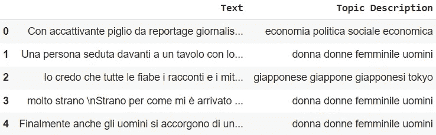**

**图片作者。**

**由于数据集包含来自罗马图书馆的用户评论，他们的语言是意大利语。我们从之前的分析中随机抽取了五个主题，每个主题对应一个标签。它们的分布如下:**

1.  **关于女性在社会中的地位的评论，或者有着强势女性主角的小说(n=205，25.5%)**
2.  **专辑和音乐会的评论，或音乐家的传记(n=182，22.64%)**
3.  **关于经济和社会政治状况的书籍和论文的评论(n=161，20.02%)**
4.  **与日本或日本文化相关的评论(n=134，13.67%)**
5.  **科技泄密论文综述(122 篇，15.17%)**

**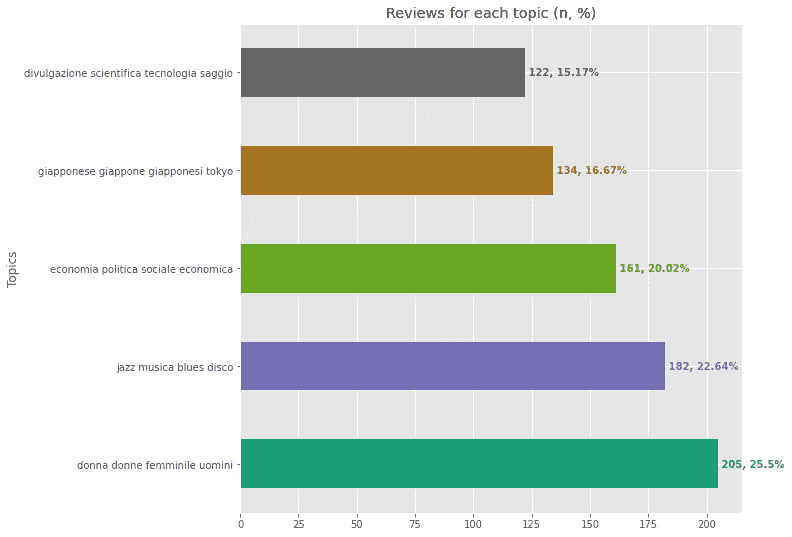**

**图片作者。**

**出于分类的目的，我们需要数字标签。因此，我们将主题描述映射到整数，如下所示:**

**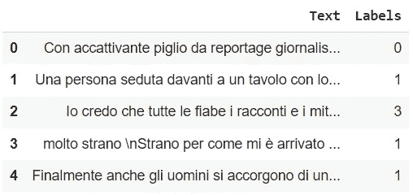**

**图片作者。**

## **2.2[可选]观察随机样本**

**虽然对文本分类的目标来说，这不是绝对必要的，但是我们可能想要检查来自不同主题的一些随机样本，以便更好地理解数据。**

**因此，我们定义了一个函数，它将一个列上的过滤条件作为输入，并打印一个满足该条件的随机评论，以及一个可读性更好的英文翻译:**

**现在，让我们观察一些样品。通过拨打`print_rand_example(df, "Labels", 1)`，我们可以看到一些顾客对女性及其社会地位的评论:**

**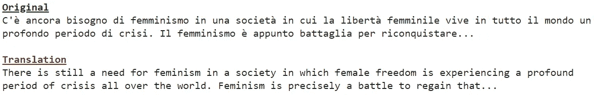**

**作者输出的`print_rand_example(df, "Labels", 1).` 图像。**

**当阅读评论的第一句话时，之前通过无监督方法制造的主题描述似乎是合理的。我们可以从同一个主题看另一个随机样本，同样调用`print_rand_example(df, "Labels", 1)`:**

**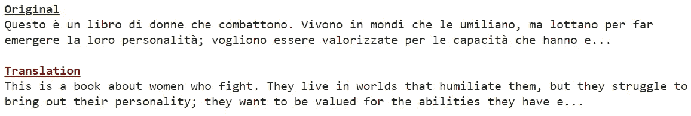**

**图片作者。**

**日语相关的话题呢？让我们通过`print_rand_example(df, "Labels", 3)`了解一下:**

**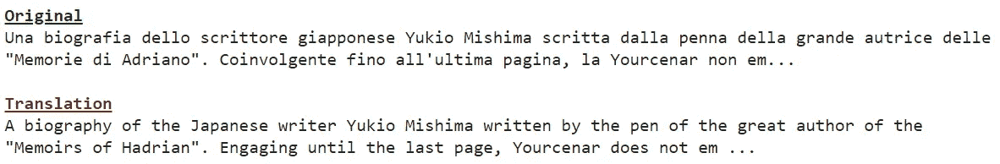**

**图片作者。**

## **2.3 在训练和测试装置中的分离**

# **3.数据建模**

## **3.1 用 TensorFlow Hub 加载 BERT**

**TensorFlow Hub 是经过训练的机器学习 models⁵.的存储库**

**数据科学家可以方便地从 TensorFlow Hub 加载大型复杂的预训练模型，并在需要时重用它们。**

**有趣的是，当我们在 TensorFlow Hub 上搜索“ *bert* ”时，我们可能还会应用问题域(分类、嵌入、…)、架构、语言等过滤器，以方便检索更适合我们需求的模型:**

**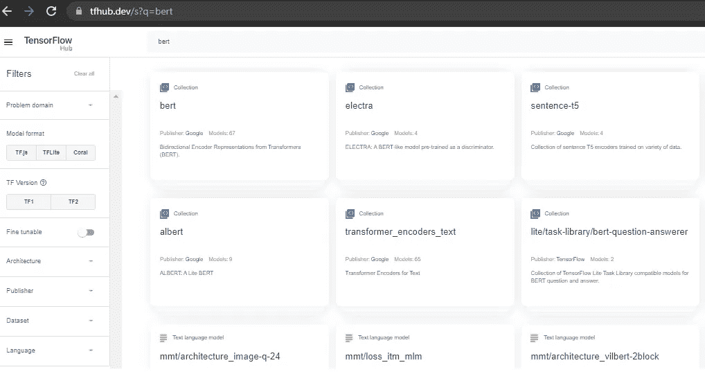**

**在 TensorFlow Hub⁵.网站上搜索“bert”的结果图片作者。**

**在这个例子中，我们使用了`universal-sentence-encoder-cmlm/multilingual-base` ⁶模型，这是一个支持 100 多种语言的通用句子编码器。如参考 paper⁷.中所述，使用条件屏蔽语言模型来训练它**

**我们要实现的是把文本变成捕捉句子级语义的高维向量。因此，我们从 TensorFlow Hub 提供的端点加载`preprocessor`和`encoder`层，并定义一个简单的函数从输入文本中获取嵌入。**

**重要的一点是，可以根据任务和输入语言选择导入任何偏好的模型。**

**由于模型基于 BERT transformer 架构，它将生成形状为`[batch size, 768]`的`pooled_output`(整个序列的输出嵌入)，如下例所示:**

**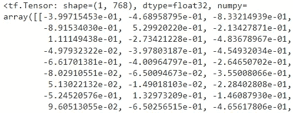**

**图片作者。**

## **3.2[可选]观察语义文本相似性**

**由于嵌入提供了句子级语义的向量表示，我们可能想要观察不同文本序列之间的相似性。**

**为此，我们绘制了通过`cosine similarity` ⁸计算的不同文本样本的语义文本相似度作为 follows⁹:**

**例如，我们期望两个几乎相同的句子，如:**

*   **这本书很有趣**
*   ***Il romanzo è interessante* (小说有趣)**

**将显示出高度的语义相似性，并且我们还期望这两个句子将与具有不同含义的第三个句子共享可比较的相似性度量，并且事实正是如此:**

**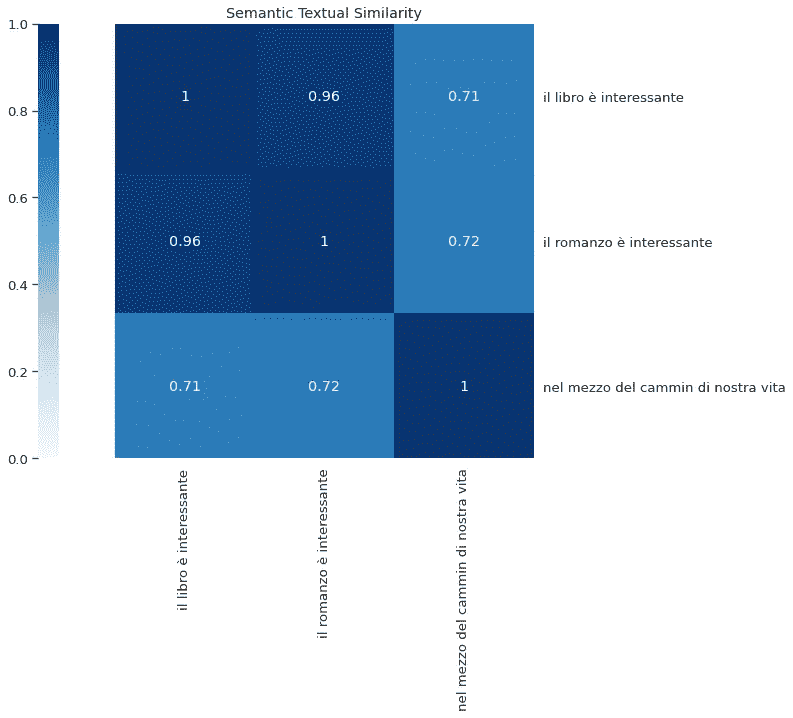**

**图片作者。**

**由于模型的性质，我们可以有效地估计不同语言中句子之间的语义相似度:**

**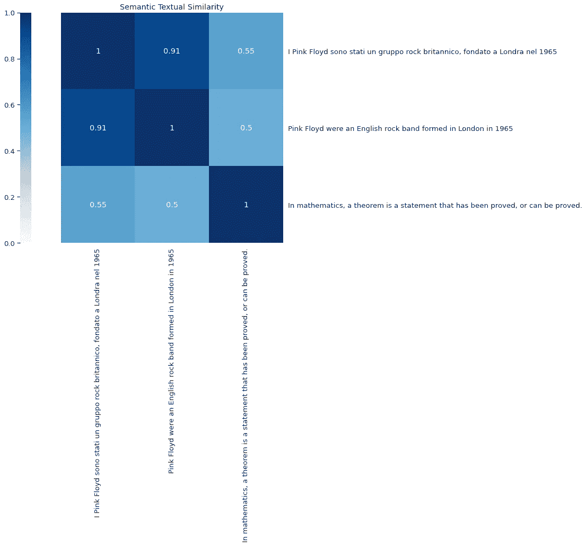**

**图片作者。**

## **3.3 创建和训练分类模型**

**由于我们面临着一个多类分类问题，并且我们之前注意到我们的主题分布略有不平衡，我们可能希望在模型训练期间观察不同的度量。**

**由于这个原因，我们定义了函数来分别计算训练期间每个类的`precision`、`recall`和`F1 score`，然后返回这些类的平均值:**

**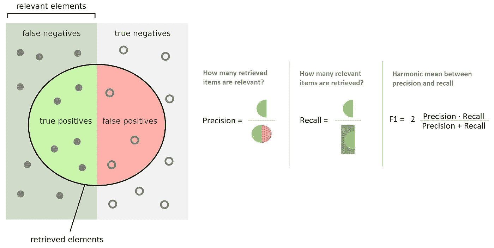**

**精确度、召回率和 F1 分数的定义。图片修改自⁰.维基百科**

**我们现在将模型定义为`preprocessor`和`encoder`层，后面是`dropout`和`dense`层，具有`softmax`激活函数和等于我们想要预测的类别数量的输出空间维度:**

**一旦我们定义了模型的结构，我们就可以编译并适应它。我们选择训练 20 个时期的模型，但是我们也使用`EarlyStopping`回调以便在训练期间监控`validation loss`:如果度量在至少 3 个时期内没有改善(`patience = 3`)，则训练被中断，并且来自`validation loss`显示最佳值(即最低值)的时期的权重被恢复(`restore_best_weights = True`):**

**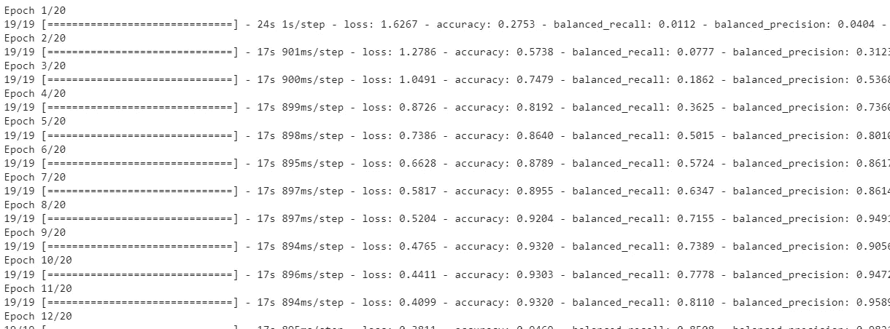**

**训练日志。图片作者。**

**最后，我们可以绘制训练过程中每个受监控指标的假设值，并比较训练和验证曲线:**

****

**训练历史。图片作者。**

## **3.4 预测**

**模型现在已经准备好了，是时候测试一些预测了:**

**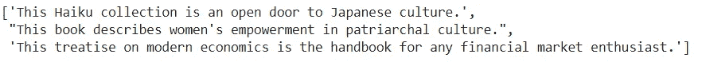**

**图片作者。**

**给定这三个输入句子，我们期望模型分别预测主题 id**3**(`Japan/Japanese/..`)、 **1** ( `Woman/Women/..`)和 **0** ( `Economy/Politics/..`)。**

**为了测试我们的假设，我们定义了一个简单的函数包装`model.predict`。特别是，当我们试图在五个可能的标签之间进行分类时，`model.predict`将返回一个大小为五的`numpy.ndarray`。我们在模型的最后一层使用的`softmax`激活函数实际上提供了目标类的离散概率分布。因此，我们可以简单地采用与较高概率(`np.argmax`)相关联的指数来推断预测的标签:**

**上面的代码片段产生了预期的结果:`[3,1,0]`。**

## **3.5 盲集评估**

**我们最初将数据集分为训练集和测试集，但在训练和验证过程中同时使用了这两个数据集。**

**为了公正地评估我们的性能，我们在一个新的数据集上评估预测的质量，该数据集包含模型在训练(盲集)期间没有“T22”看到的观察值:**

**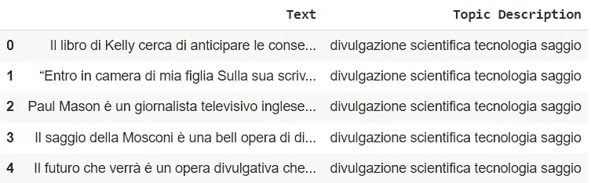**

**盲评估测试集。图片作者。**

**我们可以通过使用数据准备部分中使用的相同代码来观察主题分布:**

**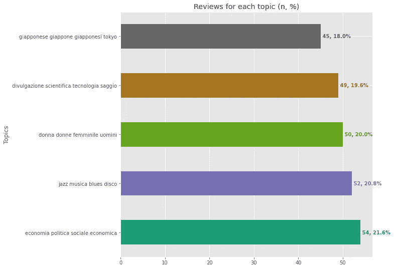**

**图片作者。**

**通过遵循用于准备训练集和验证集的相同步骤，我们可以将主题描述映射到数字标签，并检查一些随机样本。**

**例如，让我们检查来自 id 为 1 的主题的评论:`print_rand_example(test_set, "Labels", 1)`**

**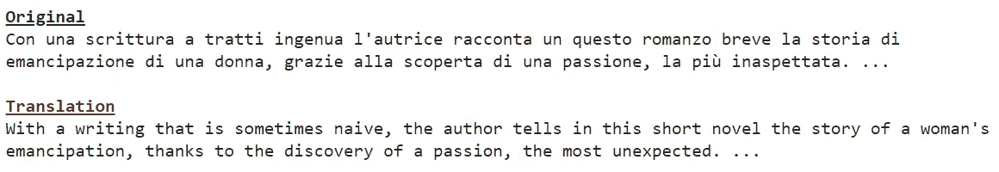**

**图片作者。**

**让我们也观察来自 id 为 3 的主题的评论:`print_rand_example(test_set, "Labels", 3)`**

**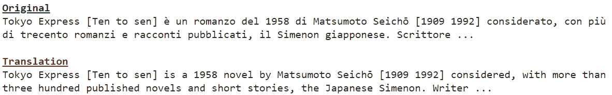**

**图片作者。**

**我们现在可以测试盲集性能:**

**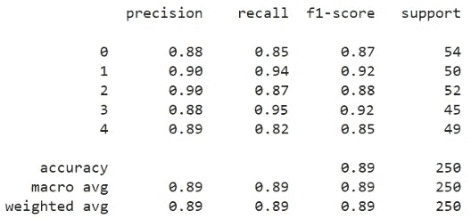**

**图片作者。**

# **4.[可选]保存并加载模型以备将来使用**

**这项任务对于文本分类模型的开发来说不是必不可少的，但它仍然与机器学习问题有关，因为我们可能希望保存模型并在需要时加载它以用于未来的预测。**

**通过调用`model.save`，可以将模型保存为`SavedModel`格式，其中包括模型架构、权重和调用函数的追踪张量流子图。这使 Keras 能够恢复内置层和自定义对象:**

**我们现在可以根据需要加载模型以供将来使用:**

***就是这样！***

# **5.参考**

**[1]德夫林，雅各布；张明伟；李，肯顿；图塔诺娃、克里斯蒂娜、*伯特:语言理解的深度双向变形金刚*前期训练 2018、[arXiv](https://en.wikipedia.org/wiki/ArXiv_(identifier)):[1810.04805 v2](https://arxiv.org/abs/1810.04805v2)**

**[2]阿希什·瓦斯瓦尼、诺姆·沙泽尔、尼基·帕尔马、雅各布·乌兹科雷特、利永·琼斯、艾丹·戈麦斯、卢卡兹·凯泽、伊利亚·波洛舒欣，“*关注是你所需要的一切*”，2017 年， [arXiv:1706.03762](https://arxiv.org/abs/1706.03762)**

**[3][https://towards data science . com/romes-libraries-readers-comments-analysis-with-deep-learning-989d 72 bb 680 c](/romes-libraries-readers-comments-analysis-with-deep-learning-989d72bb680c)**

**[4][https://www . bibliotechediroma . it/it/open-data-commenti-lettori](https://www.bibliotechediroma.it/it/open-data-commenti-lettori)**

**[https://tfhub.dev/](https://tfhub.dev/)**

**[6][https://tfhub . dev/Google/universal-sentence-encoder-cmlm/multilingual-base/1](https://tfhub.dev/google/universal-sentence-encoder-cmlm/multilingual-base/1)**

**[7]，，，杨，Daniel Cer，Jax Law，Eric Darve，*用条件掩蔽语言模型学习通用句子表征*，2021， [arXiv:2012.14388](https://arxiv.org/abs/2012.14388)**

**[https://en.wikipedia.org/wiki/Cosine_similarity](https://en.wikipedia.org/wiki/Cosine_similarity)**

**[https://www.tensorflow.org/hub/tutorials/bert_experts](https://www.tensorflow.org/hub/tutorials/bert_experts)**

**[https://en.wikipedia.org/wiki/Precision_and_recall](https://en.wikipedia.org/wiki/Precision_and_recall)**

**[11][https://www.tensorflow.org/guide/saved_model](https://www.tensorflow.org/guide/saved_model)**