# 基于 Python 中 MSTL 的多季节时间序列分解

> 原文：<https://towardsdatascience.com/multi-seasonal-time-series-decomposition-using-mstl-in-python-136630e67530>

## 了解如何使用 MSTL 分解多季节时间序列，了解 MSTL 如何工作，并查看 MSTL 在现实世界数据中的表现

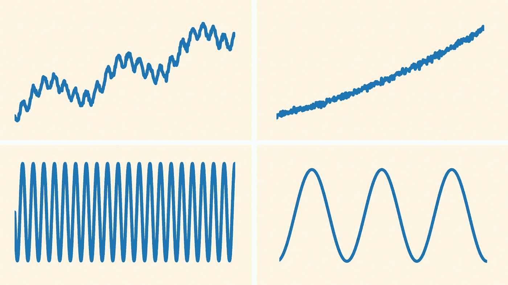

图片作者。

在本文中，我们将分解一个具有多个季节成分的时间序列。我们将探索一种最近开发的算法，称为使用黄土(MSTL) [ [1](https://arxiv.org/abs/2107.13462) ]的多季节趋势分解，并讨论其相对于现有方法的优势。最后，我们将使用 Statsmodels 中新添加的模块在 Python 中尝试 MSTL，并将其应用于真实世界的数据。

# 介绍

时间序列分解就是将时间序列分解成几个部分，最明显的是:趋势部分、季节部分和残差部分。用 Python 实现的单季节成分分解时间序列的方法有很多，比如[STL](https://www.statsmodels.org/devel/generated/statsmodels.tsa.seasonal.STL.html)【2】和[X-13-ARIMA-席](https://www.statsmodels.org/dev/generated/statsmodels.tsa.x13.x13_arima_analysis.html)【3】。但是有多个季节成分的时间序列呢？

以电力需求为例。电力需求具有每日季节性(白天比深夜需求更多)、每周季节性(周末与工作日)和每年季节性(由于供暖和制冷需求不同，夏季和冬季的需求不同)。

多季节时间序列有多普遍？出奇的普遍。天气可以驱动多个季节。想想温度和日照时间是如何在每天和每年的循环中重复的。仅仅是因为天气吗？不会。人类活动(例如，朝九晚五的工作日、工作日与周末、每月发薪日)也每天、每周等等重复。因此，从空气污染到餐馆需求的时间序列可能有多个季节成分。

现在我们知道许多时间序列可能有多个季节性，让我们想想如何分解它们。2021 年 7 月 [Bandara、Hyndman 和](https://arxiv.org/abs/2107.13462) [Bergmeir](https://arxiv.org/abs/2107.13462) 提出了一种新的多季节分解算法，称为黄土多季节趋势分解(MSTL) [1]。MSTL 将是本文的重点。

我们将首先重温时间序列分解的概念。然后，我们将探索 MSTL，它是如何工作的，为什么要使用它。最后，我们将通过 Statmodels 中的一个模块使用 MSTL，我最近添加了这个模块，并使用它来分解电力需求时间序列。

# 时间序列分解

正如你现在所知道的，时间序列分解就是将时间序列分解成趋势、季节性和残差(图 1)。

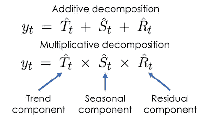

图一。时间序列分解方法可以是加法或乘法。分解方法的目的是计算单个组件。图片作者。

但是你为什么要分解一个时间序列呢？时间序列分解用于任务的时间序列分析，例如:

*   探索性数据分析(例如，调整季节性因素后，本季度失业率是否有所上升？);
*   预处理时间序列，以确定和估算异常值和缺失数据；
*   从时间序列中提取特征，供以后在分类、回归和预测任务中使用；
*   构建预测(例如，可以分别预测各个组成部分，然后汇总得出最终预测)。

一些常用的时间序列分解方法包括:

*   [一种简单的方法](https://www.statsmodels.org/devel/generated/statsmodels.tsa.seasonal.seasonal_decompose.html),其中我们应用移动平均线来提取趋势，并采用季节性指数(如月份)的平均值来提取季节性；
*   [利用黄土(STL)进行季节趋势分解](https://www.statsmodels.org/devel/generated/statsmodels.tsa.seasonal.STL.html)【2】；
*   [X-13-ARIMA-席](https://www.statsmodels.org/dev/generated/statsmodels.tsa.x13.x13_arima_analysis.html) [3]。

这些方法旨在从时间序列中提取单个季节性成分。

可以提取多个季节成分的方法包括 Prophet [4]、TBATS [5]和 STR [6]。Prophet 和 TBATS 推断季节性成分，作为训练预测模型的一部分。相反，MSTL 直接关注于时间序列的分解。稍后，我们将看到 MSTL 在一组基准时间序列上的表现优于其他方法[1]。至此，让我们深入了解 MSTL 的细节。

*如果您想了解更多关于时间序列分解方法以及如何提取预测特征的信息，请查看本课程* [*时间序列预测特征工程*](https://www.courses.trainindata.com/p/feature-engineering-for-forecasting) *。*

# MSTL:这是什么？

MSTL 代表使用**L**oess【1】的 **M** 倍数 **S** 季节- **T** 渲染分解。这是一种将时间序列分解为趋势分量、多个季节分量和残差分量的方法。

MSTL 假设时间序列可以表示为加法分解(图 2):

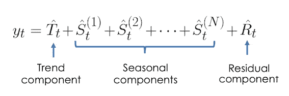

图二。多季节成分的可加分解。图片作者。

其中每个季节性成分代表不同的季节性(例如，每天、每周、每年等)。).我们将在后面看到 MSTL 在 STL 的基础上迭代提取每个季节成分。

# MSTL:为什么要用它？

在[1]中，作者将 MSTL 与其他多季节分解方法进行了比较:Prophet [4]、TBATS [5]和 STR [6]。他们比较了这些方法的准确性和计算效率。他们认为 MSTL 是有用的，因为它是:

*   准确地说，MSTL 通常在一系列基准时间序列上产生最低的 RMSE；
*   在计算效率方面，MSTL 的执行时间是所有方法中最短的；
*   对异常值鲁棒，MSTL 能够通过向底层 STL 拟合传递一个标志来使用 STL 的异常值鲁棒版本；

我还要补充一点:

*   MSTL 可以模拟随时间变化的季节性(例如，与夏季相比，冬季的每日电力需求模式将有所不同)。

简单是 MSTL 相对于提取季节成分的预测模型(如 Prophet 和 TBATS)的另一个优势。对于预测模型，要创建一个好的预测和一个好的分解，需要调整许多参数和考虑许多事情。而 MSTL 完全专注于分解时间序列，根据我的经验，需要调整的参数较少。

所以现在我们知道什么是 MSTL 以及为什么要使用它。让我们继续了解 MSTL 是如何工作的。

# MSTL:它是如何工作的？

MSTL 建立在 STL(使用 **L** oess 的 **S** easonal- **T** rend 分解的缩写)之上，这是一种可以提取单个季节成分的分解方法。STL 反过来建立在一种叫做黄土[7]的平滑方法之上(简称**Lo**cally**E**estimated**S**catter plot**S**moo thing)。黄土和 STL 值得单独写一篇博文，所以我只给出它们的概要，这样我们就可以把注意力集中在 MSTL 了。

## 黄土概述

黄土是一种用于拟合散点图的平滑曲线的方法[7]。黄土通过将多项式拟合到该点周围的数据窗口来计算任意给定点处的平滑曲线。这给了我们两个重要的参数:**窗口大小**，它决定了拟合的平滑程度，以及多项式 l 的次数**(通常是 0 或 1)。**

黄土更容易直观理解(图 3)。在动画中，我们可以看到从真实数据(蓝点)计算黄土曲线(灰点)的过程:我们查看数据窗口(红点)，我们希望在该窗口中计算黄土值并拟合该窗口内的曲线(直线)。在这个例子中，多项式次数是 1。

黄土拟合时间序列的曲线可用于模拟时间序列的趋势(图 3)。在图 4 中，我们看到当选择了适当的窗口大小时，黄土能够捕捉零售时间序列的趋势。

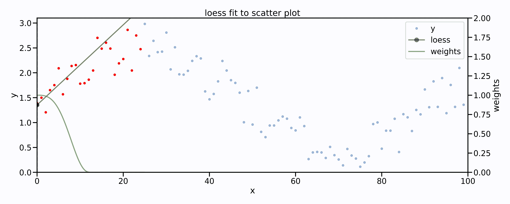

图 3。黄土拟合散点图的图解。在每个点上，一个多项式(在这种情况下是一条线)被拟合到一个数据点窗口(红色)。绿色曲线表示多项式拟合中使用的权重，使得窗口边缘的数据比中心的数据具有更小的权重。图片作者。

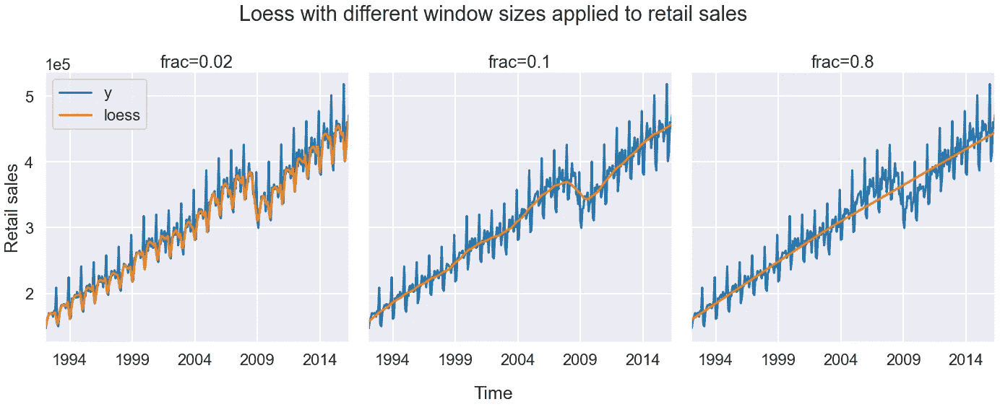

图 4。对于不同的窗口大小参数值“frac ”,黄土拟合(橙色)每月零售销售数据集(蓝色)。当窗口尺寸太小(frac=0.02)时，我们看到黄土过拟合季节性，当窗口尺寸太大(frac=0.8)时，它欠拟合数据，当选择一个好的窗口尺寸(frac=0.1)时，黄土捕捉时间序列的总体趋势。零售额数据集是零售额的月度数据集，可在[这里](https://github.com/facebook/prophet/blob/main/examples/example_retail_sales.csv)找到。图片作者。

## STL 概述

STL 的目标是从时间序列中提取一个单一的季节性成分、一个趋势成分和一个残差成分(图 5)。它通过将黄土应用于原始时间序列的多重变换来实现这一点，并递归地提取趋势和季节分量。在原论文[2]和这篇博文[ [8](http://www.gardner.fyi/blog/STL-Part-II/) ]中对 STL 有很大的解释。

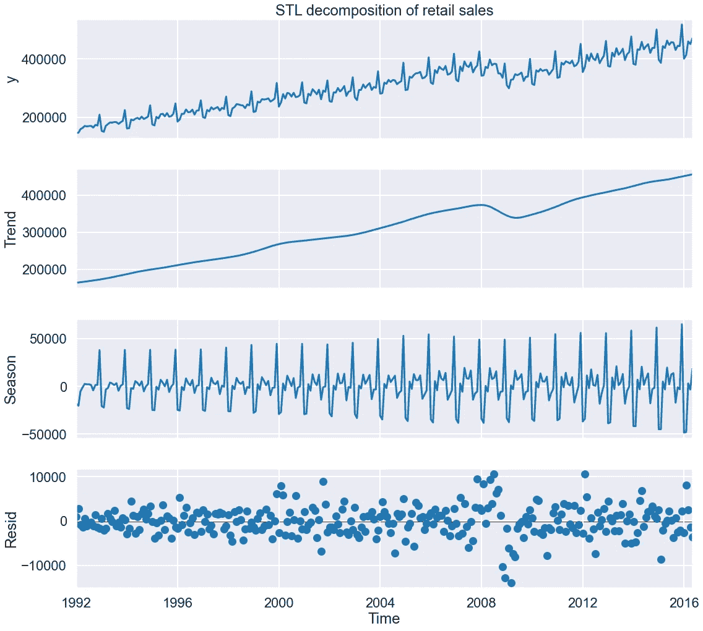

图 5。零售数据集的 STL 分解。零售数据集是零售量的月度数据集，可在[这里](https://github.com/facebook/prophet/blob/main/examples/example_retail_sales.csv)找到。图片作者。

那么要了解 MSTL，需要知道 STL 的哪些主要参数呢？我们将看到 MSTL 使用 STL 提取的季节性成分。STL 使用黄土计算季节分量。因此，STL 中有一个与季节分量相关的窗口大小和多项式次数的参数。因此，STL 季节性参数汇总如下:

*   `period`，我们希望 STL 提取的季节性成分的周期(例如，`period=12`如果我们希望每年季节性，数据的频率是每月)；
*   `seasonal`，STL 中用于提取季节分量的黄土的窗口大小(这决定了提取的季节分量有多平滑和规则)；
*   `seasonal_deg`，黄土提取 STL 中季节分量所用的多项式次数(一般设置为 0 或 1)。

## MSTL 算法

现在我们知道了什么是 MSTL(一种建立在 STL 上提取多个季节成分的算法)以及为什么要使用它(它优于现有的方法)，让我们来讨论一下算法。MSTL 算法可以分为:1)预处理步骤和 2)分解步骤。

## **预处理步骤**

有两个预处理步骤通常用于许多时间序列分析任务，而不仅仅是 MSTL。

**第一步:估算缺失数据。**在 MSTL 的 [R 实现](https://www.rdocumentation.org/packages/forecast/versions/8.16/topics/mstl)中，这是使用`[na.interp](https://www.rdocumentation.org/packages/forecast/versions/8.16/topics/na.interp)`来完成的。在 Python 实现中，您必须在使用 MSTL 之前估算缺失数据。

**步骤 2:如果用户指定，应用一个** [**框 Cox**](https://otexts.com/fpp2/transformations.html#mathematical-transformations) **变换。**如果我们认为时间序列是由加法分解描述的**而不是**，则使用此选项。Box Cox 变换可以将原始时间序列转换成可以用加法分解描述的新时间序列。

如果输入时间序列没有缺失数据并且不需要 Box Cox 变换，则可以跳过这两个步骤。

## **分解**

我们将算法的分解部分分成多个步骤。

第一步:使用 STL 提取每个季节成分。我们将想要提取的每个季节性成分的时间段传递到 MSTL(例如，对于具有每日和每周季节性的每小时数据`periods = (24, 24*7)`——每日季节性的时间段为 24 小时，每周季节性的时间段为 24*7=168 小时，等等)。).

我们将从最短的时间段(例如，每天)到最长的时间段(例如，每年)开始迭代每个季节组件。在每次迭代中，我们通过 STL 提取季节性成分(图 6a、6b)，然后从时间序列中减去它(图 6c)。然后，我们将得到的去季节性时间序列传递到下一次迭代，在该迭代中，我们提取下一个季节性成分(图 6d)等等，直到所有季节性成分都被提取出来(图 6e)。

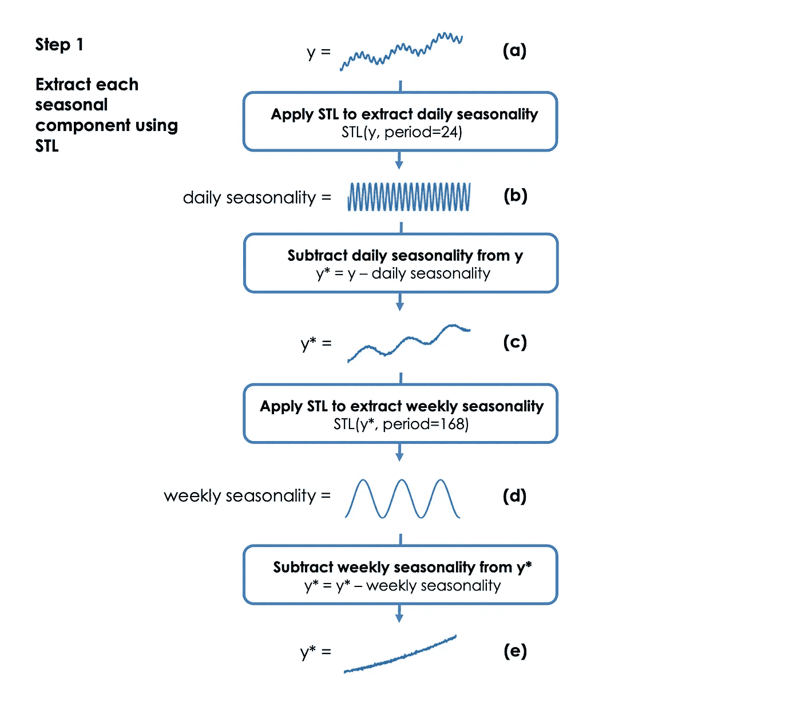

图 6。MSTL 算法分解部分的第一步。此图显示了具有趋势、每日季节性、每周季节性和噪声的时间序列示例。从原始时间序列中反复提取和减去季节性成分，直到提取出所有的季节性。图片作者。

为什么我们从最短的周期开始迭代？因为如果首先提取较长的季节性，则算法会错误地将较短的季节性作为较长季节性的一部分。

**第二步:提炼每个提取的季节性成分。**到目前为止，我们已经对每个季节性因素和完全去季节性的时间序列进行了估计(图 7a)。我们现在再次迭代每个季节组件。在每次迭代中，我们将这个单一的季节性成分加回到从步骤 1 结束时开始的完全去季节性的时间序列中(图 7b)。然后使用 STL 从该时间序列中提取相同的季节性成分(图 7c)。从时间序列中减去季节性成分的新估计值，使其再次完全消除季节性因素(图 7d)。

这一步很有帮助，因为我们现在传递给 STL 的时间序列只包含感兴趣的单个季节性成分、趋势和噪声。这使得 STL 可以更容易地重新捕获它在步骤 1 中遗漏的季节性成分的任何部分。

重复此步骤 N 次，在[1]中使用 N = 2。

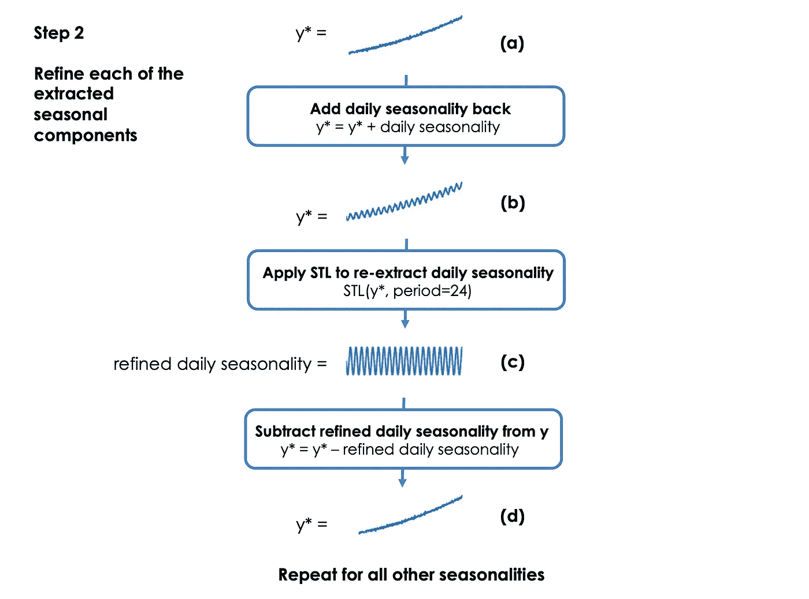

图 7。MSTL 算法分解步骤的第二步。通过将季节性成分添加回去季节性的时间序列并使用 STL 重新提取季节性成分来细化每个季节性成分。该图显示了这一步骤在每日季节性中的一次迭代。图片作者。

**第三步:提取趋势。**从步骤 2 中出现的最后一次 STL 拟合中提取趋势分量(即最长周期的季节性分量)。

**第四步:提取残渣。**在第 2 步结束时，通过从完全去季节性的时间序列中减去趋势分量来计算残差分量。

在这 4 个步骤之后，我们剩下一个趋势部分、一组精确的季节性部分和一个残差部分。

注意:在原始论文[1]中，算法的另一个分支处理用户指定没有季节成分的情况。在这种情况下，时间序列只是被平滑以提供趋势分量，而不会返回季节分量。

# MSTL 参数

实际上，在 Python 中使用 MSTL 只需要知道几个参数。让我们总结一下最重要的参数:

*   `periods`:传递到 STL 的每个季节性成分的周期`period`(例如，对于带有我们设置的`periods = (24, 24*7)`的每日和每周季节性的每小时数据)；
*   `windows`:季节性窗口大小`seasonal`，传递给每个相应季节性组件的 STL(例如`windows = (11, 15)`)。MSTL 使用基于实验的默认值，这些实验给出了[1]中的最佳结果；
*   `seasonal_deg`:在【1】中使用的季节分量的多项式的次数为`seasonal_deg = 0`；
*   `lmbda`:如果需要 Box Cox 变换，那么我们需要为 Box Cox 变换的λ参数选择一个值。λ可以手动设置，`lmbda=0.7`，也可以自动设置，`lmbda="auto"`。

# Python 中 MSTL 应用于电力需求数据

## 澳大利亚维多利亚的电力需求，数据集

我们现在来看一个现实世界的数据集，我们可以在其中应用 MSTL。让我们来看看澳大利亚维多利亚州的电力需求，数据集[1]中使用。我们可以在这里找到以半小时为间隔记录需求的原始数据【9】。我们遵循与[1]相同的步骤:我们将数据重新采样到每小时，并将我们的视角限制在 2012 年上半年，以关注每日和每周的季节性。以下部分的所有代码都可以在[这里](https://github.com/KishManani/MSTL)找到。

让我们绘制时间序列图(图 8 ),并对数据中的任何季节性建立直觉。

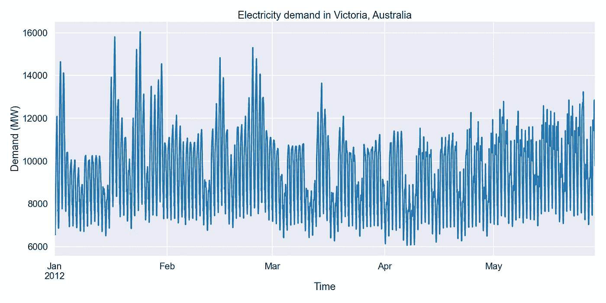

图 8。2012 年 1 月至 5 月澳大利亚维多利亚每小时电力需求(兆瓦)。图片作者。

我们预计每天都会有与电力需求相关的季节性。让我们通过绘制每天的每小时需求并按月划分来确认这一点。

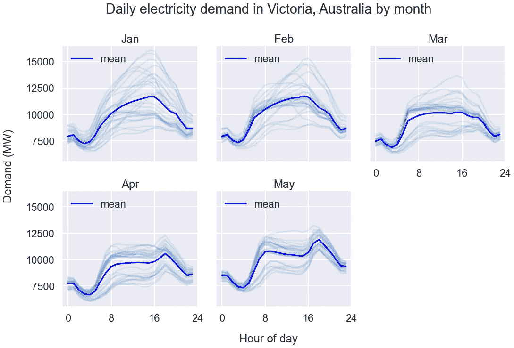

图 9。每日季节性。相应月份中每天的需求由浅蓝色线条表示。深蓝色线表示平均需求。有一种日常模式，白天的需求比深夜的需求多。图片作者。

在图 9 中，我们看到有每日季节性。我们还可以及时看到每日的季节性变化。在夏季月份(例如，一月)，在下午 4 点左右有一个每日峰值，而在冬季月份(例如，五月)，现在有两个峰值，一个在上午 8 点左右，另一个在下午 6 点左右。每日季节性变化的一个原因可能是从夏天使用空调到冬天使用供暖设备的转变。

现在，让我们绘制数据图，看看每周的季节性。

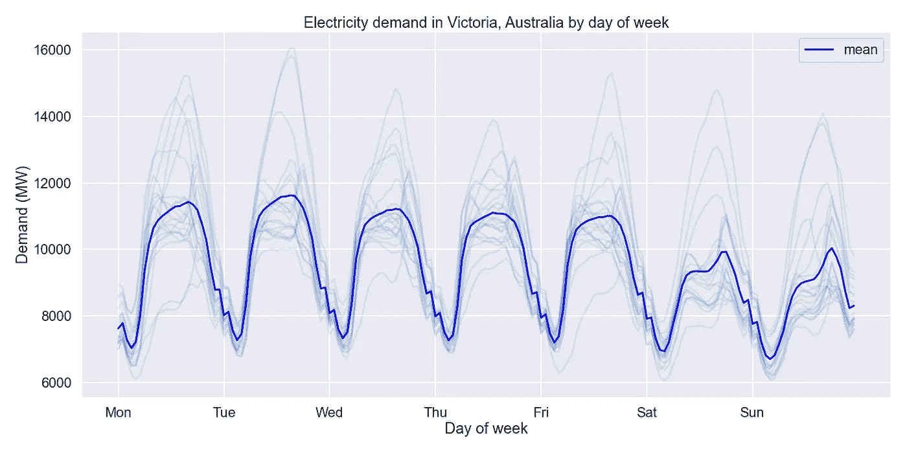

图 10。每周季节性。淡蓝色的线表示一年中每周的需求。深蓝色线表示平均需求。周末的平均需求似乎低于平日。图片作者。

在图 10 中，我们看到存在周季节性，也就是说，周末的需求比平日少。

这些图证实了每日和每周季节性的存在，并给了我们关于它们如何变化的信息。让我们继续，用 MSTL 来提取这些季节性。

## 利用 MSTL 分解电力需求数据

我们可以像这样导入 MSTL:

```
from statsmodels.tsa.seasonal import MSTL
```

我们需要指定的主要参数是`periods`，它是时间序列中每个季节成分的周期。我们期望有每日和每周的季节性，因此，我们设置`periods = (24, 24*7)`。我们也可以通过向`stl_kwargs`传递一个字典来设置输入到底层 STL 模型的参数。

```
stl_kwargs = {"seasonal_deg": 0} model = MSTL(data, periods=(24, 24 * 7), stl_kwargs=stl_kwargs)res = model.fit()
```

趋势、季节和残差分量都可以从结果对象`res`中访问:

```
seasonal = res.seasonal # contains both seasonal components
trend = res.trend
residual = res.resid
```

让我们使用`res.plot()`绘制分解图(图 11)。

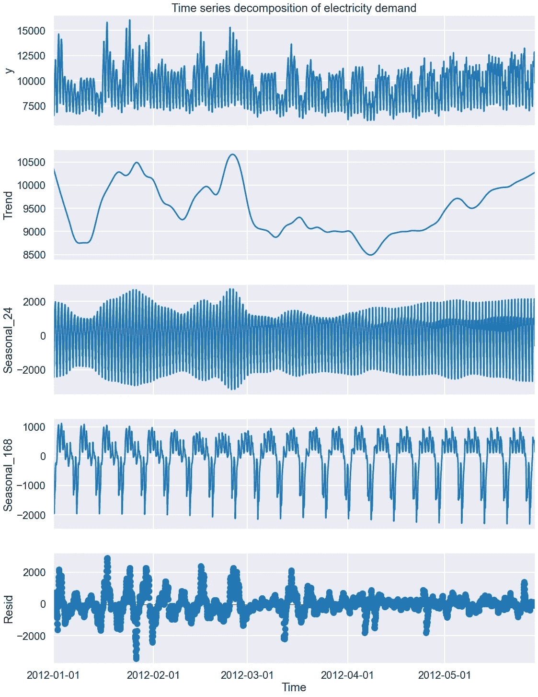

图 11。电力需求时间序列的 MSTL 分解为趋势、每日季节性(季节性 _24)、每周季节性(季节性 _168)和剩余分量。图片作者。

让我们检查来自 MSTL 的每日季节性成分，并检查它是否抓住了我们从图 9 的每日曲线图中获得的直觉(即，在夏季，每天下午 4 点有一个峰值，在冬季有两个峰值)。

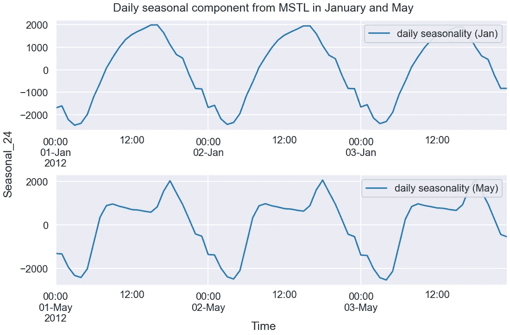

图 12。MSTL 在一月和五月的样本日期间提取的每日季节性成分。图片作者。

我们看到，MSTL 已经正确地捕捉到了每日的季节性，甚至显示了 5 月份的额外每日峰值(图 12)。这显示了 MSTL 在模拟随时间变化的季节性因素方面的作用。

让我们检查来自 MSTL 的每周季节性成分，并检查它是否抓住了我们从图 10 中的每周曲线图得到的直觉(即，周末期间的需求比工作日少)。

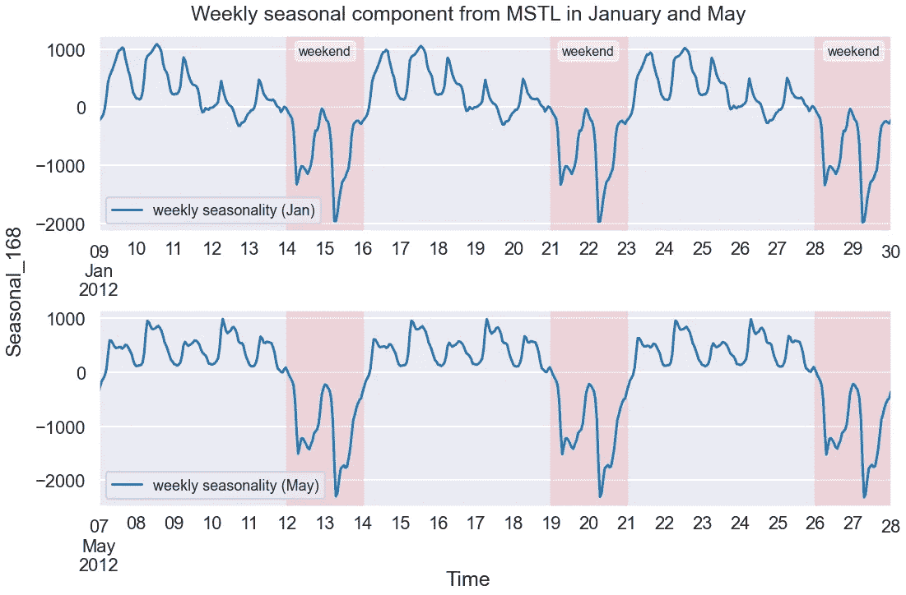

图 13。MSTL 在一月和五月的三周内提取的每周季节性成分。每周季节性因素捕捉了周末的下跌，并且在两个月内保持稳定。我们仍然可以看到一些每日季节性已经泄漏到每周的组成部分。图片作者。

在图 13 中，我们看到 MSTL 的每周季节性因素确实能够捕捉到周末需求的下降。

# 结论

我们做到了！MSTL 是分析多季节时间序列的一个很好的工具。在本文中，我们看到了如何使用 Python 通过 MSTL 分解现实世界中的多季节时间序列。

如果你做到了这一步，感谢你的阅读，我希望你发现这是有帮助的。

*如果您想了解有关黄土、STL 和 MSTL 的更多信息，本课程将在时间序列预测的* [*特征工程*](https://www.courses.trainindata.com/p/feature-engineering-for-forecasting) *中详细介绍。*

# 密码

笔记本:[https://github.com/KishManani/MSTL](https://github.com/KishManani/MSTL)

# 参考

[1] [班达拉，k .，海德曼，R.J .和伯格梅尔，c .，2021 年。MSTL:一种用于多季节模式时间序列的季节趋势分解算法。arXiv 预印本 arXiv:2107.13462 。](https://arxiv.org/abs/2107.13462)

[2]r . b .克利夫兰、W.S .克利夫兰、J.E .麦克雷和 I .特潘宁，1990 年。STL:季节性趋势分解。 *J .罗腾飞。Stat* ， *6* (1)，第 3–73 页。

[3]贝尔、W.R .和希尔默，南卡罗来纳州，1984 年。经济时间序列的季节调整问题。*商业杂志&经济统计*， *2* (4)，第 291–320 页。

[4]泰勒，S.J .和勒撒姆，b .，2018。大规模预测。*《美国统计学家*， *72* (1)，第 37–45 页。

[5]a . m . De Livera、r . j . hynd man 和 R.J. and Snyder，2011 年。用指数平滑法预测具有复杂季节模式的时间序列。*美国统计协会杂志*， *106* (496)，第 1513–1527 页。

[6]多库门托夫和海因德曼，R.J .，2021 年。STR:使用回归的季节趋势分解。*通知数据科学杂志*。

[7]w . s .克利夫兰和 S.J .德夫林，1988 年。局部加权回归:一种通过局部拟合进行回归分析的方法。*美国统计协会杂志*， *83* (403)，第 596–610 页。

[http://www.gardner.fyi/blog/STL-Part-II/](http://www.gardner.fyi/blog/STL-Part-II/)

[9]奥哈拉-怀尔德，m .海德曼，R.J .王，e . 2021。tsibbledata:“tsibble”的不同数据集。网址:[https://CRAN.R-project.org/package=tsibbledata](https://CRAN.R-project.org/package=tsibbledata)。r 包版本 0.3.0。([知识共享许可](https://zenodo.org/record/4659727#.Ymm92fPMJmp))