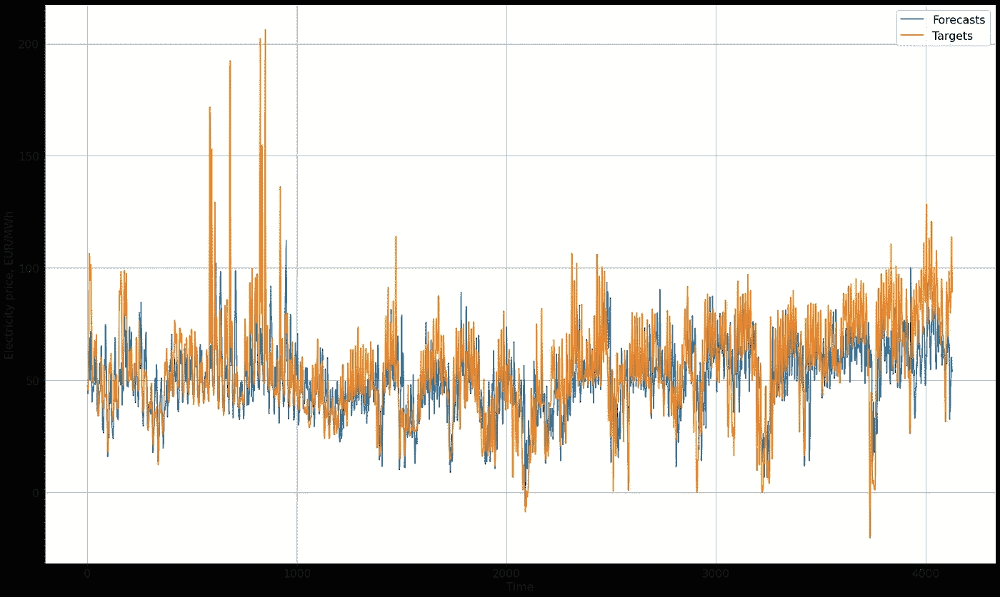

# XGBoost 多步时间序列预测

> 原文：<https://towardsdatascience.com/multi-step-time-series-forecasting-with-xgboost-65d6820bec39>

## 本文以 24 小时电价预测为例，展示了如何使用 XGBoost 生成多步时间序列预测。

由[阿格巴洛斯](https://unsplash.com/@agebarros?utm_source=medium&utm_medium=referral)在 [Unsplash](https://unsplash.com?utm_source=medium&utm_medium=referral) 上拍摄的照片

许多博客文章和 Kaggle 笔记本都将 XGBoost 应用于时间序列数据。然而，根据我的经验，现有资料要么将 XGBoost 应用于时间序列*分类*，要么应用于*一步预测*。本文展示了如何将 XGBoost 应用于*多步提前*时间序列预测，即预测跨度大于 1 的时间序列预测。这与一步到位预测有很大不同，因此需要这篇文章。

XGBoost [1]是梯度提升树的快速实现。它在包括时间序列预测在内的许多领域取得了良好的效果。例如，论文“我们真的需要深度学习模型进行时间序列预测吗？”表明 XGBoost 可以在许多时间序列预测任务中胜过神经网络[2]。

请注意，本文的目的不是对所选的预测问题产生高度准确的结果。相反，目的是说明如何使用 XGBoost 生成多输出预测。因此，本文不详细讨论时间序列数据探索和预处理，也不讨论超参数调优。关于这个主题已经有很多写得很好的材料了。

本文的其余部分结构如下:

1.  首先，我们将仔细看看本教程中使用的原始时间序列数据集。
2.  然后，我将描述如何获得一个带标签的时间序列数据集，该数据集将用于训练和测试 XGBoost 时间序列预测模型。
3.  最后，我将展示如何训练 XGBoost 时间序列模型，以及如何使用它生成多步预测。

  

# 数据集描述和问题表述

本教程中的数据是丹麦以欧元/兆瓦时为单位的批发电力“现货市场”价格。这些数据可以在 [Energidataservice](https://www.energidataservice.dk/tso-electricity/Elspotprices) [4]上免费获得(根据“全球范围的、免费的、非排他性的和其他无限制的使用许可”[5])。数据具有每小时的分辨率，这意味着在给定的一天中，有 24 个数据点。我们将使用 2017 年 1 月 1 日至 2021 年 6 月 30 日的数据，这将产生一个包含 39，384 个批发电价每小时观察值的数据集。

本教程的目的是展示如何使用 XGBoost 算法生成一个预测 *Y* ，包括给定输入的 *m* 小时的预测电价， *X，*包括 *n* 小时的过去电价观测值。这类问题可以认为是单变量时间序列预测问题。更具体地说，我们将把预测问题公式化为有监督的机器学习任务。

# 用 XGBoost 进行时间序列预测的数据准备

与任何其他机器学习任务一样，我们需要将数据分成训练数据集和测试数据集。请注意，数据点不被打乱是很重要的，因为我们需要保持观察的自然顺序。

对于有监督的 ML 任务，我们需要一个带标签的数据集。我们通过所谓的固定长度滑动窗口方法获得由 *(X，Y)* 对组成的标记数据集。使用这种方法，长度为 *n+m* 的窗口“滑过”数据集，并且在每个位置，它创建一个 *(X，Y)* 对。滑动窗口从数据集的第一次观察开始，每次滑动移动 *S* 步。在本教程中，我们将使用步长为 12。滑动窗口方法摘自论文《我们真的需要深度学习模型进行时间序列预测吗[2]其中作者还使用 XGBoost 进行多步提前预测。

在代码中，通过首先产生元组的列表来获得标记的数据集，其中每个元组包含用于切片数据的索引。第一个元组可能是这样的: *(0，192)。*这意味着创建了一个由数据点 0-192 组成的切片。索引元组列表由函数`get_indices_entire_sequence()`生成，该函数在 repo 的`utils.py`模块中实现。为了方便起见，它显示如下。

然后，索引元组列表被用作函数`get_xgboost_x_y()`的输入，该函数也在 repo 的`utils.py`模块中实现。同样，它显示在下面。该函数的参数是指数列表、数据集(例如训练数据)、预测范围、 *m、*和输入序列长度、*n。*该函数输出两个 numpy 数组:

1.  所有的模型输入，即具有形状的 *X，*(实例数， *n* )。
2.  所有目标序列，即形状为【实例数， *m* ) *的 *Y、*。*

然后，这两个函数用于生成由 *(X，Y)* 对组成的训练和测试数据集，如下所示:

# 使用 XGBoost 生成多步时间序列预测

一旦我们创建了数据，就必须实例化 XGBoost 模型。

然后我们将它包装在 scikit-learn 的`MultiOutputRegressor()`功能中，使 XGBoost 模型能够产生长度大于 1 的输出序列。这个包装器适合每个目标的一个回归量，目标序列中的每个数据点都被认为是这个上下文中的一个目标。因此，当我们预测提前 24 小时时，包装器实际上适合每个实例的 24 个模型。这使得该函数相对低效，但是该模型仍然比诸如变压器模型的神经网络训练得更快。对于好奇的读者来说，xgboost 包现在似乎天生支持多输出预测[3]。

包装的对象还具有我们从其他 scikit-learn 和 xgboost 模型中了解到的`predict()`函数，因此我们使用它来生成测试预测。

XGBoost 时间序列预测模型能够立即生成合理的预测，无需调整超参数。正如本文回购中的笔记本所示，其预测的平均绝对误差为 13.1 欧元/兆瓦时。测试数据集的平均值为 54.61 欧元/兆瓦时。

仔细观察下图中的预测，该图显示了相对于目标值的预测，我们可以看到该模型的预测通常遵循目标值的模式，尽管当然还有改进的空间。

XGBoost 预测值与实际值(图片由作者提供)

完整示例可在本报告的笔记本中找到:

  

# 摘要

在本教程中，我们介绍了如何处理时间序列数据，以便将其用作 XGBoost 时间序列模型的输入，我们还了解了如何将 XGBoost 模型包装在多输出函数中，从而允许模型生成长度超过 1 的输出序列。从 MAE 和上面的图可以看出，XGBoost 可以产生合理的结果，而无需任何高级数据预处理和超参数调整。这表明 XGBoost 非常适合时间序列预测——这一概念也在前面提到的学术文章[2]中得到支持。

就是这样！我希望你喜欢这篇文章🤞

请留下评论让我知道你的想法。

关注更多与数据科学的[时间序列预测](/how-to-make-a-pytorch-transformer-for-time-series-forecasting-69e073d4061e)、[绿色软件工程](https://kaspergroesludvigsen.medium.com/the-10-most-energy-efficient-programming-languages-6a4165126670)和[环境影响](/8-podcast-episodes-on-the-climate-impact-of-machine-learning-54f1c19f52d)相关的帖子🍀

并随时在 [LinkedIn](https://www.linkedin.com/in/kaspergroesludvigsen/) 上与我联系。

# 参考

[1][https://arxiv.org/abs/1603.02754](https://arxiv.org/abs/1603.02754)

[https://arxiv.org/abs/2101.02118](https://arxiv.org/abs/2101.02118)

[3][https://www . LinkedIn . com/posts/tunguz _ data science-machine learning-人工智能-activity-6985577378005614592-HnXU？UTM _ source = share&UTM _ medium = member _ desktop](https://www.linkedin.com/posts/tunguz_datascience-machinelearning-artificialintelligence-activity-6985577378005614592-HnXU?utm_source=share&utm_medium=member_desktop)

[4][https://www . energidataservice . dk/tso-electricity/Elspotprices](https://www.energidataservice.dk/tso-electricity/Elspotprices)

[5][https://www . energidataservice . dk/Conditions _ for _ use _ of _ Danish _ public _ sector _ data-License _ for _ use _ of _ data _ in _ ed . pdf](https://www.energidataservice.dk/Conditions_for_use_of_Danish_public_sector_data-License_for_use_of_data_in_ED.pdf)