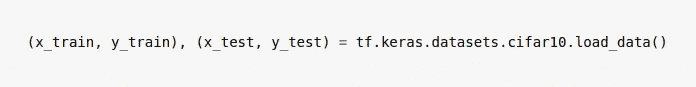
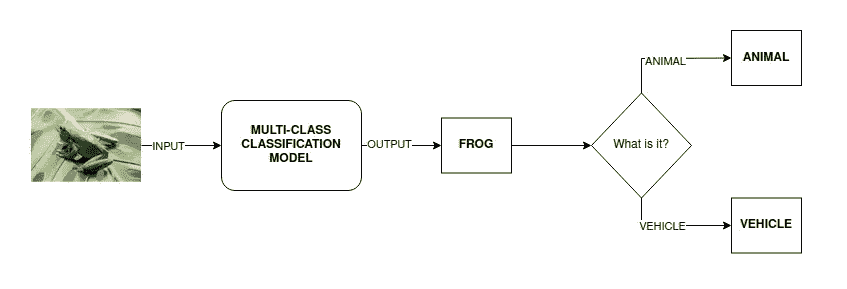
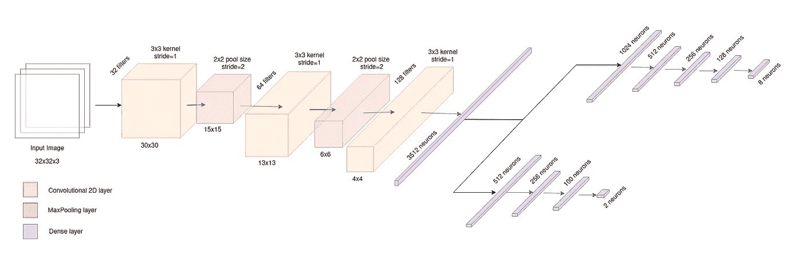
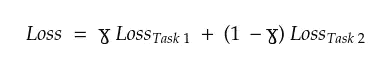
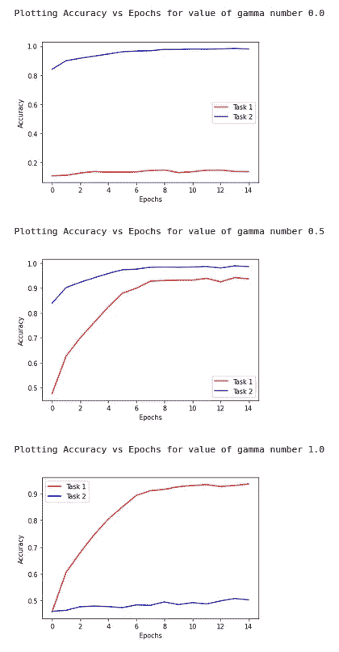

# 基于 Keras 的多任务分类学习

> 原文：<https://towardsdatascience.com/multi-task-learning-for-computer-vision-classification-with-keras-36c52e6243d2>

## 了解如何构建一个能够同时执行多种图像分类和多任务学习的模型

马库斯·温克勒在 [Unsplash](https://unsplash.com?utm_source=medium&utm_medium=referral) 上的照片

M 多任务学习(multi-task Learning，MLT)是机器学习的一个子领域，通过一个共享模型同时学习多个任务。这种类型的学习有助于提高数据效率和训练速度，因为共享模型将从同一数据集中学习几个任务，并且由于不同任务的辅助信息，将能够更快地学习。此外，它还减少了过度拟合，因为考虑到训练数据的标签对于每个任务是不同的**【1】**，模型将更难与训练数据完美拟合。

本文将介绍 MTL，并展示如何使用 tensorflow 的 Keras 模块在真实数据上实现和训练它。在我的 GitHub 资源库中可以找到完整的代码，以及一个 Jupyter 笔记本，您可以在其中试验您所学到的内容:

  

## 数据预处理

为了使解释简单易懂，将使用 CIFAR-10**【2】**数据集，该数据集在 [**MIT 许可**](https://peltarion.com/knowledge-center/terms/dataset-licenses/cifar-10) 下提供。该数据集由 60000 幅 32×32 像素的 RGB 图像组成，分为 10 个不同的类别。它被分为 50000 个训练样本和 10000 个测试样本，并且是完全平衡的，这意味着数据集每类包含 6000 个图像。可以通过执行以下命令轻松加载数据集:

**数据加载**。作者图片

数据集包含以下类:**飞机**、**汽车**、**鸟**、**猫**、**鹿**、**狗**、**青蛙**、**马**、**船**和**卡车**。多任务模型要学习的两个任务是这些标签上的分类，参见:

*   **任务 1:** 修改后的 CIFAR10 数据集上的多类分类(**飞机**、**汽车**、**鸟**、**猫**、**狗**、**蛙**、**船**和**卡车**标签，修改说明如下)。
*   **任务二**:二元分类(标签为**动物**和**车辆**)。

实现上述两个分类任务的一个更有效的选择是训练一个只学习第一个任务的模型，其输出将用于预测二元类**动物**或**车辆**。这方面的一个例子是将青蛙的图像作为输入传递给模型，为此模型将获得作为输出的 **frog** 类。因为青蛙是一种动物，那么图像将被分类到**动物**类(这个解决方案的模式可以在下面看到)。

图片作者。乔尔·亨利在 Unsplash 上拍摄的青蛙照片

尽管如此，本文将通过应用多任务学习来解决这个问题，因为，虽然它不是最有效的例子，但它完美地展示了 MTL 在这种类型的问题中的有用性和应用，并且它是发展知识的极好基础。

考虑到这一点，并且为了有一个用于训练的平衡数据集，属于**鹿**和**马**的类的实例将被删除。这样做是因为最初数据集包含 30000 个属于动物的样本(5000 个样本×6 个类别)和仅 20000 个属于车辆的样本(5000 个样本×4 个类别)，这将使数据集在二进制分类任务方面不平衡。马和鹿的实例被删除，因为它们与猫和狗具有非常相似的特征，因此可能会增加训练的复杂性，因为区分这些类的实例会更加困难。

请注意，在此清理之后，标签具有以下类别:[0、1、2、3、5、6、8、9](缺少 4 和 7，分别对应于鹿和马)。因此，有必要更新标签，使它们从 0 到 7 进行编号，这一步可以在我的资料库中的 Jupyter 笔记本中找到。但是，为了更好地学习，请尝试自己编写代码！

对于多任务学习来说，训练标签是特定于任务的，这一点至关重要。因此，在 n 任务训练中，将定义不同标签的 n 个数组。在这种情况下，第一个任务要求标签是从 0 到 7 的整数(每个类一个数字)，第二个任务要求标签是 0 和 1(因为是二进制分类)。数据先前被预处理，使得标签是从 0 到 7 的数字，并且如所期望的，用于二进制分类的标签将基于初始的 0 到 7 标签来构建，使得如果实例对应于动物，则它将是 0，并且当它对应于车辆时，它将是 1。

## 创建模型

由于这两个任务都使用图像作为训练数据，卷积网络(CNN)将被用作共享模型，因此它将学习最初从图像中提取最重要的特征。共享模型的输出将被展平，并被引入到对应于每个任务的分支。两个分支都将由密集层组成(因为我们已经展平了它们的输入)，每个密集层具有不同数量的神经元，其输出层将由 2 个和 8 个神经元组成，分别用于二进制和多类分类任务。除了输出层使用 softmax 和 sigmoid 分别进行多类和二类分类之外，所有层都使用 ReLu 作为激活函数。下面可以看到所描述模型的低级概要以及定义它的代码。

模型建筑。作者图片

在代码中，可以看到当定义神经网络的每一层时，对象接收前一层，即其输出是被定义层的输入的层。通过这种方式，Keras 模型可以针对每个任务进行分离，使得两个分支/子模型都从同一个共享模型开始。

通常模型会更新它们的权重，寻求优化它们的损失函数(参见我以前的文章[用单层感知器进行数字分类](/digit-classification-with-single-layer-perceptron-9a4e7d4d9628))，但是在 MTL，一般模型的每个分支都在学习不同的任务，所以有必要为每个任务指定一个损失函数。然而，*张量流*在反向传播过程中仅使用单个损失函数的结果，因此还必须定义联合损失函数，其最简单的形式是不同损失函数值的加权和。在这种情况下，联合损失函数定义如下:

**关节损失功能**。作者图片

注意，当 **ɣ** 等于 0 时，模型将仅接收从任务 2 获得的损失，而如果 **ɣ** 等于 1，模型将接收任务 1 的损失。这允许仅针对任务 1(如果 **ɣ** = 1)、仅针对任务 2(如果 **ɣ** = 0)或针对两个任务(如果 0 < **ɣ** < 1)来训练模型，这允许模型用于多个场景，这取决于模型需要什么。

通过在 *loss_weights* 参数中指定模型每个分支的损失函数的权重，可以在编译时在先前创建的模型中定义联合损失函数。见下面的函数。

## 训练模型

一旦对数据进行了预处理，并且为这两项任务定义了模型，就该对其进行训练了。**。fit()** 方法用于训练，与定义正常模型时不同，它接收与模型中的分支/输出一样多的数组，如 ***y*** 参数。另一方面，与正常模型一样，必须指定批次大小和时期数。在这种情况下，将使用 128 的批量大小，并且它将被训练 15 个时期。

用 3 个不同的γ值训练模型: **0** 、 **0.5** 和 **1** ，代码测量并打印每次训练的运行时间。

## 评估模型的性能

最后，我们将通过绘制这两项任务在 15 个时期内的精确度来观察不同伽马值的 MTL 模型的结果。这要归功于上面定义的***fit _ batch _ multask _ models()***函数返回的历史列表。

**不同伽马值的精度与时期图**。作者图片

从不同的伽马值获得的图表清楚地显示了上述内容:伽马的极值意味着模型将学习仅执行任务之一，伽马的中间值意味着模型将设法学习完成两个任务。此外，该模型对两种任务都获得了超过 90%的准确率，能够更好地执行二元分类。应该提到的是，二分类比多分类更简单，所以得到的结果是可以预料的。

此外，在 Jupyter 笔记本中，随机拍摄测试数据集的图像，并从模型中提取预测，以检查它是否有效，随时修改它并尝试新事物！

## 结论

当伽玛值平衡两个任务的损失函数的权重时，多任务学习已经设法在两个任务中实现非常好的结果，并且当取极端伽玛值时，它也完美地完成单任务模型的任务，因此对于模型需要偶尔完成某些任务的情况，这是非常有趣的选择。必须考虑到，模型中的分叉意味着更多的计算成本，因此需要更长的执行时间。此外，尽管建立了极端的伽马值，但是执行时间将继续很长，因为模型在两个分支中以任一方式执行正向和反向传播过程。如果模型只需要执行一个任务，这是很重要的，因为训练单任务模型(没有分支)在计算成本方面会更有效。

最后，应该提到这种类型的架构的巨大可能性。将第一过滤器(共享模型)应用于输入，然后基于定制分支进行预测的事实使得极大地优化训练模型所需的资源成为可能，这些模型需要执行在某些方面具有相似性的任务。已知的和强大的模型可以用作这种类型的架构的基础或共享模型，实现能够在许多不同的任务中实现非常好的结果的模型，总是具有它们的共同性质的一部分。

## 参考

迈克尔·克劳肖。基于深度神经网络的多任务学习:综述。 *arXiv 预印本 arXiv:2009.09796* ，2020

**【2】**首页:

  

Tensorflow API:

 