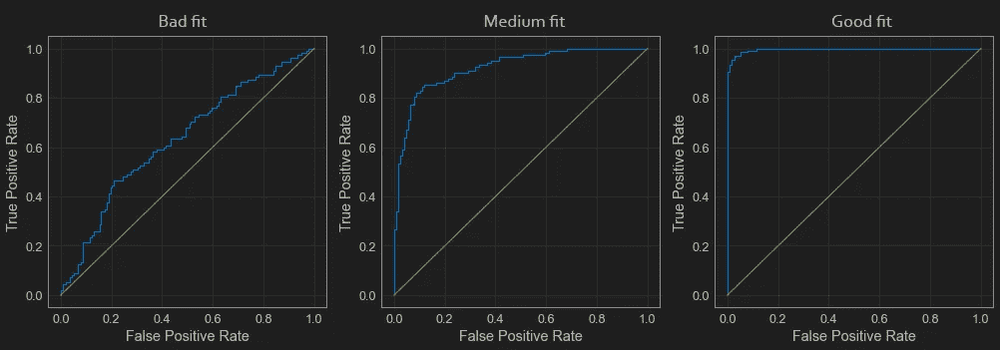
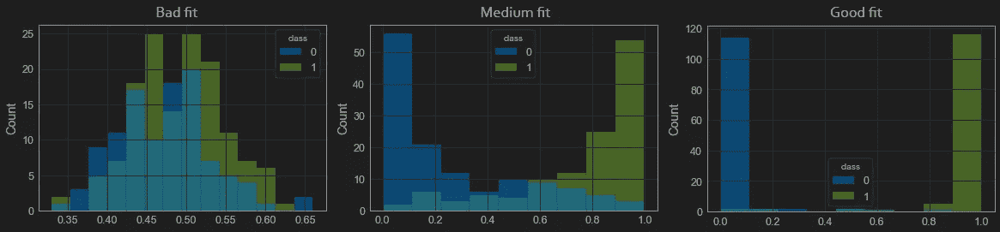
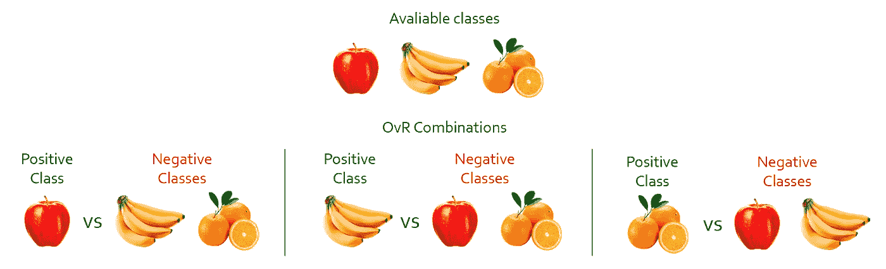
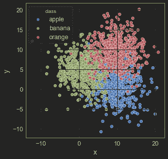
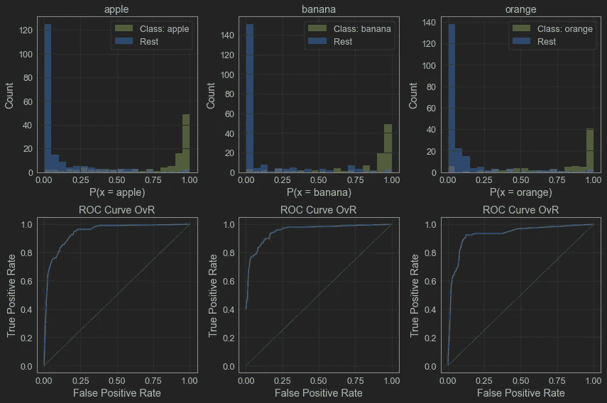
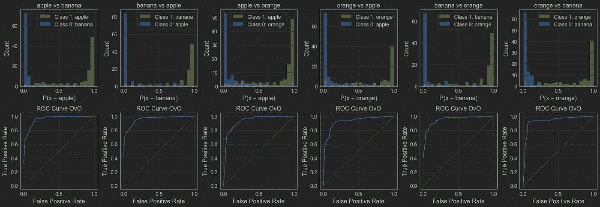

# 用 ROC 曲线和 ROC AUC 进行多类分类评价

> 原文：<https://towardsdatascience.com/multiclass-classification-evaluation-with-roc-curves-and-roc-auc-294fd4617e3a>

## 使用 OvR 和 OvO 策略使最常用的分类评估度量适应多类分类问题


作者图片

当评估多类分类模型时，我们有时需要调整二元分类中使用的指标，以便在这种情况下工作。我们可以通过使用 OvR 和 OvO 策略来做到这一点。

在这篇文章中，我将展示如何适应 ROC 曲线和 ROC AUC 指标的多类分类。

ROC 曲线和 ROC AUC 评分是评估二元分类模型的重要工具。总之，它们通过所有可能的阈值向我们显示了类别的可分性，或者换句话说，模型对每个类别的分类有多好。

正如我在另一篇文章中已经解释过的，我们可以比较 ROC 曲线(上图)和它们各自的直方图(下图)。直方图越分离，ROC 曲线也越好。



ROC 曲线比较。图片作者。



类分离直方图比较。图片作者。

但是这个概念不能立即应用于多类分类器。为了在这个场景中使用 ROC 曲线和 ROC AUC，我们需要另一种方法来比较类别:OvR 和 OvO。

在接下来的部分中，我会更好地解释它，您也可以在我的 github 上查看代码:

<https://github.com/vinyluis/Articles/tree/main/ROC%20Curve%20and%20ROC%20AUC>  

# OvR 还是 OvO？

## OvR —一个与其余

OvR 代表“One vs Rest”，顾名思义，它是一种通过同时将每个类与所有其他类进行比较来评估多类模型的方法。在这种情况下，我们选择一个类，并将其视为“积极”类，而所有其他类(其余的)则被视为“消极”类。

通过这样做，我们将多类分类输出减少为二类分类输出，因此可以使用所有已知的二类分类度量来评估这种情况。

我们必须对数据中出现的每个类重复这一过程，因此对于一个 3 类数据集，我们得到 3 个不同的 OvR 分数。最后，我们可以对它们进行平均(简单平均或加权平均)以得到最终的 OvR 模型分数。



三级设置的 OvR 组合。图片作者。

## 卵——一对一

正如你可能想象的那样，OvO 代表“一对一”,与 OvR 非常相似，但我们不是将每个类与其他类进行比较，而是比较数据集所有可能的两类组合。

假设我们有一个 3 类场景，我们选择组合“类 1 对类 2”作为第一个场景。第一步是获得仅包含这两个类的数据集的副本，并丢弃所有其他类。然后，我们将 real class = "Class1 "的观察定义为我们的积极类，将 real class = "Class2 "的观察定义为我们的消极类。既然问题是二进制的，我们也可以使用我们用于二进制分类的相同度量。

请注意，“类别 1 与类别 2”不同于“类别 2 与类别 1”，因此这两种情况都应考虑在内。因此，在 3 类数据集中，我们得到 6 个 OvO 分数，在 4 类数据集中，我们得到 12 个 OvO 分数。

在 OvR 中，我们可以平均所有的 OvO 分数，以获得最终的 OvO 模型分数。


三级设置的 OvO 组合。图片作者。

# OvR ROC 曲线和 ROC AUC

我将使用我在[二元分类 ROC](https://www.notion.so/ROC-Curve-and-ROC-AUC-2a551988205248a89a28541d70c497c8) 文章中使用的函数来绘制曲线，只做一些修改，这些修改可在[这里](https://github.com/vinyluis/Articles/blob/main/ROC%20Curve%20and%20ROC%20AUC/ROC%20Curve%20-%20Multiclass.ipynb)获得。如果您愿意，也可以使用 scikit-learn 版本。

在这个例子中，我将使用一个包含三个类的合成数据集:“苹果”、“香蕉”和“橙子”。它们在每个类的组合中都有一些重叠，这使得分类器很难正确地学习所有的实例。数据集只有两个特征:“x”和“y”，如下所示:



多类散点图。图片作者。

对于这个模型，我训练了 scikit-learn 的 RandomForestClassifier 的一个默认实例。

在下面的代码中，我们:

*   迭代所有类
*   准备一个辅助数据帧，使用一个类为“1”，其他类为“0”
*   绘制类别分布的直方图
*   绘制每种情况的 ROC 曲线
*   计算特定类别的 AUC

上面的代码输出了每个类别相对于其他类别的直方图和 ROC 曲线:



ROC 曲线和直方图。图片作者。

正如我们所看到的，“橙色”类的分数比其他两个类低一点，但在所有情况下，分类器在预测每个类方面都做得很好。我们还可以在直方图上注意到，我们在真实数据中看到的重叠也存在于预测中。

为了显示每个 OvR AUC 分数，我们可以简单地打印它们。我们也可以取分类器的平均分数:

```
# Displays the ROC AUC for each class
avg_roc_auc = 0
i = 0
for k in roc_auc_ovr:
    avg_roc_auc += roc_auc_ovr[k]
    i += 1
    print(f"{k} ROC AUC OvR: {roc_auc_ovr[k]:.4f}")
print(f"average ROC AUC OvR: {avg_roc_auc/i:.4f}")
```

输出是:

```
apple ROC AUC OvR: 0.9425
banana ROC AUC OvR: 0.9525
orange ROC AUC OvR: 0.9281
average ROC AUC OvR: 0.9410
```

在这种情况下，平均 ROC AUC OvR 为 0.9410，这是一个非常好的分数，反映了分类器在预测每一类中的表现。

# OvO ROC 曲线和 ROC AUC

使用与上一个实验相同的设置，首先需要做的是建立一个包含所有可能的类对的列表:

```
classes_combinations = []
class_list = list(classes)
for i in range(len(class_list)):
    for j in range(i+1, len(class_list)):
        classes_combinations.append([class_list[i], class_list[j]])
        classes_combinations.append([class_list[j], class_list[i]])
```

`classes_combinations`列表将包含所有组合:

```
[['apple', 'banana'],
 ['banana', 'apple'],
 ['apple', 'orange'],
 ['orange', 'apple'],
 ['banana', 'orange'],
 ['orange', 'banana']]
```

然后我们迭代所有的组合，类似于 OvR 的情况，我们

*   准备一个辅助数据帧，只包含两个类的实例
*   将类 1 的实例定义为“1”，将类 2 的实例定义为“0”
*   绘制类别分布的直方图
*   绘制每种情况的 ROC 曲线
*   计算特定组合的 AUC

上面的代码绘制了所有直方图和 ROC 曲线:



ROC 曲线和直方图。图片作者。

请注意，正如所料，“苹果 vs 香蕉”图与“香蕉 vs 苹果”图不同。和前面的例子一样，我们可以单独评估每个组合，并检查模型的不一致性。

我们还可以显示 AUC 并计算平均 OvO AUC:

```
# Displays the ROC AUC for each class
avg_roc_auc = 0
i = 0
for k in roc_auc_ovo:
    avg_roc_auc += roc_auc_ovo[k]
    i += 1
    print(f"{k} ROC AUC OvO: {roc_auc_ovo[k]:.4f}")
print(f"average ROC AUC OvO: {avg_roc_auc/i:.4f}")
```

输出是:

```
apple vs banana ROC AUC OvO: 0.9561
banana vs apple ROC AUC OvO: 0.9547
apple vs orange ROC AUC OvO: 0.9279
orange vs apple ROC AUC OvO: 0.9231
banana vs orange ROC AUC OvO: 0.9498
orange vs banana ROC AUC OvO: 0.9336
average ROC AUC OvO: 0.9409
```

在这种情况下，平均 ROC AUC 为 0.9409，接近 OvR 方案获得的分数(0.9410)。

# 结论

OvR 和 OvO 策略可以(并且应该)用于使任何二元分类度量适应多类分类任务。

评估 OvO 和 OvR 结果还有助于了解模型难以描述的类，以及可以添加或移除哪些功能来改善模型的结果。

# 如果你喜欢这个帖子…

支持我一杯咖啡！

[](https://www.buymeacoffee.com/vinitrevisan)

给我买杯咖啡！

看看这个很棒的帖子

</interpreting-roc-curve-and-roc-auc-for-classification-evaluation-28ec3983f077> 