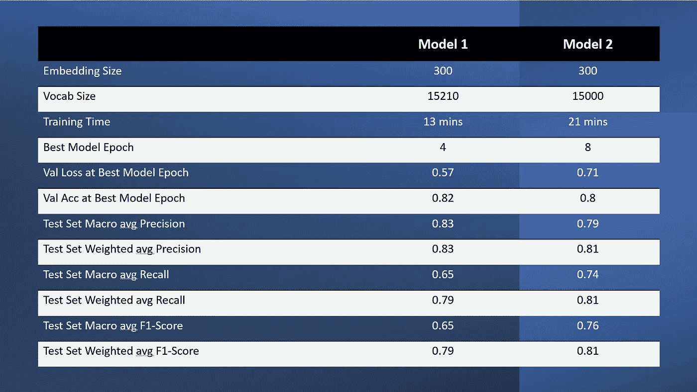
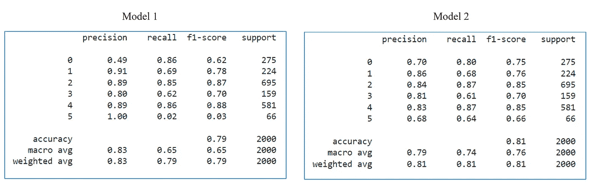
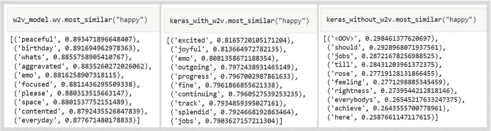

# 使用 Keras 预测情感的多类文本分类:有无单词嵌入的比较

> 原文：<https://towardsdatascience.com/multiclass-text-classification-using-keras-to-predict-emotions-a-comparison-with-and-without-word-5ef0a5eaa1a0>

## 单词嵌入增加了文本分类模型的价值吗？让我们在这个探测情绪的多类预测任务中找出答案

[腾雅特](https://unsplash.com/@tengyart?utm_source=medium&utm_medium=referral)在 [Unsplash](https://unsplash.com?utm_source=medium&utm_medium=referral) 上拍摄的照片

# 介绍

**自然语言处理中的单词嵌入**

在自然语言表达中，相似的词出现在相似的上下文中。例如，在这个句子中——“我不舒服，我生病了。“我可能得了 covid，”。单词— *不舒服*、*生病*和 *covid* 是表示一个人生病的关键词，这是显而易见的。像*头痛*、*疼痛*、*跑步* - *鼻子*、*咳嗽*等单词也有类似的上下文。然而，关于*政治*或*体育*的句子中很少会出现这些单词。在*体育*的上下文中，最频繁出现的关键词可以是*速度*、*耐力*、*比赛*、*赢*、*输*、*分*、*分*等等。

由[格伦·凯莉](https://unsplash.com/@glencarrie?utm_source=medium&utm_medium=referral)在 [Unsplash](https://unsplash.com?utm_source=medium&utm_medium=referral) 上拍摄的照片

因此，前一组词更多地出现在人们谈论健康或疾病的上下文中，而第二组关键词更可能出现在体育文章或新闻的上下文中。他们很少会重合，但如果重合，可能是关于一个可能生病的球员或谈论从事体力要求高的运动的后果，两者都有体育和健康的*重叠背景*。这些案例预计会相对较少。

因此，我们可以说，如果一个单词在其他文档中的类似上下文或单词分布中出现过，则在给定上下文或单词分布中找到该单词的概率更高。

那么什么是单词嵌入呢？

*单词嵌入是自然语言文本的密集矢量表示，包含关于给定单词上下文的信息*。该概念解决了其他语言建模策略的局限性，如以稀疏矩阵表示文本的 [tf-idf 和词袋](https://www.youtube.com/watch?v=kNLqQSqbO5k)模型，这些模型包含冗余信息，使该过程在计算上昂贵且耗时，并增加了模型的复杂性。此外，它们也特别大，因为矩阵的大小通常和词汇表的大小一样，这就带来了“维数灾难”的问题。

换句话说，在单词嵌入中，单词以这样一种方式被表示为向量(即数字),即在相似上下文中出现的单词在该词汇表的向量空间中间隔很近。为了进一步解释这一点，如果我们记下我们目前拥有的关键字，假设它们已经出现在 N 个文档中，那么,“生病”和“咳嗽”的向量的距离将小于“咳嗽”和“速度”或“咳嗽”和“胜利”之间的距离，而“胜利”和“匹配”之间的距离将小于“胜利”和“生病”。

这是一种确定文本的数字表示的方法，它试图捕捉在多个文档中出现的单词之间的上下文相似性。

**获得单词嵌入有多种方式**。word2vec 算法学派用于使用[ann](https://en.wikipedia.org/wiki/Artificial_neural_network)导出嵌入。Word2vec 的经典实现是在 Gensim 中，您可以在连续单词包(CBOW)模型或跳过 Gram 模型之间进行选择。*CBOW 通过尝试预测给定上下文中最合适的单词来学习表示，而在 skip grams 中，它通过尝试预测给定单词的最合适上下文来学习。*

**关于多级分类**

*在机器学习中，一个* ***监督的多类分类任务*** *是一个样本可以被分配给一组类中的一个且仅一个类。*例如，在情感分析任务中，样本可以是正面的，也可以是负面的，其中有两个类别可供选择。很多时候，情绪也可以是积极的、消极的或中性的，有三类可供选择。

第一个例子是特殊类型的多类分类过程。由于有两类可供选择，即正类和负类，所以称之为**二元分类任务**。另一个典型的例子是在欺诈检测任务中，交易可能是欺诈或真实的。

[皮卡伍德](https://unsplash.com/@pickawood?utm_source=medium&utm_medium=referral)在 [Unsplash](https://unsplash.com?utm_source=medium&utm_medium=referral) 上拍摄的照片

这里的第二个例子有两个以上的类可供选择。有两个以上类别可供选择的分类任务统称为**多类别分类**问题，其中*在两个以上的目标类别*中，一个且仅一个类别可以分配给一个样本。

多类分类的评估比二进制分类稍微复杂一些，因为您将评估一个 NxN 矩阵，其中 N 是任务中类的数量，而不是二进制分类的 2x2 矩阵。**因此，为了简化，使用了平均技术，如算术平均(宏)、加权平均和总体精度。**由于准确度不是最佳指标，通常根据数据集的类别分布在算术平均值和加权平均值之间做出选择。

他的案例研究是一个多类分类任务。在这里，我将预测与给定文本相关的情绪，从六个不同的类别中选择——快乐、悲伤、愤怒、爱、惊讶和恐惧。本文解决了以下问题:

1.  *使用 Word2vec 嵌入启动 Keras 嵌入层权重是否会显著提升模型的性能？*
2.  *从编程角度看哪个好？*
3.  *通过 word2vec 模型、预测模型训练后更新的 Keras 嵌入层权重以及没有使用 word2vec 嵌入初始化层权重的情况下的相似性的比较。*

为了回答这些问题，我将使用**两种嵌入策略**来训练分类器:

**策略 1:** Gensim 的嵌入，用于初始化 Keras 嵌入层的权重

**策略 2:** 使用反向传播进行改进，随机初始化嵌入层，即跳过单词嵌入的使用。

*注意:按照教程，Python 库需求在这里* *列出* [*。*](https://github.com/royn5618/Medium_Blog_Codes/blob/master/Emotion%20Detection/requirements.txt)

# 一、关于数据

**一、数据来源**

我在 Kaggle [这里](https://www.kaggle.com/praveengovi/emotions-dataset-for-nlp)和拥抱脸数据集[这里](https://huggingface.co/datasets/emotion)上使用了一个公开的数据集。数据集包含带有相应情感标签的文档列表。这些数据被分成用于构建机器学习模型的训练、测试&验证集。

**二世。基础数据统计**

1.  16k 训练、2k 测试和 2k 验证实例。我将使用训练数据来分割和验证模型，并使用测试数据进行测试。我没有在本文中使用验证数据。
2.  没有丢失的值
3.  以下是训练和测试数据的分布:

作者在 [Plotly 图表工作室](https://chart-studio.plotly.com/)上绘制的图表

作者在 [Plotly Chart Studio](https://chart-studio.plotly.com/) 上绘制的图形

处理没有缺失值的数据更容易😊显然，数据集是不平衡的。训练和测试数据遵循相同的情绪分布。大多数样本要么被标为“悲伤”，要么被标为“快乐”。为了简单起见，我将保留这个分布用于分类器训练。

# 二。数据预处理和特征工程

**i .标签的 OneHot 编码—** 因为我们的标签是分类的，所以它们被转换成大小为 *1 x 6* 的二进制数组，其中每个位置可以取值为 *0* 或 *1* 。在这个数组中，除了代表与数据样本相关联的标签的索引之外，所有的值都是 *0* 。例如，如果在第一个位置我们有' *joy* ，并且样本被标记为' *joy* '，那么该数组将看起来像 *[1，0，0，0，0，0]* ，其中每隔一个位置引用其他标签。同样，假设第三个位置是'*悲伤*'，样本标记为'*悲伤*'，数组变成 *[0，0，1，0，0，0]* 。

在这段代码中，我首先加载了具有标准列名的数据集。我使用了 [Panda 的**类别列类型**](https://pandas.pydata.org/docs/user_guide/categorical.html) ，它自动为列类别分配数字类别代码。接下来，在第 10 行，我已经使用了 [TensorFlow 的 one_hot](https://www.tensorflow.org/api_docs/python/tf/one_hot) 方法为六种情绪构建了一个 hot 编码矩阵。

**二。使用 Gensim 的 Word2Vec 模型训练—** 代码非常简单。 [Gensim 的 word2vec](https://radimrehurek.com/gensim/auto_examples/tutorials/run_word2vec.html) 所需的输入是样本的标记化形式。为此，我使用了 NLTK 的 [word_tokenize](https://www.nltk.org/api/nltk.tokenize.html) 方法。

接下来，我使用下面的代码为这个数据集生成嵌入。**注意，我只使用了训练数据集。**除此之外，我已经设置了通常的默认配置，并使用 sg=1 的 skip-gram 模型进行指示。和..窗口大小为 20，这意味着模型将被训练，同时试图从给定的单词中预测前面的 20 个单词和后面的 20 个单词。

**使用 word2vec 的注意事项是** —当您测试模型性能或将模型应用于未知数据样本时，您需要像准备训练样本一样预处理令牌。现在，如果 word2vec 模型看到一个未知单词，那么它将引发一个 [KeyError](https://realpython.com/python-keyerror/) 。

**为什么？**

因为每个单词嵌入都是使用唯一标识该嵌入所针对的单词的关键字来存储的。对于新的 vocab，密钥将不可用，因此会出现错误。这使得 Word2Vec 的定制模型的使用不灵活，因为它是在一个小数据集上训练的，这使得它无法捕获完整范围的词汇。但是，如果它是一个在大型数据集上预先训练的英语模型，那么在“正确”英语中出现的大多数单词都有可能在模型中被捕获。

**有两种方法可以处理定制模型中的这种不灵活性—**

1.  通过使用用于训练 Word2Vec 模型的词汇，从测试数据中比较并丢弃 Vocab(OOV) 中的**个单词。这样，您就不太可能遇到测试数据中缺少 vocab 的错误。**
2.  **错误处理** —在这个方法中，对于你遇到的每一个错误，你都应该删除或者处理 OOV 词。

**你应该避免的解决方案:**一起使用训练和测试集 vocab，因为那可能导致数据泄漏。此外，这并不能保证看不见的实例不会失败。

我选择了方法 1，下面是实现。我简单地遍历了列表，删除了测试数据中没有出现在 word2vec 模型的 vocab 中的单词。请注意，如果您使用 [Python 的 set 操作](https://www.w3schools.com/python/python_sets.asp)来删除令牌，令牌的顺序将被打乱，因此用处不大。

**三世。生成嵌入矩阵:**

为了在 Keras 嵌入层中使用 word2vec 嵌入，我们需要在一个*vocab _ size x Embedding _ size*矩阵中组织权重，在本例中为 *15210 x 300* 。下面是我如何使用 Gensim 获得这个。换句话说，这只是一个查找矩阵，其中第*行的单词向量是 word2vec 模型词汇表中第*行的单词向量。**

**四。准备培训和测试数据**

接下来，准备训练和测试数据的时间到了，我已经用 word2vec 词汇表中的单词索引替换了标记。当分类器训练时，通过将标记索引与嵌入矩阵中的行号进行匹配来提取单词向量。

最终，样品的长度被标准化为 *20* 。如果长度超过 *20* ，则样本在末尾被截断，如果长度小于 20，则在末尾再次用零填充，如第 24 行和第 25 行所示。

**如何确定序列长度:**

现在，为了使用 Keras 的嵌入层训练一个人工神经网络模型，我需要标准化输入文本长度。因此，我通过绘制每个样本中单词数量的直方图来分析样本长度。平均来说，大多数样本包含大约 15 个 T21 式的单词。为了捕捉比平均字数多一点的单词，我选择了 *20* ，介于第 50 个和第 75 个百分位数之间。

作者在 [Plotly Chart Studio](https://chart-studio.plotly.com/) 上绘制的图形

# 三。训练多类分类器

现在我们已经准备好了数据，是时候深入研究分类器训练了。在本文中，我将只关注 [Keras 嵌入层](https://keras.io/api/layers/core_layers/embedding/)是如何工作的。 [*关于如何使用 Keras 进行 ML 模型训练的详细概述包括代码在此。*](/predicting-fake-news-using-nlp-and-machine-learning-scikit-learn-glove-keras-lstm-7bbd557c3443)

**那么，Keras 嵌入层是做什么的呢？**

Keras 嵌入层通常用于使用深度学习的文本建模任务。它简单地通过输出维数初始化输入维数矩阵，其中输入维数是词汇表的大小，输出维数是代表向量的大小，以构成整个 vocab 的所有单词嵌入的查找表。对于词汇表中代表单词或标记的每个输入整数，该数字将用于从查找表中找到单词嵌入的索引。

现在，如果我们有一个预训练的权重，我们可以使用**权重**参数加载它，并且我们已经生成了一个查找表。另一种情况是，您没有预先训练的权重，查找表是随机生成的(**权重=无**)，并使用预测中的误差进行改进。

## **i .使用 Word2vec 嵌入来训练分类器:**

在本节中，我将展示用于训练分类器的代码。请注意，我在结尾使用了一个具有 6 个单元的全连接层(因为我们有 6 种情绪要预测)和一个“softmax”激活层。Softmax 为多类别问题中的每个类别分配概率，这些概率的总和必须为 *1.0* 。因此，一旦我们获得这些概率，我们就使用概率最高的标签作为与样本相关的最有可能的标签。

此外，我使用了 *10* 纪元，并耐心地提前停止了 *2* 纪元。*解释和细节可以在本节开头链接的博客中找到。*

在训练时，分类器，基于确认损失选择的最佳模型，在第六个时期。下面是模型的训练和验证损失曲线。请注意，在最后一个时期，训练损失是最低的，而验证损失是均匀的，约为 0.6。

作者在 [Plotly Chart Studio](https://chart-studio.plotly.com/) 上绘制的图形

**型号性能:**

为了评估模型性能，我从检查点重新加载了它-

然后，我用它来获得对**训练集**的预测，如下面的代码所示:

并且在**测试集**上显示如下代码:

最后，我使用 SkLearn 的分类报告生成分类指标，如下所示:

现在，让我们完成剩下的程序，在最后比较和评估这两种方法。

## **二。无 Word2Vec 嵌入初始化的模型训练**

我使用 Keras tokenizer 和使用 Keras 嵌入层进行了相同的分类器训练

完整的代码如下:

在模型训练之后，这是训练和验证损失的样子:

作者在 [Plotly Chart Studio](https://chart-studio.plotly.com/) 上绘制的图形

# 四。评估:

唷！所以你在这里成功了，让我们称之为—

**模型 1:** 模型用 word2vec 嵌入来训练

****模型 2:** 模型在没有 word2vec 嵌入的情况下训练**

## ****一、模型性能对比****

****产生的分类矩阵中代码和模型性能的基本差异总结如下:****

********

****模特表演对比总结|作者图片****

****显然，性能没有显著不同，这些结果表明模型 2 在召回率和 F1 分数方面更好，而模型 1 在精确度方面更好。让我们仔细看看…****

******微观、宏观、加权—准确度、精密度或召回—哪一个？******

********

****两种型号的分类报告|作者图片****

****想象一下，你正在设计一个用于心理健康咨询的聊天机器人，这些预测被用来检测情绪和做出反应，不识别悲伤或愤怒的人的成本会很高，因为咨询可能会出错，这对每个人都很重要。辨识度越高，服务越好。在这种情况下，对于每一个假阴性，客户都会受到影响，这将影响你作为顾问的服务。因此，在这种情况下(通常在医学用例中)，回忆是重要的，因为它测量了多少预测实际上是正确预测的。****

****此外，由于我们的数据集是不平衡的，最合适的评分技术是 [*加权*](https://scikit-learn.org/stable/modules/generated/sklearn.metrics.f1_score.html) *。*它考虑到了类的不平衡，并根据每个类的真实实例数计算标准化的指标。****

*****因此，似乎模型 2 只是稍微好一点，请查看下面的报告解释和混淆矩阵比较。*****

******解读分类报告和混淆矩阵:******

****这是两个混淆矩阵，混淆出现在相似的地方——观察这里的模式。两个模型都成功地预测了*快乐*和*悲伤*，模型 2 中的真阳性略多一些。相反，模型 1 在识别*愤怒*、*恐惧*和*爱*的*真阳性*方面表现稍好——这些类别具有较少的训练样本数量。似乎模型 1 错误地将其他样本归类为*愤怒，*比其他人更高。大约 78%的*惊喜*样本被模型 1 错误地归类为*愤怒*，令人惊讶的是，在六十六个*惊喜*样本中只有一个被正确预测。因此，在分类报告中，*愤怒*和*惊讶*的准确率都很低。*惊喜*的精度看似很高，因为没有其他职业被错误地预测为*惊喜。*所以，回忆 _ *惊喜*—1*(TP)*/1*(TP)*+0*(FP)*= 1****

****作者在 [Plotly 图表工作室](https://chart-studio.plotly.com/)绘制的图表****

****在模型 2 中，预测正确的预测惊喜样本更多——66 个中的 42 个(*TP*)(*所有阳性= TP + FN* )。因此，召回率更高，为 64%。这个模型也较少与*愤怒*混淆，因此整体性能略有提高，因为在这个案例研究中他们是少数。****

****作者在 [Plotly Chart Studio](https://chart-studio.plotly.com/) 上绘制的图形****

## ****二。方法比较****

****就分类器的**编程而言，使用 word2vec 来训练可能在预测时遇到未知词汇的模型稍微复杂一些，而 Keras 本质上处理词汇外的问题。******

****此外，使用 word2vec 嵌入时 ***分类器训练时间*** 更长(也是历元数)，此外不要忘记 word2vec 模型训练时间。****

## ****三。Keras 嵌入中的相似商****

****在本案例研究的最后步骤，我还使用 Gensim 将模型 1 和 2 的 Keras 嵌入层权重转换为键控矢量格式。所以，我现在有三种类型的词向量-****

****1.跳过 gram 嵌入
2。训练分类器
3 时获得的更新的跳格嵌入。在没有任何初始嵌入权重的情况下训练分类器时获得的嵌入****

****以下是从跳过语法嵌入和两个嵌入层权重获得的各个词汇向量空间中更接近单词“happy”的十个单词的列表:****

********

****分别从 Word2Vec 模型、模型 1 和模型 2 获得相似性。笔记本中的结果不同，但可以用相同的方式解释|作者图片****

****需要注意的是，**虽然 word2vec 被设计为捕获给定单词的上下文，但 Keras 嵌入层只是一个查找层**，它的权重根据它正在解决的任务和传播的错误进行更新。由于它们具有**根本不同的工作原理**，这里的比较不能集中在所获得的相似性的质量上，因此对于没有初始权重的 Keras 嵌入层来说，与‘happy’最相似的前 10 个单词看起来没有太大的相关性。然而，在 skip-gram 模型中学习的嵌入在表示与“happy”一起出现的单词方面更好。****

****此外，注意，对于没有 word2vec 权重初始化的 Keras 模型，相似性得分在 most_similar 列表中也很低。由此得出结论，这些嵌入，或者更确切地说是**单词向量**，并没有借鉴单词嵌入的思想，后者采用了一种分布式语义方法来将文本编码为数字。****

## ******注意事项和未来工作:******

1.  ****我已经使用准确性来编译模型和损耗，以便进行监控。由于对于不平衡的数据集来说，准确性是欺骗性的，所以召回率或精确度会更合适。****
2.  ****阶级不平衡没有得到解决。****
3.  ****我重新运行了多次，模型在不同的执行中略微优于对方。然而，不管好不好，在大多数运行中，模型 1 的混淆矩阵更加丰富多彩。我认为，这是因为 word2vec 单词嵌入将更接近的向量分配给上下文中一起出现的单词 ***，而不是类*** ，这使模型变得混乱。****

# ****数据集引用:****

****[1]萨拉维亚，刘，洪春涛，黄，杨海红，吴，陈永胜(2018)。 [Carer:用于情绪识别的情境化情感表征。](http://dx.doi.org/10.18653/v1/D18-1404)载于*2018 自然语言处理经验方法会议论文集*(第 3687-3697 页)****

****[*许可证在拥抱面:未知*](https://huggingface.co/datasets/emotion) *|* [*许可证在 Kaggle: CC BY-SA 4.0*](https://www.kaggle.com/datasets/praveengovi/emotions-dataset-for-nlp/metadata)****

# ****资源和代码:****

****[数据分析笔记本](https://github.com/royn5618/Medium_Blog_Codes/blob/master/Emotion%20Detection/DataExploration.ipynb) | [分类器培训笔记本](https://github.com/royn5618/Medium_Blog_Codes/blob/master/Emotion%20Detection/EmotionClassifier.ipynb)****

******我最喜欢谈论单词嵌入:******

1.  ****[Robert Meyer——用 Doc2Vec 和机器学习分类分析用户评论](https://www.youtube.com/watch?v=zFScws0mb7M)【这个很搞笑……】****
2.  ****[Lev Konstantinovskiy —文本相似性与 Gensim 中的下一代单词嵌入](https://www.youtube.com/watch?v=tAxrlAVw-Tk)****

******有兴趣阅读更多关于提高该数据集模型性能的信息吗？******

****</how-i-improved-the-performance-of-a-multiclass-text-classifier-using-kerastune-and-other-basic-data-161a22625009> **** 

*******感谢光临！*******

******我的链接:** [中](https://medium.com/@nroy0110)|[LinkedIn](https://www.linkedin.com/in/nabanita-roy/)|[GitHub](https://github.com/royn5618)****