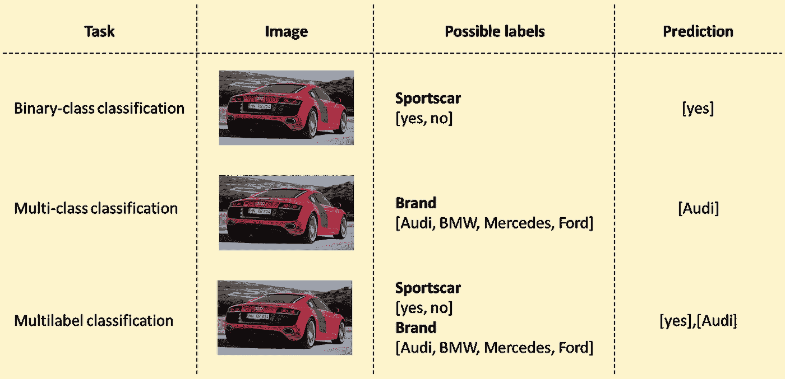
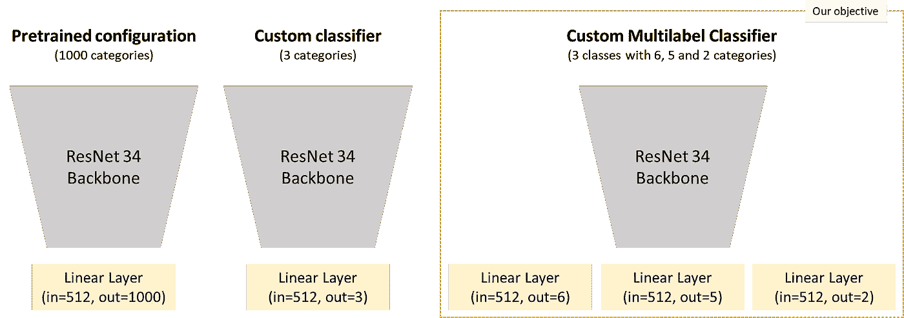

# 用 PyTorch 在 5 分钟内进行多标记分类

> 原文：<https://towardsdatascience.com/multilabel-classification-with-pytorch-in-5-minutes-a4fa8993cbc7>

# 用 PyTorch 在 5 分钟内进行多标记分类

## 您自己的分类任务蓝图

亚历克斯·苏普伦在 [Unsplash](https://unsplash.com/s/photos/cars?utm_source=unsplash&utm_medium=referral&utm_content=creditCopyText) 上的照片

当处理图像分类时，人们通常从对一个类别中的一个或多个类别进行分类开始。例如，如果您想对汽车进行分类，您可以区分它是否是敞篷车。这是二元分类的一个例子。更复杂的任务可能是区分几个类别。它是奥迪、宝马、奔驰还是福特？汽车品牌中有不止一个类别。如果我们想把两个例子结合起来呢？我们可以**一次对显示车辆的每张图像的多个特征进行分类**，例如品牌、车型和制造年份。一种方法是训练三个独立的分类器**，但是也有可能将所有东西集成到一个模型**。

分类任务(由作者完成)

我们将与出于教育目的免费使用的[斯坦福汽车数据集](https://ai.stanford.edu/~jkrause/cars/car_dataset.html)一起完成这项工作。我们开始吧:

首先，我们创建了两个函数来 a)下载和提取图像本身，b)存储相应的元数据(包含关于品牌和型号的信息)。在下一步中，我们创建一个类，该类合并两种信息并提取总共三个相关特征:

> 数据集中所有超过 1000 张图片的**品牌**。我们将所有其他品牌归入“其他”类别。
> 
> 我们区分**不同类型的车辆**:敞篷车、轿跑、SUV、面包车。所有不涉及车型的车型，我们都归纳为“其他”类别。
> 
> 我们将拼车分成**两个时间相关的队列**:2009 年及更早发布的所有汽车和 2010 年及更晚发布的所有汽车。

所以我们有三个不同类别的目标，我们希望同时预测其中的每一个。我们可以从元数据中提取所有需要的信息。

如类的文档字符串中所述，我们可以传递包含类的类别的字典:

正如所料，我们得到了一个列表，其中包含三个类别(品牌、类型、年份)的三个数字特性列表。这些是我们的培训标签。我们可以稍后使用字典重新分配它们:

乍一看，每个类都有足够的案例。我们确实有偏斜的分布，但是我们可以通过[加权](https://discuss.pytorch.org/t/passing-the-weights-to-crossentropyloss-correctly/14731/10)来减轻。我们让这些类保持原样，并为我们的自定义数据集创建一个字典。我们为每个文件名分配相应的训练标签:

接下来，我们将创建自定义数据集。更深入的介绍，你可以看看我的这篇文章。基本上还没什么特别的。**唯一的不同是，我们为每个样本**加载三个训练标签，而不是一个，并将所有三个标签传递到我们的训练循环中:

我们可以用数据加载器加载一个样本并查看它:

我们的定制数据集和数据加载器按预期工作。我们每批得到一个字典，包含图像和 3 个目标标签。这样我们就有了多标记分类器的先决条件。

自定义多标签分类器(由作者提供)

首先，我们加载**一个预训练的 ResNet34** 并显示最后 3 个子元素。首先是顺序块，然后是池操作，最后是线性层。这会得到 512 个特征作为输入，并给出 1000 个特征作为输出。我们**想要删除这最后一层，并用新的层**替换它。我们已经知道，我们各有 512 个内特征，需要 a) 6 个品牌外特征，b) 5 个车型外特征，c) 2 个时代外特征。我们可以通过将所有子元素放入一个列表并删除最后一个元素来删除最后一层:

我们可以在没有分类器头的情况下使用 ResNet 处理输出，并查看各自的张量形状:

结果我们得到一个格式为[16，512，1，1]的张量。我们的批次中有 16 个样本，每个图像有 512 个特征。第三和第四个维度的大小为 1，可以通过 *torch.flatten()* 进行平滑。现在，我们可以将此输出传递给新的分类器层:

这正是我们想要的。在我们的批次中，每个样品有 6 个对数。我们现在可以像往常一样使用训练循环中的损失函数来处理这些。现在，我们添加另外两个分类器层，并将所有内容放在一个自定义模型中:

我们创建了一个灵活的训练程序，考虑了我们模型的所有输出。因此，我们是否有 2 个、3 个或例如 5 个分级机头并不重要。对于多分类任务，我们简单地使用传统的损失函数。我们计算每个头部的 ***交叉弯曲*** 并合计损失。这样，我们可以通过一个优化步骤来优化所有三个头的权重:

我们还编写了验证例程，以便我们可以传递灵活数量的类别进行分类。我们计算每个类别的总绩效和每个类别的绩效:

## 结论

> 每一类大约 90%的准确率，我们能够做出很好的预测。我们看到，我们可以用一个模型对多个类**进行分类，而不需要多个模型或运行。在我们的例子中，我们使用 PyTorch，并且看到我们可以使用定制数据集和定制模型快速创建定制训练例程。此外，尽管任务很复杂，我们还是利用了**迁移学习**来快速获得好的结果。在现实世界中，有很多这样的应用领域。**想象一下，你运行一个二手车平台，想要直接从图像中提取关于单个车辆特征的建议。在我们的例子中，我们离这并不远。**还有另一种形式的多标签分类。例如，想想社交网络中的图像标签。这里，我们也给出了某些类，但并不是每个图像都被强制分配给每个类。我们将在下一章讨论这个问题。感谢阅读！**

# 进一步阅读

**笔记本:**[https://jovian . ai/droste-benedikt/02-article-py torch-multi label-classification](https://jovian.ai/droste-benedikt/02-article-pytorch-multilabel-classification)
**关于多类:**[https://scikit-learn.org/stable/modules/multiclass.html](https://scikit-learn.org/stable/modules/multiclass.html)

# 数据集信用

**用于细粒度分类的 3D 对象表示**
Jonathan Krause，Michael Stark，Jia Deng，李菲菲
*第四届 IEEE 表示和识别研讨会，ICCV 2013***(3 drr-13)**。澳大利亚悉尼。2013 年 12 月 8 日。
[【pdf】](https://ai.stanford.edu/~jkrause/papers/3drr13.pdf)[【BibTex】](https://ai.stanford.edu/~jkrause/papers/3drr13.bib)[【幻灯片】](https://ai.stanford.edu/~jkrause/papers/3drr_talk.pdf)

 [## 汽车数据集

### 概述汽车数据集包含 196 类汽车的 16，185 幅图像。数据被分成 8，144 个训练图像…

ai.stanford.edu](https://ai.stanford.edu/~jkrause/cars/car_dataset.html) 

[如果您喜欢中级数据科学，并且还没有注册，请随时使用我的推荐链接加入社区。](https://medium.com/@droste.benedikt/membership)