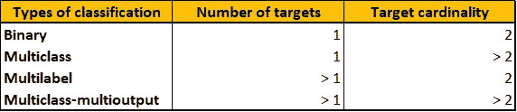
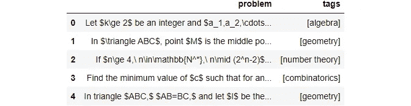
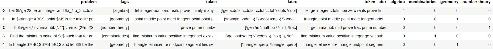
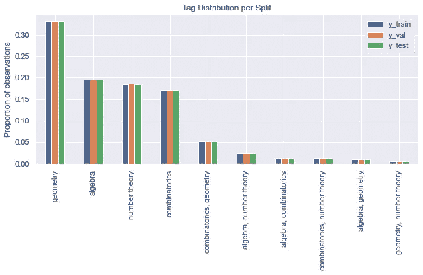
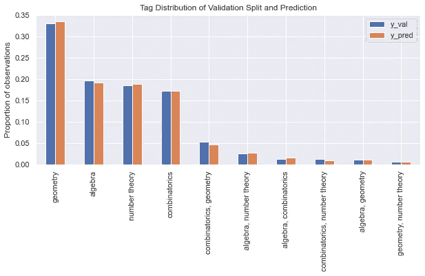
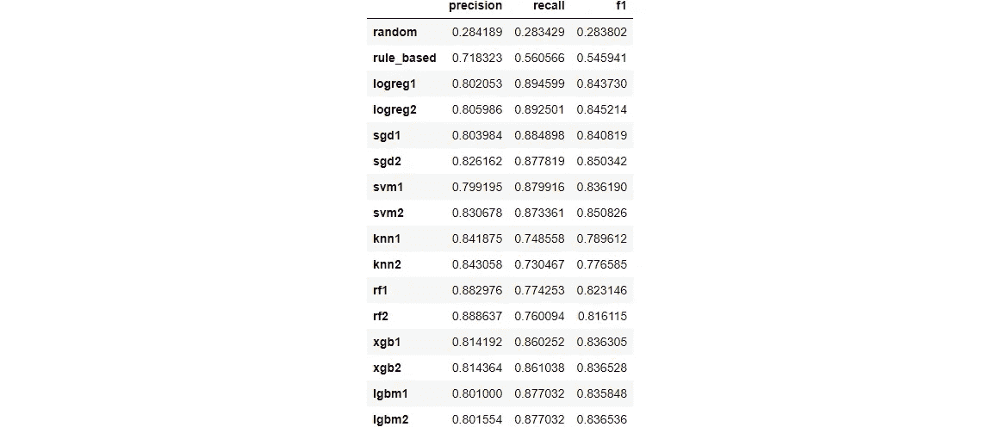
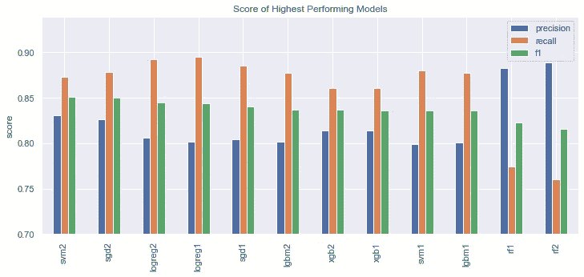
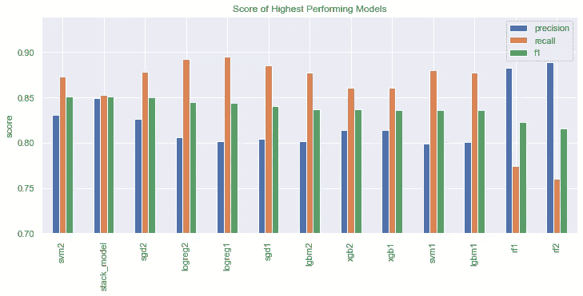

# 使用 Scikit-learn 和堆叠概括正确完成多标签文本分类

> 原文：<https://towardsdatascience.com/multilabel-text-classification-done-right-using-scikit-learn-and-stacked-generalization-f5df2defc3b5>

## 实践教程

## 以及如何使用递归正则表达式匹配 LaTeX 语法


模型堆叠本身就是一门艺术|照片由[肖恩·斯特拉顿](https://unsplash.com/@seanstratton?utm_source=medium&utm_medium=referral)在 [Unsplash](https://unsplash.com?utm_source=medium&utm_medium=referral) 上拍摄

```
**Table of Contents**· [Preprocessing](#dd97)
· [Split Dataset](#7cd9)
· [Modeling](#ad85)
  ∘ [Random Prediction](#2de0)
  ∘ [Rule-based Prediction](#6de1)
  ∘ [Machine Learning](#0ccf)
  ∘ [Stacking Models](#1c60)
· [Wrapping Up](#0515)
```

在这个故事中，您将作为多标签分类任务为数据集进行基线建模。在整个过程中，您将学习如何:

1.  使用递归正则表达式预处理包含 LaTeX 的文本。
2.  适当分割多标记观测值，保持关于第级标记组合的平衡表示。
3.  使用随机预测、基于规则的预测、机器学习预测和模型堆叠从头开始构建基线模型。

如果你不知道什么是多标签分类任务，让我们倒回去一点。基于目标/标签/类别，机器学习中有几种类型的分类问题:

1.  二进制:由两个类组成的分类问题，表示为一维数组，其中正标签用 1 表示，负标签通常为 0。
2.  多类:包含两个以上类别的分类问题。多类目标可以表示为从 0 开始的一维整数数组。
3.  Multiclass-multioutput:一个分类问题，其中每个样本的目标由固定整数*n*1 的 *n* 个输出组成，每个输出是一个类/标签。每个输出都有一组固定的可用类，每个样本都标有一个对应于每个输出的类。
4.  多标签:多类多输出分类问题，其中每个输出都是二进制的。

多类-多输出和多标签分类可以表示为整数的二维数组。具体来说，对于多标签，数组的每一列都是一个单独的二进制目标。

如果你仍然迷茫，这张对比汇总表很好地总结了这一点。



机器学习中的分类问题类型比较|图片作者[作者](http://dwiuzila.medium.com/membership)

你在这个故事中使用的数据集名为`math_problems.json`，由我和我来自奥林匹克社区的朋友创建。我们来读一下。



它有两个特性:`problem`包含 LaTeX 格式的数学问题，而`tags`包含代数、组合学、几何或数论中的一两个类。在建立模型时，`problem`和/或其提取的特征将是你的预测器，而`tags`将是你的目标。

您将逐步构建您的模型，从最简单的开始，一步步增加复杂性:

1.  随机预测:不利用`problem`中的任何信息进行随机预测
2.  基于规则的预测:基于`problem`中存在的关键字
3.  机器学习:从`problem`中提取特征，然后输入经典模型

我知道许多术语和术语有点令人困惑，尤其是当你在处理多标签分类任务时。所以从现在开始，我们要就如何称呼事物达成一致:

1.  在`problem`中的每个观察被称为问题
2.  `tags`中的每个观察值或其来自模型的预测被称为一个标签。换句话说，['代数'，'几何']是一个标签，它的二值化[1，0，1，0]也是。
3.  标签中的每个元素称为一个标记。使用与前面相同的示例，“代数”和“几何”是标签，1、0、1 和 0 也是标签。

# 预处理

让我们对一些问题进行取样，以了解数据集。

```
Let $k\ge 2$ be an integer and $a_1,a_2,\cdots,a_k$ be $k$ non-zero reals. Prove that there are finitely many pairs of pairwise distinct positive integers $(n_1,n_2,\cdots,n_k)$ such that
$$a_1\cdot n_1!+a_2\cdot n_2!+\cdots+a_k\cdot n_k!=0.$$

In $\triangle ABC$, point $M$ is the middle point of $AC$. $MD//AB$ and meet the tangent of $A$ to $\odot(ABC)$ at point $D$. Point $E$ is in $AD$ and point $A$ is the middle point of $DE$. $\{P\}=\odot(ABE)\cap AC,\{Q\}=\odot(ADP)\cap DM$. Prove that $\angle QCB=\angle BAC$.
https://z3.ax1x.com/2021/09/12/4pZ7Zj.jpg

If $n\ge 4,\ n\in\mathbb{N^*},\ n\mid (2^n-2)$. Prove that $\frac{2^n-2}{n}$ is not a prime number.

Find the minimum value of $c$ such that for any positive integer $n\ge 4$ and any set $A\subseteq \{1,2,\cdots,n\}$, if $|A| >cn$, there exists a function $f:A\to\{1,-1\}$ satisfying
$$\left| \sum_{a\in A}a\cdot f(a)\right| \le 1.$$

In triangle $ABC,$ $AB=BC,$ and let $I$ be the incentre of $\triangle ABC.$ $M$ is the midpoint of segment $BI.$ $P$ lies on segment $AC,$ such that $AP=3PC.$ $H$ lies on line $PI,$ such that $MH\perp PH.$ $Q$ is the midpoint of the arc $AB$ of the circumcircle of $\triangle ABC$. Prove that $BH\perp QH.$
```

探索性数据分析提出了一些清理策略:

1.  小写所有文本
2.  删除 URL
3.  删除所有 LaTeX 数学表达式和[渐近线](https://asymptote.sourceforge.io/)代码块。它们可能传达有用的信息，所以稍后我们也会提取它们。
4.  删除错误的 LaTeX 语法和停用词
5.  处理过滤器和非字母数字字符

上述清洁步骤中的第 3 步是最具挑战性的一步。为此，我们形式化了 4 种类型的数学表达式:

1.  单或双美元符号，`\$...\$`或`\$\$...\$\$`
2.  一对括号`(...)`
3.  一对支架`[...]`
4.  `\begin...\end`命令

为了使用正则表达式匹配 LaTeX 语法，我们使用递归，因为四种类型中的每一种都可以包含在其他类型中。模式相当复杂，如下所示。

这同样适用于渐近线模式。

现在，该打扫卫生了！

如果仔细观察，`preprocess_problem`函数返回 3 列:

1.  `token`，遵循上述清洁策略。
2.  `latex`，包含所有存在于`problem`中的 LaTeX 命令。
3.  `token_latex`，与`token`相同，但带有 LaTeX 命令。

在处理多标签分类任务时，将`tags`转换为 4 个二进制列，依次表示代数、组合学、几何和数论，然后将结果连接回原始数据集。

```
array(['algebra', 'combinatorics', 'geometry', 'number theory'],
      dtype=object)
```

最后，将预处理后的数据集保存到一个名为`math_problems_preprocessed.json`的新 JSON 文件中。



# 分割数据集

在分割数据集之前，最好了解标签分布，分别计算单标签和双标签。单标签有 4 种，双标签有 6 种组合，共 10 类。根据下面的图，有一个阶级不平衡的迹象，特别是几何。


图片作者[作者](http://dwiuzila.medium.com/membership)

您将数据集分为 3 部分:训练(70%用于训练模型)、验证(15%用于超参数调整)和测试(15%用于评估模型性能)。目前，我们不会进行超参数调优，但我们将坚持 3-split 场景。Scikit-learn 提供了一种使用`train_test_split`将数据集一分为二的快速简单的方法。所以，要把它分成 3，用两次`train_test_split`，如下。为了确保分割中相似的标签分布，不要忘记使用`stratify`参数。

```
train: 15952 (70%)
val: 3419 (15%)
test: 3419 (15%)
```

让我们看看分割后的标签分布。我们希望在分割中看到类似的分布，因为我们希望在尽可能类似于未知数据(验证数据和测试数据)的训练数据上训练我们的模型，以获得良好的泛化能力。



图片作者[作者](http://dwiuzila.medium.com/membership)

我们看到标签分布在分割中几乎是相同的，这正是我们想要的。如果不是这种情况，对于其他多标签分类任务，特别是对于不平衡的高阶标签组合，我们需要另一种分裂方法。其中一个叫做[迭代分层](http://lpis.csd.auth.gr/publications/sechidis-ecmlpkdd-2011.pdf)，由于 [scikit-multilearn](http://scikit.ml/index.html) 中的[迭代分层](http://scikit.ml/stratification.html)模块，可以很容易地使用。你应该自己试试。

# 建模

在实际应用中，选择模型时需要考虑许多因素。除了性能，我们还应该考虑模型对推理的响应速度、重新训练的时间、计算成本、内存大小、可解释性等。

在性能方面，我们要做的第一件事是构建一个简单的基线来比较模型。由于这是一个分类问题，我们将考虑性能的简单指标，如精确度、召回率和 f1 分数。

因此，构建一个`score()`函数，它接受真正的标签和预测，并以熊猫数据帧的形式返回精度、召回率和 f1 值。我们使用来自`scikit-learn`的`precision_recall_fscore_support`并设置参数`average='weighted'`来解决等级不平衡的问题。

## 随机预测

这是最简单的基线。不应该有比随机预测性能更低的模型。如果您找到了一个，很可能是您在建模步骤中走错了方向，或者您的标签没有正确编码。

将`scores`初始化为一个空的数据帧，稍后通过比较验证分割的真实标签和预测标签，该数据帧将用于列出所有模型的分数。

为了维护验证分割和预测的标签分布，将根据您之前建立的标签分布随机选择每个标签。为此，使用参数`p`等于标签分布的`np.random.choice`。不要忘记使用仅来自训练数据的标签分布，否则将会有数据泄漏。

您可以使用与前面相同的方法来确认验证分割和预测之间的标记分布的相似性。



图片由[作者](http://dwiuzila.medium.com/membership)

我们看到分布是相似的。接下来，计算分数并制表到`scores`。正如预期的那样，分数非常低(大约 0.28)，因为没有使用来自预测者的信息。


## 基于规则的预测

现在，如果我们使用来自`token`的一些关键字来确定标签会怎么样？我所说的关键字是指针对特定标签的问题经常出现的常用词。当然，这需要数学领域的专业知识。首先，我们将为每个标签使用三个关键字，如下所示。比如一道题包含“角”、“圆”、“四边形”这些词，那么就把它归类为几何。

这些启发式预测的一个问题是，它们不能涵盖所有问题，因为可能会有不包含这 12 个词的问题。这些问题的治疗方法是什么？只需随机选择一个标签。

计算分数并将其列表到`scores`。基于规则的预测比随机预测好很多，但仍然不够好。我们迫切需要机器学习。


较低的召回率是由于大量的假阴性，因为许多观察结果没有被我们选择的关键字标记(默认为 0)。

## 机器学习

这就是乐趣的开始！

我们将尝试选择最好的模型，因此为了使改变许多模型更容易，将它们包装在一个类中(在我们的例子中称为`ClfSwitcher`)，该类继承了 scikit-learn `BaseEstimator`中的主要方法，如`fit()`、`predict()`、`predict_proba()`和`score()`。

接下来，构建一个管道，从预测器中提取特征，并使用`ClfSwitcher`从提取的特征中预测标签。我们选择的特征提取器是`TfidfVectorizer`。Tf 表示术语频率，而 TF–IDF 表示术语频率乘以逆文档频率。它将计数特征重新加权为适合分类器使用的浮点值，以惩罚非常频繁的术语(例如，英语中的“the”、“a”、“is”)。

我们将分别使用 7 种型号:

1.  逻辑回归
2.  随机梯度下降
3.  线性支持向量机(SVM)
4.  k-最近邻(KNN)
5.  随机森林
6.  极端梯度增强(XGBoost)
7.  光梯度推进机(LightGBM)

其中一些模型支持 scikit-learn 实现中的多标签分类，如 k-最近邻、随机森林和 XGBoost。其他的只支持单输出，我们就传给`MultiOutputClassifier`。请注意，所有模型都尽可能使用不一致的类别权重来解决类别不平衡问题。

至于`TfidfVectorizer`，我们试图改变 n 元模型，只使用单元模型(1，1)，或者同时使用单元模型和二元模型(1，2)。更多细节参见[文档](https://scikit-learn.org/stable/modules/generated/sklearn.feature_extraction.text.TfidfVectorizer.html)。

将参数网格中的每组参数分配给管道，在训练分割上训练管道，在验证分割上进行预测，计算分数，并将分数列表到`scores`。由于有 7 个模型和 2 种 n-gram，参数组的总数是 14。

```
100%|███████████████████████████████| 14/14 [01:39<00:00,  7.11s/it]
```



定义接受`scores`的`plot()`函数，并根据 f1 分数将几个最高分绘制成柱状图。具体来说，它将按降序绘制 f1 值超过 0.80 的分数。



图片作者[作者](http://dwiuzila.medium.com/membership)

可以看出，几乎所有的模型都是低精度高召回的。这意味着这些模型预测的假阳性比假阴性多。这是有意义的，因为每个标签的最大标签数量是两个，所以当一个模型预测一个问题有两个以上的标签时，它肯定会有一个假阳性。

你会问，如何平衡精确度和召回率？一种方法是使用自定义阈值进行预测(不是默认的 0.5)，另一种方法是堆叠一些模型。

## 堆叠模型

从上面的图中可以明显看出，对于几乎所有的模型，n-gram (1，2)都比(1，1)好。这是因为当我们同时使用单词和双词时，比只使用单词时提取了更多的特征。

基于 f1 分数的最好的三个模型是 SVM、SGD 和逻辑回归。让我们用`StackingClassifier`把这 3 个排名前 3 的模型堆起来。不要忘记将结果传递给`MultiOutputClassifier`并设置参数`class_weight='balanced'`。

像以前一样，使用`TfidfVectorizer`和堆叠模型构建一个管道。对训练分割进行管道训练，对验证分割进行预测，计算分数，并将分数列表给`scores`。



图片由[作者](http://dwiuzila.medium.com/membership)

```
CPU times: total: 1.7 s
Wall time: 17.3 s
```

尽管`svm2`提供了最佳性能，我们还是会选择`stack_model`，因为`stack_model`与`svm2`不同，它具有大致相同的精度、召回率和 f1 分数。将此模型保存为 pickle 对象。

您可以再次加载该模型，并对测试分割进行预测，以获得最终性能。我们看到测试分割的分数与验证分割的分数相似(大约 0.85)，这是意料之中的。


# 包扎

在本故事中，您将了解如何用 python 解决多标签分类任务。您已经学会了如何:

1.  使用递归正则表达式预处理包含 LaTeX 的文本。
2.  适当分割多标记观测值，保持关于第级标记组合的平衡表示。您还会注意到类的不平衡，并知道如何使用 scikit-learn 中的`class_weight`参数来处理它。
3.  使用随机预测、基于规则的预测、机器学习预测和模型堆叠从头开始构建基线模型。您可以看到，堆叠模型平衡了单个模型的精确度和召回率。


🔥你好！如果你喜欢这个故事，想支持我这个作家，可以考虑 [***成为会员***](https://dwiuzila.medium.com/membership) *。每月只需 5 美元，你就可以无限制地阅读媒体上的所有报道。如果你注册使用我的链接，我会赚一小笔佣金。*

🔖*想了解更多关于经典机器学习模型如何工作以及如何优化其参数的信息？或者 MLOps 大型项目的例子？有史以来最优秀的文章呢？继续阅读:*


[艾伯斯·乌兹拉](https://dwiuzila.medium.com/?source=post_page-----f5df2defc3b5--------------------------------)

## 从零开始的机器学习

[View list](https://dwiuzila.medium.com/list/machine-learning-from-scratch-b35db8650093?source=post_page-----f5df2defc3b5--------------------------------)8 stories

[艾伯斯·乌兹拉](https://dwiuzila.medium.com/?source=post_page-----f5df2defc3b5--------------------------------)

## 高级优化方法

[View list](https://dwiuzila.medium.com/list/advanced-optimization-methods-26e264a361e4?source=post_page-----f5df2defc3b5--------------------------------)7 stories

[艾伯斯·乌兹拉](https://dwiuzila.medium.com/?source=post_page-----f5df2defc3b5--------------------------------)

## MLOps 大型项目

[View list](https://dwiuzila.medium.com/list/mlops-megaproject-6a3bf86e45e4?source=post_page-----f5df2defc3b5--------------------------------)6 stories

[艾伯斯·乌兹拉](https://dwiuzila.medium.com/?source=post_page-----f5df2defc3b5--------------------------------)

## 我最好的故事

[View list](https://dwiuzila.medium.com/list/my-best-stories-d8243ae80aa0?source=post_page-----f5df2defc3b5--------------------------------)24 stories

艾伯斯·乌兹拉

## R 中的数据科学

[View list](https://dwiuzila.medium.com/list/data-science-in-r-0a8179814b50?source=post_page-----f5df2defc3b5--------------------------------)7 stories[](https://dwiuzila.medium.com/membership)