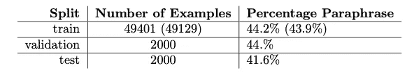
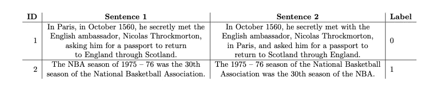

# 多语言 NLP:在 5 分钟或更短时间内开始使用 PAWS-X 数据集

> 原文：<https://towardsdatascience.com/multilingual-nlp-get-started-with-the-paws-x-dataset-in-5-minutes-or-less-45a70921d709>

## 检索、处理和使用数据集的实践教程


照片感谢来自 [Unsplash](https://unsplash.com/photos/ZzWsHbu2y80) 的[汉娜·莱特](https://unsplash.com/@hannahwrightdesigner)。

# 介绍

PAWS-X [ [1](https://arxiv.org/abs/1908.11828) ]是一个多语言**序列分类**数据集，使用单词加扰(PAWS)数据集[【2】](https://aclanthology.org/N19-1131.pdf)从原始英语释义对手创建。该数据集由 49401 个句子对组成，每个句子对都有一个相关联的标签，该标签指示该句子对是意译(y=1)还是非意译(y=0)。每个句子对由机器从原始英语数据集翻译成以下语言:德语(de)、西班牙语(es)、法语(fr)、日语(ja)、韩语(ko)和中文(zh)。因此，数据集有 7 种语言，涵盖 4 种文字(拉丁文、表意文字、韩文和中文表意文字)和 4 种语系(印欧语(日耳曼语和罗曼语)、日语、韩语和汉藏语)。下面的表 1 描述了一些数据集统计数据。表 2 显示了来自英语数据集子集的示例实例。



**表 1:** 不同数据分割可用的数据集统计。请注意，括号中的数字表示“已清理”实例的数量。



**表 2:**PAWS-x 英文子集的两个例子，这些例子直接取自 [HuggingFace](https://huggingface.co/datasets/paws-x#licensing-information) 上的数据集。

PAWS-X 通常被用作多语言 NLP 的基准，它是 DeepMind 的 XTREME [ [3](https://arxiv.org/abs/2003.11080) ]数据集的一部分。总的来说，这是一个相对容易的数据集，模型达到了 89%的准确率。然而，与人的表现(97.5%)相比，在表现上有相当大的差距。这使得数据集适合于 a)评估新的 NLP 模型的性能(特别是测量跨语言性能),以及 b)在剽窃检测管道中使用它们来微调 NLP 模型。

本文提供了检索、处理和使用数据集的简短指南。如果你不能在 5 分钟内使用数据集(即因为代码中的错误或因为我的文章写得不好)，那么我让你失望了。请标记任何问题，以便我可以让其他人的过程更顺利。

# 检索数据集

数据集可以很容易地从其 HuggingFace [存储库](https://huggingface.co/datasets/paws-x#licensing-information)中检索出来。下面的函数可用于检索数据。

务必先安装好[数据集](https://github.com/huggingface/datasets)库。

```
pip install datasets
```

# 处理数据集

检索数据集后，我运行了一些简单的验证测试。这些是:

*   确保每种语言的数据集大小相同
*   确保没有一个句子对是空的

令我失望的是，后一项测试失败了。翻译中的系统性错误导致 272 个实例为空字符串。这个错误被记录在谷歌的 PAWS-X Github repo 的下一期[中](https://github.com/google-research-datasets/paws/issues/4)，然而不管什么原因，它还没有被修复。如果你想重现最先进的(SOTA)结果，那么最好**而不是**在数据集中过滤这些不完整的实例，因为其他研究人员不太可能这么做。

但是，如果您对保持数据集的并行性感兴趣，那么您可以使用下面的函数删除这些损坏的实例(跨所有语言):

注意，我们是基于德国数据集生成 PAWSX_FILTER_IDS 的。事实上，我们可以使用任何翻译的语言(不是英语),因为这个错误是系统性的(我检查过，这个公式为所有翻译的语言提供了相同的 id！)

如果您不想在每次运行代码时定位被排除的 id(取决于您的设置)，那么您可能希望将它们硬编码到一个配置文件中。这些 id 以 Python 可复制的格式提供如下:

```
['306', '473', '624', '1209', '1698', '1858', '1975', '2325', '2530', '2739', '2912', '2991', '3046', '3135', '3394', '3437', '3664', '3726', '3846', '4135', '4518', '4721', '4826', '5107', '5457', '5857', '5934', '6048', '6147', '6506', '6650', '7200', '7350', '7374', '7508', '7666', '7808', '8656', '8789', '8905', '9114', '9259', '9368', '9471', '9854', '10115', '10285', '10386', '10666', '10757', '10992', '11252', '11305', '11385', '11732', '11772', '11783', '11784', '11804', '11843', '11870', '11944', '12484', '12642', '12679', '12754', '12794', '12830', '13136', '14108', '14442', '14525', '14693', '14812', '14820', '14889', '15170', '15395', '15397', '15594', '15647', '16131', '16346', '16359', '16441', '16478', '16777', '17067', '17123', '17563', '17607', '17615', '17863', '17995', '18213', '18443', '18549', '18606', '19075', '19181', '19289', '19311', '19329', '19476', '19597', '19672', '19762', '19882', '19888', '19988', '20028', '20126', '20219', '20752', '20818', '20902', '20903', '21162', '21248', '21520', '21556', '22294', '22585', '22621', '22733', '22785', '22822', '23414', '23588', '23752', '23907', '24964', '25002', '25075', '25088', '25092', '25369', '25587', '25889', '26172', '26787', '26881', '27137', '27223', '27446', '27829', '27925', '28192', '28242', '28517', '28654', '28836', '28846', '29020', '29060', '29066', '29465', '29632', '30314', '30568', '30649', '30882', '31284', '31458', '31712', '31715', '31963', '32035', '32043', '32067', '32334', '32489', '32534', '32976', '33502', '33538', '33974', '34119', '34619', '34634', '34706', '34793', '34820', '34976', '35221', '35251', '35334', '35406', '35439', '35568', '36246', '36406', '36524', '36589', '36651', '36685', '36719', '36816', '36947', '37331', '37397', '37672', '38068', '38093', '38198', '38378', '39005', '39020', '39195', '39633', '39674', '39683', '39744', '40325', '40337', '40397', '40406', '40457', '40509', '40574', '40750', '40799', '40814', '40870', '40913', '41342', '41498', '41579', '41595', '41782', '42177', '42253', '42490', '42568', '42757', '42862', '43161', '43417', '44037', '44467', '44488', '44861', '45243', '45365', '45498', '45594', '45750', '45975', '45982', '46143', '46593', '46672', '46691', '46743', '46751', '47436', '47632', '47657', '47667', '47677', '48090', '48217', '48243', '48307', '48678', 
'48687', '48973', '48994', '49183', '49219', '49312', '49358']
```

# 使用数据集

从这一点开始，如何使用数据集主要取决于您。在这里，我提供了关于标记数据集的重要说明，以及一个 Python 类，它允许您在 PyTorch 训练循环中直接加载和使用数据集。如果你对使用 TensorFlow 或 HuggingFace 的训练器感兴趣，可以跳过后半部分。我还提供了 PAWS-X 数据集的两个常见用例。

## 将数据集符号化

由于我们的问题是对一对**句子进行序列分类，我们需要将这两个句子作为单独的参数提供给记号赋予器函数。此外，我们指定 max_length 为 128。这是直接从 XTREME GitHub [库](https://github.com/google-research/xtreme)中获取的。它相对较小，这意味着我们可以在 Colab 上运行大多数模型，而没有任何内存限制。我们使用“longest_first”进行截断(即，如果句子对超过最大长度，则我们截断较长的句子)，并将短句对填充到最大长度。以下代码可用于标记数据集:**

## PyTorch 训练循环的数据集类

以下代码准备 PAWS-X 数据集(来自 HuggingFace 源代码),以便在 PyTorch 样式的循环中进行训练。

## 学术用例:基准 NLP 模型

PAWS-X 对于 NLP 模型的基准测试非常有用。尽管它是一个简单的数据集，但与人类的表现相比，它的表现仍有相当大的差距(88.9%比 97.5% [ [3](https://arxiv.org/abs/2003.11080) ])。这主要是因为在非拉丁脚本语言[ [3](https://arxiv.org/abs/2003.11080) ]上性能较弱。这使得数据集成为检查您的 NLP 模型是否具有拉丁文字中心偏向的良好选择。

此外，数据集的大小使其成为开发合成数据集的良好起点。例如，可以创建对立的例子来评估模型的健壮性。因为 PAWS-X 是一个简单的数据集，所以在模型不再有用之前，可以用对立的例子来推动它们。最后，PAWS-X 结构不会对给定的一对句子混合使用不同的语言(也就是说，我们永远不会有一对由一个英语句子和一个西班牙语句子组成的句子)。然而，因为数据集的大小很大，所以可以使用它的很大一部分来用跨句子对混合语言的例子补充数据集，使得该模型在多语言释义检测方面更好，而不损害其在单语释义检测方面的性能。

## 实际使用案例:PAWS-X 微调抄袭检测

PAWS-X 数据集用于释义检测，这意味着它可以用于微调简单的抄袭检测模型。但是，由于句子长度相对较小，该模型不太可能适用于非常大的文档。因此，任何使用这种模型的管道都必须先将文本分割成句子，然后再输入模型。

使用 PAWS-X 微调抄袭检测模型背后的核心逻辑是“释义”是句子相似性的一种度量。有了这个逻辑，PAWS-X 微调模型测量句子相似度也是可能的(支持传统的度量，比如计算嵌入的余弦相似度)。PAWS-X 的多语言特性意味着也可以跨语言找到相似性(例如，给定一个英语句子“I love you”和一个法语句子“Je t'adore”(简单地说，法语是 I love you)，确定它们的相似性)*。

> *虽然这是事实，但为了在多语言句子相似性方面获得更好的性能，在具有多语言翻译对的增强 PAWS-X 数据集上进行微调将是一个好主意，如章节**“学术用例:NLP 模型基准测试”**中所述

# 结束语

*   PAWS-X 是以释义检测形式的多语言序列分类数据集
*   它有超过 49k 个实例，以及额外的 2k 个验证和测试实例
*   它涵盖 7 种语言，跨越 4 种文字和 4 个语系
*   这是一个相对简单的任务和数据集
*   对于对多语言 NLP 感兴趣的人来说，这是一个很好的介绍

## 作者说明

我写这篇文章的动机是因为我最近在做一个处理多语言数据集的项目。在这个过程中，我发现虽然网上有许多丰富的数据集，但处理它们是一项非常困难的任务(许多数据集以不同的版本出现在不同的位置，可用数据集的大小与论文中报告的大小之间存在差异，存在翻译错误等等)。我心想，其他人可能也经历过同样的问题，将来还会有更多的人遇到，所以为什么不写一些简明的教程来让人们的生活更轻松呢？

这是我打算写的关于多语言 NLP 的系列文章的一部分。前几个将专注于数据集(接下来将是 TyDiQA [ [4](https://aclanthology.org/2020.tacl-1.30/) ]和 xf quad[[5](https://arxiv.org/abs/1910.11856)])。稍后我将把重点转向任务本身(表示数据、有趣的实验、培训和评估教程)。

如果您对我的工作感兴趣，请考虑通过我的推荐链接获得中等会员资格来支持我:

[](https://namiyousef96.medium.com/membership)  

这对我很有帮助，因为你的一部分会员费会归我(别担心，这对你没有额外的费用！)同时让您完全访问 Medium 上的所有文章！

# 参考

## 相关资源

**数据集位置**

[](https://huggingface.co/datasets/paws-x)  

**数据集论文**

[](https://arxiv.org/abs/1908.11828)  

## 引用表

[1]https://arxiv.org/abs/1908.11828

[2]https://aclanthology.org/N19-1131.pdf

[3][https://arxiv.org/abs/2003.11080](https://arxiv.org/abs/2003.11080)

[https://aclanthology.org/2020.tacl-1.30/](https://aclanthology.org/2020.tacl-1.30/)

[https://arxiv.org/abs/1910.11856](https://arxiv.org/abs/1910.11856)

## 声明

*根据许可，PAWS-X 数据集可用于任何用途(参见*[*hugging face*](https://huggingface.co/datasets/paws-x#licensing-information)*上的许可信息)。它是由谷歌公司提供的。*

*所有图片、表格和代码均由作者提供，除非另有说明*