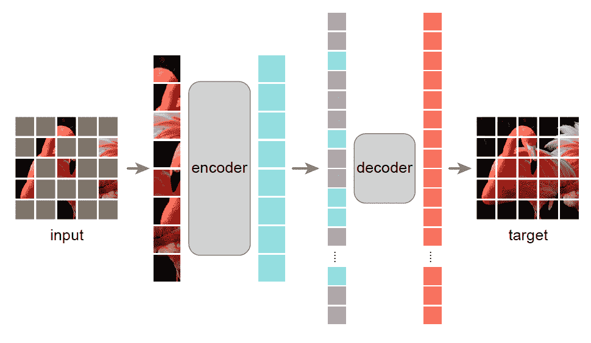
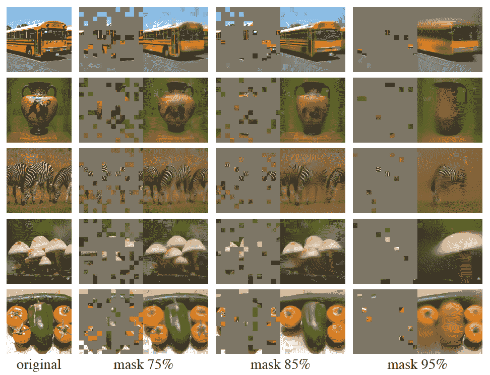
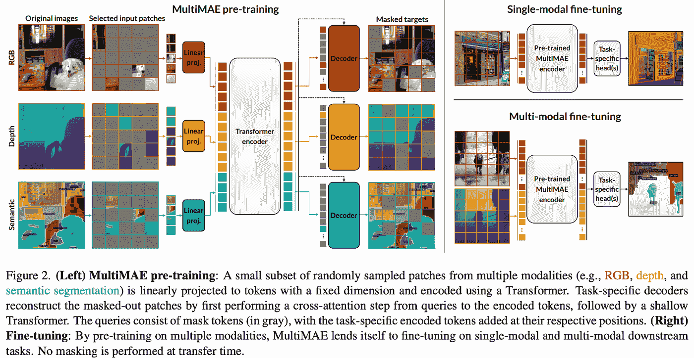

# MultiMAE:在无监督预训练中利用标记数据的灵感

> 原文：<https://towardsdatascience.com/multimae-an-inspiration-to-leverage-labeled-data-in-unsupervised-pre-training-9739a2dbf97c>

## 通过多模式屏蔽自动编码器提高模型性能

巴勃罗·阿里纳斯在 [Unsplash](https://unsplash.com?utm_source=medium&utm_medium=referral) 上拍摄的照片

自监督预训练是提高传统监督学习性能的一种主要方法，其中大量的标记数据是必要的和昂贵的。在自我监督学习方法中，对比学习因其简单有效而广受欢迎。然而，大多数对比学习方法使用全局向量，其中像素级信息的细节丢失，这在转移到下游密集任务时留下了改进的空间。我向感兴趣的读者推荐我以前的关于对比学习方法的文章。

<https://medium.com/geekculture/understanding-contrastive-learning-and-moco-efe491e4eed9>  </pixel-level-dense-contrastive-learning-6558691eeb67>  </contrastive-pre-training-of-visual-language-models-848dd94c881b>  

对于密集下游任务的迁移学习，我们需要一些自我监督的预训练方法，可以恢复整个特征图的细节，而不仅仅是合并的全局向量。只有通过这个才能了解到整个特征地图分布的细节，更重要的是，不需要标注。

在对比学习中，提出了一些方法来训练图像块[4]，或局部特征[5]，甚至像素[6]。然而，这些方法要么使用消耗内存的动量编码器和队列[4，5]，要么使用难以训练的带有伪标签的半监督学习方式[6]。

## 屏蔽自动编码器

没有对比思维的方法是何在 2021 年提出的[7]。这与自然语言处理中的 BERT [8]的方法类似，在该方法中，使用交叉熵损失对句子中的屏蔽记号进行分类和训练。**然而，在计算机视觉中，表征不能被分类，因为图像模式几乎是无限的，而在 NLP 中，表征是有限的，并且在语料库中预定义。因此，在计算机视觉中，被屏蔽的标记只能以回归方式预测，而不能以分类方式预测**。

( [MAE 不对称架构](https://arxiv.org/pdf/2111.06377.pdf))

该架构被称为屏蔽自动编码器(MAE ),其中非屏蔽令牌被编码，屏蔽令牌被重建并以 MSE 损失进行训练。这是一个基于视觉转换器的简单而有效的架构[9]。由于编码器仅编码未屏蔽的标记，因此它可以以较小的计算开销扩展到大的输入图像。此外，由于解码器是浅层的，并且仅针对屏蔽令牌计算损失，所以它也是可扩展的，几乎没有额外的计算开销。作者对标记使用了随机掩蔽，但我认为训练资源可以集中在尚未训练好的标记上，就像焦点丢失[10]中使用的方式。

([MAE 的重建结果](https://arxiv.org/pdf/2111.06377.pdf)

我们可以看到，即使当图像被 95%的遮挡时，也可以重建出真实的图像，显示了模型强大的细节学习能力。

## 多模式多任务屏蔽自动编码器

([多模态架构](https://arxiv.org/pdf/2204.01678v1.pdf))

当一个模型成功时，它通常会被社区中的研究人员扩展到许多其他形式。**多式联运就是这些扩展模式之一。由于多模态模型产生更健壮的特征，如果你有数据**，训练多模态模型通常是一个好的选择。

在 MultiMAE 中，作者使用了三种模态:RGB、深度和语义。由于很难在这三种模式下收集大量的相应数据，作者建议使用一些现成模型生成的伪标签。然而，作者还表明，用伪标签训练的模型不如用真实标签训练的模型性能好。

该模型如上所示进行了扩展。简单明了的是，每个模态面片都用模态线性投影仪投影到标记向量。所有三种模态的标记向量用相同的编码器编码，但是用模态解码器分别解码。在预训练之后，编码器可以用相应的线性投影仪和特定任务头以单模态和多模态方式进行微调。

我发现关于 MultiMAE 的一件有趣的事情是**标记的数据可以在预训练和微调阶段利用**。假设您有一些 RGB 语义对用于训练语义分割模型，**，而不是以传统的监督学习方式训练，您可以用 MultiMAE 预训练模型，其中 RGB 和语义都被屏蔽和重建**。在此之后，由于模型已经学习了 RGB 的分布和语义细节，因此在接下来的单模态微调阶段，标签效率可以提高很多。**如果在耗费数据的预训练阶段缺乏地面真实语义标签，也可以使用一些现成模型产生的伪标签**。

## 参考

[1] [理解对比学习和 MoCo，2021](https://medium.com/geekculture/understanding-contrastive-learning-and-moco-efe491e4eed9)

[2] [像素级密集对比学习，2022](/pixel-level-dense-contrastive-learning-6558691eeb67)

[3] [视觉语言模型对比预训练，2022](/contrastive-pre-training-of-visual-language-models-848dd94c881b)

[4] [DetCo:对象检测的无监督对比学习，2021](https://arxiv.org/pdf/2102.04803.pdf)

[5] [用于自监督视觉预训练的密集对比学习，2021](https://arxiv.org/pdf/2011.09157.pdf)

[6] [带区域对比的自举语义分割，2022](https://arxiv.org/pdf/2104.04465.pdf)

[7] [屏蔽自动编码器是可伸缩视觉学习器，2021](https://arxiv.org/pdf/2111.06377.pdf)

[8] [BERT:面向语言理解的深度双向变压器预训练，2019](https://arxiv.org/pdf/1810.04805.pdf)

[9] [一幅图像抵得上 16X16 个字:用于大规模图像识别的变形金刚，2021 年](https://arxiv.org/pdf/2010.11929.pdf)

[10] [用于密集物体检测的焦损失，201](https://arxiv.org/pdf/1708.02002.pdf) 8

[11] [MultiMAE:多模态多任务屏蔽自动编码器，2022](https://arxiv.org/pdf/2204.01678v1.pdf)

<https://dushuchen.medium.com/membership> 