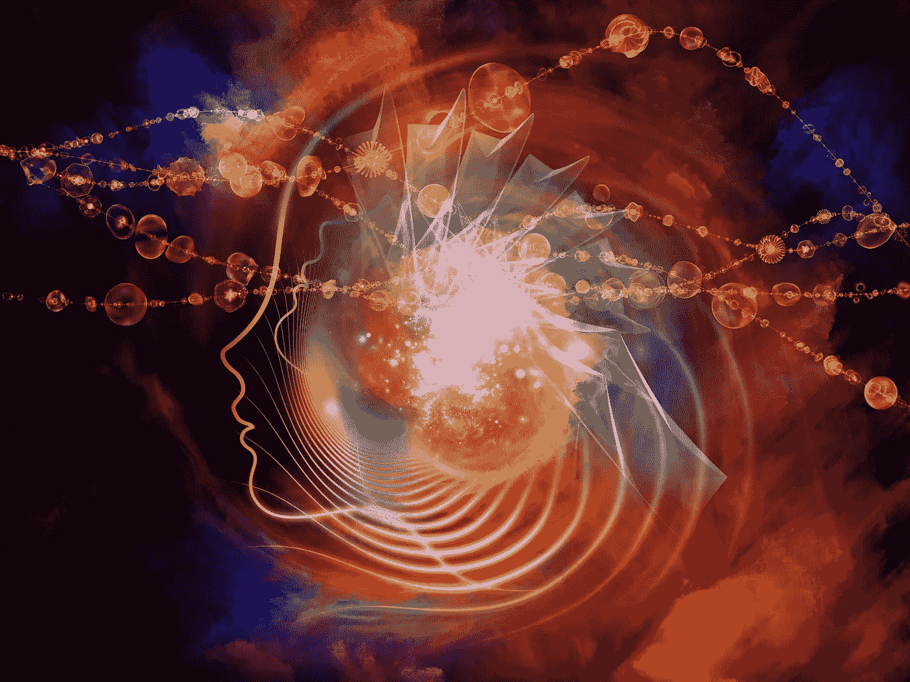
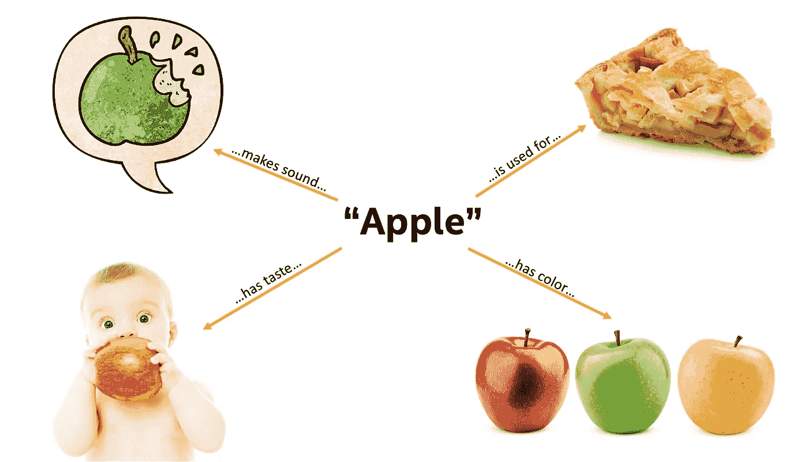
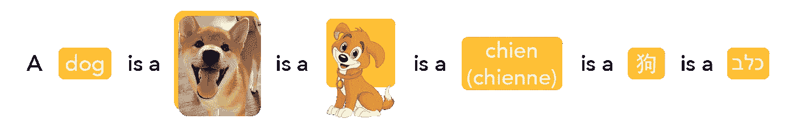
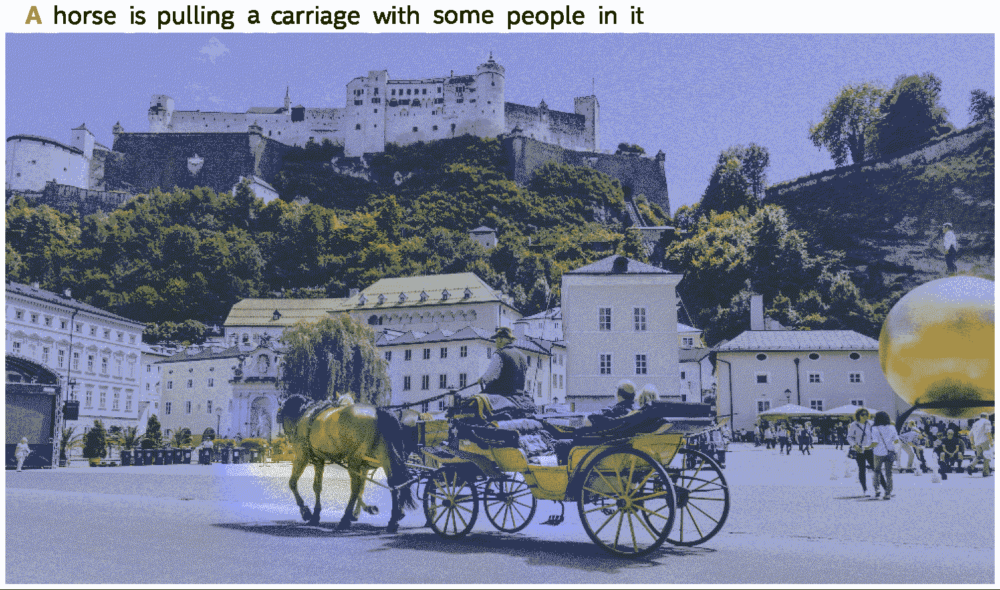
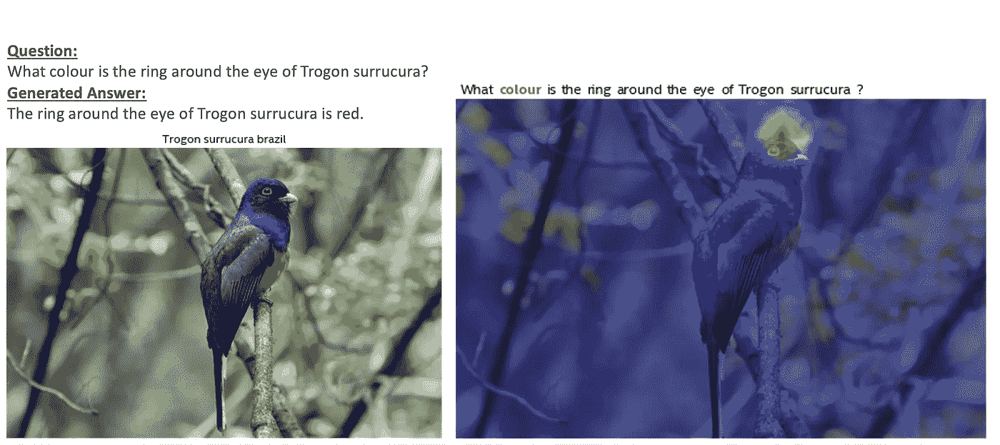

# 多模态:认知人工智能的新前沿

> 原文：<https://towardsdatascience.com/multimodality-a-new-frontier-in-cognitive-ai-8279d00e3baf>

## 通过创新的多模式系统实现更智能、适应性更强的人工智能

图片来源:[Agsandrew](https://stock.adobe.com/contributor/201652684/agsandrew?load_type=author&prev_url=detail)via[Adobe Stock](https://stock.adobe.com/)。

*与英特尔实验室的*[*Vasudev Lal*](https://www.linkedin.com/in/vasudev-lal-79bb336/)*和认知人工智能团队合作编写。*

**认知人工智能中一个令人兴奋的前沿领域涉及构建能够集成多种模态并综合语言、图像、视频、音频和关系图等结构化知识源的意义的系统。像对话式人工智能这样的自适应应用；使用语言的视频和图像搜索；自主机器人和无人机；人工智能多模态助手将要求系统能够使用所有可用的模态与世界进行交互，并在特定的上下文中做出适当的响应。在这篇博客中，我们将介绍多模态学习的概念及其一些主要用例，并讨论英特尔实验室在创建强大的多模态推理系统方面取得的进展。**

在过去的几年里，深度学习(DL)解决方案在许多自然语言处理(NLP)基准测试(例如， [SuperGLUE](https://super.gluebenchmark.com/leaderboard) 、 [GLUE](https://gluebenchmark.com/leaderboard) 、 [SQuAD](https://rajpurkar.github.io/SQuAD-explorer/) )和计算机视觉基准测试(例如， [ImageNet](https://openaccess.thecvf.com/content_iccv_2015/papers/He_Delving_Deep_into_ICCV_2015_paper.pdf) )中的表现都优于人类基准。单个模态的进展证明了神经网络学习的高效统计映射所实现的感知或类似识别的能力。

仅仅在十年前，这些单模态任务被认为是极其难以处理的，但目前却是数据中心、客户端和边缘产品中的主要人工智能工作负载。然而，在多模态环境中，许多可以使用自动化方法收集的见解仍然没有被利用。

**以人为中心的认知人工智能的多模态性**

人类的认知能力通常与多种形式的成功学习相关联。例如，一个苹果的概念应该包括从视觉获得的信息:它通常在颜色、形状、质地等方面看起来像什么。但是，人类和高级人工智能系统形成的苹果概念还应该受到苹果被咬下时发出的声音、人们谈论苹果派时的意思以及维基百科等文本语料库或维基数据等结构化知识库中关于苹果的全面知识的影响。

图一。与“苹果”概念相关的各种形态。图片来源:英特尔实验室 2022 英特尔公司。

多模态人工智能系统可以从多个来源和模态获取知识，并利用它来解决涉及任何模态的任务。通过图像和知识库学习的信息应该可用于回答自然语言问题；同样，从文本中学习到的信息应该在视觉任务需要时使用。这一切都通过贯穿所有形态的概念联系在一起，或者正如人们所说的:狗就是狗就是狗。

图二。狗是狗是狗。图片来源:英特尔实验室 2022 英特尔公司。

**常识知识本来就是多模态的**

人类拥有很多关于这个世界的常识，比如意识到鸟儿在天空飞翔，汽车在路上行驶。这种常识性的知识通常是通过视觉、语言和感官线索的结合而不是仅仅通过语言获得的。[艾伦人工智能研究所首席执行官柳文欢·埃齐奥尼将常识称为“人工智能的暗物质”。这是因为](https://www.technologyreview.com/2018/10/11/103957/the-us-military-wants-to-teach-ai-some-basic-common-sense/)[常识由隐性信息](https://www.quantamagazine.org/common-sense-comes-to-computers-20200430/)组成——人类自动用来理解世界的一组广泛(且广泛共享)的未写假设和经验法则。

有趣的是，多模态系统可以提供一种途径来解决人工智能系统中常识知识的缺乏。提高基于转换器的语言模型(如[伯特](https://arxiv.org/abs/1810.04805) / [GPT-3](https://arxiv.org/abs/2005.14165) )的常识知识的一种方法是将跨越其他模态的训练信号合并到模型架构中。实现这一功能的第一步是在不同的模态之间调整内部表示。

当人工智能接收到图像和相关文本并处理这两者时，它需要在模态之间关联相同的对象或概念。例如，考虑这样一个场景，AI 看到一张汽车图片，上面有提到汽车轮子的文字。当人工智能处理涉及车轮的文本部分时，它需要处理图像中车轮的部分。人工智能需要“知道”汽车轮子的图像和提到轮子的文本是指不同形态的同一物体。

**当前多模态人工智能任务和架构**

截至 2022 年初，多模态人工智能系统正在试验将文本/NLP 和视觉驱动到一个对齐的嵌入空间，以促进多模态决策。存在许多要求模型至少具有一定量的多模式能力的任务。以下是四种常见工作负载和相应 SotA 模型的简要概述

*   **图像描述生成，文本到图像生成**

也许，处理图像描述和文本到图像生成任务的最知名的模型是 OpenAI 的[剪辑](https://openai.com/blog/clip/)和 [DALL-E](https://openai.com/blog/dall-e/) ，以及它们的继任者 [GLIDE](https://arxiv.org/abs/2112.10741) 。

CLIP 预先训练单独的图像和文本编码器，并学习预测数据集中的哪些图像与各种描述配对。有趣的是，正如人类的[“Halle Berry”神经元](https://www.nature.com/articles/nature03687)一样，CLIP 已经被证明具有[多模态神经元](https://openai.com/blog/multimodal-neurons/)，当暴露于分类器标签文本以及相应的图像时，这些神经元会激活，这表明了一种融合的多模态表示。DALL-E 是 GPT-3 的 130 亿参数变体，它将文本作为输入，并生成一系列输出图像来匹配文本；然后使用 CLIP 对生成的图像进行排名。GLIDE 是 DALL-E 的发展，它仍然使用 CLIP 对生成的图像进行排序；然而，图像生成是使用[扩散模型](https://arxiv.org/abs/1503.03585)完成的。

*   **视觉问答**

视觉问答，正如在像 [VQA](https://visualqa.org/) 这样的数据集中所呈现的，是一项需要模型根据图像正确回答基于文本的问题的任务。微软研究院的团队已经为这项任务开发了一些领先的方法。 [METER](https://arxiv.org/pdf/2111.02387.pdf) 是一个通用框架，用于训练高性能的端到端视觉语言转换器，使用各种可能的子架构用于视觉编码器、文本编码器、多模式融合和解码器模块。统一视觉语言预训练模型( [VLMo](https://arxiv.org/abs/2111.02358) )使用模块化变压器网络来联合学习双编码器和融合编码器。网络中的每个模块都包含一个特定模式的专家池和一个共享的自我关注层，为微调提供了极大的灵活性。

*   **文本到图像和图像到文本搜索**

网络搜索是多模态学习的另一个重要应用。呈现这个任务的数据集的一个例子是 [WebQA](https://webqna.github.io/) ，它是一个模拟 web 搜索的多模态和多跳基准测试。WebQA 是由微软和卡内基梅隆大学的团队构建的。

在此任务中，模型需要识别可以帮助回答查询的来源(基于图像或文本)。对于大多数问题，模型需要考虑多个来源才能得到正确答案。然后，系统需要使用这些多个来源进行推理，以自然语言生成查询的答案。

谷歌已经用大规模图像和噪声文本嵌入模型解决了多模态搜索任务。这个模型[利用](https://ai.googleblog.com/2021/05/align-scaling-up-visual-and-vision.html)与互联网上的图像相关联的容易获得但有噪声的 alt-text 数据来训练单独的视觉( [EfficientNet-L2](https://ai.googleblog.com/2019/05/efficientnet-improving-accuracy-and.html) )和文本( [BERT-Large](https://ai.googleblog.com/2018/11/open-sourcing-bert-state-of-art-pre.html) )编码器，然后使用对比学习来组合它们的输出。生成的模型存储了多模态表示，无需任何进一步的微调即可支持跨模态搜索。

*   **视频语言建模**

从历史上看，基于视频的任务对人工智能系统来说一直具有挑战性，因为它们是资源密集型的；但这种情况正在开始改变。视频语言建模和其他视频相关的多模态任务领域的主要工作之一是由微软的佛罗伦萨-VL 项目驱动的。2021 年年中，佛罗伦萨-VL 项目推出了 [ClipBERT](https://www.microsoft.com/en-us/research/publication/less-is-more-clipbert-for-video-and-language-learning-via-sparse-sampling/) ，它涉及 CNN 和 transformer 模型的组合，在稀疏采样的帧上运行，并以端到端的方式进行优化，以解决流行的视频语言任务。 [VIOLET](https://www.microsoft.com/en-us/research/publication/violet-end-to-end-video-language-transformers-with-masked-visual-token-modeling/) 和 [SwinBERT](https://www.microsoft.com/en-us/research/publication/swinbert-end-to-end-transformers-with-sparse-attention-for-video-captioning/) 是 ClipBERT 的演变，它们引入了掩蔽视觉令牌建模和稀疏注意力，以改善视频问答、视频检索和视频字幕中的 SotA。

区别在于细节，但是上面所有的模型都有一个共同的特点，那就是使用基于 transformer 的架构。这种类型的架构通常与并行学习模块相结合，以从各种模态中提取数据，然后将它们统一到单个多模态表示中。

**英特尔实验室和微软创建视觉和语言预培训模型**

与上述方法类似，英特尔实验室认知人工智能(CAI)研究团队的工作重点是使用基于 transformer 的模型架构创建多模态表示。然而，与 CLIP(擅长图像和文本的实例级配对)等一些模型不同，认知 AI 团队的方法是实现图像和文本中实体的细粒度对齐。所开发的架构还允许将完整的图像上下文提供给同样处理文本的多模态转换器。

认知人工智能团队与微软研究[自然语言计算(NLC)](https://www.microsoft.com/en-us/research/group/natural-language-computing/) 团队合作，最近[推出了 KD-VLP](https://arxiv.org/pdf/2109.10504.pdf) ，这是一个在概念层面视觉语言对齐方面特别有效的模型。架构和预训练任务强调系统中的实体级表示，或对象。KD-VLP 在诸如视觉问题回答( [VQA2.0](https://visualqa.org/challenge.html) )、视觉常识推理( [VCR](https://visualcommonsense.com/) )、在 [MSCOCO](https://link.springer.com/chapter/10.1007/978-3-319-10602-1_48) 和 [Flickr30K](https://direct.mit.edu/tacl/article-abstract/doi/10.1162/tacl_a_00166/43313) 上的图像和文本检索(IR/TR)、用于视觉推理的自然语言( [NLVR2](https://lil.nlp.cornell.edu/nlvr/) )和视觉蕴涵( [SNLI-VE](https://github.com/necla-ml/SNLI-VE) )等任务上展示了竞争性能。

该模型的自我监督训练导致了也是可解释的紧急注意模式。例如，下面的剪辑显示了当模型思考伴随文本中的每个单词时，其视觉注意力是如何变化的。这些模式为模型的内部工作和推理机制提供了有价值的见解。当探索模型推理能力中需要解决的差距时，这种洞察力是有价值的。

图 3:追踪多模态注意力的热图。图片来源:英特尔实验室 2022 英特尔公司。

与微软研究团队的这一研究合作产生了解决多模态挑战的解决方案，例如多模态数据集上的问题回答。一个基于知识的多模态系统目前在 [VisualCOMET 任务](https://visualcomet.xyz/)上领先[公共排行榜](https://leaderboard.allenai.org/visualcomet/submissions/public)，其中 AI 系统需要推理静态图像的动态内容。该模型可以从单个图像中唤起一个动态的故事情节，就像人类如何能够想象出以前发生了什么以及接下来会发生什么。

这种单一模型解决方案在[视觉常识推理(VCR)挑战赛](https://visualcommonsense.com/leaderboard/)的公共排行榜上也颇具竞争力。它目前在单一模型解决方案中排名前五，我们的 [WebQA](https://blogs.bing.com/search-quality-insights/october-2021/Introducing-WebQA-A-Multi-hop,-Multi-modal-Open-Domain-Reasoning-Challenge-Benchmark) 解决方案在[neur IPS 2021 竞赛](https://webqna.github.io/)的获奖名单中名列前茅。WebQA 解决方案涉及一种新颖的方法，将多模态源合并到语言生成模型中。该系统可以通过多模式编码器将图像和文本源与问题联系起来，并有效地聚集多个源的信息。解码器使用跨多个多模态源的这种融合的结果来以自然语言回答查询。

图 4:带有注意力热图的网络问答问题示例。Trogon Surrucura 图片鸣谢:[维基媒体](https://en.wikipedia.org/wiki/Surucua_trogon#/media/File:Trogon_surrucura_brazil.jpg)和 [Cláudio Dias Timm](https://www.flickr.com/photos/32674493@N04) 。

**结论**

现实生活环境本质上是多模态的。这个应用领域允许人工智能研究社区进一步推动人工智能从单一感知模态(如图像或文本)的统计分析过渡到对象及其交互的多面视图，帮助在从“形式”到“意义”的旅程中取得进展。

## 参考

1.  Wang，a .，Pruksachatkun，y .，Nangia，n .，Singh，a .，Michael，j .，Hill，f .，… & Bowman，S. R. (2019)。Superglue:通用语言理解系统的一个更具粘性的基准。arXiv 预印本 arXiv:1905.00537。
2.  王，a .，辛格，a .，迈克尔，j .，希尔，f .，利维，o .，&鲍曼，S. R. (2018)。GLUE:自然语言理解的多任务基准和分析平台。arXiv 预印本 arXiv:1804.07461。
3.  Rajpurkar，p .，贾，r .，，梁，P. (2018)。知道你不知道的:无法回答的问题。arXiv 预印本 arXiv:1806.03822。
4.  Rajpurkar，p .，贾，r .，，梁，P. (2021)。斯坦福问答数据集。[https://rajpurkar.github.io/SQuAD-explorer/](https://rajpurkar.github.io/SQuAD-explorer/)
5.  何刚，张，徐，任，孙(2015)。深入研究整流器:在 imagenet 分类上超越人类水平的性能。IEEE 计算机视觉国际会议论文集(第 1026–1034 页)。
6.  维基数据。(2019).检索于 2022 年 1 月 31 日，来自[https://www.wikidata.org/wiki/Wikidata:Main_Page](https://www.wikidata.org/wiki/Wikidata:Main_Page)
7.  骑士，W. (2020，4 月 2 日)。美军想教 AI 一些基本常识。麻省理工科技评论。[https://www . technology review . com/2018/10/11/103957/the-us-military-wants-to-teach-ai-some-basic-common-sense/](https://www.technologyreview.com/2018/10/11/103957/the-us-military-wants-to-teach-ai-some-basic-common-sense/)
8.  帕夫卢斯，J. (2020 年 5 月 4 日)。常识到电脑。广达杂志。[https://www . quanta magazine . org/common-sense-comes-to-computers-2020 04 30/](https://www.quantamagazine.org/common-sense-comes-to-computers-20200430/)
9.  Devlin，j .，Chang，M. W .，Lee，k .，& Toutanova，K. (2018 年)。Bert:用于语言理解的深度双向转换器的预训练。arXiv 预印本 arXiv:1810.04805。
10.  布朗、T. B .、曼恩、b .、赖德、n .、苏比亚、m .、卡普兰、j .、达里瓦尔、p .……和阿莫代伊，D. (2020)。语言模型是一次性学习者。预印本 arXiv:2005.14165。
11.  拉德福德、a .、金、J. W .、哈拉奇、c .、拉梅什、a .、高、g .、阿加瓦尔、s .……和苏茨基弗(2021)。从自然语言监督中学习可转移的视觉模型。arXiv 预印本 arXiv:2103.00020。
12.  拉梅什，a .、巴甫洛夫，m .、戈，g .、格雷，s .、沃斯，c .、拉德福德，…和苏茨基弗，I. (2021 年)。零镜头文本到图像生成。arXiv 预印本 arXiv:2102.12092。
13.  Nichol，a .、Dhariwal，p .、Ramesh，a .、Shyam，p .、Mishkin，p .、McGrew，b .、…、陈，M. (2021)。Glide:使用文本引导扩散模型实现照片级真实感图像生成和编辑。arXiv 预印本 arXiv:2112.10741。
14.  Quiroga，R. Q .、Reddy，l .、Kreiman，g .、Koch，c .、和 Fried，I. (2005)。人脑中单个神经元的不变视觉表征。自然，435(7045)，1102–1107。
15.  Goh，g .，Cammarata，n .，Voss，c .，Carter，s .，Petrov，m .，Schubert，l .，… & Olah，C. (2021)。人工神经网络中的多模态神经元。蒸馏，6(3)，e30。
16.  使用非平衡热力学的深度无监督学习。arXiv:1503.03585，2015。
17.  纽约州戈亚尔、茨韦塔纳州 Khot、萨默斯-斯蒂尔、巴特拉和帕里克(2017 年)。让 vqa 中的 v 变得重要:提升视觉问答中图像理解的作用。IEEE 计算机视觉和模式识别会议论文集(第 6904–6913 页)。
18.  窦志英，徐玉英，甘，张，王，王，王，李，…曾，米(2021)。训练端到端视觉语言转换器的实证研究。arXiv 预印本 arXiv:2111.02387。
19.  王文伟，鲍海红，董丽兰，魏凤芳(2021)。VLMo:混合模态专家的统一视觉语言预训练。arXiv 预印本 arXiv:2111.02358。
20.  常，那朗，米，，h，曹，高，j，，y(2021)。网络问答:多跳和多模态问答。arXiv 预印本 arXiv:2109.00590。
21.  贾，杨，杨，夏，陈，李玉亭，帕瑞克，郑，范，李，…和杜里格(2021)。在嘈杂文本监督下扩大视觉和视觉语言表征学习。arXiv 预印本 arXiv:2102.05918。
22.  贾，杨，杨(2021 年 5 月 11 日)。ALIGN:在嘈杂文本监督下扩大视觉和视觉语言表征学习。谷歌人工智能博客。[https://ai . Google blog . com/2021/05/align-scaling-up-visual-and-vision . html](https://ai.googleblog.com/2021/05/align-scaling-up-visual-and-vision.html)
23.  谭，男，乐，qv(2019 . 5 . 29)。EfficientNet:通过 AutoML 和模型缩放提高准确性和效率。谷歌人工智能博客。[https://ai . Google blog . com/2019/05/efficient net-improving-accuracy-and . html](https://ai.googleblog.com/2019/05/efficientnet-improving-accuracy-and.html)
24.  Devlin 和 m . Chang(2018 年 11 月 2 日)。开放源码 BERT:自然语言处理的最先进的预备培训。谷歌人工智能博客。[https://ai . Google blog . com/2018/11/open-sourcing-Bert-state-of-art-pre . html](https://ai.googleblog.com/2018/11/open-sourcing-bert-state-of-art-pre.html)
25.  微软。(2021 年 12 月 14 日)。佛罗伦萨-VL 项目。微软研究院。[https://www . Microsoft . com/en-us/research/project/project-Florence-VL/](https://www.microsoft.com/en-us/research/project/project-florence-vl/)
26.  雷，李，李，周，李，甘，钟，彭大林，班萨尔，米，刘(2021)。通过稀疏采样进行视频和语言学习。IEEE/CVF 计算机视觉和模式识别会议论文集(第 7331-7341 页)。
27.  傅廷杰，李，李，甘，郑，林，王，王维元，王，刘，郑(2021)。VIOLET:端到端视频语言转换器，带屏蔽视觉令牌建模。arXiv 预印本 arXiv:2111.12681。
28.  林，李，李，林春春，艾哈迈德，甘，刘，…，王，(2021)。SwinBERT:对视频字幕关注较少的端到端变压器。arXiv 预印本 arXiv:2111.13196。
29.  刘，杨，吴，曾善友，李，何，段，倪(2021)。Kd-vlp:通过对象知识提炼改进端到端的视觉和语言预训练。arXiv 预印本 arXiv:2109.10504。
30.  Antol，s .、Agrawal，a .、Lu，j .、Mitchell，m .、Batra，d .、Zitnick，C. L .、& Parikh，D. (2015)。Vqa:视觉问答。IEEE 计算机视觉国际会议论文集(第 2425-2433 页)。
31.  泽勒斯，共和党，比斯克，纽约州，法尔哈迪，和崔，纽约州(2019)。从识别到认知:视觉常识推理。IEEE/CVF 计算机视觉和模式识别会议论文集(第 6720-6731 页)。
32.  林，T. Y .，梅尔，m .，贝隆吉，s .，海斯，j .，，p .，拉马南，d .，… &兹尼克，C. L. (2014 年 9 月)。微软 coco:上下文中的公共对象。在欧洲计算机视觉会议上(第 740–755 页)。斯普林格，查姆。
33.  Young，p .，Lai，a .，Hodosh，m .，& Hockenmaier，J. (2014 年)。从图像描述到视觉指示:事件描述语义推理的新相似性度量。计算语言学协会汇刊，2，67–78。
34.  苏尔亚，周，s，张，a，张，I，白，h .，&阿奇，Y. (2018)。基于照片的自然语言推理语料库。arXiv 预印本 arXiv:1811.00491。
35.  谢，倪，赖，多兰，丁，& Kadav，A. (2018)。视觉基础语言学习的视觉蕴涵任务。arXiv 预印本 arXiv:1811.10582。
36.  微软。(2022 年 1 月 19 日)。自然语言计算。微软研究院。[https://www . Microsoft . com/en-us/research/group/natural-language-computing/](https://www.microsoft.com/en-us/research/group/natural-language-computing/)
37.  Park，J. S .，Bhagavatula，c .，Mottaghi，r .，法尔哈迪，a .，和 Choi，Y. (2020 年 8 月)。VisualCOMET:对静态图像的动态背景进行推理。在欧洲计算机视觉会议上(第 508–524 页)。斯普林格，查姆。