# 多元线性回归:理论与应用

> 原文：<https://towardsdatascience.com/multiple-linear-regression-theory-and-applications-677ec2cd04ac>

## 详细解释了线性最小二乘法，并用 Python 从头开始实现


费迪南·斯托尔在 [Unsplash](https://unsplash.com?utm_source=medium&utm_medium=referral) 拍摄的照片

多元线性回归由于其简单性和结果的可解释性而成为最基本的统计模型之一。出于预测目的，线性模型有时会优于更好的非线性模型，尤其是在训练案例数量少、信噪比低或数据稀疏的情况下(Hastie 等人，2009 年)。顾名思义，在这些模型中，预测变量(或响应变量)是由预测变量的线性组合来描述的。*倍数*一词指的是预测变量。

在整篇文章中，将详细描述普通最小二乘(OLS)回归模型的基本原理，并将从头开始用 Python 实现一个回归器。所有用到的代码都在这个 [*示例笔记本*](https://github.com/bruscalia/optimization-demo-files/blob/main/regression/notebooks/linear_regression.ipynb) 里。

线性回归已经在许多 Python 框架中可用。因此，在实践中，不需要从零开始实现它来估计回归系数和进行预测。然而，我们在这里的目标是深入了解这些模型是如何工作的，以及它们的假设在处理未来项目时会更加有效。从通常的框架来看，我建议检查来自 *statsmodels* 的 *OLS* 和来自 *sklearn* 的*线性回归*。

让我们开始吧。

# 线性最小二乘法

在进入方程之前，我想定义一些符号指南。

*   矩阵:大写斜体粗体。
*   向量:小写斜体粗体。
*   标量:常规斜体。

多元线性回归模型或 OLS 可以用下面的等式来描述。

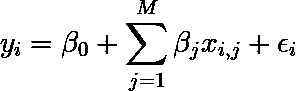

线性回归模型元素表示法。(图片由作者提供)。

其中 *yᵢ* 为观察值 *i* 的因变量(或响应)；*β*₀为回归截距， *βⱼ* 为与决策变量 *j* 相关的系数， *xᵢⱼ* 为观察值 *i* 的决策变量 *j* ， *ε* 为剩余项。在矩阵符号中，它可以描述为:

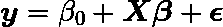

线性回归模型矩阵符号。(图片由作者提供)。

其中 ***β*** 为参数的列向量。

线性模型对结构进行了大量假设，并产生稳定但可能不准确的预测(Hastie 等人，2009)。当采用线性模型时，应该了解这些假设，以便对结果做出正确的推断，并执行必要的更改。

残差项 *ε* 假设正态独立分布，均值为零，方差为常数 *σ* 。一些模型属性，比如参数和预测的置信区间，强烈依赖于这些关于 *ε* 的假设。因此，核实这些数据对于获得有意义的结果至关重要。

线性最小二乘回归模型的目标是找到使残差平方和(或误差平方和)最小的 *β* 的值，由下面的等式给出。

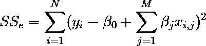

误差平方和(残差):最小二乘回归的损失函数。(图片由作者提供)。

这是一个有解析解的优化问题。该公式基于每个预测相对于参数向量 *β* 的梯度，参数向量对应于自变量向量本身 ***x*** *ᵢ* 。考虑一个矩阵 ***C*** ，由下面的等式给出。

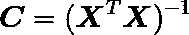

c 矩阵。(图片由作者提供)。

***β*** 的最小二乘估计由下式给出:

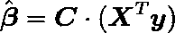

参数的最小二乘估计。(图片由作者提供)。

在接下来的步骤中，让我们创建一个 Python 类， *LinearRegression，*来执行这些估计。但是在此之前，让我们导入一些有用的库和函数，以便在本文中使用。

```
import numpy as np
import pandas as pd
import matplotlib.pyplot as plt
from scipy.stats import shapiro
from scipy.stats import t as t_fun
```

如果我们想考虑截距β₀.，第一步是创建一个估计类和一个方法，在估计矩阵中包含一列 1

```
class LinearRegression:

    def __init__(self, fit_intercept=True):
        self.fit_intercept = fit_intercept

    def _prepare_X(self, X):
        X = np.array(X)
        if len(X.shape) == 1:
            X = np.atleast_2d(X).reshape((-1, 1))
        if self.fit_intercept:
            ones = np.ones((X.shape[0], 1))
            X = np.column_stack((ones, X))
        else:
            pass
        return X
```

现在，让我们实现一个 *fit* 方法( *sklearn* -like)来估计 *β。*

```
def fit(self, X, y=None):
    X = self._prepare_X(X)
    n, p = X.shape
    self.n = n
    self.p = p
    C = np.linalg.inv(X.T.dot(X))
    self.C = C
    betas = C.dot(X.T.dot(y))
    self.betas = betas
```

预测的方法。

```
def predict(self, X, y=None):
    X = self._prepare_X(X)
    y_pred = X.dot(self.betas)
    return y_pred
```

以及用于计算 *R* 度量的方法。

```
def r2_score(self, X, y):

    y_pred = self.predict(X)
    epsilon = y_pred - y
    sse = np.sum(epsilon * epsilon)

    y_mean = np.mean(y)
    mean_res = y_mean - y
    sst = np.sum(mean_res * mean_res)

    return 1 - sse / sst
```

# 参数的统计显著性

测试参数 *β* 的统计显著性以验证预测值的相关性是有用的。当这样做时，我们能够去除不良预测，避免混淆效应，并提高新预测的模型性能。为此，应该测试与给定预测器相关联的参数 *β* 为零的零假设。让我们利用矩阵*和残差的方差 *σ̂* 来计算参数 *β* 的方差-协方差矩阵 ***V*** 及其相应的标准差。*

*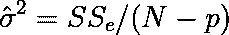*

*残差方差。(图片由作者提供)。*

*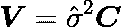*

*参数的方差协方差矩阵。(图片由作者提供)。*

*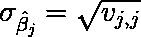*

*参数的标准误差。(图片由作者提供)。*

*在 Python 中，我们只需向 fit 方法添加以下代码行:*

```
*epsilon = y - X.dot(betas)
sse = np.sum(epsilon * epsilon)

sigma_squared = sse / (n - p)
self.sigma_squared = sigma_squared

V = C * sigma_squared
self.V = V

sigma_betas = np.sqrt(np.diag(V))
self.sigma_betas = sigma_betas*
```

*然后，我们可能会得到与零假设相关联的*t*-值及其对应的*p*-值。在 Python 中，可以通过使用来自 *scipy.stats* (之前在这里作为 *t_fun* 导入)的 *t* 生成器实例来完成。*

```
*pvalues = t_fun.sf(abs(betas) / sigma_betas, (n - p)) * 2.0
self.pvalues = pvalues*
```

*现在，我们已经准备好工具来估计回归系数及其统计意义，并根据新的观察结果进行预测。让我们在下一节应用这个框架。*

# *引线键合示例*

*这是一个示例，其中的目标是基于导线长度和芯片高度来预测半导体制造过程中导线接合的拉伸强度。它是从 Montgomery & Runger (2003 年)检索的。这是一个小数据集，在这种情况下，线性模型尤其有用。我将它的一个副本保存在与示例笔记本相同的存储库中的一个. txt 文件中。*

*让我们首先导入数据集。*

```
*dataset = pd.read_csv("../data/montgomery/wire_bond.txt", sep=" ", index_col=0)*
```

*然后定义自变量 ***X*** 的矩阵和预测变量 ***y*** 的观测值的向量。*

```
*X = dataset.iloc[:, :-1].values
y = dataset.iloc[:, -1].values*
```

*我画了一些散点图，看看预测因子和因变量之间的关系。*

*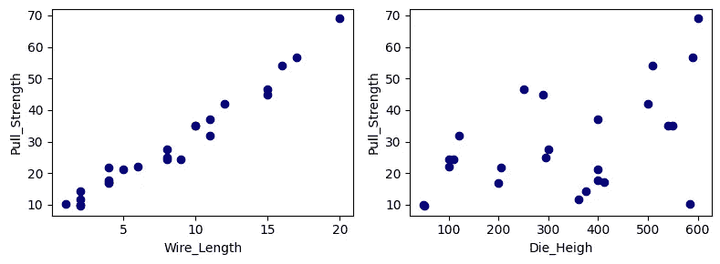*

*引线键合问题中的目标与预测。(图片由作者提供)。*

*请注意，预测变量和回归器线长度之间存在很强的线性关系。相反，芯片高度和焊线之间的线性关系在成对可视化中并不明显，尽管这可能归因于其他预测因素的影响。*

*接下来，让我们创建一个 *LinearRegression* 类的实例，使其适合数据，并基于 *R* 度量验证其性能。*

```
*linreg = LinearRegression()
linreg.fit(X, y)
print(linreg.r2_score(X, y))*
```

*它返回值 0.9811。*

*好像很有希望！现在，为了验证参数的统计意义，让我们运行以下代码:*

```
*for i, val in enumerate(linreg.betas):
    pval = linreg.pvalues[i]
    print(f"Beta {i}: {val:.2f}; p-value: {pval:.2f}")*
```

*它返回:*

```
*Beta 0: 2.26; p-value: 0.04
Beta 1: 2.74; p-value: 0.00
Beta 2: 0.01; p-value: 0.00*
```

*因此，我们有一个具有很好的性能和统计意义的模型，只要数据分布没有显著变化，它就可能在新的观察结果上表现良好。注意，根据它的*p*-值，我们可能会考虑放弃截距。最后，让我们验证模型假设。*

*   *残差服从正态独立分布。*
*   *残差的平均值为零。*
*   *残差具有恒定的方差。*

*让我们首先验证残差的平均值。*

```
*y_hat = linreg.predict(X)
epsilon = y - y_hat
print(f"Mean epsilon: {np.mean(epsilon):.3f}")
print(f"Sigma epsilon: {np.std(epsilon):.3f}")*
```

*这似乎没问题:*

```
*Mean epsilon: -0.000
Sigma epsilon: 2.146*
```

*现在，让我们使用夏皮罗-维尔克正态性检验。*

```
*shapiro_stat, shapiro_pvalue = shapiro(epsilon)
print(f"Shapiro test p-value: {shapiro_pvalue:.2f}")*
```

*它返回:*

```
*Shapiro test p-value: 0.38*
```

*因此，我们不能拒绝零假设，即我们的残差来自正态分布。*

*最后，让我们绘制残差与预测变量和回归量的关系图，以验证它们是否独立分布。*

*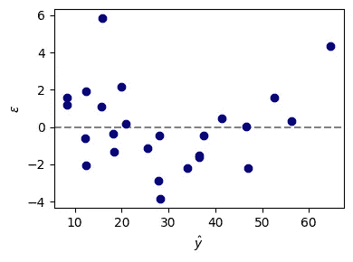*

*残差与预测变量。(图片由作者提供)。*

*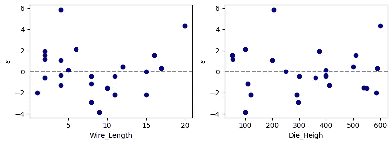*

*残差与自变量。(图片由作者提供)。*

*残差大多分布良好，尤其是在导线长度小于 7 和目标长度小于 25 的区域。然而，在目标和导线长度之间可能存在一些非线性，因为中间值的残差偏向负值，而高值(目标> 50)偏向正值。那些有兴趣更详细地探索该问题的人可以尝试创建多项式要素，看看这种偏差是否会减少。此外，方差似乎不是有条件分布的。因此，我们不可能通过加权残差来提高模型性能。*

*在下一节中，让我们创建一个与第一个自变量相关的假预测值，并验证统计显著性检验是否能识别它。*

# *添加错误的预测值*

*假预测值将等于线长度加上随机噪声项，该随机噪声项遵循平均值 0 和σ1 的正态分布。*

```
*# Predefined random seed to reproductibility of results
np.random.seed(42)

# Create feature
x_false = X[:, 0] + np.random.randn(X.shape[0])
X_false = np.column_stack((X, x_false.reshape((-1, 1))))*
```

*请注意，它也与响应变量线性相关。事实上，甚至比芯片高度更相关。*

*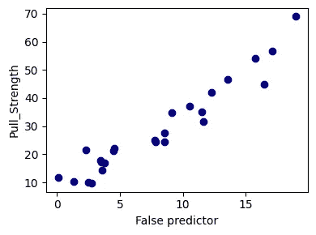*

*目标预测值与错误预测值。(图片由作者提供)。*

*让我们重复上一节的过程来看看结果。*

```
*linreg_alt = LinearRegression()
linreg_alt.fit(X_false, y)
print(linreg_alt.r2_score(X_false, y))*
```

*看起来得分指标仍然很高(0.9828)，但我们的结果不一定像以前一样有意义。让我们来验证置信区间。*

```
*for i, val in enumerate(linreg_alt.betas):
    pval = linreg_alt.pvalues[i]
    print(f"Beta {i}: {val:.2f}; p-value: {pval:.2f}")*
```

*它返回:*

```
*Beta 0: 2.13; p-value: 0.05
Beta 1: 3.43; p-value: 0.00
Beta 2: 0.01; p-value: 0.00
Beta 3: -0.69; p-value: 0.16*
```

*看来我们找到了冒名顶替者…*

*因此，我们的框架有效地验证了错误的预测器没有向模型提供额外的信息，假设我们仍然具有线长度的原始值，即使错误的预测器与预测变量具有强线性相关性。相反，相关性较弱的芯片高度对模型的贡献具有统计学意义。*

*在这种情况下，强烈建议从模型中删除不必要的特征，以提高其可解释性和通用性。在[示例笔记本](https://github.com/bruscalia/optimization-demo-files/blob/main/regression/notebooks/linear_regression.ipynb)中，我还提出了一个基于 *p* 值的递归特征消除策略。*

# *进一步阅读*

*作为一个有工程背景的人，在这方面我应该推荐的第一本参考书是 Montgomery Runger(2003)写的《T4 工程师应用统计和概率》。在那里，你可能会发现这里提出的基本原理的更详细的描述和其他相关的回归方面，如多重共线性，平均响应的置信区间，和特征选择。*

*那些对机器学习更感兴趣的人可以参考 Hastie 等人(2009)的*统计学习的要素*。特别是，我发现看到作者如何解释最近邻与线性模型之间的偏差-方差权衡非常有趣。*

*当一个人的目标是估计具有描述非线性现象的一些基本意义的参数时，非线性回归也是令人着迷的。贝茨&瓦特(1988)的《T2【非线性回归分析及其应用】T3》一书是一个很好的参考。Myers 等人(2010 年)的《T4 广义线性模型》一书的第 3 章也介绍了这个主题。*

*科斯马·沙立兹教授的课堂讲稿可以在[这个链接](https://www.stat.cmu.edu/~cshalizi/ADAfaEPoV/)上找到。目前，该草案的标题为*从初级角度进行高级数据分析*。在那里，人们可以找到有趣的主题，如加权和方差，因果推断，和相关数据。*

*我很欣赏 Python 包 [*statsmodels*](https://www.statsmodels.org/dev/index.html) 。在应用了 [OLS](https://www.statsmodels.org/dev/generated/statsmodels.regression.linear_model.OLS.html) (正如我们在本文中所做的)之后，人们可能会有兴趣尝试 [WLS](https://www.statsmodels.org/dev/generated/statsmodels.regression.linear_model.WLS.html#statsmodels.regression.linear_model.WLS) 来解决残差方差不均匀的问题，并使用 [VIF](https://www.statsmodels.org/dev/generated/statsmodels.stats.outliers_influence.variance_inflation_factor.html) 来检测要素多重共线性。*

# *结论*

*在本文中，介绍了多元线性回归的主要原理，然后用 Python 从头开始实现。该框架应用于一个简单的例子，其中除了线性最小二乘问题中关于残差的主要假设之外，还验证了参数的统计显著性。完整的代码和额外的例子可以在[这个链接](https://github.com/bruscalia/optimization-demo-files/blob/main/regression/notebooks/linear_regression.ipynb)中找到。*

# *参考*

*贝茨博士和瓦茨博士，1988 年。*非线性回归分析及其应用。威利。**

*茨韦塔纳·哈斯蒂和 J. H .弗里德曼，2009 年。统计学习的要素:数据挖掘、推理和预测。第二版。纽约:斯普林格。*

*蒙哥马利特区和龙格，2003 年。工程师应用统计和概率。第三版。约翰·威利父子公司。*

*迈尔斯，R. H .，蒙哥马利特区，维宁，G. G .和罗宾逊，T. J .，2012 年。*广义线性模型:在工程和科学中的应用。第二版。霍博肯:约翰·威利&之子。**

*c .沙里齐，2021。*从初级观点看高级数据分析。*剑桥大学出版社。*