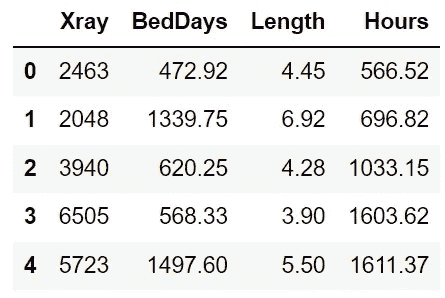
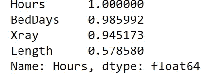
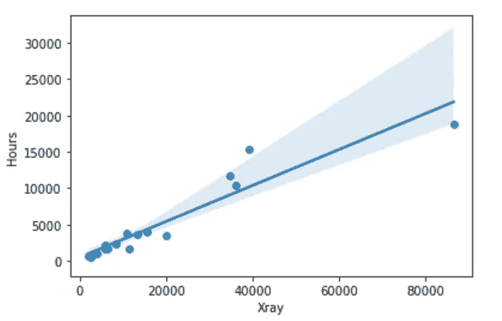
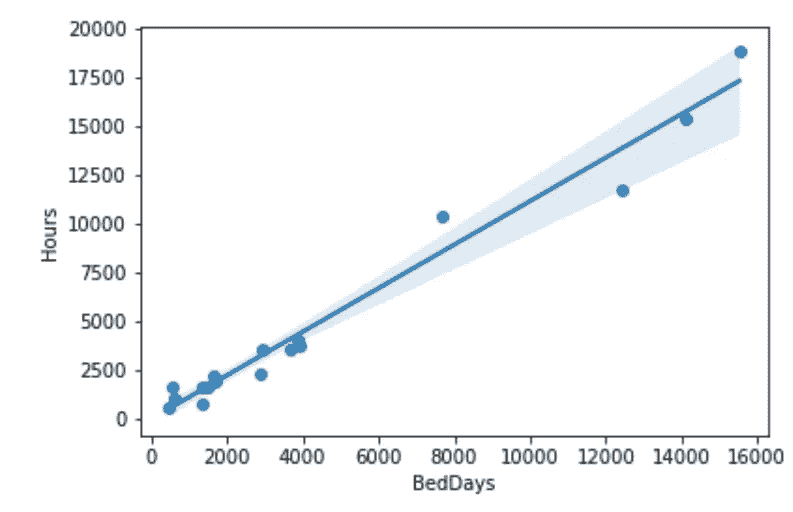
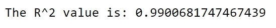
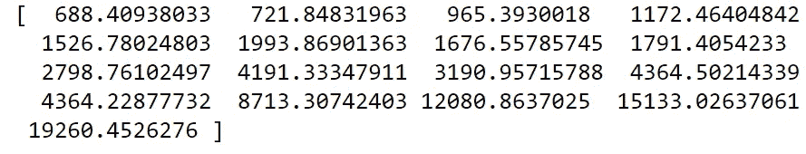
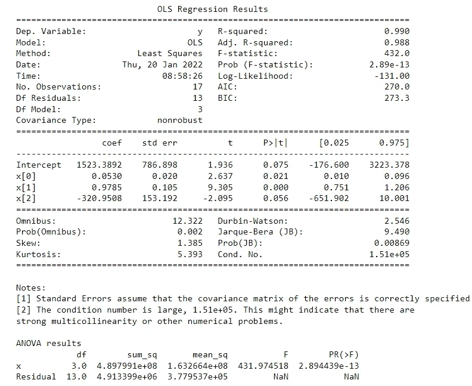
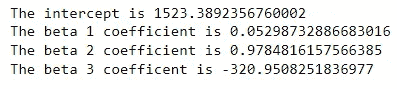
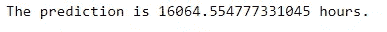

# 支持医院运营的多元线性回归

> 原文：<https://towardsdatascience.com/multiple-linear-regression-to-support-hospital-operations-34f5516384c3>

## 探索一种用于进行预测和了解数据集不同要素之间的相互作用的强大工具。

> 处理人员配备问题的行业，如医院管理行业，可以从使用多元线性回归中受益，以更好地安排他们的工人，并更好地了解他们当前运营中的哪些因素可能会增加员工的工作时间。


[国家癌症研究所](https://unsplash.com/@nci?utm_source=medium&utm_medium=referral)在 [Unsplash](https://unsplash.com?utm_source=medium&utm_medium=referral) 上拍摄的照片

# **简介**

线性回归是进行预测和检查数据集不同要素之间的相互作用的一种很好的技术。不仅能够用 Python 实现代码很重要，而且突出模型输出的意义和重要性对于验证模型是否准确解释数据集也至关重要。

# 履行

**数据集**

我们今天要使用的数据集是一个 [SAS 医院人员数据集](https://www.google.com/books/edition/SAS_for_Data_Analysis/LX2v9CNhzJMC?hl=en&gbpv=1&dq=Xray+(X1),+BedDays+(X2)+and+Length+(X3)&pg=PA271&printsec=frontcover)。数据集的独立特征是 **X 射线**(每月 X 射线数量)**、床位天数**(每月占用床位天数)**、**和**长度(**患者每月平均住院时间 **)** 。因变量为医院每月**手术小时数**。数据集可在此处找到[。](https://github.com/benmccloskey/Linear_Regression/blob/main/Hospital_dataset.xlsx)

**分析**

我们希望对数据集执行多元线性回归，以了解 X 射线、住院天数和住院时间如何影响医院的运营时间。这对于医院管理层确定医生、护士等的数量是很重要的。每个月都需要人手。此分析的代码可在处[找到。](https://github.com/benmccloskey/Linear_Regression)

首先，让我们导入我们希望使用的库。今天我将介绍两个不同的能够实现线性回归的库。**[**sci-kit learn**](https://scikit-learn.org/stable/modules/linear_model.html)拥有大量用户熟悉的机器学习库，可以轻松实现线性回归执行。我喜欢使用[**stats models**](https://www.statsmodels.org/stable/index.html)**，因为它输出的 ANOVA(方差分析)表提供了我们创建的模型的大量统计信息。****

```
****#Import Libraries**
import pandas as pd 
import numpy as np 
import matplotlib.pyplot as plt
from sklearn.linear_model import LinearRegression
import seaborn as sns 
from statsmodels.formula.api import ols
from statsmodels.stats.anova import anova_lm**
```

****下一步是加载数据框并查看前 5 行。****

```
**df = pd.read_excel('Hospital_dataset.xlsx')
df.head()**
```

********

****数据框中的前 5 行(图片来自作者)****

****既然数据已经载入，我个人喜欢得到自变量(X 列)和因变量(y 列)之间的相关性。这可以让我们更好地了解在实现我们的回归时会有什么样的交互。对于此分析，我们的响应(因变量)变量 *y* 是**小时。******

```
**#Correlation 
df.corr()['Hours'].sort_values(ascending=False)**
```

********

****相关性(图片来自作者)****

****不出所料，**小时**与自身完美关联。手术时间、x 射线和卧床天数之间有很高的相关性。这表明**小时**随着 x 射线和卧床天数的增加而增加。**小时**与患者的平均住院时间没有很大的相关性。当增加患者平均住院时间时，这可能会导致**小时**的低增长或负增长(患者住院时间的长短可能不会产生太大的影响)。****

****接下来，我们将创建我们的 X 和 y 值。****

```
**#Create x and y values
X = df[['Xray','BedDays','Length']]
y = df['Hours']**
```

****同样，在制作我们的模型之前，我们将使用 sns.regplot 调查每个 x 列和**小时**之间的相互作用。regplot 允许数据的回归拟合和绘图。****

```
**#XRays vs. Hours Regplot 
sns.regplot(x='Xray',y='Hours',data=df)**
```

********

****X 射线和时间的回归图(图片来自作者)****

```
**#BedDays vs. Hours regplot 
sns.regplot(x='BedDays',y='Hours',data=df)**
```

********

****卧床天数和时间的回归图(图片来自作者)****

```
**#Length vs. Hours Regplot 
sns.regplot(x='Length',y='Hours',data=df)**
```

********

****长度和小时的回归图(图片来自作者)****

****前两个回归图显示，这些特征和时间有更好的拟合。在第三个情节中，住院时间的长短与小时数没有很大的关系。由于相关值较低，这在意料之中。可能需要进行进一步的分析，以寻找可能对模型产生影响的异常点(尤其是具有异常长度的异常点)。**长度**的值的方差比**床日**和 **X 射线**的值的方差大得多，这可能在模型中产生偏差。****

****下一步将是创建一个线性回归模型。对于本例，我们将使用所有三个解释变量(X 特征)来创建模型。我们将使用 scikit-learn 中的 **LinearRegression()** 来创建我们的第一个模型。****

```
**lm  = LinearRegression()
lm.fit(X,y)**
```

****接下来，我们将获得 R 值。r 让我们了解到我们的模型能多好地解释数据。较高的 R 值意味着模型在解释数据集的潜在关系方面做得更好。****

```
**print('The R^2 value is:', lm.score(X,y))**
```

********

****r 值(图片来自作者)****

****R 值很高，这是一个好现象！这表明这是一个很好的模型。需要明确的是，真的没有完美的 R 值(被验证为“好”的计量经济学模型可能具有较低的 R 值)。您还可以使用进行预测。scikit 包中的 predict()。****

```
**#Predictions | Error
predictions = lm.predict(X)print(predictions)**
```

********

****预测(图片来自作者)****

****现在我们有了一个能够做出预测的模型！我们可以用于多元线性回归的另一个包是 **statsmodel** 包，由于它的 ANOVA 表输出，我通常会更多地使用它。ANOVA 表收集关键统计数据，这些数据可以帮助我们判断我们创建的模型是否适合数据集。****

****首先，让我们来拟合我们的模型。****

```
**# Fit the model
y= df['Hours']
x = df[['Xray','BedDays','Length']]model = ols("y ~ x", df).fit()**
```

****接下来，让我们打印出该模型所有重要统计数据的摘要。****

```
**# Print the summary
print(model.summary())# Peform analysis of variance on fitted linear model
anova = anova_lm(model)print('\nANOVA results')
print(anova_results)**
```

********

****方差分析输出(图片来自作者)****

****ANOVA 输出提供了许多有用的信息，有助于理解我们的模型如何很好地解释给定月份医院的手术小时数。我首先关注的是 R and R 调整值。R 值非常高，为 0.99，这是一个好现象。R 调整值 0.988 也接近 R 值，这表明这是一个强模型。R and R 调整的区别在于，R 调整考虑了模型中参数(β系数)的数量。尽管数据越多越好，但使用数据集中的每个要素及其值并不一定会为该数据集创建最佳模型。另一个可以为模型的有效性提供快速信息的值是系数的 p 值。一般来说，我们希望 p 值小于 0.05。截距具有较高的 p 值，如果我们去掉β3 系数，该值可能会降低，因为它的 p 值大于 0.05。最后，德宾-沃森值是 2.546(我们希望该值接近 2)。这并不太令人担忧，但该值表明数据中几乎不存在自相关。****

****接下来，我们可以进一步查看β系数值，以了解不同因素如何影响医院的运营小时数。****

```
 **#Parameter Values
print('The intercept is',model.params[0])
print('The beta 1 coefficient is',model.params[1])
print('The beta 2 coefficient is', model.params[2])
print('The beta 3 coefficent is', model.params[3])**
```

********

****贝塔系数值(图片来自作者)****

****截距是 1，523.39，这意味着模型的平均值是 1，523.39 小时，如果所有其他值都为零。β1 系数为 0.53。这可以解释为 x 射线增加 1 个单位，导致每月医院手术时间大约增加 0.53 小时。β2 系数为 0.98。对该值的解释是，病床天数每增加 1 个单位，住院时间就增加 0.98 个小时。在看到 x 射线和卧床天数与小时数的正相关后，正值是意料之中的。就住院时间而言，每增加 1 个单位，医院的手术时间就会减少-320.95 小时。****

****现在，如果给我们一个值，我们也可以使用这个模型来快速预测我们期望的小时数。举个例子，如果我们相信一个月照 x 光的次数是 56194 次，一个月的卧床天数是 14077.88 天，平均住院时间是 6.89 天，会怎么样？****

```
**pred = model.params[0] + model.params[1]*56194 + model.params[2]*14077.88 + model.params[3]*6.89
print('The prediction is',pred, 'hours.')**
```

********

****预测(图片由作者提供)****

****这组 X 值的预测值是 16，064.55 小时。****

******结论******

****今天我们看了两种在 Python 中快速运行多元线性回归模型的方法。研究了多元线性回归的基本原理以及如何解释所建立的线性模型的不同值。多元线性回归是一个很好的工具，可以用来预测完成一个项目所需的时间，或者是一个组织在计划人员安排时需要考虑的时间。如果你喜欢这篇文章，或者想让我更深入地研究如何建立一个更好的线性回归模型，并剖析模型的有效性，请在下面发表评论，或者随时联系我！****

******请在** [**LinkedIn**](https://www.linkedin.com/in/benjamin-mccloskey-169975a8/) **上加我或者随时联系！感谢阅读！******

******来源******

****威廉·j·肯尼迪和默文·马拉辛格..数据分析 SAS:中间统计方法。英国，纽约斯普林格，2008。****