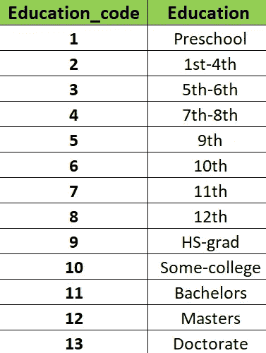
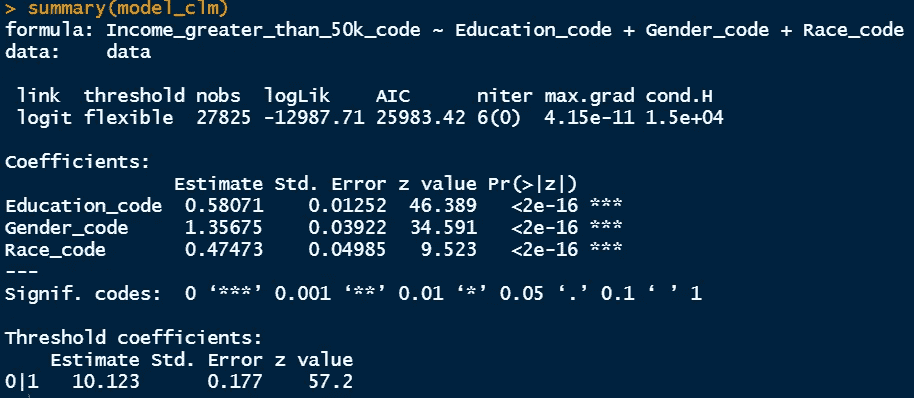
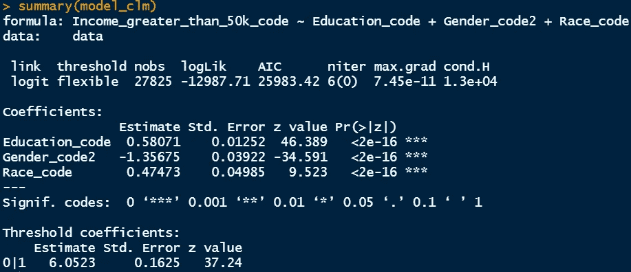
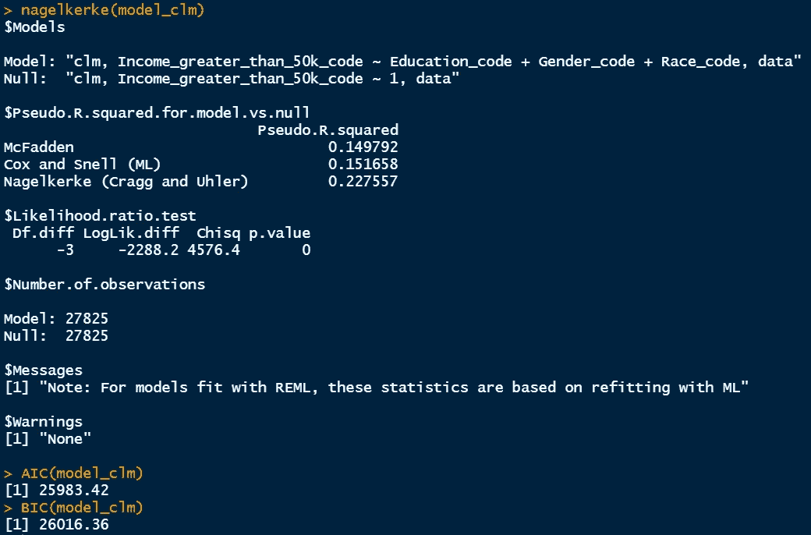
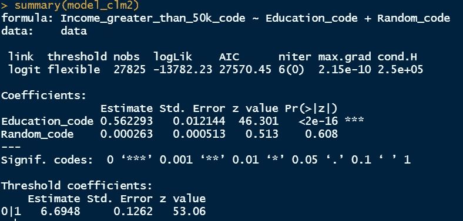
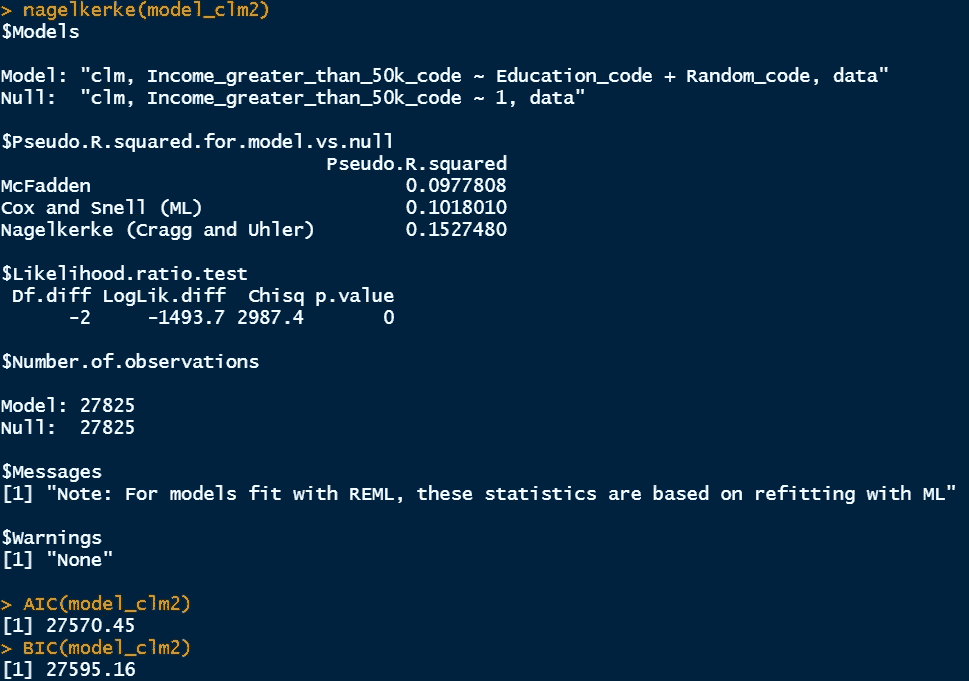
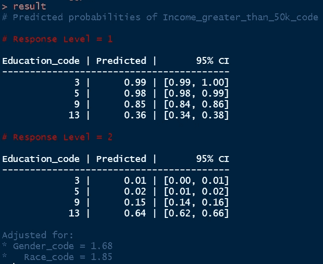

# R 中序数变量和预测概率的多元逻辑回归

> 原文：<https://towardsdatascience.com/multiple-logistic-regression-for-ordinal-variable-and-predicted-probabilities-in-r-3e3ef3ba6ca2>

## R 系列中的统计

在 [Unsplash](https://unsplash.com/s/photos/library?utm_source=unsplash&utm_medium=referral&utm_content=creditCopyText) 上由 [Zaini Izzuddin](https://unsplash.com/@izzuddindanial?utm_source=unsplash&utm_medium=referral&utm_content=creditCopyText) 拍照

> **简介**

在上一篇文章中，我们已经介绍了有序变量的简单逻辑回归，当看到结果时，这变得非常有趣。在本文中，我将讨论相似有序数据的多元逻辑回归，并使用 R 包预测概率。在有序逻辑回归中，预测变量可以是有序的、二元的或连续的，而响应变量是有序的。

例如，如果我们使用有序教育水平来预测收入，它只有两个水平的响应。我们可以有从一年级到博士学位的教育水平，并分配有序的数字来进行回归。我们也可以用二元变量来预测收入。例如，我们可以将 1 分配给有学士学位的人，将 0 分配给没有学士学位的人。在某种意义上，这也可以被认为是两个 kevels 的序数变量。最后，我们也可以使用教育年限等连续变量作为预测收入水平的预测因子。下面的文章给出了准确的分析。

  

这里，我们现在感兴趣的是同时引入多个变量作为预测因子。

> **数据集**

作为一个案例研究，我们将使用位于 UCI 机器学习库中的[成人数据集](https://archive.ics.uci.edu/ml/datasets/adult)。该数据集中收集了超过 30000 个人的人口统计数据，包括他们的种族、教育、职业、性别、工资、每周工作时间、就业水平以及收入水平。

[来自 UCI 机器学习知识库的成人数据集](https://archive.ics.uci.edu/ml/datasets/adult)

为了进行有序逻辑回归分析，有必要修改给定的数据。尽管如此，让我首先提出一个问题来进行研究。

> 受教育程度、性别、种族对收入有什么影响？

为了回答这个问题，我们需要教育和收入水平的标签编码数据。正如你在数据集中看到的，从一年级到博士学位有不同的教育水平。由于收入水平是二进制的，它提供了个人收入是否超过 50000 美元的信息。在这种情况下，我们正在处理一个二元响应变量和一个序数预测变量(Education_code 列)，两个二元预测变量(Gender_code 和 Race_code)。

对于性别，男性分配 2，女性分配 1。稍后我们将交换这些数字，看看结果有什么不同。对于种族，我们有兴趣看看白人和非白人之间的收入是否有差异。非白种人被分配 1，白种人被分配 0。分析要在 R 中进行，开始吧。

链接 excel 文件:[成人-v3.xlsx](https://github.com/mdsohelmahmood/Statistics-in-R-Series/tree/main/Multiple%20Logistic%20Regression)

> **在 R 实施**

我们将在这里使用相同的 clm()函数。但首先，我想澄清不同教育程度的价值观。如下图所示。

要添加多个变量，我们可以简单地在 clm()命令中使用下面的格式。

> 模型 _clm

To show the effect of non-related variables, I have introduced a new column names “Random_code” and we will see it’s effect on the result.

> **结果解释**

在上面的代码中，显示了两个模型。第一个模型评估了教育水平、性别和种族对收入的影响。第二个模型引入了一个新的随机变量。

1.  模型 1:预测变量是序数教育水平、二元性别和二元种族变量。响应变量是二元收入水平。
2.  模型 2:预测变量是序数教育水平和一个连续的随机变量。响应变量是二元收入水平。

> **模型 1 结果**

模型 1 结果

从结果总结来看，关键要点是:

*   教育水平每提高一级，收入超过 50000 美元的对数或对数几率增加 0.581。
*   性别代码每增加一个单位，收入大于 50000 美元的对数或对数几率增加 1.357。这意味着，如果被研究的个体是女性(1)，而我们用男性(2)代替这个个体，那么高收入的 logit 概率增加了 1.357。
*   Race_code 每增加一个单位，收入> 50000 美元的对数或对数几率增加 0.475。这意味着，如果被研究的个体是非白人(1)，而我们用一个白人来代替这个个体(2)，更高收入的 logit 概率增加了 0.475。
*   所有的预测变量都有意义(p<0.05)。

如果我们交换性别值(将 1 分配给男性，将 2 分配给女性)，系数的符号会发生如下变化

交换性别代码后的模型 1 结果

这向我们表明，性别代码每增加一个单位，收入> 50000 美元的对数或对数几率减少 1.357。这意味着，如果被研究的个体是男性(1)，而我们用女性(2)来代替这个个体，那么高收入的 logit 概率降低了 1.357。如果我们交换种族代码，同样的事情也会发生。

模型 1 结果

关于伪 R 值，麦克法登给我们的值是 0.149，我们将在后面的讨论中把这个值与其他模型进行比较。我们还将比较两个不同模型的 AIC 和 BIC 统计，因为单个模型的单个值在逻辑回归中没有太大的意义。

> **模型 2 结果**

模型 2 结果

从结果总结来看，关键要点是:

*   教育水平每提高一级，收入超过 50000 美元的对数或对数几率增加 0.562。
*   在这种情况下，由于 p>0.05，随机变量不显著。

模型 2 结果

麦克法登伪 R 值 ios 小于模型 1，AIC/BIC 统计值高于模型 1。这意味着当我们比较这些拟合优度统计时，模型 1 具有更好的性能。

> **预测**

我们将使用 ggpredict()命令来有效地预测预测变量的任何给定值。我们需要 ggeffects libarary 来实现它。让我们预测一组人的收入水平，假设他们的教育水平是 3、5、9 和 13。

预测结果

由于我们有两个收入水平(收入> 50000 美元和收入≤ $50000 美元)，响应水平的数量也是 2，如上面的红色所示。每个教育水平的预测概率显示在第二列。当教育水平为 3(5 到 6 年级)时，收入≤ $50000 的概率是 0.99，而如果教育水平为 13(博士)，收入≤ $50000 的概率是 0.36。从第二响应水平预测结果可以做出相同的推断。

我们可以在这里引入多个预测变量。包括性别后，我们得到以下结果。

预测结果

现在我们有 4 个表，因为性别有两个类似于收入水平的值。对于性别代码 1(女性)，如果个人有博士学位(教育代码 13)，收入> 50000 美元的预测概率是 0.42，而如果个人是男性(性别代码 2)并且他有博士学位，收入> 50000 美元的预测概率是 0.74。这表明女性在同等教育水平下获得了某种不平等的报酬。

***结论***

已经讨论了两个模型，它们结合了一个顺序预测变量和一个二元响应变量的逻辑回归。第一个模型包含序数教育变量，二元性别和种族变量，以及收入变量。第二个模型由一个连续的随机变量、顺序教育变量和一个二元收入变量组成。我们在伪 R2 和 AIC/BIC 统计的基础上比较了这些模型，以确定它们的性能。此外，从一组给定的数据中，根据预测结果的概率和 95%的置信区间进行预测。

***数据集确认***

[杜瓦博士和格拉夫博士(2019 年)。UCI 机器学习知识库[http://archive . ics . UCI . edu/ml]。加州欧文:加州大学信息与计算机科学学院。](https://archive.ics.uci.edu/ml/datasets/adult)

感谢阅读。

   