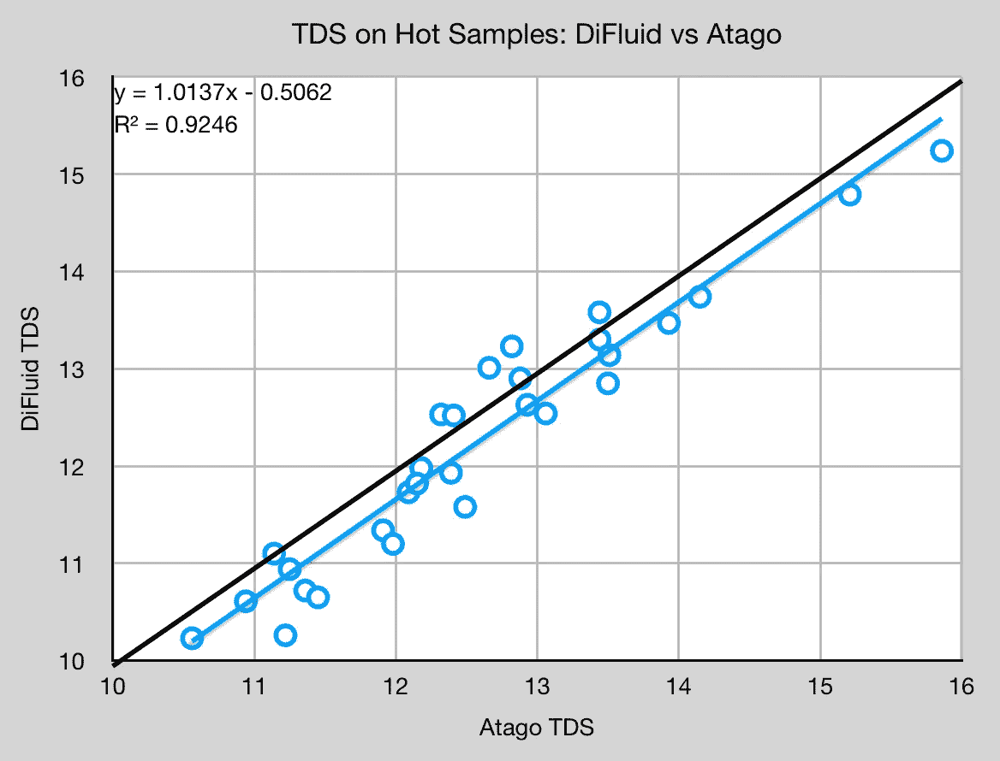
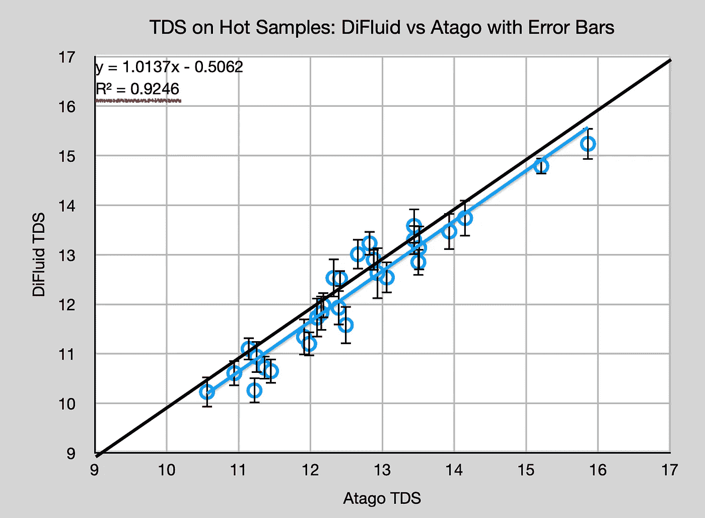
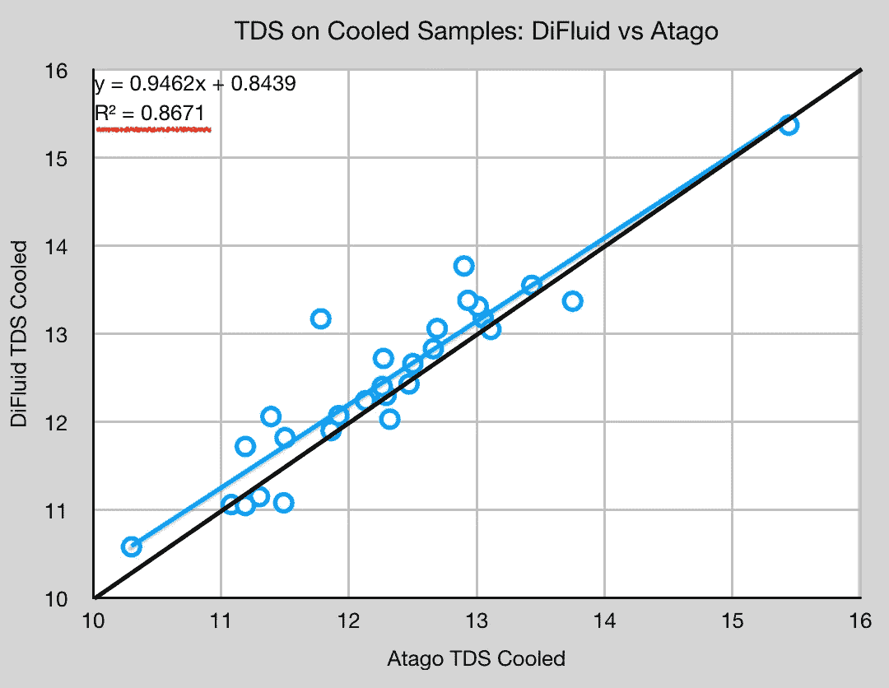
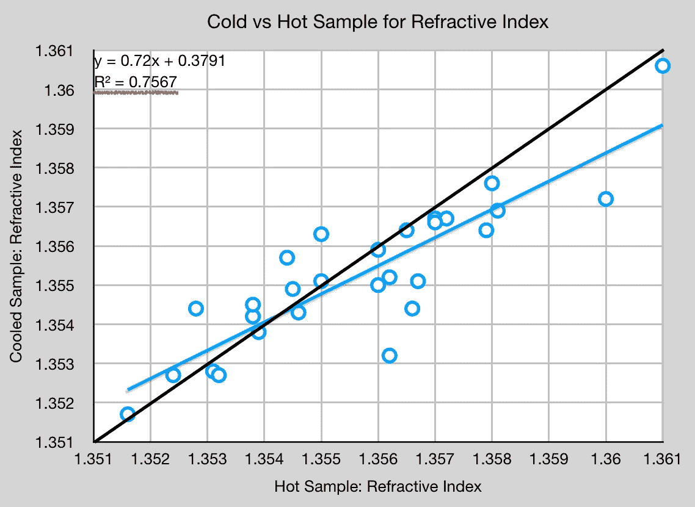
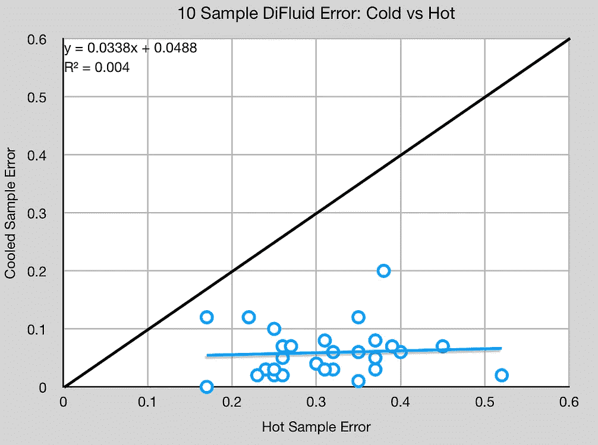
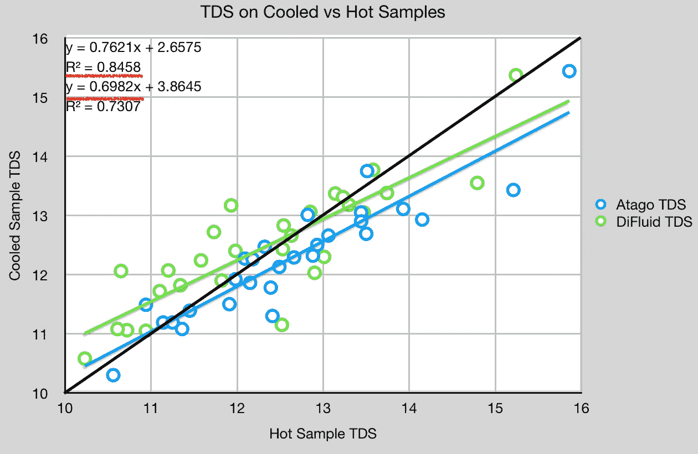

# 浓缩咖啡中 DiFluid 折光仪的多个样品

> 原文：<https://towardsdatascience.com/multiple-samples-for-the-difluid-refractometer-in-espresso-c9a9cda08aab>

## 咖啡数据科学

## 再次仔细检查一个特征

[之前](/difluid-vs-atago-for-total-dissolved-solids-tds-in-espresso-d474614ad66f)，与 VST 和 Atago 相比，关于二流体折光率仪的研究相当多。我确实忽略了钻井液的一个特点:多样本。VST 和 Atago 都采用了多个样本，但是他们没有给出选项，也没有显示样本之间的误差。DiFluid 有，所以我用这个多重特性收集了更多的数据，再看一看。

# 设备/技术

[浓缩咖啡机](/taxonomy-of-lever-espresso-machines-f32d111688f1) : [像样的浓缩咖啡机](/developing-a-decent-profile-for-espresso-c2750bed053f)

[咖啡研磨机](/rok-beats-niche-zero-part-1-7957ec49840d) : [小生零](https://youtu.be/2F_0bPW7ZPw)

咖啡:[家庭烘焙咖啡](https://rmckeon.medium.com/coffee-roasting-splash-page-780b0c3242ea)，中杯(第一口+ 1 分钟)

镜头准备:[断奏夯实](/staccato-tamping-improving-espresso-without-a-sifter-b22de5db28f6)

[预灌注](/pre-infusion-for-espresso-visual-cues-for-better-espresso-c23b2542152e):长，约 25 秒

[过滤篮](https://rmckeon.medium.com/espresso-baskets-and-related-topics-splash-page-ff10f690a738) : 20g VST

其他设备: [Atago TDS 计](/affordable-coffee-solubility-tools-tds-for-espresso-brix-vs-atago-f8367efb5aa4)、 [DiFluid TDS 计](/rethinking-refractometers-vst-atago-and-difluid-part-1-b5fdb0e5731e)、 [Acaia Pyxis 秤](/data-review-acaia-scale-pyxis-for-espresso-457782bafa5d)

# 性能指标

我用 TDS 评估了这两个传感器。**总溶解固体(TDS)是用折射仪测量的，这个数字结合弹丸的输出重量和咖啡的输入重量用来确定提取到杯中的咖啡的百分比，称为**提取率(EY)** 。**

# **数据**

**我使用 DiFluid 和 Atago 收集了 29 对数据点，对于 28 对，我还冷却了样本并收集了另一个 TDS 样本。对于 DiFluid，我只使用了 10 个样本的平均特性。总的趋势是钻井液低于报告的 TDS，但该趋势有一个有趣的偏移，因为它非常接近 y = x。**

****

**所有图片由作者提供**

**我也添加了误差线，但是我不认为它们有什么不同。**

****

**当冷却样品时，钻井液超过报告的 TDS，但趋势相似。我没有画误差线，因为误差通常低于 0.05%**

****

**我比较了热样品和冷样品的折射率，温度对折射的影响非常明显。**

****

**从误差率来看，冷误差率非常低，我怀疑不需要多个样本。如前所述，DiFluid 的质量较小，因此其温度稳定性不如 Atago 或 VST。**

********

**在查看冷/热 TDS 时，Atago 和 DiFluid 具有相似的趋势斜率，但存在偏移。**

****

**DiFluid 是一种有趣的传感器，因为它可以提供其他折光率仪无法提供的数据。这个分析的难点在于我只有一个样本，而不是全部 10 个。通常，当样品冷却时，相同的读数会发生变化。很有可能我的设备是最好的，所以这种差异应该是麻烦的。或者，我的设备可能是最差的样本。幸运的是，新的 DiFluid 模型即将出现，因此可以获得更多的数据！**

**如果你愿意，可以在推特、 [YouTube](https://m.youtube.com/channel/UClgcmAtBMTmVVGANjtntXTw?source=post_page---------------------------) 和 [Instagram](https://www.instagram.com/espressofun/) 上关注我，我会在那里发布不同机器上的浓缩咖啡照片和浓缩咖啡相关的视频。你也可以在 [LinkedIn](https://www.linkedin.com/in/dr-robert-mckeon-aloe-01581595) 上找到我。也可以关注我在[中](https://towardsdatascience.com/@rmckeon/follow)和[订阅](https://rmckeon.medium.com/subscribe)。**

# **[我的进一步阅读](https://rmckeon.medium.com/story-collection-splash-page-e15025710347):**

**[我未来的书](https://www.kickstarter.com/projects/espressofun/engineering-better-espresso-data-driven-coffee)**

**[我的链接](https://rmckeon.medium.com/my-links-5de9eb69c26b?source=your_stories_page----------------------------------------)**

**[浓缩咖啡系列文章](https://rmckeon.medium.com/a-collection-of-espresso-articles-de8a3abf9917?postPublishedType=repub)**

**[工作和学校故事集](https://rmckeon.medium.com/a-collection-of-work-and-school-stories-6b7ca5a58318?source=your_stories_page-------------------------------------)**