# 多重系列？将它们与任何 Sklearn 模型一起预测

> 原文：<https://towardsdatascience.com/multiple-series-forecast-them-together-with-any-sklearn-model-96319d46269>

## 用 Python 同时预测多个序列的趋势


劳埃德·威廉姆斯在 [Unsplash](https://unsplash.com?utm_source=medium&utm_medium=referral) 上拍摄的照片

一种流行的经典时间序列预测技术叫做[向量自回归(VAR)](/multivariate-time-series-forecasting-653372b3db36) 。这种方法背后的思想是，多个序列的过去值(滞后)可以用来以线性方式预测其他序列的未来值。它以这种方式一起预测多个时间序列。

你什么时候会想用这样的方法？当你有两个或更多你怀疑会相互影响的序列时，比如利率和通货膨胀，这是一个有效的方法。运行 VAR 时，所有系列都是稳定的，这一点非常重要。一旦确定了要预测的序列并确保了它们的平稳性(通过对非平稳序列进行差分或转换)，剩下要考虑的唯一参数就是用作预测的滞后数。这可以通过在不同数量的滞后上进行[信息标准搜索](https://www.econometrics-with-r.org/14-6-llsuic.html)来完成。VAR 方法有一些扩展，包括用误差项估计(VARMA)、应用误差修正项(VECM)、添加外生变量(VARMAX)和用季节性估计(SVAR)。

# 将 VAR 概念扩展到机器学习

逻辑上的问题是，如果你在这个过程中改变了基本的线性函数会怎样？或者，如果你把上面描述的几个概念混合搭配会怎么样？有多种方法可以使用这种通用方法，但需要更多基于机器学习的过程，例如使用 [Scikit-Learn 库](https://scikit-learn.org/stable/)中可用的模型。考虑到应该如何准备时间序列数据以及更新预测和模型输入的困难，从头开始编写这样一个程序将是非常耗时的。令人欣慰的是，一些 Python 包，如 [darts](https://unit8co.github.io/darts/) 、 [scalecast](https://scalecast.readthedocs.io/en/latest/) 和其他包，为您解决了许多令人头疼的问题。

今天，我将演示如何使用 scalecast 将这种方法应用于预测。设置过程和提取最终结果很容易。该程序包通过多步过程动态预测您输入的所有系列。一个缺点是，以这种方式将机器学习模型应用于多变量预测的研究并不多，至少据我所知是这样。不过，探索还是很有趣的。看完整笔记本[这里](https://github.com/mikekeith52/scalecast-examples/blob/main/multivariate/multivariate.ipynb)。这些数据可以在拥有开放数据库许可证的 [Kaggle](https://www.kaggle.com/datasets/neuromusic/avocado-prices) 上获得。如果您觉得 scalecast 有趣，请在 GitHub 上给它打一颗星:

[](https://github.com/mikekeith52/scalecast) [## GitHub - mikekeith52/scalecast:使用多种工具轻松、动态地预测时间序列

### 该软件包使用了 Python 中的可扩展预测方法，包括 scikit-learn、statsmodels、脸书预言家…

github.com](https://github.com/mikekeith52/scalecast) 

# 探索性数据分析

我们将了解如何预测以下两个系列:

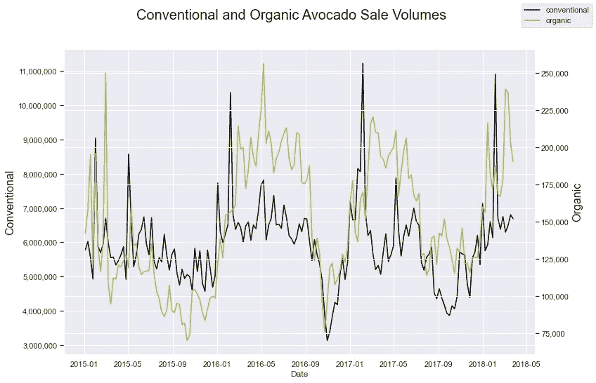

作者图片

这些测量了从 2015 年 1 月到 2018 年 3 月底加州每周传统和有机鳄梨的销售情况。该图需要一个双轴，因为传统的比有机的具有更高的体积。对它们进行皮尔逊相关计算，我们看到它们的系数是 0.48。这两个系列肯定一起移动，并显示出类似的趋势，尽管在不同的规模。

接下来，我们检查两个序列的平稳性。使用一个共同的测试来确定这一点，扩大的 Dickey-Fuller 测试，我们看到这两个系列可以被认为是 95%的确定性平稳。这意味着我们可以尝试在它们最初的水平上模拟它们。然而，两者看起来似乎都遵循一个趋势(因此不是平稳的)，并且两个测试都没有在 99%的显著性水平上确认平稳性。我们可以假设它们现在是稳定的，但是这种分析的一个有趣的扩展是对每个序列进行一次差分，scalecast 可以让你很容易地做到这一点。

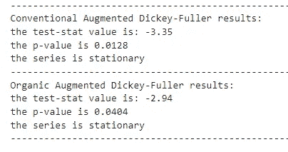

作者图片

让我们使用自相关和偏自相关函数来查看每个序列中有多少滞后具有统计显著性:

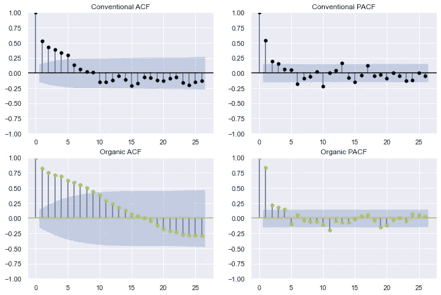

作者图片

从这些图中，很难准确地说出有多少滞后才是理想的预测。看起来至少有三个，但也可能多达 20 个，中间有一些间隙。让我们宁可增加更少的延迟——3。稍后，我们将展示如何在代码中结合这个决定。

另一个要考虑的重要因素是每个系列的季节性。我们可以通过季节分解法直观地看到季节性:

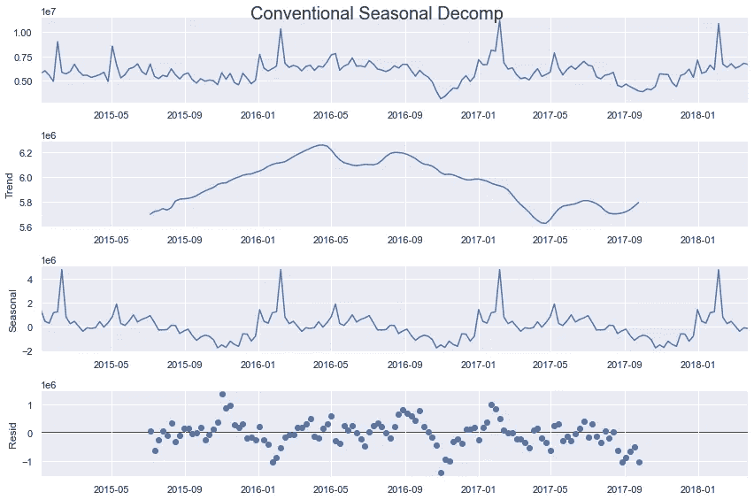

作者图片

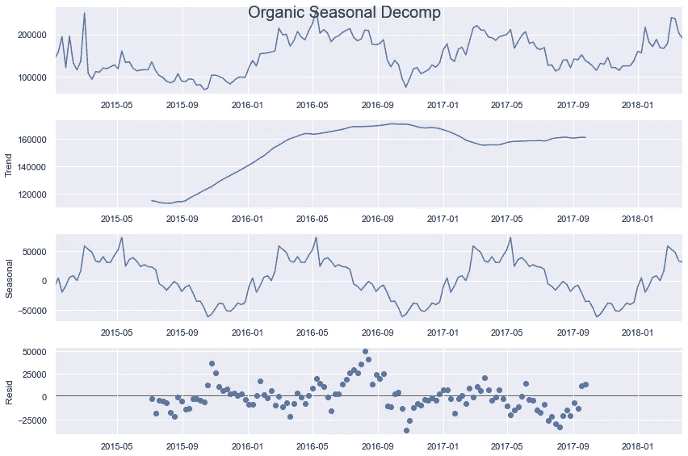

作者图片

看看这一产出，至少在有机系列中确实出现了上升趋势，尽管扩大的 Dickey-Fuller 检验表明了平稳性。也有很强的季节性，看起来好像有一年(52 个周期)和半年(26 个周期)周期。以上是数据的线性分解，但残差看起来仍然遵循一种模式，表明线性模型可能不是最适合的。我们可以尝试使用线性和非线性方法，并添加不同类型的季节性。

最后，让我们使用我们所了解的关于这些系列的一切来做出我们的建模决策。首先，我们将应用的模型:

```
models = ('mlr','elasticnet','knn','rf','gbt','xgboost','mlp')
```

MLR 和 ElasticNet 模型都是线性应用，ElasticNet 是混合了 L1 和 L2 正则化参数的线性模型。其他模型都是非线性的，包括 k-最近邻、随机森林、两个提升树和一个多层感知器神经网络。

使用 scalecast 过程，我们现在可以创建预测器对象来存储关于每个系列的信息以及我们想要尝试预测它们的方式:

```
# load the conventional series
fcon = Forecaster(y=data_cali_con['Total Volume'],
                  current_dates = data_cali_con['Date'])
# load the organic series
forg = Forecaster(y=data_cali_org['Total Volume'],
                  current_dates = data_cali_org['Date'])for f in (fcon,forg):
    # set forecast horizon of 1 year
    f.generate_future_dates(52)    
    # set 20% testing length    
    f.set_test_length(.2)
    # set aside 4 weeks for validation
    f.set_validation_length(4)
    # add seasonality in the form of wave functions
    f.add_seasonal_regressors(
        'week',
        'month',
        'quarter',
        raw=False,
        sincos=True,
    )
    # add the year as a regressor
    f.add_seasonal_regressors('year')
    # add a time trend
    f.add_time_trend()
    # add an irregular seasonal cycle of 26 periods
    f.add_cycle(26)
    # add three dep variable lags    
    f.add_ar_terms(3)
```

# 单变量预测

在我们将分析扩展到多序列预测之前，让我们通过应用单变量过程来测试性能。通过从 scalecast 导入以 Grids.py(用于单变量过程)和 MVGrids.py(用于多变量过程)格式保存到工作目录的验证网格，我们可以使用回归器(包括我们已经添加的滞后、季节回归器和时间趋势)自动调整、验证和预测我们选择的模型:

```
GridGenerator.get_example_grids(overwrite=False)
GridGenerator.get_mv_grids(overwrite=False)
```

我们可以称预测过程为:

```
fcon.tune_test_forecast(models,feature_importance=True)
forg.tune_test_forecast(models,feature_importance=True)
```

我们还可以为每个对象添加一个加权平均集合模型:

```
fcon.set_estimator('combo')
fcon.manual_forecast(how='weighted')
forg.set_estimator('combo')
forg.manual_forecast(how='weighted')
```

并绘制结果:

```
fcon.plot_test_set(ci=True,order_by='LevelTestSetMAPE')
plt.title('Conventional Univariate Test-set Results',size=16)
plt.show()forg.plot_test_set(ci=True,order_by='LevelTestSetMAPE')
plt.title('Organic Univariate Test-set Results',size=16)
plt.show()
```

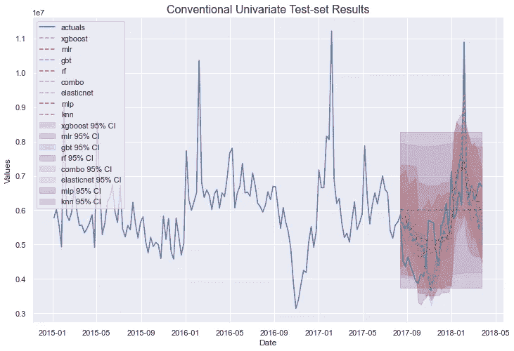

作者图片

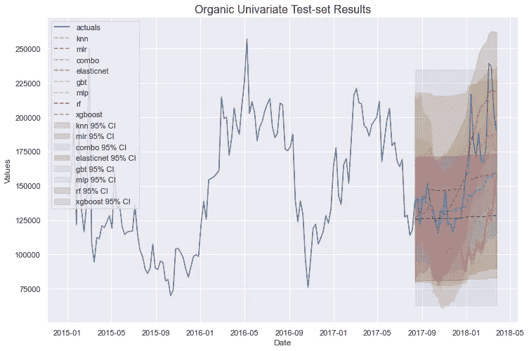

作者图片

有趣的模式和预测出现了。让我们也导出一些模型摘要，从数字上了解每个模型的表现:

```
pd.set_option('display.float_format',  '{:.4f}'.format)
ms = export_model_summaries({'Conventional':fcon,'Organic':forg},
                            determine_best_by='LevelTestSetMAPE')
ms[
    [
        'ModelNickname',
        'Series',
        'Integration',
        'LevelTestSetMAPE',
        'LevelTestSetR2',
        'InSampleMAPE',
        'InSampleR2',
        'best_model'
    ]
]
```

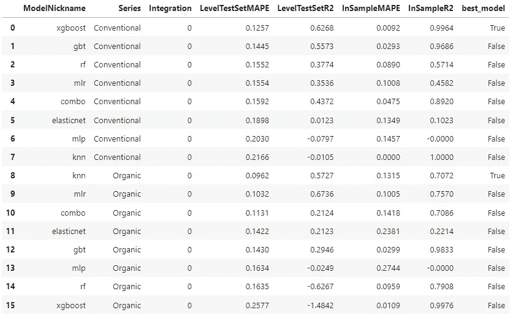

作者图片

仅从测试集 MAPE 来看，XGBoost 在常规系列中表现最好，KNN 在有机非线性模型中表现最好。然而，XGBoost 似乎严重超载。让我们转到多元建模，看看我们是否可以改善结果。

# 多元预测

为了将上面的单变量建模扩展到多变量概念，我们需要将 scalecast 中创建的预测器对象传递到一个 mvpredictor 对象中。这是这样做的:

```
mvf = MVForecaster(fcon,forg,names=['Conventional','Organic'])
```

更多关于这行代码的深度，请看这里的。基本上，任何数量的预测器对象都可以传递给这个新对象。在构建这个新对象之前，您应该已经设置了预测范围并添加了您想要使用的任何 Xvars，否则，您将只有每个系列的滞后来进行预测，并且将失去添加季节性和外生回归量的机会。使用这个新的 mv predictor 对象，它能够从我们提供给它的两个 predictor 对象中获得那些其他参数，但是我们确实需要重新设置测试和验证长度:

```
mvf.set_test_length(.2)
mvf.set_validation_length(4)
```

我们有不止一个系列可以预测，但是我们仍然可以使用类似于单变量部分的自动化方法。然而，现在我们的模型将尝试在两个方面进行优化，不仅是所选的误差指标(在优化模型时默认为 RMSE)，而且是多个系列的误差指标的集合。例如，如果出于某种原因，准确预测传统系列比正确预测其他系列更重要，我们可以告诉对象只优化该系列的选定误差度量:

```
mvf.set_optimize_on('Conventional')
```

要更改它以优化跨系列的平均度量(这也是默认行为)，我们可以使用:

```
mvf.set_optimize_on('mean')
```

现在，我们运行自动预测程序:

```
mvf.tune_test_forecast(models)
```

完成后，我们告诉对象根据我们选择的度量设置最佳模型。我选择测试集 MAPE。这将选择在两个系列中平均具有最佳测试集 MAPE 的模型:

```
mvf.set_best_model(determine_best_by='LevelTestSetMAPE')
```

现在，让我们看看结果。我们可以一起绘制所有系列的所有模型，但是由于常规和有机体积的比例非常不同，我们仍然希望逐个绘制它们，就像我们在单变量部分所做的那样:

```
mvf.plot_test_set(series='Conventional',
                  put_best_on_top=True,
                  ci=True)
plt.title('Conventional Multivariate Test-set Results',size=16)
plt.show()mvf.plot_test_set(series='Organic',
                  put_best_on_top=True,
                  ci=True)
plt.title('Organice Multivariate Test-set Results',size=16)
plt.show()
```

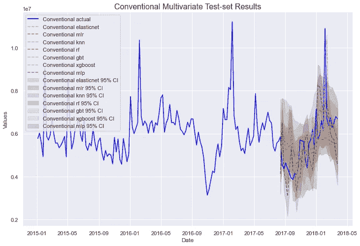

作者图片

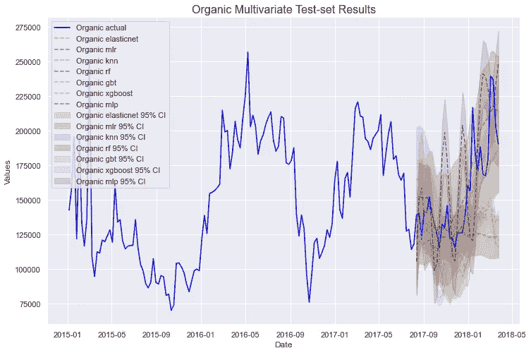

作者图片

非常好！在进一步检查这些之前，让我们探索另一种类型的集合模型，它可以在 scalecast 中与多变量预测一起执行。

# 模型堆叠

在单变量部分，我们应用了 scalecast 固有的集成模型——加权平均模型。多变量预测只允许应用 Scikit-learn 模型，因此我们没有相同的组合模型可用，但有一个不同的集成模型可以使用:StackingRegressor。

```
from sklearn.ensemble import StackingRegressor
mvf.add_sklearn_estimator(StackingRegressor,'stacking')
```

现在，我们使用之前应用和调整过的其他模型来构建模型，如下所示:

这看起来可能很复杂，但这是将我们之前定义的 MLR、ElasticNet 和 MLP 模型合并为一个，其中每个模型的预测都成为最终模型的输入，即 KNN 回归量。我选择这些模型是因为它们显示出最少的过度拟合可靠测试集误差度量的迹象。让我们称这个模型为 scalecast。我们可以使用 13 个滞后来训练这个模型，因为正如我们很快就会看到的，13 个滞后是模型调整过程中最常选择的，尽管我们可以根据需要通过网格搜索来调整该参数。

```
mvf.set_estimator('stacking')
mvf.manual_forecast(estimators=estimators,final_estimator=final_estimator,lags=13)
```

现在，我们可以看到所有型号的型号性能:

```
mvf.set_best_model(determine_best_by='LevelTestSetMAPE')
results2 = mvf.export_model_summaries()
results2[
    [
        'ModelNickname',
        'Series',
        'HyperParams',
        'LevelTestSetMAPE',
        'LevelTestSetR2',
        'InSampleMAPE',
        'InSampleR2',
        'Lags',
        'best_model'
    ]
]
```

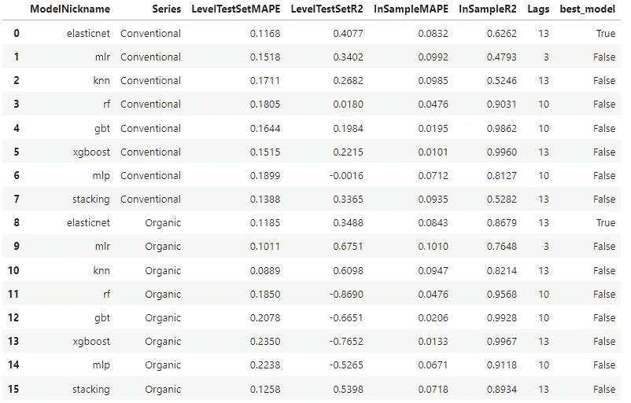

作者图片

ElasticNet 在两个系列之间具有最好的平均误差，这就是为什么它在上面的输出中被标记为两个系列中最好的，但是 KNN 在有机系列中比 ElasticNet 做得更好。我们可以选择 ElasticNet 作为常规系列的最终模型，选择 KNN 作为有机系列的最终模型。这两个最佳模型的 MAPE 度量都低于单变量方法的最佳模型，表明整体性能更好。让我们看看它们在 52 期预测范围内的表现:

```
mvf.plot(series='Conventional',models='elasticnet',ci=True)
plt.title('Elasticnet Forecast - Conventional - MAPE 0.1168',
          size=16)
plt.show()mvf.plot(series='Organic',models='knn',ci=True)
plt.title('KNN Forecast - Organic - MAPE 0.0889',
          size=16)
plt.show()
```

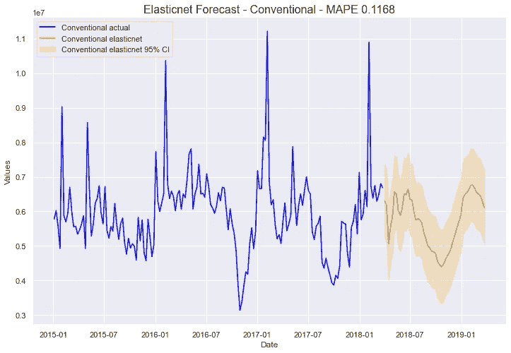

作者图片

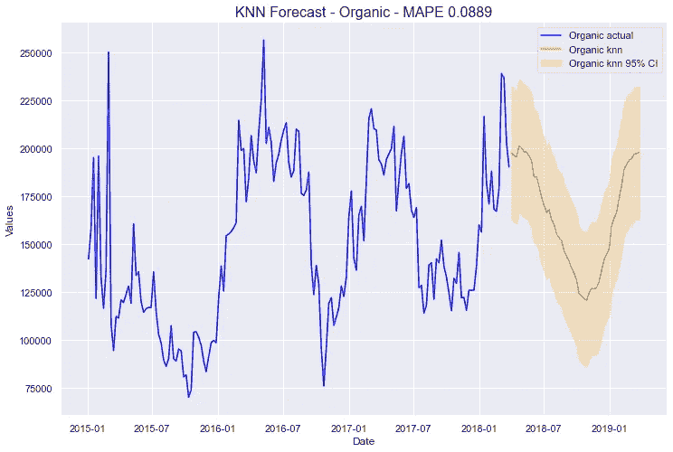

作者图片

对于这些情节来说，重要的是考虑它们看起来是否可信。对我来说，如果一个预测通过了视力测试，那就是它在现实世界中有用的最好迹象。据我所知，这两个模型看起来都还可以，虽然，两个都不能很好地预测这个系列的整体尖峰。也许有了更多的数据或更复杂的建模过程，这种不规则趋势可以更好地建模，但目前，这是我们将坚持的。

# 结论

这是 Python 中使用 scalecast 进行多元预测的概述。建模过程非常简单和自动化，这有利于快速获得结果，但这种方法有一些问题。通过应用许多模型，有可能幸运地获得一些技术，并在验证数据上过度拟合。我响应来自飞镖包开发者的[警告](https://unit8co.github.io/darts/quickstart/00-quickstart.html):

> “那么[哪种应用模型最好]？嗯，在这一点上，实际上很难说哪一个是最好的。我们的时间序列很小，我们的验证集更小。在这种情况下，很容易将整个预测工作过度适应于这样一个小的验证集。如果可用模型的数量及其自由度很高(例如深度学习模型)，或者如果我们在单个测试集上使用许多模型(如在本笔记本中所做的)，则尤其如此。

带着这种情绪，看看每种技术的平均误差并记住我们的几个模型显示出过度拟合的迹象可能也是好的。

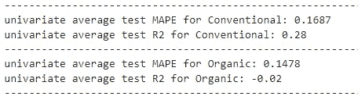

作者图片

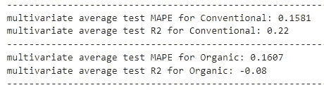

作者图片

从这个角度来看，这两种技术并不明显孰优孰劣，因为一些模型的误差指标会降低，而另一些会增加。无论我们做出什么决定，都需要用常识来调节。一个人在这种分析中做出的决定可能与另一个人的决定不同，两者都可能是正确的。说到底，预测是一门讲述未来的科学，没有人能 100%预测未来。完成 darts 开发者的想法:

> “作为数据科学家，我们有责任了解我们的模型可以信任到什么程度。所以，一定要对结果有所保留，尤其是在小数据集上，并在做出任何预测之前应用科学方法:)建模快乐！”

感谢您的关注！