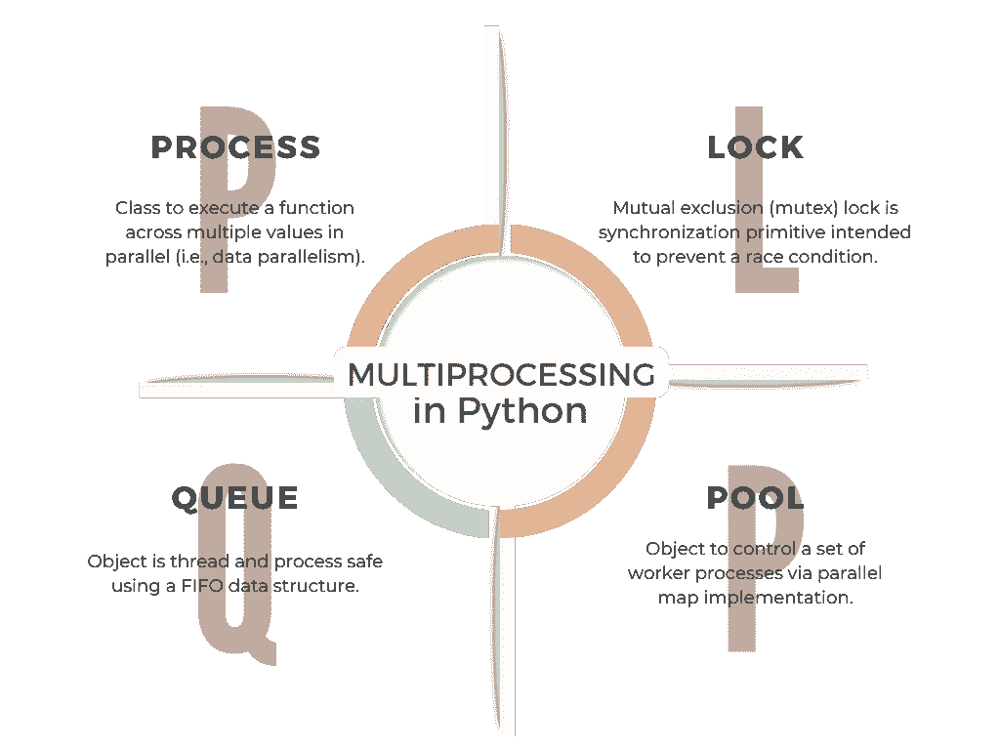
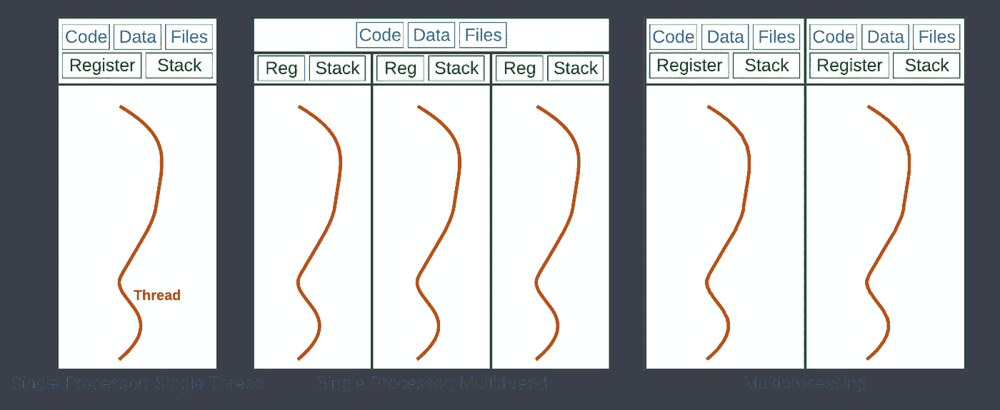
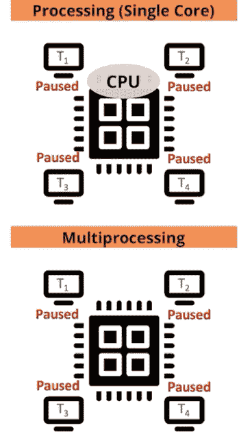
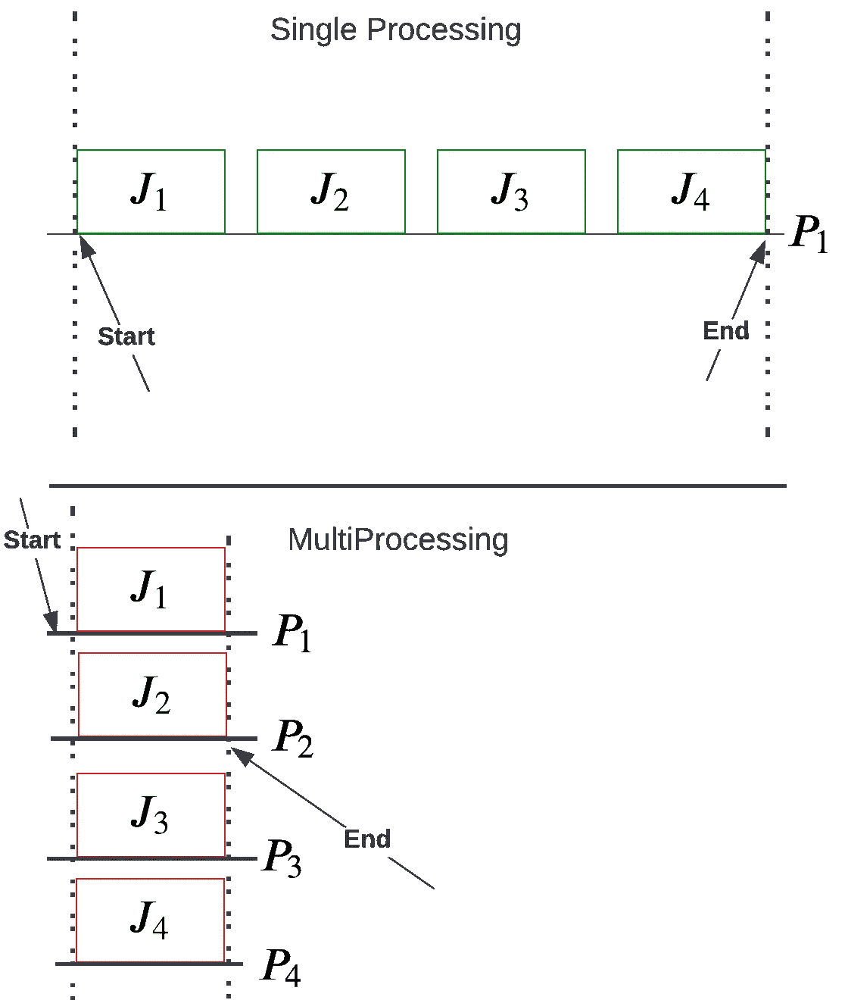
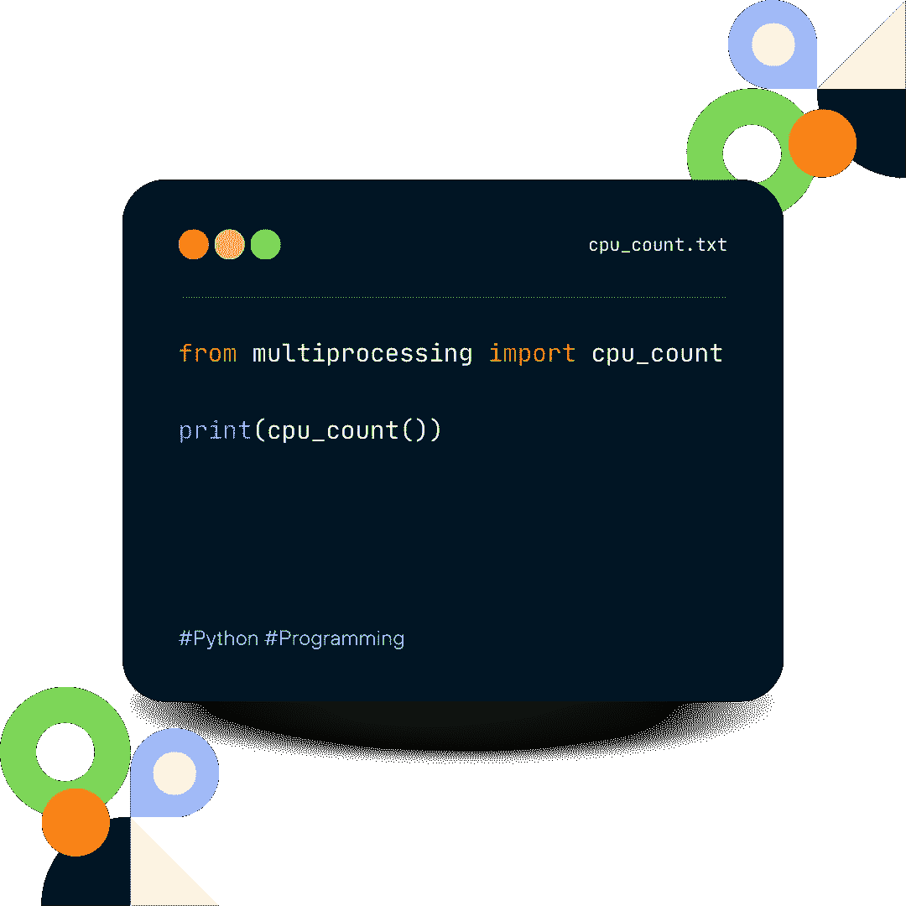
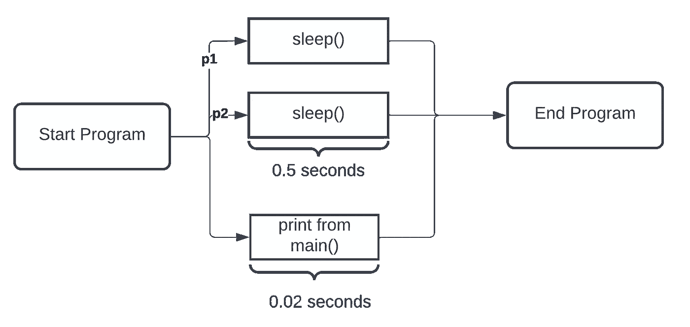
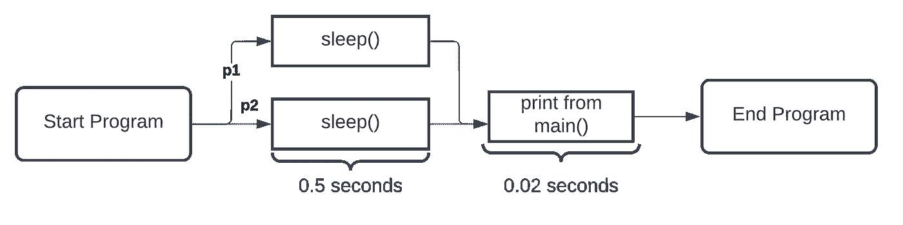

# how-To:Python 中多重处理的 4 个基本部分

> 原文：<https://towardsdatascience.com/multiprocessing-in-python-9d498b1029ca>

## 像专家一样编码！

## 有效的 Python



**图一。**进程、锁、队列和池对于理解多处理 Python 包至关重要。写完博客后，理解以上内容将使编码人员能够在他们的源代码中利用并行处理，并理解在其他代码中的用法。

经过多次请求、一些计划，并有时间交付一个实用的摘要之后，我很高兴地分享一个指南，它将允许您开始在 Python 代码中使用并行处理！

# TL；速度三角形定位法(dead reckoning)

P 并行处理可以加速你的代码，并处理每个数据集样本要执行的许多任务。遵循这种范式，Python 中的多处理允许您同时运行多个进程。我们讨论 Python 中多处理包的四个重要组件:进程、锁、队列和池(图 1)。

# 目录

```
· [Introduction](#43d9)
· [What is multiprocessing, and why use it?](#0df6)
· [Multiprocessing in Python](#2a93)
· [Using the multiprocessing library — Process, Lock, Queue, Pool](#cd53)
  ∘ [1\. Process](#f318)
  ∘ [2\. Lock](#0385)
  ∘ [3\. Queue](#30eb)
  ∘ [4\. Pool](#943e)
· [Tips on how to get started with multiprocessing](#8d4e)
· [Tips on Best Practices for Using Multiprocessing](#bf67)
· [Conclusion](#9794)
· [Supplemental Material](#4705)
```

# 介绍

D 数据科学家经常被赋予使用各种转换技术处理一组数据点的任务。换句话说，给定一个数据集，我们的目标是通过过滤、转换、清理、缩放等对数据进行预处理。此外，为了突出和理解，或者为了分析和可视化结果，必须经常对得到的数据进行后处理。因此，相同的工作必须对 *N* 个数据样本执行 *N* 次——正如有经验的数据科学家所争论的那样，建模前后的步骤会成为额外的瓶颈。想了解如何利用 CPU 的全部功能来减少时间开销吗？如果我说使用多处理 Python 包很容易呢？

让我们学习如何通过几行额外的代码来加快 Python 的运行时间！但是首先，让我们并行运行这组进程！入门所需的所有知识涵盖了多处理包的四个组件——进程、锁、队列和池(图 1)。

我们从定义多处理开始，同时强调它的用例。接下来，我们讨论 Python 编程特有的多重处理。然后，通过定义、示例代码和视觉效果描述并举例说明入门所需的四个组件；下面是采用最佳实践的技巧。最后，在总结时，我们回顾了那些希望将学习提高到下一个水平的人的补充资源。完整的代码在 Github 上。

# 什么是多重处理，为什么要使用它？

多重处理指的是同时运行多个进程，这对加速代码和处理大型数据集和任务非常有用。例如，并行运行一个操作可以将一个作业分成几个可以同时处理的较小部分。典型的单处理器执行，时间成本为*N×M*，其中 *M* 为单个进程的时间(即时间单位)，下至( *N / C* ) *x M* ，其中 *C* 为 CPU 核心数。考虑到 *N* 在现代大数据范式中可能会变得非常大，我们可以缩短时间。当您的计算机有多个内核或处理器时，这尤其有用。此外，多处理可以将 I/O 密集型任务分散到不同的进程中，从而提高这些任务的性能(图 2)。



**图二。**对加工类型的描述。作业期间访问的资源(蓝色文本框)访问内存资源(绿色)以在 CPU 核心线程(红色)上处理作业。如前所述，本质上可并行化的 CPU 密集型任务可以在多个处理器上运行(右图)，这是本博客的主题。多线程值得一个单独的博客——期待后续的主题。有关内存和资源的资源，请参见末尾的补充资料。作者创作了这幅插图。

虽然多重处理非常有用，但是注意到一些与使用它相关的潜在危险是很重要的。例如，如果两个进程试图同时访问同一资源，这可能会导致数据损坏或不一致。因此，锁对于保护进程间的共享资源至关重要。与此同时，一个有效的程序员将了解硬件的能力，因此，充分利用它的潜力(图 3)。



**图 3。**GIF 展示了单核处理(上图)和多核处理(即多处理，下图)之间的区别。该图描绘了具有四个核心的同一个 CPU，四个核心被四个任务(即 T1、T2、…、T4)所包围。请注意单核是如何连续处理任务的，必须完成第一个任务，然后是下一个任务，依此类推。另一方面，多重处理利用所有四个核心来处理程序(也称为作业、任务等)。)并行。作者创作了动画。

对于那些视觉学习最好的人，让我们用另一种方式来比较单处理和多处理:作为处理器和作业的函数(图 4)。



**图 4。**应该清楚的是，比较单处理和多处理范例，M 个作业(例如，本例中为 4 个)或者一个接一个地串行执行(top ),或者作为独立的进程同时执行。哪个看起来更有效率？作者创作的人物。

# Python 中的多重处理

多重处理利用多个 CPU 内核来加速计算负载。Python 采用了一个[全局解释器锁](https://realpython.com/python-gil/)(即 GIL)，这是一种通过为[内存管理](https://realpython.com/python-memory-management/)实现的引用计数方案来避免内存泄漏和不必要的竞争情况的范例。像大多数实现策略一样，GIL 有其优点和缺点，让我们考虑一个主要缺陷:它限制了 Python 字节码在同一个内核的单个线程上运行。除此之外，GIL 是未来博客的主题。现在，我们知道在核心 Python 中，并行编程是被有意禁用的。

Python 提供了几个工具，通过同名的包来实现多处理，包括进程、锁、队列和池。我们将讨论每个组件，并举例说明接下来如何使用它们。首先，让我们导入包并确定系统中可用的内核数量(图 5)。



**图 5。**导入并调用' cpu_count()'来了解当前 cpu 上有多少核心。作者创作了这幅插图。

# 使用多处理库—进程、锁、队列和池

Python 的多重处理的四个基本组件都有特定的用途。下面是每一个的简要概述。

## 1.过程

这是 Python 中的基本执行单元。每个进程都有自己的 Python 解释器副本和内存空间，允许多个作业同时执行而不会发生冲突。

*流程*类的处理如下:(1)通过 forked 复制当前流程；(2)创建新的进程标识符；(3)任务作为独立的子进程运行。

具体来说，如下例所示，*进程*通过两个函数`start()`和`join()`进行管理。

**举例和动手学习。**

让我们首先定义一个为`sleep_sec`休眠的函数，默认值设置为半秒。

```
import time

def sleep(sleep_sec=0.5):
    print(f'Sleeping for {sleep_sec} seconds')
    time.sleep(sleep_sec)
    print('Finished sleeping')
```

接下来，让我们使用多重处理包创建多个进程。

```
import multiprocessing
p1 = multiprocessing.Process(target=task)
p2 = multiprocessing.Process(target=task)
```

`Process()`的`target`参数指定了流程运行的目标函数。但是这些进程在启动之前不会立即运行。

```
p1.start()
p2.start()
```

将所有这些放在一起，我们有以下内容:

```
import multiprocessing
import time

def sleep(sleep_sec=0.5):
    print(f'Sleeping for {sleep_sec} seconds')
    time.sleep(sleep_sec)
    print('Finished sleeping')

if __name__ == "__main__":
    start_time = time.perf_counter()

    # Creates two processes
    p1 = multiprocessing.Process(target=sleep)
    p2 = multiprocessing.Process(target=sleep)

    # Starts both processes
    p1.start()
    p2.start()

    finish_time = time.perf_counter()

    print(f"Program finished in {(finish_time - start_time):.3f} seconds")
```

打印报表将被设置为如下引号:

> *程序 0.013 秒结束
> 休眠 0.5 秒
> 休眠 0.5 秒
> 休眠结束
> 休眠结束*

请注意，虽然执行了两次对`sleep`的调用，但是人们会认为程序至少需要 1 秒钟(即，睡眠两次，每次半秒钟)。此外，程序末尾的 print 语句出现在之前通过函数调用执行的语句之前。这是为什么呢？答案很简单。如上所述，`start()`和`join()`是`Process()`类一起使用的方法。在我们做`start()`的地方，我们从来不`join()`。让我们使用原理图来检查程序流程(图 6)。



**图 6。**当没有调用‘join()’时，程序将执行与其他进程并行的主进程。因此，需要将打印的时间打印在作者创建的主示意图的末尾。

在解决这个问题之前，让我们强调一下关于 Python 中多重处理的一个重要注意事项。

```
ℹ️ The main program (i.e.,if *__name__ == "__main__"*) must encapsulate our execution; else, the multiprocessing module complains. This safety construct guarantees Python finishes analyzing the program before the sub-process is created.
```

现在，回到我们的程序，它似乎没有按顺序运行，事实并非如此，但它没有被设置为等待。我们需要在两个进程上调用`join()`函数，让它们在打印时间之前运行。这是因为有三个过程正在进行:`p1`、`p2`和主过程。主进程是跟踪和打印执行时间的进程。我们应该使`finish_time`线的运行不早于`p1`和`p2`工序的完成。我们需要在`start()`函数调用后立即添加这段代码:

```
p1.join()
p2.join()
```

`join()`方法强制其他进程等待，直到调用它的进程完成。以下是添加了 join 语句的输出:

> *休眠 0.5 秒
> 休眠 0.5 秒
> 休眠完毕
> 休眠完毕
> 程序在 0.568213340181392 秒内完成*



**图 7。**现在，程序将等待并行作业完成，因为每个流程实例都调用了“join()”。作者创建的示意图。

让我们看看更新后的程序流(图 7)。

通过类似的推理，我们可以运行更多的进程。下面是从上面修改的具有 10 个进程的完整代码:

```
import multiprocessing
import time

def sleep(sleep_sec=0.5):
    print(f'Sleeping for {sleep_sec} seconds')
    time.sleep(sleep_sec)
    print('Finished sleeping')

if __name__ == "__main__":
    start_time = time.perf_counter()
    processes = []

    # Creates 10 processes then starts them
    for i in range(10):
        p = multiprocessing.Process(target=sleep, args=(1.0,))
        p.start()
        processes.append(p)

    # Joins all the processes
    for p in processes:
        p.join()

    finish_time = time.perf_counter()

    print(f"Program finished in {finish_time - start_time):.3f} seconds")
```

> 睡 1.0 秒
> 睡 1.0 秒
> 睡 1.0 秒
> 睡 1.0 秒
> 睡 1.0 秒
> 睡 1.0 秒
> 睡 1.0 秒
> 睡 1.0 秒
> 睡 1.0 秒
> 睡 1.0 秒
> 睡完
> 睡完
> 睡完
> 睡完
> 睡完
> 
> 进程结束，退出代码为 0

如果我们运行上面的代码片段，它调用了`sleep(1.0)`十次:如果没有多核处理，我们预计代码至少需要十秒钟。

```
ℹ️ Referring to the complete code above: notice that input arguments can be passed via keyword *args*, which expects a tuple. Also, notice that we loop and store each process in a list, which is better practice for there could be variable processes, opposed to hard-coding *p1, p2, ..., p10*.
```

## 2.锁

如上所述，进程是程序的运行实例，封装了每个 Python 程序(即，每个都是 Python 解释器的新实例)。`MainProcess`是当`python <file>.py`作为脚本运行时的流程名称——这是我们前面通过 schematics 看到的一个方面。此外，我们了解到子进程可以通过一个`Process`实例派生出来并同时运行。通常，这些并发程序在进程间共享数据或资源。互斥锁保护共享资源并防止竞争情况。

> 最常用的确保互斥的机制是互斥锁或互斥体，或简单的锁。互斥体是一种特殊类型的对象，在底层硬件中有支持。基本思想是每个关键部分都有锁保护。

——第 53 页，[并行编程介绍](https://amzn.to/3LRljie)，2020。

*锁*用于保护进程间的共享资源。它们允许多个作业无冲突地访问一个资源。此外，*锁*对于确保作业之间的数据一致至关重要。

*锁*允许代码断言，在锁被释放之前，没有其他进程可以执行类似的代码。因此，类*锁*的目的是双重的:(1)通过`acquire()`函数来声明锁；(2)通过`release()`功能解除锁定。

让我们吸取上面`Process`的教训。下面是要运行的完整代码:

```
# example of a mutual exclusion (mutex) lock for processes
import time
from random import random
from multiprocessing import Process
from multiprocessing import Lock

# work function
def sleep(lock, identifier, value):
    # acquire the lock
    with lock:
        print(f'>process {identifier} got the lock, sleeping for {value:.3f}')
        time.sleep(value)

# entry point
if __name__ == '__main__':
    # create the shared lock
    lock = Lock()
    # create a number of processes with different sleep times
    processes = [Process(target=sleep, args=(lock, i, random())) for i in range(10)]
    # start the processes
    for process in processes:
        process.start()
    # wait for all processes to finish
    for process in processes:
        process.join()
```

输出如下。

> >进程 0 获得锁，休眠 0.297
> >进程 1 获得锁，休眠 0.908
> >进程 2 获得锁，休眠 0.223
> >进程 3 获得锁，休眠 0.016
> >进程 4 获得锁，休眠 0.323
> >进程 5 获得锁，休眠 0.796
> >进程 6 获得锁，休眠 0。
> 
> 进程结束，退出代码为 0

如果我们再次运行相同的代码会怎么样:

> >进程 0 得到锁，休眠 0.223
> >进程 1 得到锁，休眠 0.175
> >进程 2 得到锁，休眠 0.148
> >进程 3 得到锁，休眠 0.773
> >进程 4 得到锁，休眠 0.180
> >进程 5 得到锁，休眠 0.294
> >进程 7 得到锁
> 
> 进程结束，退出代码为 0

注意第二次运行时 *ID5* 在 *ID7* 之前，返回到 *ID6* 。这怎么可能？

我们可以开发一个例子，通过将上面的示例代码分成几部分来演示如何使用互斥锁。

首先，我们可以定义一个目标任务函数，它将一个锁作为参数，并使用锁来保护一个关键部分。

关键部分包括报告消息和几分之一秒的阻塞。

```
# work function
def sleep(lock, identifier, value):
    # acquire the lock
    with lock:
        print(f'>process {identifier} got the lock, sleeping for {value:.3f}')
        time.sleep(value)
```

接下来，我们可以创建一个`Lock` 实例供流程共享。

```
...
# create the shared lock
lock = Lock()
```

然后，我们可以创建许多流程来执行我们的 **task()** 函数，并竞争执行关键部分。

每个进程将接收共享锁、一个 0 到 9 之间的整数 ID 和一个 0 到 1 之间的随机睡眠时间(秒)作为输入。

正如上一节对完整代码所做的那样，我们可以通过列表理解来实现这一点，创建一个由十个已配置的`Process`实例组成的列表。

```
...
# create a number of processes with different sleep times
processes = [Process(target=task, args=(lock, i, random())) for i in range(10)]
```

接下来，我们可以开始所有的过程。

```
...
# start the processes
for process in processes:
    process.start()
```

最后，我们可以等待所有新的子进程终止。

```
...
# wait for all processes to finish
for process in processes:
    process.join()
```

下面列出了使用锁的完整示例。

代码从十个被配置为执行我们的自定义函数的进程开始。

然后启动子进程，主进程阻塞，直到所有子进程完成。

每个子进程试图获取`sleep()`函数中的*锁*。一次只有一个方法可以获取*锁*，一旦它们这样做了，它们就报告一条消息，包括它们的 id 和它们将休眠多长时间。然后，在释放锁之前，该进程会阻塞几分之一秒。

## 3.长队

允许进程相互通信。例如，数据可以放在一个队列中，当它可用时由另一个处理器处理，这允许我们将一个任务分解成可以同时处理的更小的部分。

```
from multiprocessing import Queue

colors = ['red', 'green', 'blue', 'black']
cnt = 1
# instantiating a queue object
queue = Queue()
print('pushing items to queue:')
for color in colors:
    print('item no: ', cnt, ' ', color)
    queue.put(color)
    cnt += 1

print('\npopping items from queue:')
cnt = 0
while not queue.empty():
    print('item no: ', cnt, ' ', queue.get())
    cnt += 1
```

> 将物品推入队列:
> 1 号物品红色
> 2 号物品绿色
> 3 号物品蓝色
> 4 号物品黑色
> 
> 从队列中弹出项目:
> 项目编号:0 红色
> 项目编号:1 绿色
> 项目编号:2 蓝色
> 项目编号:3 黑色

## 4.泳池

池是用于并行执行任务的进程的集合。池有助于将一个巨大的任务分成多个处理器可以处理的小部分。

```
from multiprocessing import Pool

import time

work = (["A", 5], ["B", 2], ["C", 1], ["D", 3])

def work_log(work_data):
    print(" Process %s waiting %s seconds" % (work_data[0], work_data[1]))
    time.sleep(int(work_data[1]))
    print(" Process %s Finished." % work_data[0])

def pool_handler():
    p = Pool(4)
    p.map(work_log, work)

if __name__ == '__main__':
    pool_handler()
```

输出:

> 流程 A 等待 5 秒
> 流程 B 等待 2 秒
> 流程 C 等待 1 秒
> 流程 D 等待 3 秒
> 流程 C 完成。
> 流程 B 完成。
> 流程 D 完成。
> 流程一结束。

请注意，我们现在可以设置并行执行的工作线程数量:

```
def pool_handler():
    p = Pool(4)
    p.map(work_log, work)
```

将`Pool`设置为具有`nworkers=4`，并且列表具有 4 个元素，这意味着同时执行每个组件。因此，请注意，打印语句显示每次修整的顺序与设置为`sleep`的秒数相同。

# 关于如何开始多重处理的提示

如果您是 Python 多重处理的新手，这里有一些技巧可以帮助您入门:

1.  熟悉 Python 流程管理的基础知识。*流程*模块的文档可以帮助您理解如何启动和控制流程。
2.  确保你知道锁的基本知识。*锁*模块提供了保护进程间共享资源所需的所有工具。
3.  使用队列在进程间通信使得在作业间来回传递数据变得容易。
4.  实验！学习如何使用多重处理的最好方法是尝试不同的技术，看看什么最适合您的需要。

# 使用多重处理的最佳实践技巧

当在项目中使用多重处理时，请记住一些最佳实践。以下是一些帮助您充分利用多重处理的技巧:

1.使用 CPU 密集型任务:并非所有作业都适合并行运行。然而，CPU 密集型作业非常适合多处理，因为它们可以分成更小的部分并同时运行。

2.限制共享资源的使用:如前所述，两个进程试图访问同一个资源会导致数据损坏或不一致。限制进程间共享资源的使用以避免任何潜在的冲突是很重要的。

3.小心使用锁:锁对于保护进程间的共享资源至关重要，但是小心使用它们也很重要。如果您需要更加小心的话，您可以很容易地创建死锁或其他同步问题。

4.使用队列进行通信:队列允许进程相互通信，这对于需要在多个任务之间进行协调的任务很有帮助。

5.彻底测试您的代码:在将它部署到生产环境之前进行测试总是一个好主意。多重处理会引入新的和不可预见的问题，所以在它们给应用程序带来问题之前捕捉任何潜在的问题是非常重要的。

# 结论

Python 中的多重处理是加速代码的强大工具。**通过在多个处理器之间分配任务，您通常可以比在单个处理器上运行相同的任务更快地获得结果。**在本文中，我们看了四个重要的 Python 多处理组件。我们还讨论了有效使用多处理的一些最佳实践。

将来，我们将探索 Python 中多处理的用例，例如消息传递和共享内存概念。因此，我们将返回到`Queue`并引入其他数据结构，使其能够相对快速地实现。

请对未来的博客提出建议，无论是多重处理还是另一个主题。

# 补充材料

在过去的关于智能指针的三部分系列文章中介绍了内存管理:

[](https://betterprogramming.pub/smart-pointers-in-cpp-708486276526)  [](https://betterprogramming.pub/understanding-smart-pointers-in-cpp-6c3854593503) [## 现代 C++:智能指针的近距离观察

### 《理解智能指针》续集 betterprogramming.pub](https://betterprogramming.pub/understanding-smart-pointers-in-cpp-6c3854593503) [](https://betterprogramming.pub/understanding-smart-pointer-iii-909512a5eb05)  

# 接触

```
**Want to Connect?** Follow Dr. Robinson on [LinkedIn](https://www.linkedin.com/in/jrobby/), [Twitter](https://twitter.com/jrobvision), [Facebook](https://www.facebook.com/joe.robinson.39750), and [Instagram](https://www.instagram.com/doctor__jjj/). Visit my homepage for papers, blogs, email signups, and more!
```

[](https://www.jrobs-vision.com/) 