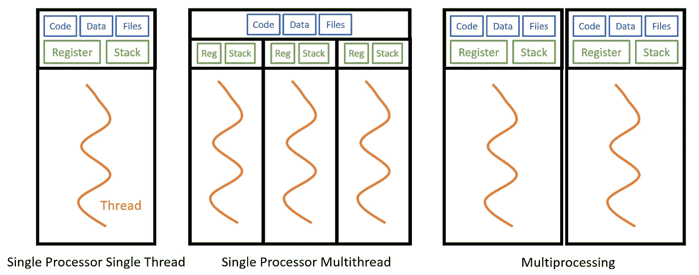

# 10 分钟内完成多线程和多处理

> 原文：<https://towardsdatascience.com/multithreading-and-multiprocessing-in-10-minutes-20d9b3c6a867>

## Python 示例简化了多任务处理


默里·坎贝尔在 [Unsplash](https://unsplash.com?utm_source=medium&utm_medium=referral) 上拍摄的照片

多线程和多处理是实现多任务的两种方式(想想分布式计算！)在 Python 中。 ***多任务*** 在并行运行函数和代码时很有用，比如将数学计算分解成多个更小的部分，或者在一个 for 循环中拆分彼此独立的项。本文将介绍和比较多线程和多处理之间的区别，何时使用每种方法，以及如何在 Python 中实现它们。

***更新*** *:本文是系列文章的一部分。查看其他“10 分钟内”话题* [*此处*](https://medium.com/@kayjanwong/list/in-10-minutes-eeaa9aa67055) *！*

# 目录

1.  [多线程与多处理](https://medium.com/p/20d9b3c6a867/#6517)
2.  [多线程作为 Python 函数](https://medium.com/p/20d9b3c6a867/#99ae)
3.  [作为 Python 类的多线程](https://medium.com/p/20d9b3c6a867/#7fda)
4.  [作为 Python 函数的多重处理](https://medium.com/p/20d9b3c6a867/#4123)

# 多线程与多处理

根据正式定义， ***多线程*** 是指处理器并发执行多个线程的能力，其中每个线程运行一个进程。而 ***多处理*** 指的是系统并发运行多个处理器的能力，其中每个处理器可以运行一个或多个线程。



图 1:多线程与多处理的对比——作者图片

从上图中，我们可以看到在多线程中(中间的图)，多个线程共享相同的代码、数据和文件，但运行在不同的寄存器和堆栈上。多重处理(右图)使单个处理器倍增，复制代码、数据和文件，这会产生更多开销。

多线程对于 ***IO 绑定进程*** 很有用，比如从网络或数据库读取文件，因为每个线程可以并发运行 IO 绑定进程。多重处理对于 CPU 受限的进程 很有用，例如计算量大的任务，因为它将受益于拥有多个处理器；类似于多核计算机比单核计算机工作得更快。

请注意，对 CPU 受限的进程使用多线程可能会降低性能，因为竞争资源确保一次只能执行一个线程，并且在处理多个线程时会产生开销。

另一方面，多重处理可以用于 IO 绑定的进程。然而，如上所述，管理多个进程的开销高于管理多个线程的开销。您可能会注意到，由于程序使用多个 CPU 内核，多处理可能会导致更高的 CPU 利用率，这是意料之中的。

# 作为 Python 函数的多线程

多线程可以使用 Python 内置库`threading`实现，并按以下顺序完成:

1.  创建线程:每个线程都用它的参数标记到一个 Python 函数
2.  开始任务执行
3.  等待线程完成执行:有助于确保完成或“检查点”

在下面的代码片段中，实现了上面的步骤，以及一个线程锁(第 22 行)来处理竞争资源，这在我们的例子中是可选的。

有一些值得注意的观察

*   第 12–15 行:进程在不同的线程(线程 ID)上运行，但是使用相同的处理器(进程 ID)
*   第 8 行:如果在获取和释放锁之间实现`time.sleep(sleep_duration)`,线程将按顺序运行，不会节省任何时间——您可以试试！

# 作为 Python 类的多线程

对于喜欢面向对象编程的用户来说，多线程可以作为一个继承自`threading.Thread`超类的 Python 类来实现。使用类而不是函数的一个好处是能够通过类对象共享变量。

将多线程实现为函数和类的区别在于第 1 步(创建线程)，因为线程现在被标记为类方法而不是函数。调用`t1.start()`和`t1.join()`的后续步骤保持不变。

```
import time

class Sleep(threading.Thread):
    def __init__(self, sleep_duration):
        self.sleep_duration = sleep_duration

    def sleep(self):
        time.sleep(self.sleep_duration)

if __name__ == "__main__":
    # Create thread
    sleep_class = Sleep(2)
    t1 = threading.Thread(target=sleep_class.sleep)
```

# 作为 Python 函数的多重处理

多重处理可以通过 Python 内置库`multiprocessing`使用两种不同的方法实现——进程和池。

***进程*** 方法类似于上面的多线程方法，其中每个进程都用其参数标记为一个函数。在下面的代码片段中，我们可以看到多处理比多线程花费的时间更长，因为运行多个处理器的开销更大。

***Pool*** 方法允许用户定义工作进程的数量，以先进先出的调度方式将所有进程分配给可用的处理器，自动处理进程调度。池方法用于使用`map`或`starmap`(第 19 行)将一个函数分成多个小部分——用不同的输入参数运行同一个函数。而 Process 方法用于运行不同的功能。

希望本文介绍了多线程和多重处理的概念，以及何时使用每种方法。Python 示例是可以用您的函数替换的框架代码片段，您已经准备好了！

**感谢您的阅读！如果你喜欢这篇文章，请随意分享。**

# 相关链接

【https://docs.python.org/3/library/threading.html】Python 文档:[T2](https://docs.python.org/3/library/threading.html)

`multiprocessing` Python 文档:[https://docs.python.org/3/library/multiprocessing.html](https://docs.python.org/3/library/multiprocessing.html)