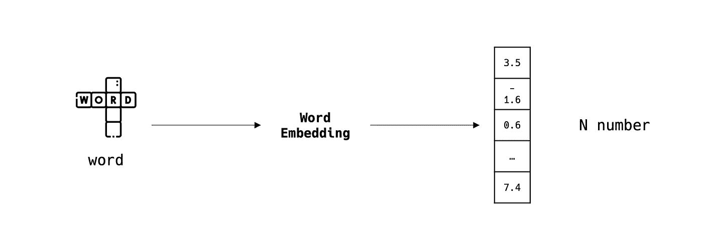
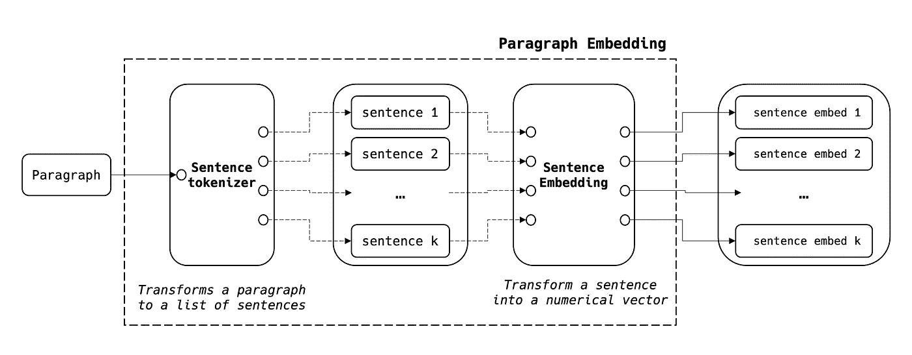
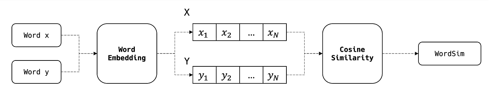
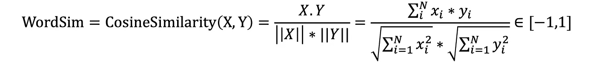
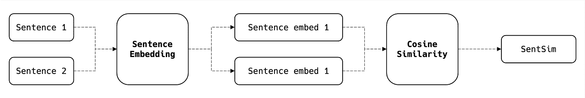
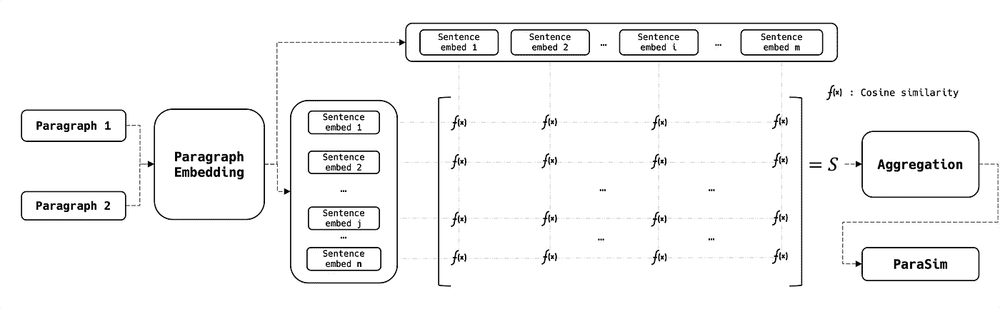
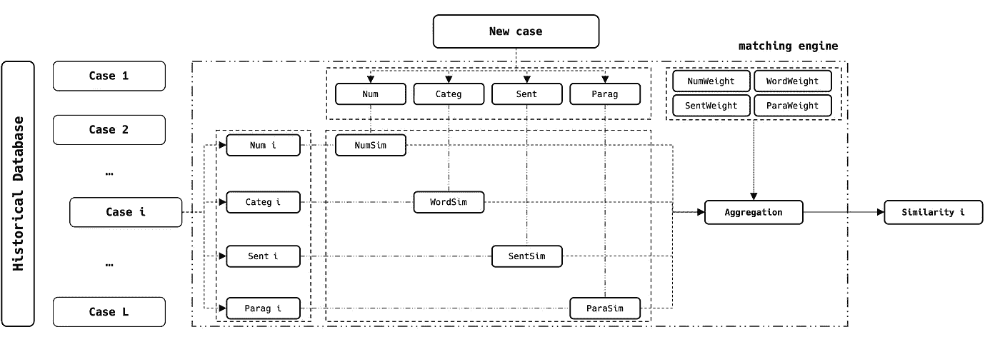

# 文本、分类和数字数据的多元匹配引擎

> 原文：<https://towardsdatascience.com/multivariable-matching-engine-on-textual-categorical-and-numerical-data-d90b0dca7f4c>

照片由 [Pixabay](https://www.pexels.com/fr-fr/photo/gros-plan-de-la-photographie-d-un-fruit-cerise-rouge-162689/) 拍摄

## 发现嵌入和相似性的力量

如今，许多公司不得不在其活动中处理类似的案件。他们中的少数人利用旧的和以前的工作，而绝大多数人从头再来。

在本文中，我们将发现如何利用人工智能算法来构建一个匹配引擎，该引擎可以使用文本、分类和数字变量。

为简单起见，我们将考虑一个案例由以下数据描述:

*   *Num* :数值型变量
*   *类别*:分类变量(一个单词)
*   *已发送*:文本变量(1 个句子-需要嵌入)
*   *段落*:文本变量(段落-需要嵌入)

如果您的数据库不遵循相同的结构，您可以应用预处理管道来实现相同的场景。

# 目录

摘要如下:

# 1-嵌入
2-相似性
3-匹配引擎

# **嵌入**

## 单词嵌入

单词嵌入是在大小为 N 的向量空间中表示单词的艺术，其中语义相似的单词，从数学上来说，彼此接近。
在处理文本数据时，这是一个重要的步骤，因为 ML 算法主要处理数值。

作者图片

单词嵌入算法有 [Word2Vec](https://ar5iv.labs.arxiv.org/html/1402.3722) 、 [FastText](https://ar5iv.labs.arxiv.org/html/1607.04606) 、 [BERT](https://ar5iv.labs.arxiv.org/html/1810.04805) 、…，在不同语言中有几种改编。

## 句子嵌入

一个句子是一系列单词。也就是说，我们可以按照以下步骤聚合单词嵌入来生成句子嵌入:

作者图片

其中:

作者图片

*   NB1:在清理阶段，我们可以只保留要嵌入的关键字
*   NB2:聚合公式可以平衡长句和短句
*   NB3:句子嵌入的大小与单词嵌入的大小相同

## 段落嵌入

鉴于段落是一系列句子的事实，我们可以使用与上面相同的方法:

作者图片

*   NB1:在普通语言中，句子通常用字符串“.”来分隔，但在某些情况下可能需要定制。
*   NB2:段落嵌入的大小是(N，k ),其中 N 是句子嵌入的大小，k 是段落中句子的数量。

# 类似

## 数字相似性

让我们考虑两个数值 x、y 和 NumSim，两者之间的距离定义如下:

作者图片

如果:

*   x=y => NumSim(x，y)=1
*   x>>y => NumSim(x，y) **≈1/(|x|+1)≈0**

## 词汇相似性

有许多方法可以计算两个单词之间的相似度，下面我们列举两种最著名的方法:

*   *近似字符串匹配*(基于字符):Levenshtein 的距离，…
*   *语义串匹配*(基于嵌入):余弦相似度、欧几里德距离、…

在本文中，我们将主要关注余弦相似度，它只不过是两个比较单词的两个嵌入向量之间的角度的余弦:

作者图片

其中:

作者图片

## 句子相似性

我们遵循相同的方法，这次使用上面定义的句子嵌入算法:

作者图片

其中:

作者图片

## 相似之处

这一段的相似之处稍微复杂一些，因为它们的嵌入被认为是 2D 矩阵而不是向量。为了比较这两个段落，我们计算每个对等句子的 SentSim，并生成 2D 相似度矩阵，然后将该矩阵汇总为一个分数:

作者图片

其中:

作者图片

# **匹配引擎**

如前所述，让我们考虑一个业务案例，其中我们必须处理许多案例。每种情况都用四个变量描述: *Num、Categ、Sent 和 Parag* (见简介)。
我们可以利用历史数据将每个新案例与整个数据库进行比较，并使用下图选择最相似的案例:

作者图片

其中:

作者图片

我们对从 1 到 L(数据库的大小)的所有情况执行这些操作，并输出最高的匹配分数。

*   NB1:如果 *Categ* 变量具有唯一且稳定的模态，我们可以用简单的过滤代替匹配
*   NB2:如果每种类型有不止一个变量，可以使用正确的相似性方法将它们堆叠到同一个引擎中
*   NB3:每个变量的权重根据其业务优先级和重要性进行选择

# 结论

匹配引擎在科技界非常流行和使用。它们为企业提供了更快的处理工具，节省了时间和资金。
在本文中，我们关注的是特定类型的输入(数字和文本)，但是您也可以想象使用一个图像作为我们案例的额外描述。这需要使用 CNN 技术，例如[暹罗网络](/object-detection-face-recognition-algorithms-146fec385205)，其生成与余弦相似性一起使用的图像嵌入，以生成额外的匹配分数。