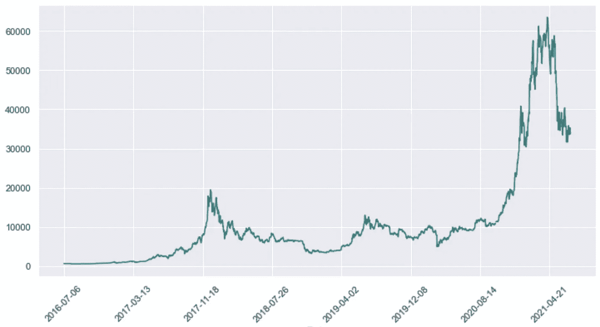
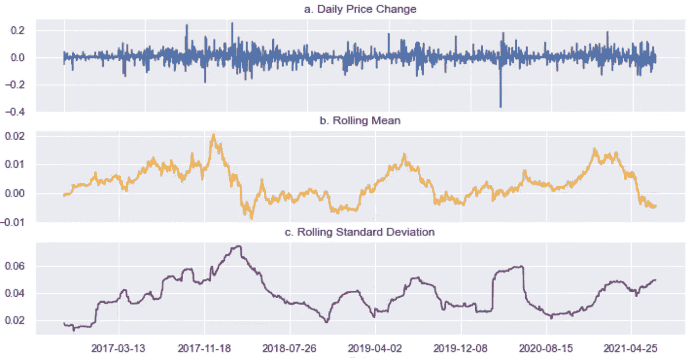
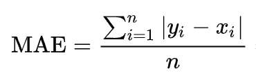
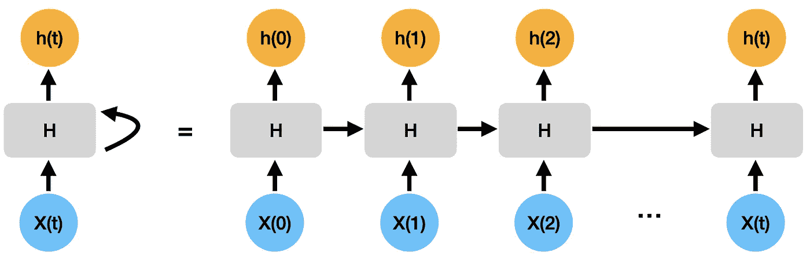
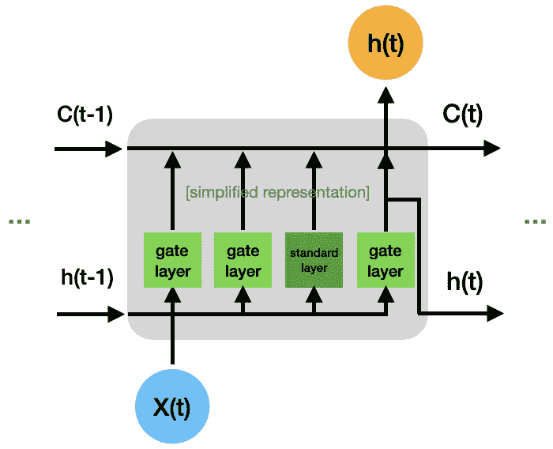
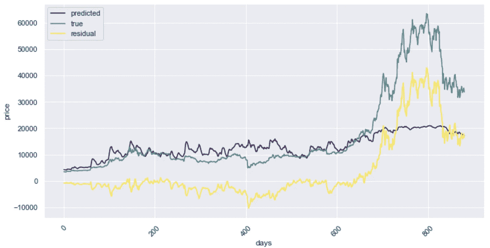

# 基于深度学习的多元时间序列预测

> 原文：<https://towardsdatascience.com/multivariate-time-series-forecasting-with-deep-learning-3e7b3e2d2bcf>

## 用 LSTM 网络进行时间序列预测并解释结果

照片由[德鲁·比默](https://unsplash.com/@drew_beamer?utm_source=unsplash&utm_medium=referral&utm_content=creditCopyText)在 [Unsplash](https://unsplash.com/s/photos/future?utm_source=unsplash&utm_medium=referral&utm_content=creditCopyText) 上拍摄

预测，对未来做出预测，在任何想要保持业务成功的公司的决策过程中起着关键作用。这是因为明天的成功取决于今天的决策，而决策是基于预测的。因此，良好的预测是至关重要的，例如，预测销售以更好地规划库存，预测经济活动以通知业务发展决策，甚至预测组织内的人员流动以改进人员规划。

在这篇文章中，我们展示了如何利用多个历史时间序列结合递归神经网络(RNN)，特别是长短期记忆(LSTM)网络[1]，来预测未来。此外，我们使用基于 DeepLIFT [4][5]的方法来解释结果。

我们选择这种建模方法是因为它在传统方法不适用的环境中提供了最先进的性能。特别是，当时间序列数据复杂时，即趋势和季节模式随时间变化时，像 LSTM 网络这样的深度学习方法是 ARMA(自回归移动平均)等更传统方法的可行替代方法[2]。LSTM 模型最初是为自然语言处理(NLP)任务开发的，现在已经进入了时间序列预测领域，因为与文本一样，时间序列数据是按顺序出现的，序列不同部分之间的时间关系对于确定预测结果很重要。

此外，我们希望通过找到对预测贡献最大的重要特征来揭示经过训练的神经网络。

我们使用的示例是根据价格本身的历史时间序列以及其他特征(如交易量和日期衍生特征)来预测[比特币](https://finance.yahoo.com/quote/BTC-USD/history?p=BTC-USD)的未来价格。我们选择这个数据是因为它体现了个人投资者在决定购买或出售资产时所做决策的动态变化和行为方面。这些方面也确实出现在其他预测问题中，如引言中提到的那些问题。这篇文章只是为了教育目的而写的，你不应该把它看作是投资建议。

# 数据探索和准备

[数据集](https://finance.yahoo.com/quote/BTC-USD/history?p=BTC-USD)由 2016 年 7 月至 2021 年 7 月的每日价格(包括开盘价、最高价、最低价、收盘价，均以美元报价)和成交量(以美元计算的每日交易量)组成。

下图显示了每日收盘价的时间序列(图 1)。您已经可以看到时间序列的特点是频繁的峰值、低谷以及不断变化的(局部)趋势。

图 1:每日比特币价格[图片由作者提供]

## 时间序列平稳性

传统的统计预测技术要求数据是稳定的，即具有恒定的均值、标准差和自相关性。然而，如果不满足平稳性的条件，预测技术，如 ARMA，不能模拟数据随时间的相关性结构，因此必须使用其他技术。

让我们仔细看看我们的例子，并做一些视觉检查。简单地看一下上面的价格时间序列(图 1)，你可以看到它并不是平稳的，因为平均值是随着时间变化的。典型的时间序列问题，下一步将是转换时间序列，试图使其平稳。我们采用价格水平的一阶百分比差来获得每日价格变化。此外，我们计算每日价格随时间变化的滚动平均值和滚动标准差。在图 2 中，你可以看到每日价格变化的均值和标准差都不是恒定的，因此时间序列不是稳定的。

图 2:每日价格变化(a .)，价格变化的 90 天滚动平均值(b .)，价格变化的 90 天滚动标准差(c .)[图片由作者提供]

时间序列表现出强烈的、不规则的动态性，这是传统预测技术不太适合的。另一方面，rnn，尤其是 LSTM 模型，已经证明可以很好地处理更复杂的时间序列，正如在许多 Kaggle 比赛中看到的那样，这就是我们关注它们的原因。

## 特征生成和准备

我们从数据集中获得了另外两个特征，包括作为日内价格变动衡量标准的高低点之间的百分比差异，以及作为隔夜价格变动衡量标准的第二天开盘和收盘之间的百分比差异。此外，我们从日期列派生出三个特性，包括星期几、月份和季度，以帮助预测我们的目标特性，即收盘价(Close)。

鉴于我们的金融时间序列数据相对干净和结构化，我们不必花太多时间清理和准备数据。准备步骤包括将我们的数据集分为训练集和测试集，以及将所有要素重新调整到介于 0 和 1 之间的通用比例，这有助于防止要素处于不同比例时模型过度拟合。通常，我们会在分析结束时保留一个用于模型评估的保留数据集，但在我们的情况下，观察模型在测试数据集上的性能就足够了。

# 多元时间序列预测

接下来，我们致力于建立一个时间序列预测模型，该模型可以将多个变量(及其各自的历史)作为输入，以预测未来的价格。

## 目标

在我们深入建模方面之前，有必要确定一个与业务目标一致的目标(或成本)函数，以确保模型能够实际帮助实现期望的业务结果。目标是创建一个预测模型，尽可能准确地预测价格，同时优先考虑更持久的价格变动(如每周趋势)，而不是更小、更易变的周内变动。

我们做出以下考虑:

*   我们选择均方误差(MSE)作为我们的主要成本函数，因为我们的数据集是高质量的，也就是说，不存在因数据误差而导致的异常值，否则这些异常值可能会导致使用此误差指标的模型过度拟合。
*   实际上，我们选择了均方根误差(r MSE ),见图 3，而不是均方根误差，原因很简单，因为 RMSE 与预测变量有相同的单位。
*   在其他情况下，如预测销售额，数据可能会有错误，例如，如果没有考虑假期。该模型将错误地预测低销售额，并且由此产生的大误差将在训练期间被错误地惩罚。
*   鉴于我们的数据中存在一些较大但罕见的价格波动，RMSE 可能会导致模型过度拟合。此外，我们更感兴趣的是预测总体趋势，而不是时间序列的短期运动。因此，我们选择包括平均绝对误差(MAE ),见图 4，作为额外的性能测量，因为它比 RMSE 对异常值更宽容。

图 3:均方根误差[图片由作者提供]

图 4:平均绝对误差[图片来自作者]

我们的目标是尽量减少 RMSE 和梅。

## 递归神经网络和长短期记忆

让我们专注于构建预测模型。为此，我们将快速回顾递归神经网络(RNN)以及长短期记忆(LSTM)网络。

RNNs 是一种神经网络架构，主要用于检测语言等序列数据中的模式，或者在我们的情况下，检测数字时间序列中的模式。为了检测数据中的序列模式，信息通过网络循环传递，即信息被传输回模型[3]。这使得 RNN 除了考虑当前输入 X(t)之外，还能够考虑先前的输入 X(t-1)。在图 5 中，您可以看到信息 h(t)是如何从网络的一个步骤传递到下一个步骤的。

图 5:展开的 RNN，X(t)作为时间 t 的输入，H 作为隐藏层，h(t)作为时间 t 的隐藏层输出[图片由作者提供]

关于如何通过随时间反向传播来训练 RNN 的更多信息也可以在[3]中找到。随着序列变得更长，当前隐藏状态将需要保留来自先前隐藏状态的越来越多的信息，这对于非常长的序列来说会变得有问题。对于每个时间步长，随着涉及更多的变换，渐变可以减少(或增加)，最终导致渐变消失(或爆炸)。这意味着远早于当前时间步长发生的状态的贡献会丢失(或占主导地位)。

LSTMs 是一种特殊类型的 rnn，它比标准 rnn[1][3]更好地处理了这种长距离依赖性。与 RNNs 类似，LSTMs 具有链状结构，但每个重复的块(LSTM 单元)与标准 RNN 相比，具有 3 个额外的全连接层(图 6)。这些附加层也称为栅极层，因为它们的激活(sigmoid)与标准层(tanh)不同。当信息通过每个 LSTM 单元时，单元状态 C(t)可以通过经由栅极层添加或移除信息来更新。这就是 LSTM 模型如何决定是保留还是丢弃先前时间步长的信息。

图 6:简化的 LSTM 单元，X(t)为 t 时刻的输入，C(t)为当前单元状态，h(t)为 t 时刻的隐藏层输出[图片由作者提供]

关于 LSTMs 的更多细节和确切结构，可以参考[1]。

## 模型训练和评估

我们的特定预测模型由两个 LSTM 层和一个全连接层组成，用于预测第二天的价格。我们使用一个数据集类来生成序列长度为 30 天的特征集的时间序列，并使用一个数据加载器类来批量加载它们。我们使用 Adam 优化器和 RMSE 以及 MSE 作为损失函数来训练模型(在单独运行期间)。此外，如果没有显著的性能改进，我们实施提前停止以允许培训作业提前完成。

由于输入数据被缩放到 0 和 1 之间的级别，我们必须将模型的输出按比例缩小(去缩放)到原始比例，以便能够根据实际价格级别评估预测。重点不在于调整最佳模型，所以我们只使用一组超参数进行训练，并将其视为基线模型。在对该模型进行了大约 10-15 个时期的训练并对其输出进行了缩放之后，该模型在测试数据集上实现了大约 10，000 的 RMSE 和大约 6，500 的 MAE。

让我们来看看对测试数据的预测(图 7)。您可以看到，该模型在预测整体价格发展方面做得相对较好，这是我们在测试数据集的第一季度的目标。在中间阶段(300-450 天)，该模型似乎总是高估价格，并且未能预测到接近结束时(680 天及以后)的极端价格上涨，这解释了上面提到的较大误差。

图 7:模型预测(预测)与实际价格(真实)及其差异(残差=真实-预测)[图片由作者提供]

如果我们只在测试数据集的前 30 天验证模型的性能，它会显著提高。RMSE 和 MAE 都下降到大约 750，这意味着该模型的预测平均错过了大约 750 的价格。我们可以在图 7 中看到，随着训练时间(第 0 天)的推移，模型的预测越来越差。在时间序列预测中，必须经常重新训练模型，以便它可以从最新的观察中学习。根据最近的数据训练模型，可以让它学习和吸收最新的模式和信号。

该模型未能预测价格的几次高峰和低谷，这一事实表明缺少输入因素。向训练数据集中添加更多要素有助于进一步改进模型预测。

这并不是对模型预测误差的详尽分析，但足以满足我们的目的。接下来，我们将使用这个基线模型，并尝试解释它的预测。

## 重要特征

对于神经网络，理解模型做出预测的原因可能很困难。我们使用一种基于深度提升算法[4][5]的方法，该算法近似于经典博弈论中已知的 SHAP 值。基本上，这种方法旨在回答这样一个问题，即当某个要素存在时(在输入中)与不存在时(不在输入中)相比，该要素对模型预测的贡献有多大，从而得出该要素的重要性。更具体地，该方法通过反向传播网络中所有神经元对输入的每个特征的贡献来分解神经网络对特定输入的输出预测。然后，它将每个神经元的激活与其参考激活进行比较，并根据差异分配贡献分数(或乘数)。参考输入表示根据域选择的一些默认或中性输入，例如零或特征平均值。基于代表性数据集(或背景数据集)计算乘数后，我们可以基于一些样本输入计算输入要素对模型输出的贡献，并按照贡献最大的顺序对要素进行排序，以获得其重要性。

我们使用 900 个训练数据样本作为背景数据集，并使用 100 个测试数据样本来解释模型的输出。由于在每个时间步长计算每个输入样本的特征重要度，因此我们对所有 100 个输入样本进行平均，并按特征和时间步长绘制重要度图(图 8)。前三个输入特征是交易量、收盘价和日内高低百分比价格变化。我们还可以看到，与更远的时间步长(第-30 天到第-8 天，其中第 0 天是预测时间)相比，更近的时间步长(第-7 天到第-1 天)在进行预测时起着更重要的作用。

图 8:基于深度 SHAP 的重要特征

理解深度学习模型的预测对于减少在需要可解释性的应用中采用的障碍是至关重要的。除了以一定的准确度预测结果之外，我们现在可以测量其最重要的贡献者。例如，如果我们要预测一家公司的产品销售，通过应用这种特征重要性技术，我们可以进一步了解销售为什么会发生变化，并设计行动计划来促进预期的业务成果(例如，通过支持有助于提高销售额的特定营销活动来增加销售额)。

此外，从发现重要特征中获得的见解也有助于为模型优化过程提供信息。例如，在这里，缩短输入序列长度以及删除不重要的特征将提高训练和推理速度，同时可能不会对预测性能产生太大影响。

# 结论

在本文中，我们展示了如何基于 LSTM 网络构建一个多元时间序列预测模型，该模型可以很好地处理具有复杂模式的非平稳时间序列，例如，在传统方法缺乏的领域。在将预测目标与我们的“业务”目标联系起来之后，我们只需要很少的数据准备就可以对模型进行训练和评估。此外，我们使用基于 DeepLIFT 的技术发现了哪些特征(以及哪些时间步长)驱动了模型的预测。这使得我们能够解释深度学习模型，并从中得出更好的决策。

这篇博文附带的 Github 代码可以在[这里](https://github.com/danielhkt/deep-forecasting)找到。

参考资料:

[1] Hochreiter 和 Schmidhuber。“长短期记忆”。(1997)

[2]博克斯和詹金斯。时间序列分析、预测和控制。(1994)

[3]施密特。“递归神经网络(RNNs):一个温和的介绍和概述”。(2019)

[4] Shrikumar、Greenside 和 Kundaje。“通过传播激活差异学习重要特征”。(2017)

[5]伦德伯格和李。“解释模型预测的统一方法”。(2017)