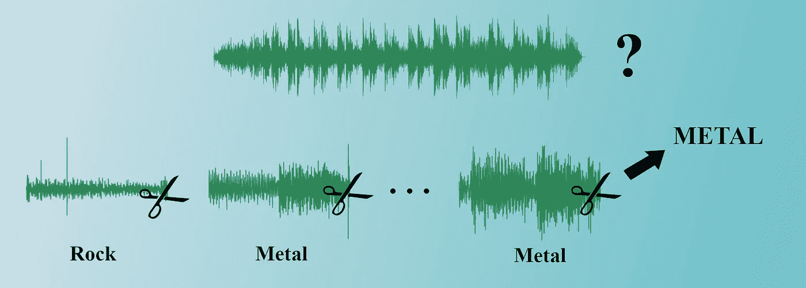
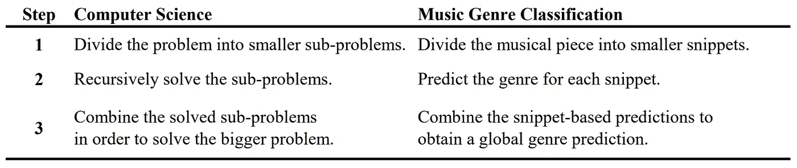
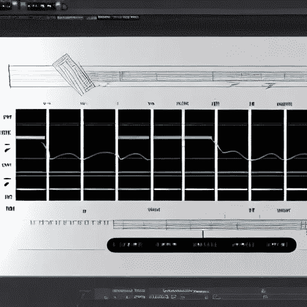
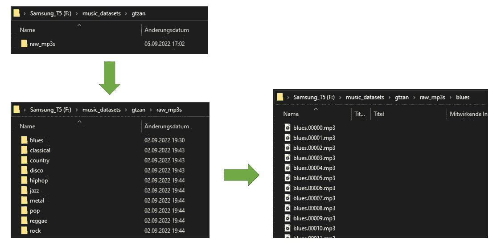
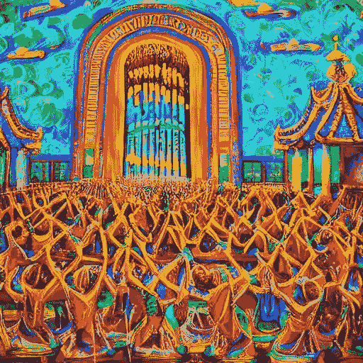
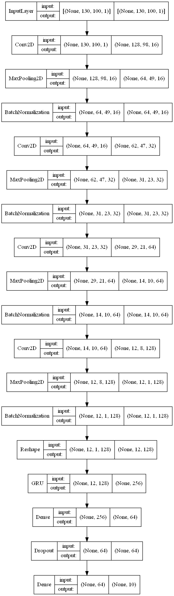
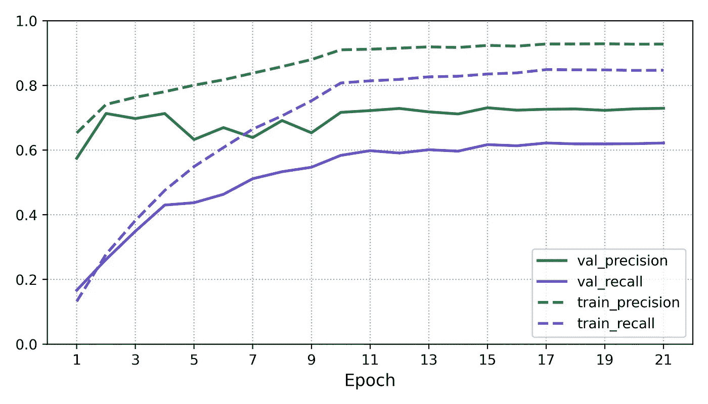
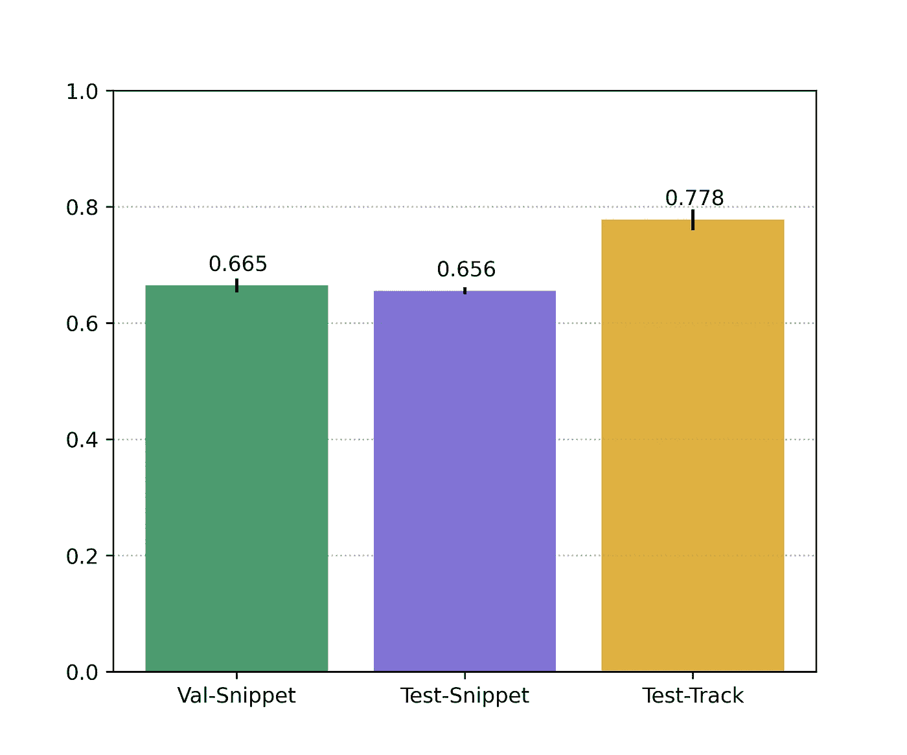

# 基于分而治之 CRNN 的音乐流派分类

> 原文：<https://towardsdatascience.com/music-genre-classification-using-a-divide-conquer-crnn-2ff1cf49859f>

## 一种适用于小数据集的有效方法



图片作者。

# 音乐流派分类中的 C(R)NNs

自从 CNN 在 2012 年开始在图像处理领域爆发以来，这些网络很快被应用于音乐流派分类，并取得了巨大的成功！今天，在所谓的*频谱图*上训练 CNN 已经成为最先进的技术，取代了几乎所有以前使用的基于手工制作的特征、MFCCs 和/或支持向量机(SVM)的方法。

最近几年，已经开始显示将 LSTMs 或 GRUs 之类的循环层添加到经典 CNN 架构中会产生更好的分类结果。对此的直观解释是，卷积层计算出什么和什么时候，而递归层发现什么和什么时候之间有意义的关系。这种架构被称为**卷积递归神经网络(CRNN)** 。

# 分治分类


AI 生成的图像(稳定扩散 1.5)。提示:“一群互相争斗的人，这样他们就不会联合起来对抗一个人”，分而治之的军事定义。图片作者。

当我第一次了解《分而治之》时，我很困惑，因为我是在军事背景下听说的。军方的定义是

> “使一群人意见相左，互相争斗，这样他们就不会联合起来反对一个人”(【www.merriam-webster.com】[)](http://www.merriam-webster.com)

然而，这几乎是**与我们的目的**相反的意思！参见*表 1* ，其中列出了计算机科学和音乐流派分类中 divide &征服背后的三步过程。



表 1 —计算机科学和音乐流派分类中的分而治之。

虽然定义不一样，但它们确实有很多重叠，而且我个人认为“分治”这个术语在这两种情况下都非常合适。在音乐流派分类中，该术语最早由董(2018)使用(据我所知)。然而，其他研究人员如 Nasrullah 和赵(2019)也使用了这种方法-只是没有使用相同的名称。

通常，流派分类仅仅基于一个 30 秒的片段。这部分是因为常用的音乐数据源如 [GTZAN](https://www.kaggle.com/datasets/andradaolteanu/gtzan-dataset-music-genre-classification) 或 [FMA](https://github.com/mdeff/fma) 数据集或 Spotify Web API 提供了这样长度的曲目。然而，应用分治法有三大优势:

## 1.更多数据

假设您有完整长度的音轨，那么获取一个 30 秒的片段并丢弃剩余的 3-4 分钟的音轨是非常低效的。使用分治法，可以使用大多数音频信号。此外，通过允许切片之间的重叠，甚至可以绘制更多的片段。事实上，我认为这是一种自然的、相当无缝的数据扩充形式。

例如，与每个音轨绘制一个 30 秒的片段相比，如果您绘制一个 3 秒的片段并与 1 秒重叠，您可以从 3 分钟的音轨中获得超过 80 倍的训练数据。即使你只有 30 秒的音轨，你也可以从每个音轨中获得 14 个 3 秒的片段和 1 秒的重叠。

## 2.低维数据

一个 30 秒的片段产生了一个相当大的声谱图。在常用参数下，一个谱图可以有(1290 x 120)的形状，即**超过 15 万个数据点**。自然，一个 3 秒的片段，同样的参数会产生一个只有**15k 个数据点**的~(129 x 120)声谱图。根据您使用的机器学习模型和架构，这可以显著降低模型的复杂性。

**边注**:如果你不知道什么是频谱图，或者它们为什么以及如何用于音频分类，我推荐[这篇由](https://medium.com/x8-the-ai-community/audio-classification-using-cnn-coding-example-f9cbd272269e)[实验作家](https://medium.com/u/27bf142e87f1?source=post_page-----2ff1cf49859f--------------------------------)撰写的文章，它给出了一个漂亮而直观的解释。

## 3.与音频输入长度无关

如果你想在现实世界中应用你训练过的模型，你会遇到各种长度的轨迹。你不必费力去寻找合适的 30 秒片段，而是开始画 3 秒的片段，直到覆盖整个音轨。如果输入的音轨长度不到 30 秒呢？你的模型是否足够健壮来处理 10 秒的广告词，这些广告词被零填充以达到 30 秒？分而治之，这不是问题。

## 不足之处

使用分治法有三个主要缺点。首先，它增加了额外的处理步骤来分割音频文件并执行完整音轨的聚合预测。此外，基于片段的方法需要轨道式的训练-验证-测试分离，以避免相互关联的训练、验证和测试数据集。

幸运的是，这两个步骤都已经包含在我的单标签音频处理管道 [*SLAPP*](https://github.com/MaxHilsdorf/single_label_audio_processing_pipeline) 中，在 GitHub 上**可以免费获得。**

最后，单个片段的预测通常使用某种多数投票进行汇总。这样，你的模型就完全忘记了任何超过 3 秒钟的音乐关系。除非您为聚合过程开发另一个复杂的元分类器。

## 何时使用分而治之

如果你有大量的数据，并且不需要更多的数据，或者如果你想分析在较长时间内展开的音乐结构，你可能不想使用分治法。但是，如果您的数据有限，并且希望用它来构建一个健壮而灵活的分类器，请考虑这种令人兴奋而有效的方法！

# 利用 SLAPP 进行数据处理



AI 生成的图像(稳定扩散 1.5)。提示:“功能强大的音乐处理机器的概念艺术”。图片作者。

## 什么是 SLAPP？

本文也作为我新开发的 [**单标签音频处理流水线(SLAPP)**](https://github.com/MaxHilsdorf/single_label_audio_processing_pipeline) **的展示。**该工具自动化了单标签音频分类任务的整个数据处理工作流程。这包括将轨道分割成片段，计算光谱图，执行轨道方向的列车验证测试分割，等等。

由于在家用电脑上处理音频数据需要很长时间，SLAPP 允许你在任何时候关闭电脑并重新加载你的进度，而不会有任何明显的时间或数据损失。在为我的学士论文开发了这个管道之后，我在几个分类任务上尝试了一下，从中获得了很大的乐趣和成功。

在 [**GitHub**](https://github.com/MaxHilsdorf/single_label_audio_processing_pipeline) 上查看 SLAPP，亲自试用**。**

## 使用 SLAPP 处理 GTZAN

[GTZAN](https://www.kaggle.com/datasets/andradaolteanu/gtzan-dataset-music-genre-classification) 是一个众所周知的公开可用的流派分类数据集，以**来自 10 个不同流派的 100 首 30 秒长的曲目为特色**。这个数据集非常适合我们的目的，因为它背后有大量的研究，而且它只有有限的数据。

为了使用 SLAPP，你需要把你的 MP3(不是 WAV)文件放在一个文件夹结构中，就像图 1 中的*所示。*



图 1 —使用 SLAPP 所需的文件夹结构示例。图片作者。

因为 GTZAN 就是这样的文件夹结构(耶！)，我们现在需要做的就是将 WAV 文件转换成 MP3 文件，我们就可以开始了。我建议您通过遍历目录，并使用

```
from pydub import AudioSegmentAudioSegment.from_wav("/input/file.wav").export("/output/file.mp3", format="mp3")
```

接下来，您需要做的就是通过导航到您想要的目录并使用以下命令来克隆 SLAPP 存储库:

```
**git clone** https://github.com/MaxHilsdorf/single_label_audio_processing_pipeline
```

确保您的系统满足使用 SLAPP 的所有要求；例如，Python 库 [Pydub](https://github.com/jiaaro/pydub) 和 [Librosa](https://librosa.org/doc/latest/index.html) 以及音频编解码器 [FFmpeg](https://ffmpeg.org/download.html) (在资源库中有详细描述)。

现在，在 SLAPP 中，我们打开“pipeline_parameters.json”并像这样设置参数:

这样，我们从 GTZAN 内的每个 30 秒的轨道中提取多达 14 个 3 秒的片段，允许 1 秒的重叠。通过运行“build_dataset.py”构建数据集，然后通过运行“process_dataset.py”对数据集进行归一化和混洗。这就是你要做的一切。SLAPP 会帮你处理剩下的事情。

验证和测试各占 10%，您将获得 **11，186 个训练谱图**和 1，386 个验证和测试数据的谱图。每个谱图的形状为(130 x 100)。

**旁注**:如果你不只是阅读，而是实际编码，这个处理步骤会花一些时间，因为有很多计算步骤。在此过程中的任何时候，您都可以停止脚本并重新启动它们，从您停止的地方继续。如果你在 SLAPP 上遇到任何技术问题，请随时告诉我，因为这是我的第一个软件版本，可能会有很多错误，或者我的文档可能不够。

# 构建和培训 CRNN



AI 生成的图像(稳定扩散 1.5)。提示:“音符的绘画建造了一个巨大的宗教寺庙”。图片作者。

## 模型结构

使用 Keras 库，我构建了这样一个 CRNN:

这种 CRNN 架构背后的思想是使用卷积层+最大池将频率维度压缩为标量值，同时将时间维度保持为向量。这允许我们将门控递归单元(GRU)应用于由卷积块提取的特征。据我所知，这种类型的建筑是由 Choi 等人(2017)提出的，并已被 Nasrullah 和 Zhao (2018)以及 Bisharad 和 Laskar (2019)等多项研究采用。

有关所用架构的详细概述，请参见图 2 。



图 2 —所用 CRNN 模型的架构。

在开发阶段，我尝试了该架构的不同变体，并比较了这些模型之间的验证损失。这种特殊的模型仅用大约 40 万个参数就取得了**的最高结果。**

**边注:**在这种情况下，SLAPP 会给你一个形状的训练数据张量(11186，100，130)。然而，为了训练这个特定的 CRNN，输入需要被整形为(11186，130，100，1)，有效地交换时间轴和频率轴(numpy.swapaxes)并增加另一个维度(numpy.expand_dims)。

## 模特培训

我用 Adam optimizer 训练模型，学习率为 0.0001，分类交叉熵损失，批量为 32。此外，我使用了 Keras 提供的 EarlyStopping、ReduceLROnPlateau 和 ModelCheckpoint 回调来确保训练顺利进行，并且只保存最好的模型。

正如您在*图 3* 中看到的，训练指标达到了接近 90%的精度和召回分数，而验证精度和召回分数收敛在 62%和 73%之间。鉴于我们只处理 3 秒钟的音频和 10 个平衡的类(通过随机猜测→ 10%的准确性)，这已经相当令人印象深刻了。总体而言，本次训练运行中的最佳模型实现了 67.32% 的**验证准确率。**



图 3-CRNN 训练运行的训练和验证指标。图片作者。

为了获得更稳定的结果，开始了 10 次训练运行并进行评估，以获得感兴趣的指标的平均分数和标准偏差。请记住，本文的目的不是提供复杂的统计评估，而是使用一个示例来展示分治分类的有效性。

# 片段与基于轨迹的分类


AI 生成的图像(稳定扩散 1.5)。提示:“陪审团严格审查一个有趣案件的照片，黑暗的气氛”。图片作者。

## 如何计算基于轨迹的预测？

对于基于音轨的预测，我将测试数据集中的每个音轨作为 MP3 文件加载。测试轨道名称由 SLAPP 自动写入您的数据目录中的“train_val_test_dict.json”。接下来，我使用的过程如下:

1.  **将音轨**分割成尽可能多的片段(在这种情况下，3 秒的片段有 2 秒的重叠)。
2.  将每个片段转换成适合训练模型的输入形状的 **mel 光谱图**。
3.  获取每个片段的原始类**预测。**
4.  **对所有片段中每个类的原始分数**求和。
5.  您的全局预测是具有**最高得分总和**的班级。

由于这对于初学者来说可能会变得相当复杂，我将为您提供另一个模块来自动化这个基于轨迹的预测过程:请在这里找到该模块及其文档[。](https://github.com/MaxHilsdorf/divide_conquer_track_analyzer)

## 分类结果

我对上面描述的模型进行了十次训练和评估，并对准确性得分进行了平均，以消除该过程的一些随机性。

参见*图 4* 获取准确度分数的直观概述。我们注意到的第一件事是，该模型在验证和测试数据上的表现几乎和**一样好，这是一个好迹象。此外，所有的标准偏差都很小，这告诉我们，我们真的可以在平均精度的差异。**

很容易看出，基于音轨的分类优于基于片段的分类，平均相差约 12.2 个百分点。虽然为了简单起见，我们不打算做任何统计测试，但不可否认的是，在这种情况下，通过 divide&convert 进行的**基于轨迹的分类要优于**。



图 4 —基于片段和基于跟踪的分类的准确性和标准偏差(10 次测试)。图片作者。

## 如果我们使用完整的 30 秒片段会怎么样？

到目前为止，我们已经表明(在这个例子中)基于音轨的分治分类优于 3 秒单片段分类。然而，如果我们在“原始”GTZAN 中的 1000 个 30 秒音频片段上构建 CRNN，我们可能会获得更高的准确性。

这是可能的，所以我试了一下。我基于 30 秒的切片构建了另一个类似架构的 CRNN(尽管由于数据较少，只有一半的参数),并对其进行了 10 次训练，以平均获得的准确度分数。这种方法在**的平均准确率仅为 55.8%** (SD=0.043)，远远低于任何 3 秒模型**。**

# 结论


AI 生成的图像(稳定扩散 1.5)。提示:“两幅真正深刻对话的音乐作品，抽象”。图片作者。

## 分而治之确实征服了

本文展示了分而治之的方法如何有助于为音频分类问题建立一个强大的分类器，即使没有太多的训练数据。数据处理管道 SLAPP 使得为单标签音频分类任务构建分而治之分类器所需的处理步骤变得非常容易。

## 3 秒比 30 秒好

为什么 30 秒的切片比 3 秒的切片更糟糕，尽管它们包含更多的信息？通过绘制 3 秒切片来增加数据集大小似乎有助于模型提取有意义的特征，而在处理由巨大光谱图组成的非常小的数据集时，它似乎会迷失方向。

可以说，如果使用其他数据格式，如 MFCCs 或更小维度的手工制作的功能，该模型将更容易处理 30 秒的音频文件。然而，本文表明，如果使用分治法，几乎任何音频数据集都可以用声谱图数据进行分类。

## SLAPP +分而治之的其他应用

如果你想在另一个类似的问题上尝试所提出的方法，这里有一些想法可能会启发你的下一个数据科学项目:

1.  基于语音数据的性别识别
2.  基于语音数据的口音识别
3.  音乐情感分类器
4.  使用来自机器传感器的音频数据构建分类器

> 非常感谢你对我的工作感兴趣！如果有什么对你不起作用，或者你在理解或应用这些概念时有困难，请告诉我。

# 参考

**[1]比沙拉德，D. &拉斯卡尔，R. H. (2019)** 。基于卷积递归神经网络结构的音乐类型识别。在:*专家系统* 36，4。

**【2】崔、k；法泽卡斯；桑德勒，M. &曹，K. (2017)** 。用于音乐分类的卷积递归神经网络。In: *国际声学、语音、信号处理会议 2017* 。

**【3】董，M. (2018)** 。卷积神经网络在音乐流派分类中达到人类水平的准确性。参加:*认知计算神经科学会议，2018 年 9 月 5 日至 8 日，宾夕法尼亚州费城*。

**【4】纳斯鲁拉，Z. &赵，Y. (2019)** 。音乐艺术家使用深度特征对音频、文本和图像进行分类。In: *arXiv* ，DOI:[10.48550/arXiv . 1707.04916](https://doi.org/10.48550/arXiv.1707.04916)