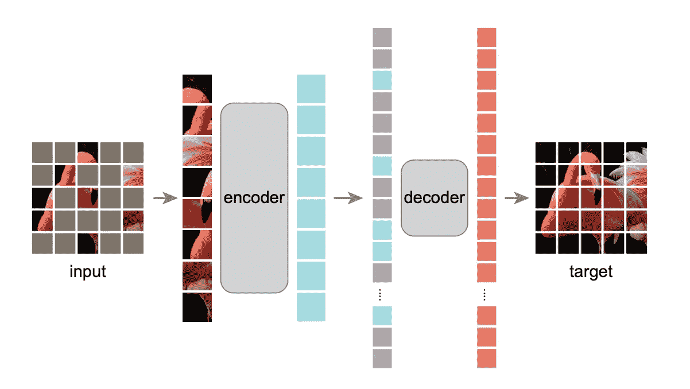
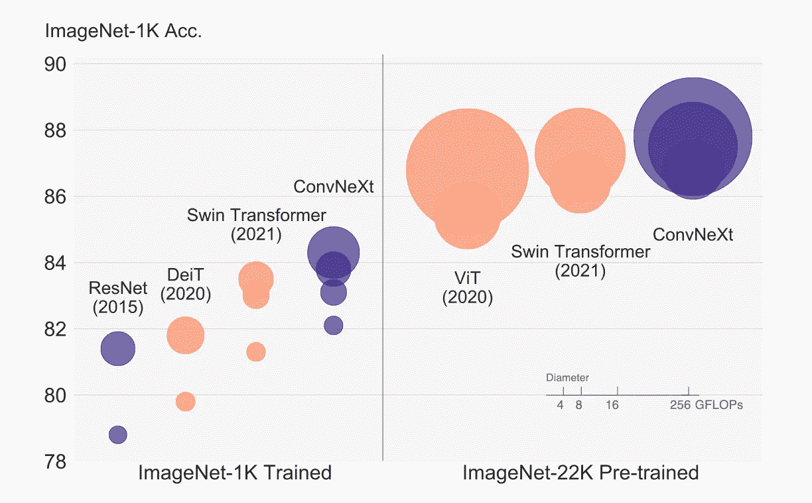
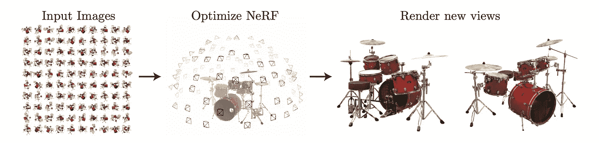
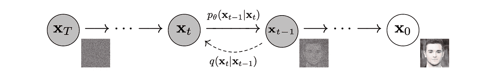

# 2020 年计算机视觉必读论文*更新*

> 原文：<https://towardsdatascience.com/must-read-papers-in-computer-vision-for-the-2020s-3943d5339ba4>

## 计算机视觉中深度学习技术的前沿

计算机视觉社区目前正在发生什么？如果你像我一样是一个狂热的计算机视觉爱好者，这里有几篇我近年来最喜欢的论文，我相信它们将对未来产生巨大的影响。

免责声明:这些论文是我认为的“基础”论文。有许多论文延伸到它们之外，具有很大的见解，我将逐渐在这里添加链接以供参考。

# 屏蔽的自动编码器是可扩展的视觉学习器

图一。屏蔽的自动编码器管道。从原始纸张中检索的图像。

如果你跟踪深度学习技术有一段时间了，你可能听说过 BERT，这是一种自我监督的技术，用于语言中，你可以屏蔽部分句子，进行预训练，以改善学习隐式表示。然而，在学习更好的特征提取方面，同样的技术不能转移到 CNN 上——直到最近引入了视觉变形金刚 vit。

对于 transformer 架构，He 等人研究了屏蔽是否适用，结果令人振奋:一个屏蔽的自动编码器伴随 ViTs 被证明是一种有效的预处理技术，用于分类和重建等下游任务。

【论文链接:【https://arxiv.org/abs/2006.11239】

## **相关论文:**

*   ***作为时空学习者的蒙版自动编码器:*[*https://arxiv.org/abs/2205.09113*](https://arxiv.org/abs/2205.09113)**
*   ***Point-BERT:预训练带遮罩点建模的 3D 点云变形器:*[*https://arxiv.org/abs/2111.14819*](https://arxiv.org/abs/2111.14819)**

# **21 世纪 20 年代的通信网**

****

**图二。ConvNeXt 与变压器的比较。从原始纸张中检索的图像。**

**另一方面，尽管 vit 在许多视觉任务的论文中表现出了优越性，但有一项工作在分析卷积网络(ConvNet)的基础方面表现突出。Liu 等人专注于“现代化”卷积网络，引入经验证明对 vit 有用的元素，并表明 ConvNet 确实可以在 ImageNet 等大型数据集上实现类似于 vit 的结果。**

***论文链接:【https://arxiv.org/abs/2201.03545】<https://arxiv.org/abs/2201.03545>***

## **相关论文:**

*   ***将您的内核扩展到 31x31:重温 CNN 中的大型内核设计:*[*https://arxiv.org/abs/2203.06717*](https://arxiv.org/abs/2203.06717)**

# ****NeRF:将场景表示为用于视图合成的神经辐射场****

****

**图 3。NeRF 的管道。从原始纸张中检索的图像。**

**移动到三维空间，在重建和新颖的视图合成方面也有惊人的突破。Mildenhall 等人提出使用全连接网络来表示 3D 形状。也就是说，给定一些坐标和视角，网络输出特定空间的相应颜色。这允许以高质量和精确的质量生成未知角度的物体的新图像/视图。**

***论文链接:*[*https://arxiv.org/abs/2201.03545*](https://arxiv.org/abs/2201.03545)**

## **相关论文:**

*   ***GNeRF:无姿态摄像机的 GAN 基神经辐射场:*[*https://arxiv.org/abs/2103.15606*](https://arxiv.org/abs/2103.15606)**
*   ***BARF:束调节神经辐射场:*[*https://arxiv.org/abs/2104.06405*](https://arxiv.org/abs/2104.06405)**
*   ***CityNeRF:城市尺度的建筑 NeRF:*[*https://arxiv.org/abs/2112.05504*](https://arxiv.org/abs/2112.05504)**
*   ***Block-NeRF:可扩展大场景神经视图合成:*[*https://arxiv.org/abs/2202.05263*](https://arxiv.org/abs/2202.05263)**

# ****去噪扩散概率模型****

****

**图 4。去噪扩散模型正反过程。从原始纸张中检索的图像。**

**当讨论生成网络时，人们通常会想到 gan 或 VAEs。令人惊讶的是，扩散模型是近年来优秀的模型家族。简而言之，扩散模型在其正向过程中逐渐向图像添加噪声，同时学习反向过程。因此，逆向过程成为生成模型，其中图像可以从纯随机噪声中“提取”，类似于模型被训练的数据分布。**

***论文链接:*【https://arxiv.org/abs/2006.11239】**

*****相关论文:*****

*   ****改进的去噪扩散概率模型:*<https://arxiv.org/abs/2102.09672>***
*   ****具有深度语言理解的真实感文本到图像扩散模型:*[*https://arxiv.org/abs/2205.11487*](https://arxiv.org/abs/2205.11487)***
*   ***三维点云生成的扩散概率模型:*[*https://arxiv.org/abs/2103.01458*](https://arxiv.org/abs/2103.01458)**

***感谢您坚持到现在*🙏*！* *我会在计算机视觉/深度学习的不同领域发布更多内容，所以* [*加入并订阅*](https://taying-cheng.medium.com/membership) *如果你有兴趣了解更多！***