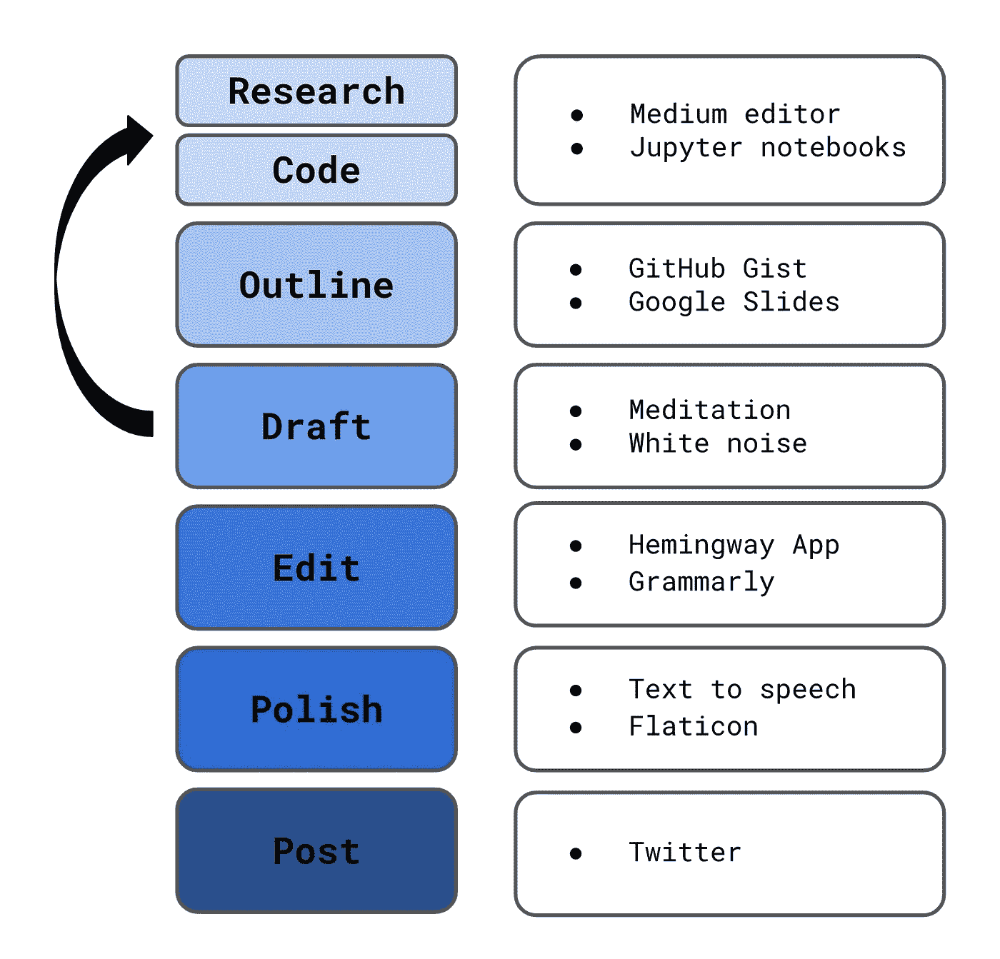
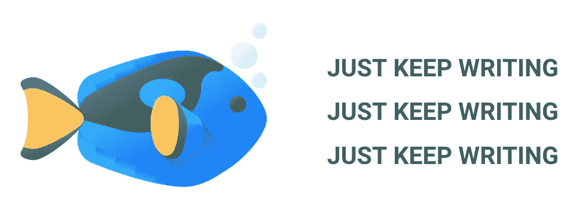
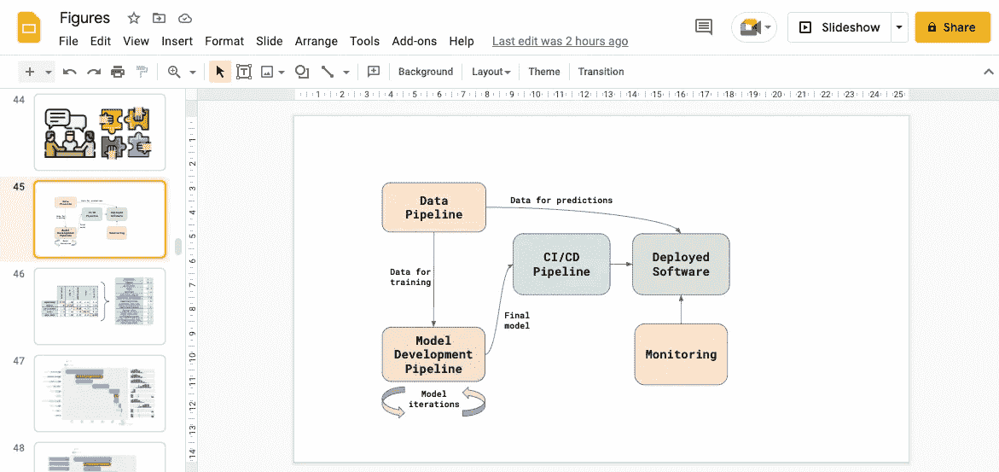
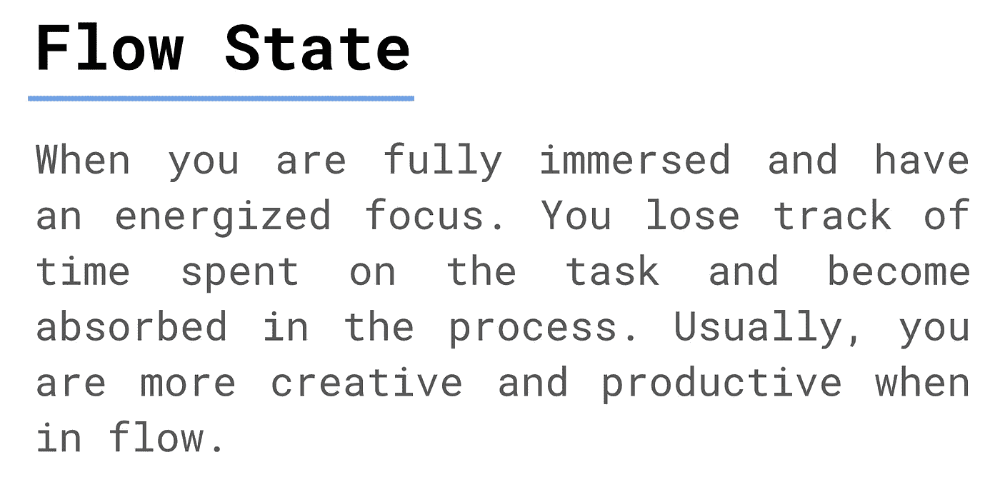
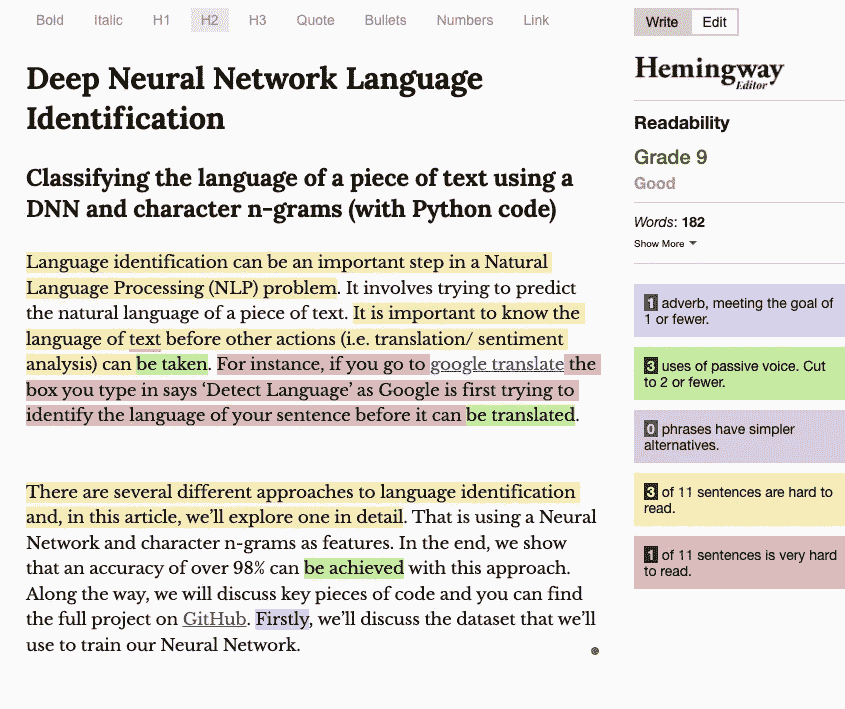
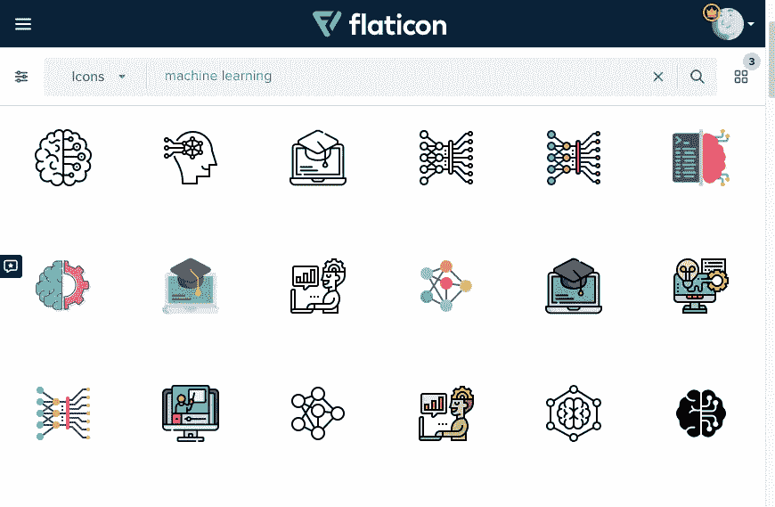
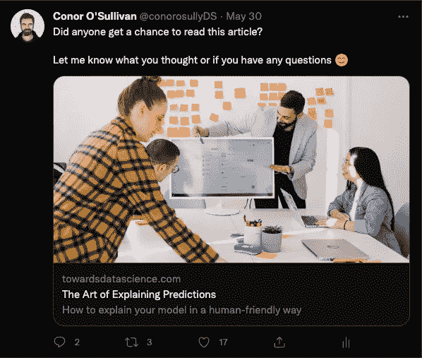
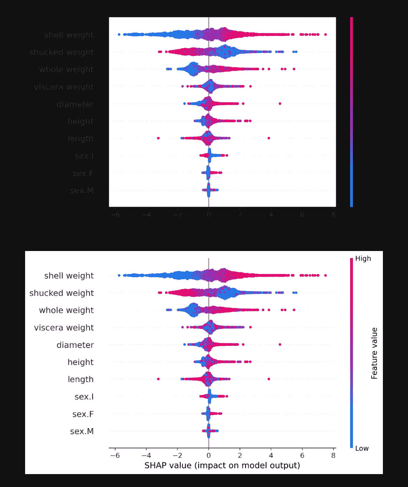

# 我写技术文章的 6 个步骤

> 原文：<https://towardsdatascience.com/my-6-step-process-for-writing-technical-articles-9d2f22026a5f>

## 我写数据科学文章的过程、工具和技巧

克里斯汀·休姆在 [Unsplash](https://unsplash.com?utm_source=medium&utm_medium=referral) 上拍摄的照片

我发现每篇新文章的空白页都有点令人生畏。有这么多工作要做。你需要做研究，起草，编辑和添加图形。在某些情况下，你需要学习一些全新的东西。每个作者都会有某种过程来帮助处理这种工作量。

我的过程始于每篇文章的通用清单。一步一步地分解文章使得整个工作量看起来更容易管理。完成每一步也给我成就感，并帮助我保持动力。最后一个好处是，将某些任务分开让我成为了一个更有效率的作家。

我已经写了近 3 年的数据科学文章。在此期间，我发表了 33 篇文章，总浏览量超过 23 万。我最近还出现在《走向数据科学》的[作者聚焦](/how-can-we-bridge-the-gap-between-fairness-research-and-real-world-use-cases-a40a53b25d92)中。我投入了大量的工作来完善我的写作过程。想分享给大家，希望能对你的写作有所帮助。

这个过程已经发展成了您在下面看到的更加明确的步骤。我将带您详细了解 6 个步骤中的每个步骤。在右边，你会找到我用来帮助完成每一步的工具。我会讨论这些，同时，我会给你一些有助于我写作的建议。这些包括我如何写得更快，提出新的想法，让我的文章在移动设备上看起来不错。

6 步写作过程(来源:作者)

# 0)创意产生

在进入这个过程之前，我需要决定写些什么。随着时间的推移，我的想法来源发生了变化。在获得计算机科学硕士学位几个月后，我开始写作。最初，我在学位期间做的项目是一个文章的春天。艰苦的工作已经完成了。我只需要把它改编成一个好故事。

我之前一篇文章的例子是 [**深度神经网络语言识别**](/deep-neural-network-language-identification-ae1c158f6a7d) **。**它是基于我为机器学习课程做的一个项目。分析的重点是预测一段文字的语言。这是使用以字符三元模型作为模型特征的深度学习来完成的。有一篇关于这一分析的文章，但是它假设在 ML 和 NLP 方面有一定水平的专业知识。

中等文章不只是给专家看的。在写文章的时候，我把分析改编成了编码教程。我花时间解释了一些基本的 NLP 概念，如文本清理和停用词。我还试图解释用于分析的代码。希望即使是经验很少的人也能理解这个教程。

回想起来，我认为我在大学做的工作是开始写作的最佳地方。我已经对我所学的课题了如指掌。写作是重温这些项目并向世界展示我所学到的东西的好方法。随着项目的枯竭，我需要寻找新的想法来源。我开始学习新的数据科学来写作。我发现写作是学习新事物的好方法。

当学习一个新的技术概念时，我的最终目标是写一篇关于它的文章。同时，我总是试图给我所写的领域增加一些价值。我需要将代码应用到新的数据集，创建新的可视化或提供一些其他独特的见解。为此，我需要很好地理解技术概念。这样，写作为我的学习提供了一些结构。

我发现写作有你写的文章之外的好处。我从写作中获得的知识和沟通技巧都让我在工作中受益匪浅。最近，我发现我在工作中获得的经验有益于我的写作。我所获得的实践经验自然为我所写的领域增加了价值。

比如我的文章， [**分析机器学习中的公平性**](http://Analysing Fairness in Machine Learning (with Python)) **。**我有幸和一个算法公平性的专家团队一起工作。关于这个话题有很多研究。与团队合作向我展示了什么是最有用和最实用的应用。在写这篇文章的时候，我试图尽可能多地传递这些知识。

(来源: [flaticon](https://www.flaticon.com/premium-icon/fish_3066721?term=dory&page=1&position=1&page=1&position=1&related_id=3066721) )

随着时间的推移，创意的来源可能会发生变化，但有一点是不变的。一旦我开始写作，我总是会有新的相关想法。抓住一个话题总是会引出新的问题。对一个领域有了更好的了解，我也会知道如何增值。这意味着我通常会开始写一篇文章，即使我不是 100%确信它会增加价值。大海里有很多想法。我就一直写，让他们来。

# 1)研究和编码

一旦我有了想法，它会分成两类。要么是研究文章，要么是编码教程。 [**什么是 MLOps？**](/what-is-mlops-8dff3a6ec94c) 是一篇研究文章的例子。这些是非技术性的，旨在**讨论概念**。上面提到的语言识别文章就是一个编码教程的例子。这些旨在向你展示如何**应用概念**。

这第一步将取决于文章的类型。研究文章包括阅读学术论文和书籍。我用**媒体编辑器**做笔记 app。在我做研究的时候，我会抄写一些文字。我会用引号把其他作者的作品分开。目标是收集相关的段落，稍后我会把它们提炼成我自己的话。

> 我如何将其他作者的作品分开的例子…

我的大部分编码教程都是 Python 的，我用的是 **Jupyter 笔记本**。最初，会有很多实验。我想解释如何应用一个概念，但同时，我想讲一个好故事。我将尝试不同的数据集，以找到一个能最好地解释一个概念的数据集。如果我找不到好的数据集，我将生成一个具有特定属性的数据集。我也将尝试相同结果的不同视觉化。我这样做是为了找出哪些是最有趣的，并清楚地解释这个概念。

我也对结果的顺序进行了思考。比如在 [**用 Python 介绍 SHAP**](/introduction-to-shap-with-python-d27edc23c454)**，**我解释了 5 个不同的 SHAP 剧情。情节的顺序是有目的的。一些情节的弱点被前面的情节解决了。这提高了文章的流畅性。最后，笔记本中的结果将与最终文章的顺序相同。这使得下一步，创建一个大纲，更容易。

# 2)概述

一旦我对研究和代码的数量感到满意，我就创建文章的大纲。这是文章的骨架。它将包含所有的标题和副标题。它还将包含解释这一概念所需的所有图表。到大纲结束的时候，我会确切地知道我想写什么。这使得下一步，写草稿，尽可能快地进行。

对于研究文章，我将对第一步中复制的所有文本进行重新排序，以适应大纲。在研究阶段，我会从学术论文或书籍中复制整篇文章。我将这些段落移至正确的小标题，并删除任何不必要的文字。我也会开始在每一段上面加注释。这些是关于如何用我自己的话把它们表达出来并把来源联系在一起的想法。

对于编码文章，我将包括来自分析的任何数字。这些一般直接来自笔记本。也就是说，它们是使用 Python 包(如 matplotlib 或 plotly)创建的。我还会在每个图表上方添加简短的注释。这些概括了我每段要写的内容。

如果我想解释代码片段，我会使用 [**GitHub Gists**](https://gist.github.com/starred) 来嵌入它们。下面，您可以从语言识别文章中看到代码。这个代码被用来训练一个神经网络。比起将代码直接嵌入到介质中，我更喜欢使用这些。我喜欢不同的颜色用于组件，使其更容易阅读。

对于研究和代码文章，我将添加一些额外的图形。如果我认为它们会使一个概念更容易理解，或者如果它们会使文章读起来更有趣，我会添加这些。有了好的图形，我可以把一段详细的文字简化成“见图 X”。为了创建这些图形，我一般使用 [**谷歌幻灯片**](https://www.google.com/slides/about/) 。我不是平面设计师，但它能完成工作。你不需要花哨的工具来讲述一个好故事。

用谷歌幻灯片创建的图形(来源:作者)

到提纲阶段结束，我想对自己要写的东西有一个清晰的想法。虽然，我的轮廓从来都不完美。当我真正开始写作时，它通常会改变。我只是希望它包含足够的细节，使草案阶段尽可能顺利。正如我下面所讨论的，在写草稿的时候，我会努力进入一种流畅的状态。大纲应尽可能对此有所帮助。

# 3)草稿

提纲做好了，是时候继续写草稿了。这是文章的核心。老实说，这是写作中最无聊的部分。我希望我脑子里的想法能出现在纸上。作为一种妥协，我试图尽可能快地在页面上获得尽可能多的单词。我不担心拼写、语法或句子结构。这是在编辑阶段的后期。

真正的目标是尝试进入一种心流状态。软件开发人员可能对这个概念很熟悉。当你 100%专注于任务时。单词/代码会毫不费力地出现在页面上。我发现进入心流可以大大提高我写文章的速度。

流动状态的定义(来源:作者)

进入心流很难。这就是为什么我试图有一个好的轮廓。我不应该考虑太多我想写的东西。我尽量不去添加数字或查找我忘记研究的东西，以免打断我的写作。话虽如此，在你动笔之前，很难把你需要的东西都写在提纲里。

通常在选秀的时候，我会意识到缺少了一些东西。我可能需要做更多的研究，或者我可能会想到一个更好的数字来表达我的观点。为了流量，我就一直走下去。我为缺失的数字和图形留下占位符。一旦我完成了初稿，我就可以回到研究/编码阶段。

除了一个好的大纲，我一直在试验进入心流的最佳条件。我发现一些有用的东西是写作前的锻炼或冥想。这让我头脑清醒，可以集中注意力。我写作的常规和时间也很重要。对我自己来说，我发现最好的时间是运动后的上午 10 点到 12 点。在这两个小时里保持高度集中胜过在一天的其他时间里试图缓慢地写作。

写作前我也尽量避免分心。这包括社交媒体、电子邮件甚至 WhatsApp 消息。任何能让我走神的东西。如果我在一个嘈杂的环境中，我发现听**白噪声**很有用。这可能是过度的，但是保护流动状态是重要的。一旦你分心，你可能会失去它，很难再回到它。

# 4)编辑

我的草稿就像一大块大理石。现在是时候凿出里面的雕像了。在编辑阶段，我想提高可读性。我对句子进行了重新措辞和排序，使文章尽可能流畅。我尽量缩短句子，用更简单的词。我也删除任何重复。我的目标是用最简单的方式和尽可能少的词语解释一些事情。

如果我觉得我需要一些关于一篇文章的反馈，我会在编辑的时候试着去得到。这通常意味着将文章发送给家人或朋友。我问他们是否发现有什么难以阅读的东西，或者他们是否认为有什么遗漏。你的写作很难得到好的反馈。我发现人们太好了，或者没有足够的时间进行彻底的批评。

作为替代，我喜欢使用 [**海明威编辑器**](https://hemingwayapp.com/) 。它使用机器学习来评估你的作品的可读性。如下所示，它还会指出你写作中可以改进的部分。我倾向于关注红色的“难以阅读”的句子。我将通过改写或分解句子来简化这些问题。

海明威编辑器分级(来源:[海明威 app](https://hemingwayapp.com/) )

另一个有用的编辑工具是 [**语法上的**](https://www.grammarly.com/) 。我用的是免费版，可以很好地检查你的拼写和标点符号。具体来说，我使用的是 [chrome 扩展](https://chrome.google.com/webstore/detail/grammarly-grammar-checker/kbfnbcaeplbcioakkpcpgfkobkghlhen)。这允许我在媒体编辑器中使用语法。您可能希望在绘制阶段关闭扩展。我发现当我应该写作的时候，它诱使我改正语法。

总的来说，我尽量把起草和编辑阶段分开。我总是有一个编辑阶段。然而，在看了下面的视频后，我把更多的精力放在了分离步骤上。Ayodeji 说，为了提高他的写作速度，他戴着不同的帽子-一个是写作，一个是编辑。如果他试图同时做这两件事，写文章所需的总时间就会增加。

我的写作也有过类似的经历。实际的写作很无聊，完美是一种干扰。如果我花太多的时间去尝试表达事物，我会失去兴趣。相反，我试着进入心流，在那发生之前把我所有的想法都写在纸上。我可以稍后回来整理这些想法。我发现写草稿和编辑之间的休息也有利于编辑过程。我经常想到应该添加到文章中的东西或者更好的表达方式。

# 5)波兰

写作的最后阶段是润色文章。我想让我的大理石雕像发光。我添加了一些收尾工作，并试图找出我在编辑过程中漏掉的任何小错误。这些是语法学家没有发现的语法错误。

我可以一遍又一遍地读我自己写的东西而不发现这些错误。这就是我使用**文本到语音转换**的原因。我让我的设备在我阅读的时候读出我写的东西。当我听到语法错误时，它们就突出来了。大多数设备都内置了这一功能。在 macOS 上，您可以通过高亮显示文本并按下 ***控制***+***ESC****来激活文本到语音转换。*

我最不喜欢做的事情就是添加一些图像。这些与用谷歌幻灯片创建的图形不一样。它们无助于解释概念。它们只是为了让文章更有趣，并打破文本的连续段落。我通常用 [**flaticon**](https://www.flaticon.com/) 来表示这些。在本文中，我甚至使用了其中的一些图标。

(来源: [flaticon](https://www.flaticon.com/) )

# 6)职位

一旦我对最终的文章感到满意，就该发表了。我从不直接向媒体发表文章。相反，我试图把我的文章发表在一个出版物上。我通常和[一起发表关于数据科学的文章](https://towardsdatascience.com/)。通过他们现有的受众和社交媒体，这些文章获得了更多的浏览量。

我也创造了自己的文章流量。我活跃在 **T** [**witter**](https://twitter.com/conorosullyDS) 上，我会在那里分享它。我总是试图创造一些对话，并获得反馈。比如下面这条推文。有几次我根据 Twitter 上的评论修改了一篇文章。在某些情况下，对话会产生全新的文章想法。

(来源:作者)

# 一些最后的提示

## 针对移动设备进行优化

[媒体上 68%的流量来自移动设备](https://medium.com/blogging-guide/7-amazing-medium-platform-statistics-688986c518bd#:~:text=1.,and%20potential%20reach%20of%20content.)。我不确定我的观众的确切比例。不管是什么，我还是想确保我的文章在手机上看起来不错。在我意识到我的一些文章很难阅读之前，我从来没有这样做过。

你可以在下面看到我的意思。这是我的文章 [**用 Python 介绍 SHAP**](/introduction-to-shap-with-python-d27edc23c454)中的一个图。这个人物有透明的背景。在媒体编辑器中(第二张图片)，它看起来很好。不过手机 app 背景比较暗。这使得标签难以阅读(第一张图片)。

移动网站与桌面网站上的图像(来源:作者)

为了确保我不会遇到这样的问题，我在发布文章之前会在手机应用程序上查看。为此，我与自己分享了**草稿链接**。然后我在我的移动设备上打开这个链接。我确保在 Medium *app* 中打开。这是因为中型*移动网站*仍然有白色背景。

## 理解你的动机

弄清楚你写的**动机。写的理由有很多。你可能想建立声誉，提高沟通技巧或赚钱。我在下面的文章中讨论了我的动机。理解写作的好处帮助我保持动力。我写作的具体原因也有助于我的方法。**

 [## 我为什么写数据科学

### 撰写数据科学文章的 6 大好处

towardsdatascience.com](/why-i-write-about-data-science-75667a5ef0ae) 

当人们谈论成为一名成功的作家时，一个普遍的感觉是数量胜于质量。这意味着写更多的文章，而不是专注于使它们完美。我认为这个建议假设每个人都有同样的动机。那就是靠写作赚钱。

你可能想把写作作为学习新事物的一种方式。在这种情况下，不必着急。慢慢来。如果你想在某个领域建立声誉，在一篇文章上投入更多的努力是有意义的。一篇高质量的文章比许多低质量的文章能给你更好的声誉。最终，你想写的理由将决定你成功的原因。

## 要耐心

在你成功之前，需要时间和大量的努力。如果你用阅读你文章的人数来定义成功的话。我已经写了两年多了。我现在才开始看到好处的实现。关键是要持之以恒，不断努力提高你的写作水平。

也就是说，我觉得我才刚刚开始我的写作之旅。我一直在努力改进我的流程。因此，如果你知道任何**工具**或**技巧**，请在评论中告诉我。

我希望这篇文章对你有帮助！你可以成为我的 [**推荐会员**](https://conorosullyds.medium.com/membership) **来支持我。你可以访问 medium 上的所有文章，我可以得到你的部分费用。**

 [## 通过我的推荐链接加入 Medium 康纳·奥沙利文

### 作为一个媒体会员，你的会员费的一部分会给你阅读的作家，你可以完全接触到每一个故事…

conorosullyds.medium.com](https://conorosullyds.medium.com/membership) 

你可以在|[Twitter](https://twitter.com/conorosullyDS)|[YouTube](https://www.youtube.com/channel/UChsoWqJbEjBwrn00Zvghi4w)|[时事通讯](https://mailchi.mp/aa82a5ce1dc0/signup)上找到我——注册免费参加 [Python SHAP 课程](https://adataodyssey.com/courses/shap-with-python/)

## 图像来源

所有图片都是我自己的或从[www.flaticon.com](http://www.flaticon.com/)获得。在后者的情况下，我拥有他们的[保费计划](https://support.flaticon.com/hc/en-us/articles/202798201-What-are-Flaticon-Premium-licenses-)中定义的“完全许可”。