# 我的持续集成花费了太多时间。我如何修理它？

> 原文：<https://towardsdatascience.com/my-continuous-integration-takes-too-much-time-how-do-i-fix-it-704c5a674191>

## 缩短 CI 运行时间的方法。衡量、优化、利用隐藏的资源，等等。

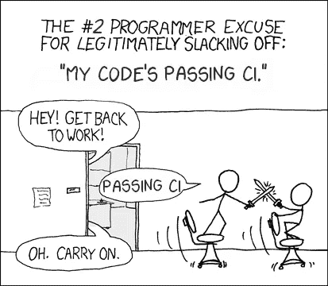

[xkcd](https://xkcd.com/303/) 作者混音的漫画。授予了显式使用权限。

我们都经历过这种情况:发送另一个 git push 到 pull 请求，并在 30、40、60 分钟内等待所有触发的 CI 检查完成。同时进行多任务处理或阅读一些 r/编程。太烦人了(不得不一心多用，也就是说)。我们能做得更好吗？我们来调查一下。

下面是一个典型的 CI 作业管道:

1.  启动执行程序。根据配置项的不同，它可以是容器、虚拟机或云实例。
2.  获取检查过的源代码。一个`git clone`。
3.  有效负载的设置:安装依赖项、编译器、linters 等。
4.  建造。对于像 Python 这样的解释语言，这可以是项目包的一个`pip install`。
5.  有效负载:运行单元测试，验证，确保代码风格等。
6.  提交工件。

我们可以在每一个阶段进行优化。此外，还有一个元优化，我将在最后描述。

## 邪恶的执行者

启动执行程序是所有阶段中最可疑的阶段。用户的杠杆很少。需要注意的一件重要事情是，硬件可能会在不同的运行之间发生变化。比如云 GitHub 动作在不同的 CPU 上运行；有些缺少 AVX2 这样的流行指令集。IOPS 也非常。我不建议滥用 GHA，但有可能重新触发几次乔布斯，以赢得最快的机器。

开源构建工程师经常忽略执行器经常拥有多个内核。[特拉维斯有两个](https://docs.travis-ci.com/user/reference/overview/#virtualisation-environment-vs-operating-system)， [GHA 有两个](https://docs.github.com/en/actions/using-github-hosted-runners/about-github-hosted-runners#supported-runners-and-hardware-resources)，[天蓝色管道有两个](https://docs.microsoft.com/en-us/azure/devops/pipelines/agents/hosted?view=azure-devops&tabs=yaml#hardware)。我见过在几个线程中进行`make -j2`或执行单元测试的 CI 脚本。

容器化的执行器通常比传统的虚拟机启动更快，所以如果你的 CI SaaS 提供选择，不要在不必要的时候选择虚拟机。

## 清晰的代码获取

快速获取项目代码的黄金法则是尽可能少地下载。一些配置项抽象了这个阶段，尽管每个配置至少允许设置克隆深度。我迄今为止最好的一次投篮是

```
git clone --single-branch --branch <sha> --no-tags --depth 1
```

—通过跳过除我们正在构建的提交所引用的对象之外的所有 Git 对象，减少网络传输。GitHub Actions 在`git fetch`期间进行等效的优化:

```
git init .
git remote add origin [https://github.com/...](https://github.com/...)
git -c protocol.version=2 fetch --no-tags --prune --progress --no-recurse-submodules --depth=1 origin <sha>
```

## 更快的设置

加速设置的普遍建议是缓存所有内容。

*   缓存已安装的包/模块等。(Python，Ruby，Node，Golang)。
*   我不熟悉 Java 和 C#，但我打赌它们也有一些值得坚持的东西。
*   缓存 docker 层并利用 [BuildX](https://docs.docker.com/buildx/working-with-buildx/) 特性。

我知道两种缓存 docker 层的方法:简单的和终极的。简单的方法提炼出

1.  `docker load layers.tar`
2.  `docker build --cache-from <image>`
3.  `docker save <layers> -o layers.tar`

这有两个问题:它们很慢，而且容易出现每次构建后`layers.tar`增长的滚雪球效应，所以`<layers>`应该小心选择。BuildX 消除了对`docker load / store`的需求，因此速度更快。

最终的方法是从一个定制的容器注册中心拉取和推入。然而，人们仍然不得不偶尔从旧的陈旧层中删除注册表。

## 更智能地构建

增量编译(C/C++，Rust)。但是请记住变化的 CPU——如果没有固定所需的 CPU 属性，您可能会被抓到。

利用两个 CPU 内核(参见“邪恶的执行器”)。

用 Python ( `pip install -e .`)中的[开发安装](https://setuptools.pypa.io/en/latest/userguide/development_mode.html)节省一些时间。

避免一次性构建所有内容。例如，分离出独立的包并将它们卸载到设置阶段。

## “内爆”有效载荷

使用增量测试运行程序，根据差异选择要执行的测试。缺点:测量测试覆盖率变得更加困难。另一个缺点是:Python 没有什么好处，在每个模块中导入半个世界是很常见的。

在多线程中执行单元测试。IO 绑定的测试套件应该过量使用线程，例如，我在两个内核上启动了四个线程，取得了巨大的成功。

以下内容有些显而易见，但值得一提:不要硬编码`sleep()` -s。首先，因为总会发生硬编码值不够的情况，其次，因为这纯粹是浪费资源。如果你真的需要睡觉，把 tiny `sleep()` -s 和出口支票一起绕成一个圈。

如果您的 CI 是按时间而不是按并行执行者来计费的，或者您的项目是开源的，那么您可以将单元测试分散到几个任务中，这样就不用在一个任务中执行 100%的测试，而是启动 5 个任务，每个任务执行 20%的测试。

给定作业时间公式 C + k * W，其中 C 是常数因子(引导、获取、设置)，k 是线性因子，W 是已执行单元测试的量，如果将 W 分成 N 个大小相等的部分，CI 时间将减少到 C + k * W / N， 并且您将为 C * N + k * W 付费。增加 N 直到计费开销增加到可比值 C * N ~ k * W 才有意义，因此 N ~ k * W / C。例如:100%的测试需要 40 分钟，C 是 2 分钟。 N ~ 20。新的 CI 时间为 4 分钟。新的计费时间是 80 分钟。然而，一些统计水下石头建议较低的 N，进行到下一节。

## 元考虑

总有一个关键 CI 作业最后完成。下图应该看起来很熟悉:

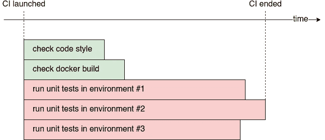

总有一个关键 CI 作业最后完成。图片作者。

令人惊讶的是，仅仅优化平均作业运行时间是不够的。如果你能额外减少标准差，那将是最好的。以下是一些臭名昭著的例子:

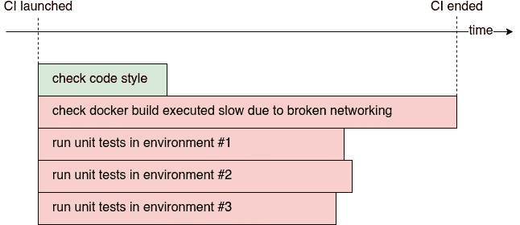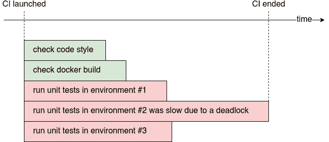

作业运行时间的高标准偏差对总体 CI 持续时间的不利影响。作者图片。

夸张地说，假设我们有 20 个独立的 CI 作业，每个作业 90%的概率需要 5 分钟，10%的概率需要 10 分钟。所有工作在 5 分钟内完成的几率正在消失 0.9 ⁰≈12%.所以我们将在剩余的 88%中等待 10 分钟，即使平均作业运行时间只有 5*0.9+10*0.1=5.5 分钟。随着独立竞争情报工作数量的增加，挫败感也在增加。这种情况类似于大数据处理:数据中总有一个棘手的边缘怪癖会让你的 Spark 工作崩溃，让你从头开始。下面有一个奇特的理论，但我不会用数学公式来淹没读者。

我对保持低标准差的建议是:

*   限制对 web APIs 的请求。
*   依赖尽可能少的第三方。例如，重定向 pulls 到私有容器注册表，而不是探索公共容器注册表的速率限制。
*   比起磁盘 IO，更喜欢内存缓存。
*   处处设置严格的截止日期。
*   监控指标。

最后一点让我特别感兴趣，因为我的公司正在开发一个产品来计算和分析这些指标。所以我想出了以下三个:占有率，临界占有率，不平衡。

## 占有

占用率指标是作业运行时间总和与作业数量和最长作业运行时间的乘积之比。该比率始终介于 0 和 1 之间。0 表示绝对的资源利用效率低下，1 表示理想的效率。

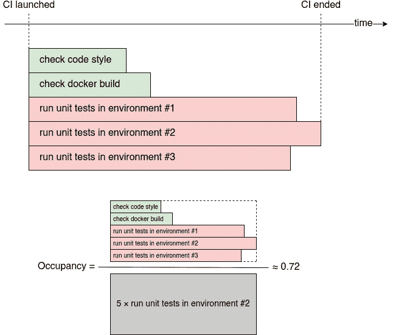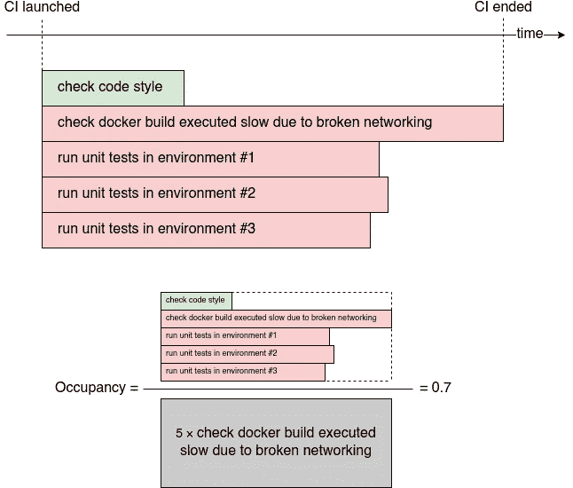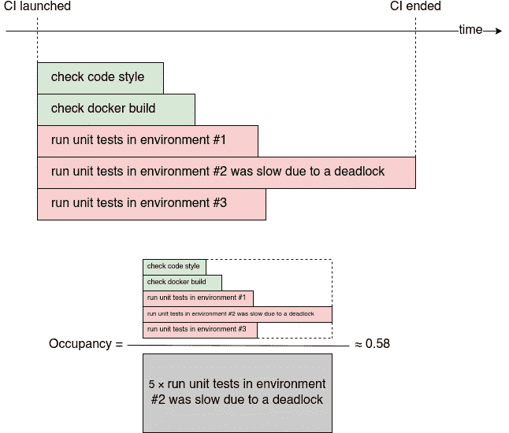

占用率计算示例。作者图片。

入住率反映了 CI 套件整体的“密集”程度。我们(数百名)客户的平均 CI 占用率(第 95 百分位)为 **0.58** 。

## 临界占有率

关键占用率指标与常规占用率非常相似，只是我们丢弃了非关键类型的作业。如果至少有一个作业完成了父配置项套件中的最后一个作业，我们称该作业的类型为关键。根据我们的三个例子，关键的工作类型是不同环境中的单元测试。此外，docker 构建在第二个示例中也很关键。

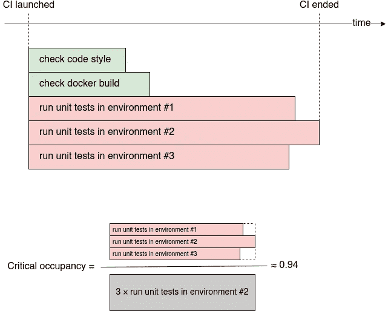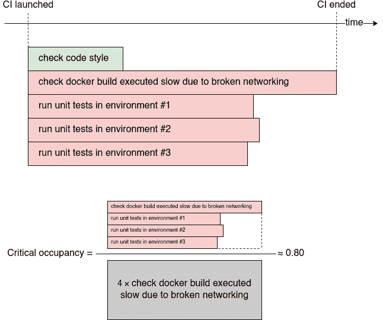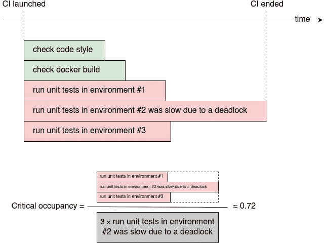

临界占用率计算示例。作者图片。

关键占用试图排除快速，轻量级的工作，如林挺或建筑文件，只留下那些影响整体持续时间。这可能是对标准差严重性更公平的估计。

我们客户的平均临界入住率(第 95 百分位)为 **0.61** 。

## 不平衡

最后一个指标是最简单的:不平衡是最长和第二长的作业运行时间之差。

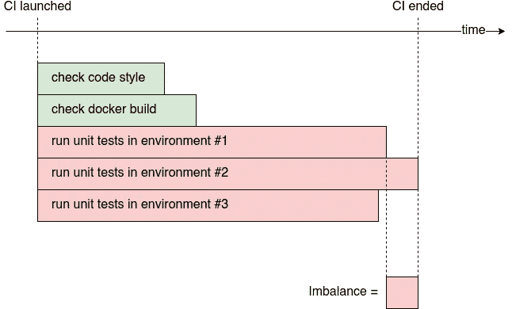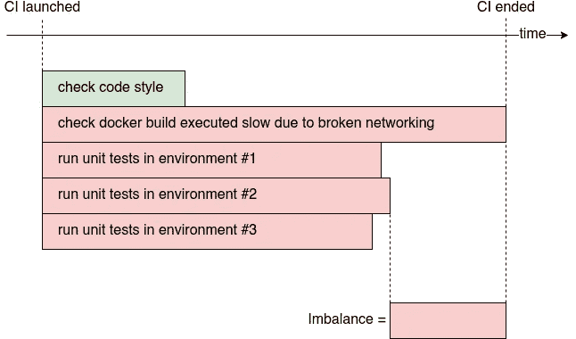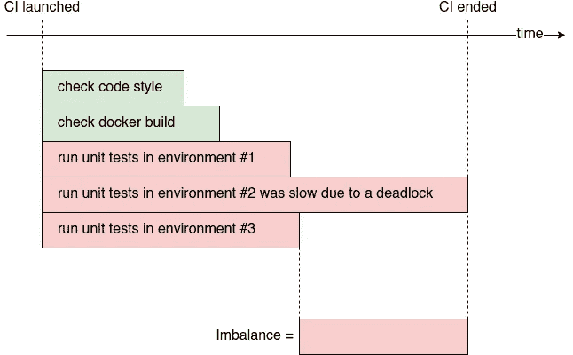

不平衡计算的例子。作者图片。

不平衡反映了通过优化关键作业来减少总体 CI 套件持续时间的机会有多少。如果不平衡值只有几秒钟，就很难通过“微优化”来加速 CI 反之，如果值几分钟，游戏就得不偿失了。

我们的客户平均不平衡(第 95 百分位)为**3 分 48 秒**。

## 警告

上面的 CI 图只是一个简化的模型。实际上，可能会有作业在其他作业完成时开始、隐式依赖 Dag 等。幸运的是，绝大多数不会配置如此复杂的场景。

像其他指标一样，占用率和不平衡可能是无意义和无用的。入住率可能在 0.4 左右..0.7，没有可操作的原因，或者当有几个相同的关键作业时，不平衡可能保持接近于零。它们就像软技能:有时有效，有时无效。

## 摘要

我将一个典型的 CI 工作建模为一系列的多个阶段:引导执行器、获取代码、设置环境、构建、执行有效负载、提交工件。然后，我为这些阶段提出了一些优化来减少运行时间。最后，我描述了“元”CI 优化，它降低了运行时间的标准偏差，并提出了三个相关的指标:占用率、临界占用率和不平衡。

像往常一样，我将感谢任何反馈和更正。请在媒体上关注我，以获得我下一篇帖子的通知。我写的是应用于软件开发工件的 ML/DS，Python，PostgreSQL。

另请阅读:[我们如何优化 Python API 服务器代码 100 倍](/how-we-optimized-python-api-server-code-100x-9da94aa883c5)和[我们如何优化 PostgreSQL 查询 100 倍](/how-we-optimized-postgresql-queries-100x-ff52555eabe)。

如果你是一个渴望建立持续改进软件开发文化的工程领导者，请查看我们的 [SaaS 产品网站](https://athenian.co/)。雅典人衡量 GitHub 上任何 CI 的占有率和朋友。