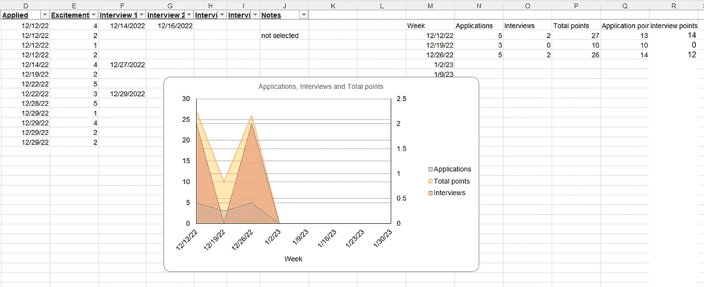

# 我的数据科学求职

> 原文：<https://towardsdatascience.com/my-data-science-job-search-6deb4117e7b5>

## 哪些有效，哪些无效，以及实用技巧

埃里克·普劳泽特在 [Unsplash](https://unsplash.com?utm_source=medium&utm_medium=referral) 上拍摄的照片

经过十年的高等教育、实习和工作之旅，我经历了系统生物学、清洁能源和电子显微镜，最终找到了自己的职业定位:可再生能源领域的数据科学家。你可能和我一样，一个差点不小心沦落到这里的人，没有受过正规教育(虽然我做了几年数据科学家后确实回到了学校)。去年夏天毕业后，我有一次寻找数据科学工作的有趣而深刻的经历，我想我应该分享一些我尝试过的事情，希望你能从中收集到一些对你有帮助的东西。这绝不是让你找到理想工作的“银弹”解决方案，而只是我在一个不断发展和竞争激烈的行业中的一些想法。

## 找到你的位置

有两个“啊哈！”我找工作的瞬间。第一个时刻幸运地发生在一周之内。数据科学是一个如此多才多艺的工具，以至于你几乎可以找到任何类型的公司想要雇佣某人。但是你想为一家大的科技公司工作吗？你的激情是在营销上吗？或者也许你和我一样喜欢解决工程问题。当然，我申请了几份只有“数据科学”头衔的工作，但是很多都是在我不感兴趣的公司。我的背景不一致，我的激情也不一致，他们能看出来。我没有收到他们任何一个人的回电。这里的建议是决定你想在数据科学职业生涯中做什么，找到你的激情，并申请这些类型的工作。

在搜索接近尾声时，工作邀请开始到来，但最令人兴奋的是一位雇主，他从第一次面试就告诉我，“在我们收到的数百名求职者中，你是我们最兴奋的人！”这并不是因为我有最令人惊讶的简历，而是因为这是一个真正的利基行业(半导体设备制造)，我有理由着迷。

## 简历提示

第二个“啊哈”时刻发生在几周前，当时我申请了很多工作，但没有得到多少回应。我修改了我的简历，突然我一周内得到了两倍的面试机会，而申请的工作却更少了。以下是我做的一些具体的事情:

*   我创建了一个专业网站，在那里我放了一份职业陈述，我的完整简历，以及一些我参与和撰写的项目和文章的链接。你可以在这里看到。
*   在我的简历上，我在顶部加入了我的专业网站、LinkedIn 个人资料和 Github 的链接。
*   关键词改造！嘿，你的机器学习/数据科学职位的雇主最有可能使用 ML 来整理简历。让他们知道你能胜任 ML 的最好方法是什么？认识到他们可能在进行关键词搜索，在你的简历中充斥那些特殊的关键词，比如“数据科学”、“github”、“AWS”，或者你拥有的任何其他技能。
*   修剪脂肪。我总是在简历中保留一个名为“额外技能和兴趣”的小部分，在那里我会提到一些爱好。虽然这对于偶尔采访我的马拉松选手或音乐家同伴来说很棒，但它只是占用了宝贵的空间，对关键词搜索没有任何贡献。所以把绒毛拿出来。如果你被录用了，你会有足够的时间来联系你的爱好。如果可能的话，保持你的简历简洁。

我不确定这些变化中的哪一个突然引起了这么多雇主的注意。也许有一天当我在面试的时候，我会让你知道。但是这次简历修改把平均每周 50 份工作申请和 2-3 次面试变成了 20-30 份申请和 5-8 次面试。

## 追踪你的进度

如果没有跟踪我的申请和面试，我不会意识到这些“啊哈”时刻。每个人都有自己的体系；我会分享我的，但对你来说，做一些对你有用的事情很重要。

在我分享我的跟踪系统的细节之前，我想讲一个我找工作的快速经验。在我找工作的前几周，我在学校，没有认真找工作。我申请了很多我认为的工作，却一次面试机会都没有，这让我很沮丧。嗯，我没有跟踪我的申请，当我开始时，发现我申请了不到 10 家公司！现在，你们中的一些人只需要申请 10 个就能找到工作，但这真的只是一个数字游戏。通过跟踪你的应用程序，你可以看到什么是有效的，什么是无效的，如果你认为自己比实际做得更好或更差，给自己一些现实。

我个人在 Excel 电子表格中记录了所有东西。我有一个关于公司名称、职位名称和我在哪里找到这个职位的专栏(LinkedIn，实际上是公司网站，等等。).我有一栏是我申请的日期，5 栏是我面试的日期(我经历的最多的面试是 6 次)，然后是“兴奋度”栏和“备注”栏。因此，当我申请一份工作时，我会记录基本信息，以便他们联系我进行面试时我可以追踪到它，给它一个 1-5 分的“兴奋度”，并写下我申请的日期。如果我有面试，我会记录日期和任何笔记。然后我写了一些 Excel 公式来跟踪我申请了多少份工作，我平均对那些工作有多兴奋，看看平均有多少份工作导致了一次面试，并做出曲线图。如果你对一个模板感兴趣，你可以在这里下载它[。](https://docs.google.com/spreadsheets/d/1D5-x-zldb2yZ396ftTAQOq8IA6ymSqPT/edit?usp=sharing&ouid=107614753179186368738&rtpof=true&sd=true)

示例工作申请电子表格的屏幕截图。作者的电子表格和截图。

最后，我建立了一个积分系统。我没有说“本周我将申请 20 份工作”，而是制定了一个目标来获得 X 分。对于我填写的每一份申请，我都会得到与兴奋度相对应的分数(这激励我申请你更感兴趣的公司，这些公司往往会做出更积极的回应)，然后第一次面试 6 分，第二次面试 8 分，之后的任何面试 10 分。这个系统帮助我在面试时继续申请工作；如果我有很多面试，我会平静地接受这样一个事实，那就是我那个星期提交的申请没有那么多，而如果我没有很多面试，我可以提交很多申请。这个系统需要一些迭代来开发，所以继续下去，根据需要继续修改它！

## 学习适销对路的技能

在我找工作的时候，雇主们喜欢听到的一件事就是我在继续学习技能。比如我之前用过云计算资源，但不是专门用 AWS。嗯，我碰巧住在西雅图，在地铁上看到一些西雅图 AWS 技能中心免费课程的广告，所以我报名参加了一些。网上有很多材料，你甚至可以把代码片段或项目发布到你的 Github 上给雇主看。这一点是要承认，如果你只是整天申请工作，你可能会筋疲力尽。通过从事富有成效的项目和技能来改变现状，你不仅会在找工作时找到更多的满足感和多样性，还会获得脱颖而出的技能。练习一些编码题也是个不错的主意。我个人的经验是，大约四分之一的面试有编码部分，但这可能是独一无二的，因为我更多地是在寻找重视化学工程方面而不是编码方面的工作。

## “给人留下深刻印象的着装”问题

如果你从事数据科学或机器学习，你可能是在申请远程工作。你的采访都是远程的。你可能会读到很多帖子，说你应该如何穿着才能给人留下深刻印象。这可能是个不错的建议，但我的经验是这没关系。我参加过一些面试，在这些面试中，我穿了一件有纽扣的衬衫和领带，在另外一些面试中，我只穿了一件漂亮的 polo 衫。很明显，你不想看起来像个邋遢鬼，但我收到了我盛装打扮的公司和我只穿了一件 polo 衫的公司的工作邀请。

## 感恩日记

每个人都明白:找工作很难。如果你正在读这篇文章，你可能是那些没有得到一切的人之一。你的求职可能令人沮丧。在我找工作的时候，我当然去过那里很多次。

几周后，我决定每天写下一件我感激的事情。有时这是一次很好的面试，有时这是一份让我兴奋的新工作，有时这是一句半开玩笑的话，比如“我很感激这一家公司没有给我一份工作，因为现在我意识到，它可能不适合我！”有些日子可能超级难找到值得感恩的事，但总会有。这样做有助于我在漫长的过程中保持清醒，如果你从这篇文章中学到了什么，我希望就是这个。

## 利用你的关系！

我会第一个承认我不是告诉你怎么做的最佳人选。但是我会用我大学时代的一个好朋友和同学作为例子。他已经毕业，在将近一年的时间里，他很难找到一份工程方面的工作。他决定给 AIChE(美国化学工程学会)的主席打电话，告诉他自己的故事。他不仅能够建立联系，而且能够利用这种联系找到他的第一份工作，并从那时起拥有了一份伟大的职业生涯。

所以利用你的教授，利用你的朋友。这可能很可怕，你可能会觉得你在占用他们的时间，但我相信你会发现他们不仅愿意，而且渴望帮你找到工作！这也可能有助于寻找本地工作——全国甚至世界各地的每个人都可以申请任何偏远的职位，所以可能很难脱颖而出；如果公司想找一个本地人来管理办公室，竞争范围会小得多。

这就是我的全部，而且对我很有效。我们都是不同的，有不同的背景和职业目标，所以这可能有用，也可能没用。如果是的话，我很乐意在 LinkedIn 上联系。一如既往，欢迎关注我的【T2 走向数据科学】，查看我关于数据科学案例研究的定期帖子。