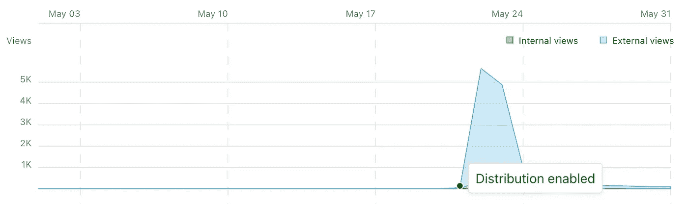
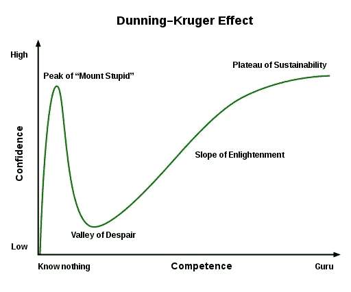
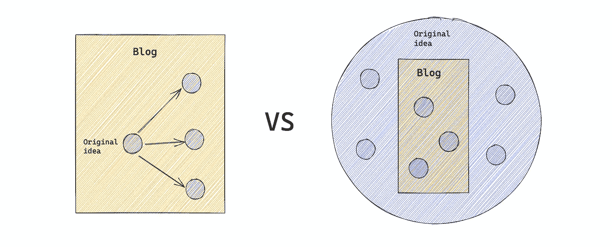
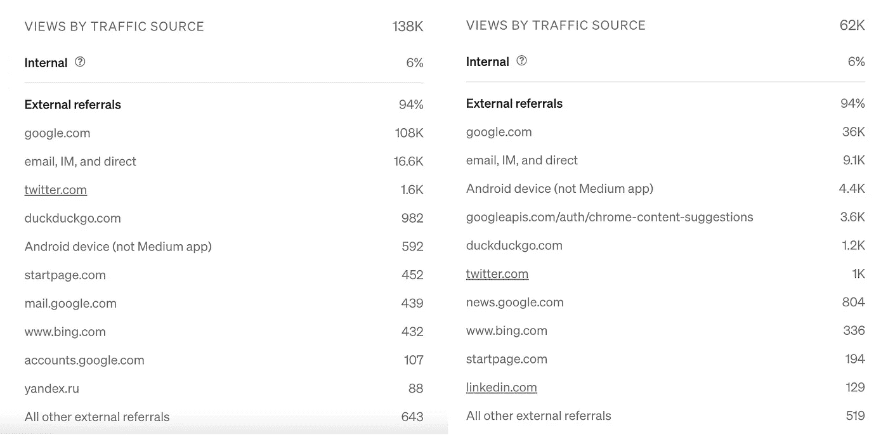

# 我的技术写作之旅

> 原文：<https://towardsdatascience.com/my-technical-writing-journey-14ea1ca18e79>

## 一切都从问自己一个问题开始

照片由[扬尼克·普尔弗](https://unsplash.com/@yanu)在 [unsplash](https://unsplash.com/) 上拍摄

两年前，我在媒体上开始了我的第一个技术博客。老实说，我不敢相信我已经坚持这个习惯这么长时间了。作为一种欣赏的方式，我想我可以写一个回顾，与任何也想加入的人分享我的旅程。

在写这篇博客的时候，我已经发表了 28 篇文章，获得了 685，000+的浏览量和 1，000+的关注者。这些只是数字，对不同的人有不同的意义。这个博客绝不是教你如何在媒体上传播(我也不知道)。这是从问自己一个问题到养成写博客习惯的旅程。

## 我的出发点是什么？

我在一周内发表了我的前三篇文章。就写作而言，那是我最有收获的一周。都是从当时没有好的完整的资料来回答我的问题的挫败感开始的。为了找到出路，我从网上收集了一些作品，并经历了试错的过程。最终，我得到了我想要的。这个问题与工作有关，所以我把我的发现写在了一个笔记本上，并把它展示给了我的同事。事实证明这对每个人来说都是一个有趣的话题。

当我完成我的演讲时，我决定在互联网上与更多的观众分享。那是 2020 年 5 月，在家工作的情况也让我更想表达自己一点。同一天，我修改了笔记，完成了我的第一个官方技术博客:[了解如何在 Python 中使用 NamedTuple 和 data class](https://medium.com/p/e82e535c3691?source=post_stats_page-------------------------------------)。我不得不说，我对接下来几天的观点感到惊讶，这是好的方面。我不知道分配算法是如何工作的。直到今天我还不知道。但这无疑给了我在互联网上创造更多有趣内容的信心。

[的视图了解如何在 Python 中使用 NamedTuple 和 data class](https://medium.com/p/e82e535c3691?source=post_stats_page-------------------------------------)2020 年 5 月

> 随着我写的博客越来越多，事实告诉我，并不是每个博客都会这样。毫无疑问，我很幸运有一个好的开始。

## 创意从何而来？

每个内容创作者都需要一个缪斯。对我来说，每个想法都是从一个问题开始的。这些问题 90%源于我的日常工作。有些问题非常小众，比如“为什么当我调用函数 F 时，framework X 会引发异常 E？”，或者可以非常笼统，如“Python 中的继承是如何工作的？”。不管是哪种，都是困扰我的问题。如果我写了它，我应该是第一个得到好处的人，因为我的博客解决了我自己的问题。

我的第一个写作技巧是找到一个困扰你的问题。作为一名工程师，我们的日常生活应该充满了问题。我们离不开 StackOverflow:)。如果可以，那就找一份新工作，因为它不再是一份有挑战性的工作。之所以会发现一个和你很接近的问题，是因为你知道你和其他和你一样的人想要得到解决的这个问题的核心是什么。**你会对你的听众表现出充分的同情心。在一天结束时，评估你工作的方法是问你自己最初的问题是否得到了回答。**

拥有这样一种问题驱动的心态不仅让你的内容更加脚踏实地，而且这也是一个很好的学习机会。有时我们在向人们解释事情时会卡住。很有可能你还没有掌握这个题目。因此，告诉人们事物是如何在口语或写作中运作的，是提高你对某些主题的知识的一个很好的方法。

**我通常做的是找到一个让我烦恼同时又吸引我的问题。**这是一种又恨又爱的关系。你期待完成后的成就感，因为你的博客会让未来许多人的生活变得更容易。如果情况只有厌恶，那就不要写了。比如我绝对不会写什么为什么只能在 Linux 上安装包，而不能在 macOS 上。:))我只想尽快摆脱它。

说到这里，我想以展示著名的邓宁-克鲁格效应来结束这一节。基本意思是“一知半解是件危险的事情。”当你在学习一个全新的事物时，你会很兴奋，会有很多问题。不要急着写“什么是阿帕奇卡夫卡？”或者“API 是如何工作的？”因为你很可能正站在“愚笨山的顶峰”。当你在那里时，你的产出往往是肤浅的。在我看来，写作的理想位置是“绝望的山谷”或“启蒙的斜坡”，因为它有助于你到达“可持续发展的高原”。

当我们处于“可持续发展的高原”时，我们还应该继续写作吗？我不知道。我想说，这是大多数人一生都在追求的一个假想点。只要我们在路上，我们就应该继续写作。

邓宁-克鲁格效应(来源:[维基百科](https://en.m.wikipedia.org/wiki/File:Dunning%E2%80%93Kruger_Effect_01.svg)

## 如何将一个想法转化为博客？

将想法转化为博客的两种不同模式(由高创建)

下一步是**将你最初的想法扩展或缩小到一个实用的范围**。例如，我的 [NamedTuple 和 Dataclass](/understand-how-to-use-namedtuple-and-dataclass-in-python-e82e535c3691) 博客以一个问题开始:就对象创建时间而言，哪个类的性能更好？这是一个非常小众的问题。我不需要很多话来回答。对于这种类似 StackOverflow 的问题，您需要扩展范围，思考在这个上下文中还有哪些有趣的地方。在研究过程中，我发现了许多其他有趣的点。所以我在对象创建、属性访问、不变性等方面做了更多的比较。最后，读者将对 Python 中的这两个概念有一个大致的了解，并帮助他们选择一个。其他类似的例子还有 Python 中的 [Understand __slots__ 和](/understand-slots-in-python-e3081ef5196d)[Understand zip()——Python 中隐藏的瑰宝](/understand-zip-a-hidden-gem-in-python-9488a255f45d)都是从一些小问题开始的，比如“我如何以优雅的方式将两个列表合并成对？”。

另一种方法是当你有一个广泛的想法时，缩小你原来的范围。你写的是博文，不是书。不要制定过于雄心勃勃的目标。否则，你要么让文章流于表面，不能创造太多价值，要么文章太长，读不下去。我喜欢的是找到题目的独特切入点。例如，在文章[如何用 Python 编写用户友好的命令行界面](/how-to-write-user-friendly-command-line-interfaces-in-python-cc3a6444af8e)中，我重点介绍了如何让您的 CLI 应用程序更加用户友好。在 [5 使用财务数据的 Python 技巧](/5-python-tips-to-work-with-financial-data-8907e17a7c91)中，我将 Python 技巧仅与财务数据联系起来。这样，你总是有一个明确的目标读者群。

**另一个普遍的建议是在开始叙述之前做一个想法转储。这样你就不会忘记你要写什么，并且确保文章的大小合适。**

## 如何留住你的观众？

好的，我有一个想法，我也知道我想谈什么。接下来，让我们想想如何保持你的观众的注意力，这样他们就不会太快失去注意力。根据我自己的经验，这里有几个建议。如果你有其他好的建议，请告诉我。

**明确你的目标群体**

一般来说，有两种类型的读者阅读你的科技博客。

1)浏览社交媒体并被标题吸引的读者。恭喜，你在标题上做得很好。他们打开页面，阅读介绍，并快速滚动页面，看看是否有任何有趣的内容。他们可能会上瘾，或者把它放在书签里以备后用，或者干脆把它扔掉。他们的行为是不可预测的，因此留住他们的策略也是模糊的。我唯一的策略是总是有一个清晰简洁的标题，这样在他们阅读之前，他们会有一些期望。当他们有期望时，他们属于第二类。

2)另一个群体是带着问题来的读者。他们谷歌了一下[“python 命名的元组和数据类”](https://www.google.com/search?q=python+namedtuple+and+dataclass&oq=python+namedtuple+and+dataclass&aqs=chrome..69i57j0i22i30l2j0i390l3.5689j0j9&sourceid=chrome&ie=UTF-8)，在 StackOverflow 之后他们就找到了我的文章。他们打开页面的目的是了解 NamedTuple 和 Dataclass。这些人是我的目标读者，我希望他们的问题在关闭页面之前得到回答。

统计数据还显示，谷歌是我最大的流量来源，这证明大多数人来这里是有目的的。

我的 2 篇文章的流量来源(作者:高 T5)

**全面了解所有经验等级**

当有需要时，让我们用尽可能清晰和详细的信息来满足它，而不要对读者的背景知识做任何假设。几乎我所有的博客都是从一点基础知识开始，然后才开始写代码。我不提供太多大块的代码。但是我喜欢详细描述每一个命令，它是做什么的，为什么它是这样工作的。这些细节为读者提供了提高技能所需的信息。我经常问自己，我的文章是否包含太多的隆隆声或*、*明显的事情，但每当我看到类似“xxx 不清楚”的评论时，我知道我应该解释得更清楚。

> 中国有句谚语:给一个人一条鱼，你可以喂他一天。教一个人钓鱼，你可以喂他一辈子。

**不要把你的技术博客写得太专业**

人们(包括我在内)有时更喜欢阅读科技博客而不是 StackOverflow 的原因是，我们希望有更多的背景，听到好的故事。即使它是一个科技博客，你仍然可以讲一个关于它的好故事。有什么问题？为什么这对我们来说是个问题？怎么才能解决呢？你能举一些例子来支持你的说法吗？对读者有什么建议？这有助于非工程师理解你的观点，他们可能会将你的文章推荐给他们的工程师同事，因为他们认为这可能对他们有用。

我喜欢用图表和例子来解释事情。一张图表不仅能表达成千上万的单词，还能在阅读文章时创造一种精神上的休息。例子总是能很好地向人们展示你所说的是实实在在的东西，而不是火箭科学。

## 你是怎么保持节奏的？

许多跑步者努力了几个月，但一越过终点线，他们就停止了训练。当你所有的努力都集中在写一篇文章上时，当你完成后，还有什么能推动你前进呢？《原子习惯》这本书告诉我，发展一个长期的系统比拥有一个目标驱动的心态更具可持续性。

> 真正的长期思考是没有目标的思考。它不是关于任何单一的成就。这是一个不断完善和不断改进的循环。最终，你对这个过程的承诺将决定你的进步。—原子习惯

你的写作目标应该像“每月发表 X 篇文章”而不是“发表 10 篇文章”那样与你的持续进步相关联。

来自互联网、朋友和同事的积极反馈是让你继续前进的另一个因素。尝试[在社交媒体上展示你的作品](https://www.amazon.com/Show-Your-Work-Austin-Kleon/dp/076117897X)，并鼓励人们给你评论。当你获得更多的参与度时，你会更愿意开始下一个博客。相信我！

像往常一样，我希望你会发现这篇文章很有用，并兴奋地开始你的第一个科技博客。:))

## 参考

这些材料可以提高你的技术写作技巧:

 [## 数字海洋的技术写作指南|数字海洋

### DigitalOcean 很高兴能继续收集与服务器管理相关的技术文章…

www.digitalocean.com](https://www.digitalocean.com/community/tutorials/digitalocean-s-technical-writing-guidelines)  [## 技术写作|谷歌开发者

### 我们针对以下角色的人开设了这些课程:专业软件工程师计算机科学学生…

developers.google.com](https://developers.google.com/tech-writing)