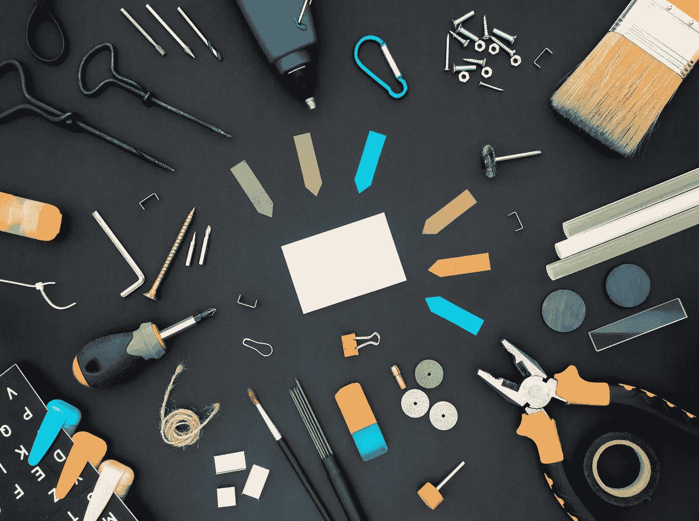

# 我对数据科学的理解正在向一个新的方向发展

> 原文：<https://towardsdatascience.com/my-understanding-of-data-science-is-evolving-to-a-new-direction-5863f815dac5>

## 意见

## 我不知道对此作何感想

丹·克里斯蒂安·pădureț在 [Unsplash](https://unsplash.com/s/photos/tools?utm_source=unsplash&utm_medium=referral&utm_content=creditCopyText) 上拍摄的照片

2019 年，数据科学开始成为我生活中的一件事。从那以后，我一直充满激情和好奇心地学习数据科学，几乎每天都有新的发现。

数据一直是数据科学的中心，这是意料之中的常态。数据科学就是从数据中提取信息、见解或价值。

利用数据创造商业价值的潜力显著增加，这推动了对数据、工具和技能的巨大需求。由于所有这些转变，工具的数量激增。

在我开始数据科学之旅时，我对数据科学家的理解是一个能够理解数据告诉我们什么的人。数据科学家超越表面现象，提取隐藏的信息。

到目前为止，我觉得成为一名数据科学家与你使用工具的能力更有关系。不要误解我。你阅读、理解和理解数据的能力仍然至关重要。然而，你在某些工具上的技能已经凸显出来。

我对数据科学的理解越来越像你在数据科学生态系统中使用工具的能力。我不知道对此作何感想。

显然，我们不能忽视工具。使用软件工具和软件包来清理、处理和分析数据总是势在必行的，因为我们可能要处理大量的数据。然而，工具的数量和复杂性一直在增加。因此，数据科学家花费大量时间学习使用这些工具。

# 这有什么不好？

首先，使用更高效更快捷的工具没有错。时间和计算能力是重要的资源，所以如果有一种工具有可能节省我们一些时间或计算，忽略它是不明智的。

但是，这不应该导致您忽略更重要的东西:数据。

掌握好手头的数据比任何其他工具都有用。例如，有几个超参数调整工具，可以帮助您找到最佳的超参数值，并可能实现对模型的改进。

另一方面，通过掌握数据的结构和属性并包含一些业务上下文来派生一个新特性，与超参数调优相比，您可能会获得显著的改进。

# 我必须学习所有的工具吗？

绝对不行！然而，数据科学不是一个单独从业者的工作。你是团队的一员，所以团队使用的工具是你需要学习的。考虑到数据科学生态系统中的高流动率，您可能会频繁更换公司，这可能意味着需要学习新的工具。

# 对于大公司来说，情况可能略有不同

如果你在一家大型公司担任数据科学家，你的任务可能会局限于一个较窄的范围。在这种情况下，你不必处理或学习这么多工具，因为你专注于一个特定的任务。

我认为这只对有限的几家公司有效。大量的数据科学家工作需要你参与数据科学或机器学习工作流程的多个步骤。

我想解释的是，作为一名数据科学家，还是作为一名数据科学工具专家。你不能完全忽略其中任何一个。然而，我强烈建议不要失去重点，不要忘记数据科学到底是什么。

如果你成为一个工具专家，你可以执行你被告知要做的任务。这绝对是一项宝贵的技能。除此之外，如果你帮助用数据做决策，你成为一名杰出的数据科学家的机会就会大大增加。

了解你的数据！

*你可以成为* [*媒介会员*](https://sonery.medium.com/membership) *解锁我的全部写作权限，外加其余媒介。如果你已经是了，别忘了订阅*<https://sonery.medium.com/subscribe>**如果你想在我发表新文章时收到电子邮件。**

*感谢您的阅读。如果您有任何反馈，请告诉我。*