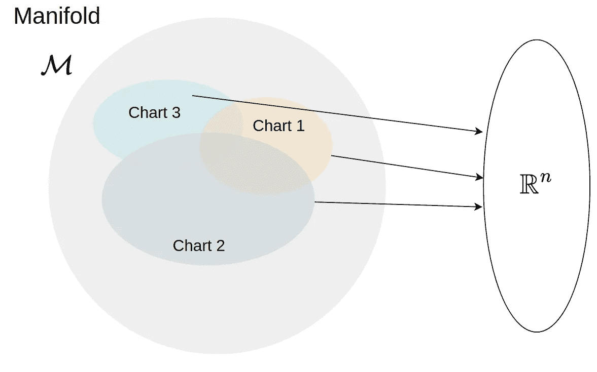
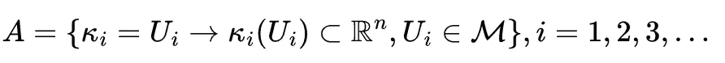
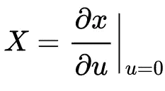
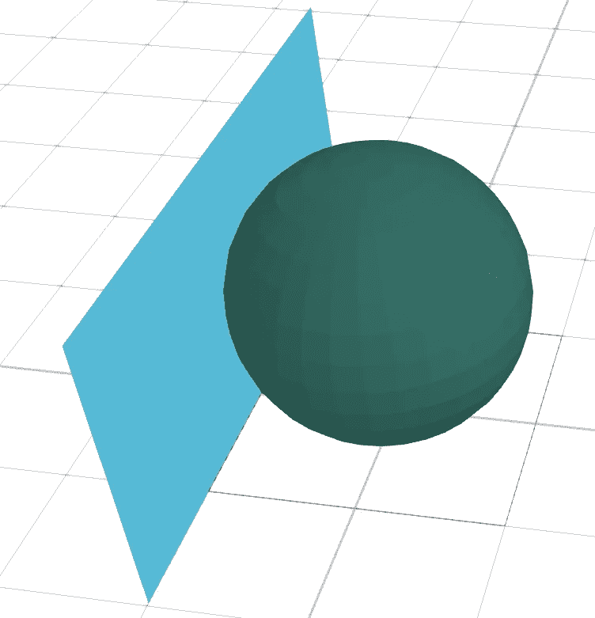
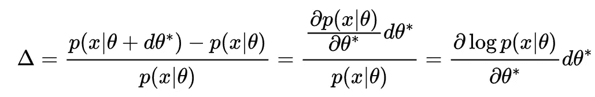
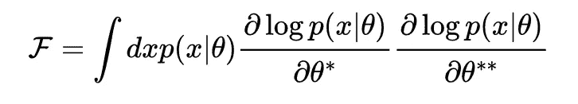
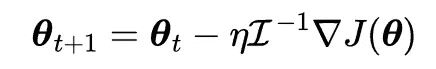

# 信息几何的神秘世界

> 原文：<https://towardsdatascience.com/mystical-world-of-information-geometry-16b4637d89e8>

## 信息论和机器学习的几何故事

该图像是由作者使用人工智能工具绘制的

在高中的时候，我们有些人对几何是又爱又恨，尤其是坐标和 3D 几何。更有甚者，微积分和几何是不被认可的。然后是信息技术的繁荣，随之而来的是机器学习、人工智能和数据科学的热潮。这个原因激发了许多人去更深入地挖掘一些数学和信息几何是其中之一。信息几何可以用在统计流形学习中，统计流形学习最近被证明是在高维数据集上进行无监督学习的有用工具。它还可以计算两个概率度量之间的距离，应用于模式匹配、为神经网络的训练构建替代损失函数、信任传播网络和优化问题。

> 信息几何是一种利用几何探索信息世界的数学工具。信息几何也被称为费歇尔几何，其原因将在本文的后面部分显而易见。

信息几何学是用几何学研究决策，可能还包括模式匹配、模型拟合等。但是为什么是几何方法呢？几何允许在一个无坐标的框架中研究不变性，提供了一个直观思考的工具，并允许我们研究等方差。例如，三角形的质心在仿射变换下是等变的。

让我们讨论一些基本原理来理解信息几何中有什么。

# 基本原则

为了理解微分几何，进而理解信息几何，我们需要了解什么是流形。在我之前关于[流形对齐](/manifold-alignment-c67fc3fc1a1c)的文章中，我讨论了什么是流形，但我将在下面复制它:

> n 维流形是具有极限、连续性和正确性的最一般的数学空间，并且允许与 n 维欧几里得空间存在连续的反函数。流形局部类似欧几里得空间，但它们可能不是欧几里得空间。本质上，流形是欧几里得空间的推广。

## 拓扑空间

考虑一个空间 *X* 由一组点 *x∈ X* 和一组称为每个点的邻域 *N(x)* 的 *X* 的子集定义。我们有以下属性:

1.  如果 *U* 是 *x、*和 *x∈ U* ，以及 *V⊂X* 和 *U⊂V* 的邻域，那么 *V* 也是 *x* 的邻域。
2.  *x* 的两个邻域的交集也是 *x* 的一个邻域。
3.  *x* 的任意邻域 *U* 包含 *x* 的邻域 *V* ，这样 *U* 就是 *V* 中所有点的邻域。

任何满足上述性质的空间 *X* 都可称为拓扑空间。

## 同胚现象

在[流形对齐](/manifold-alignment-c67fc3fc1a1c)中，我讨论了同态，它可以公理化地表示为:

考虑到*f*:*X*→*Y*是两个拓扑空间之间的函数，那么 *X* 和 *Y* 同胚如果 *f* 连续，双射，并且 *f* 的逆也连续。考虑一个流形𝓜，对于所有点 x *∈* 𝓜，如果 *U* 是 *x 的邻域，并且对于一个整数 *n* 使得 *U* 与ℝⁿ同胚，那么小的 *n* 是该流形的维数。*

## 图表

由函数*κ*:*u*→*κ*(*u*)表示的同胚称为图，其中 *U* 可能是𝓜.的开集有许多方法可以构建一个图表来定义𝓜.这些图表的集合被称为地图集。这个想法如图 1 所示。数学上，图谱将由等式 1 定义。图表的一个具体例子是坐标系统，它可以是映射流形上的点的函数。

图一。流形和图表(图由作者创建)

等式 1。一本地图册

此时，很容易定义一个**可微流形**:其转移映射(或函数)是无限可微的流形。

这就是抽象数学中的流形。它对统计学和数据科学的理解呢？记住，我们在统计学中处理概率。这导致了**统计流形的概念。**在统计流形中，每个点 *p ∈* 𝓜对应于一个域𝓧.上的概率分布人们可以用一个由正态分布族形成的流形的具体例子来考虑这一点。

## 流形上的向量和切线:如何在弯曲空间上定义它们

在普通几何中，向量是连接两点的直线，但在弯曲空间中，这可能不是真的。曲线空间上的向量被定义为流形上特定点处曲线的切线。如果 *u* 是一个沿曲线变化的参数，那么一条曲线可能被定义为 *x(u)* ，往往去掉 *u* 部分，简单写成 *x* 。弯曲空间中的向量变成

等式 2。弯曲空间中的向量

其被局部定义在点 *p* 处，其中 *u = 0* 。注意，向量本身不在流形上，但它有欧几里得概念。像图表一样，在点 *p* 可以有许多可能的切线。是的，如果你只是考虑一个 2D 平面，这是令人难以置信的，但即使在像球体一样的三维空间中，在一个点上也可能有多条切线，那么我们就可以谈论球体上一个点的切面(图 2)。类似地，我们可以讨论流形在点 *p* 的切空间。

图二。有切面的球体(作者画的)

如果我们从一个图表转到另一个图表，这与从笛卡尔坐标到极坐标的坐标转换是一样的。假设有一个变换函数 *ϕ* 将 *x* 从一个图表变换到另一个图表，那么可以写成*x′= ϕ(x).*

## **双空间**

向量空间 *V* 的对偶空间 *V** 是包含 *V* 的所有线性泛函的空间，即所有映射*t*:*v*↦*f*，其中 *F* 是 *V* 的向量空间所在的域。因此，对偶空间包含了从 *V* 到 *F* 的所有线性映射。为了更好地理解双重空间，我在网上搜索，无意中发现了下面这个例子:

> 想象一个二维实向量空间。定义一个函数，它接受任何向量，并只返回其 x 坐标值。定义另一个函数，它接受任何向量，只返回它的 **y** 坐标值。让我们调用第一个函数 **f1** 和第二个函数 **f2** 。让我们想得更多一点。把这两个函数当作向量。特别是，把它们想象成有趣的向量空间中的基本向量。你可以把它们加在一起:把 **f1** + **f2** 想象成一个函数，它接受任何向量并返回**x**-坐标和**y**-坐标之和。你可以把它们乘以数字:把 7 * **f1** 想象成一个函数，它接受任何一个向量，并返回乘以 7 的 **x** 坐标值。你可以组成任何你喜欢的线性组合:把 3.5 * **f1** -5 * **f2** 想成一个取任意向量的函数，返回数字 3.5 乘以 **x** 坐标减去 5 乘以 **y** 坐标。这就是双重空间的作用。

## 张量

流形上的张量是最普遍的。它们可以被认为是数学上的多线性野兽，吃切空间及其对偶空间的向量，吐出实数。供给张量的来自切空间及其对偶空间的向量总数称为**张量的秩**。来自对偶空间的这些数给出了所谓的**逆变秩**，来自正切空间的这些数被称为**协变秩**。

我将跳过对它们的正式讨论，因为老实说，我自己也不理解它们——现在还不理解。但本质上，流形是几何构造，张量是对应的代数构造。

## 公制的

度量是一个张量场，它在流形上的每一点的切空间上诱导一个内积。任何协方差秩为 2 的张量场都可以用来定义度量。一些资料称之为黎曼 Metric⁷.

现在，在一长串错综复杂的术语之后，我们来看看信息几何中有用的东西。

# 信息几何学

> 信息几何是统计学和微分几何交叉的一个数学分支，它从几何的角度研究概率分布。

我们首先需要看一下**信息度量，也称为 Fisher 信息度量。**

## 费希尔信息度量

如果我们希望在点 *θ** 找到合适的度量张量，其中θ*对应于分布族 *p(x|θ)* 中的一个，那么我们需要考虑 *p(x|θ)* 和它的无穷小扰动 *p(x|θ + dθ*)之间的距离概念。*那么相对差值由等式 3 给出。当然

等式 3。 *θ*处扰动的相对差值。*

相对距离取决于随机变量 *x* 。如果你计算正确，那么δ的期望值，即𝔼(δ= 0。方差呢？原来方差是非零的。我们可以定义=𝔼[δ。根据第一个原理，对于公制𝓕，在 *θ** 和 *θ*** 之间的无穷小位移的长度由 *dl =* 𝓕 *dθ*dθ**给出。*求解为*dl*=𝔼[δ]=𝓕*dθ* dθ* **给出

等式 4。费希尔信息度量

也就是我们所说的**费希尔信息度量(FIM)** 。FIM 测量随机变量 *X* 的一次观察平均携带了多少关于参数 *θ* 的信息，如果*x*∩*p(x∣θ)*。还有另一种方法可以达到等式 4 的 1/2 倍，我建议读者参考参考文献 1。但是，如果它让你兴奋，量子信息科学的蓬勃发展有费雪信息度量的应用。关于这一点，我将很快有一个新的系列文章。如果你想得到通知，订阅！另一个应用是贝叶斯推理中无信息先验的设计。也许我现在走得太远了。

我将用最后一件事来结束这篇文章，费希尔信息矩阵𝓘，当我们处理多个参数时，它是𝓕的矩阵版本，可以用在类似于梯度下降的优化中，更新规则为

等式 5。微分流形语言中的优化更新规则。

其中 *η* 为学习参数， *∇J* 为标量场 *J* 的散度。

在本文中，我试图提供信息几何和相关术语的简要概述。为了清楚起见，本文省略了大量的工作，我鼓励读者仔细阅读我在下面提供的参考资料。

这有帮助吗？ [*给我买杯咖啡*](https://www.buymeacoffee.com/rahulbhadani) *。*

*爱我的文字？加入我的* [*邮箱列表*](https://rahulbhadani.medium.com/subscribe) *。*

*想了解更多 STEM 相关话题？加入* [*中等*](https://rahulbhadani.medium.com/membership)

# **参考文献**

1.  [http://www . robots . ox . AC . uk/~ lsgs/posts/2019-09-27-info-geom . html](https://web.archive.org/web/20220407162109/http://www.robots.ox.ac.uk/~lsgs/posts/2019-09-27-info-geom.html)*
2.  [https://math . stack exchange . com/questions/240491/what-a-covector-and-what-is-it-used-for](https://math.stackexchange.com/questions/240491/what-is-a-covector-and-what-is-it-used-for)
3.  [https://qr.ae/pv34JS](https://qr.ae/pv34JS)
4.  [https://frank Nielsen . github . io/SPIG-莱舒克斯 2020/geom stats-spigl 2020 . pdf](https://franknielsen.github.io/SPIG-LesHouches2020/Geomstats-SPIGL2020.pdf)*
5.  [https://www.cmu.edu/biolphys/deserno/pdf/diff_geom.pdf](https://www.cmu.edu/biolphys/deserno/pdf/diff_geom.pdf)
6.  [https://math . UCR . edu/home/baez/information/information _ geometry _ 1 . html](https://math.ucr.edu/home/baez/information/information_geometry_1.html)*
7.  https://mathworld.wolfram.com/RiemannianMetric.html

注:结尾带*的链接已在[http://web.archive.org/](http://web.archive.org/)存档。

## 一些相关的话题

</manifold-alignment-c67fc3fc1a1c>  </the-gromov-wasserstein-distance-835c39d4751d> 