# N-BEATS:基于神经基扩展的时间序列预测

> 原文：<https://towardsdatascience.com/n-beats-time-series-forecasting-with-neural-basis-expansion-af09ea39f538>

## 零触发时间序列预测的深度学习模型


用 DALLE [1]创建

有一件事让时间序列预测变得特别。

这是数据科学中唯一深度学习和变形金刚没有明显优于其他模型的领域。

让我们使用久负盛名的 **Makridakis M 竞赛**作为基准——一系列展示时间序列预测领域最新进展的大规模挑战。

在被称为 **M4** 的第四次迭代中，获胜的解决方案是[ES-RNN【2】](https://eng.uber.com/m4-forecasting-competition/)，这是优步开发的混合 LSTM &指数平滑模型。有趣的是，6 个(57 个中的)纯 ML 模型表现很差，它们几乎没有超过竞争基线。

一年后，情况发生了变化。 *Elemental AI* (与 **Yoshua Bengio** 共同创立)发表了[**N-BEATS【3】**](https://arxiv.org/pdf/1905.10437.pdf)***，*** 一个纯深度学习模型，比 M4 获奖的 ES-RNN 模型高出 3%。但是还有更多。

在本文中，我们深入描述:

1.  ***N-BEATS*的架构，模型如何工作，为什么如此强大。**
2.  如何产生可解释的预测。
3.  **N 拍 *N 拍*如何实现无与伦比的零拍迁移学习。**
4.  **为什么 *ARIMA* 不能原生支持迁移学习。**

让我们开始吧。

> 如果你对时间序列预测感兴趣，可以查看我收集的最佳深度学习模型和教程。

# 什么是 N-BEATS

> N-BEATS 是一种快速、可解释的 DL 模型，它使用完全连接层的双残差堆栈来重新创建统计模型的机制。

**N-BEATS** 代表***N****eural****B****asis****E****x expansion****A****分析为****T****ime****S 这家公司是由 Yoshua Bengio 联合创立的，后来被 T42 的 ServiceNow 收购。***

*N-BEATS* 是一个有趣的预测模型，因为:

*   这是第一个超越所有成熟的统计方法的纯深度学习模型。
*   它提供了可解释的预测。
*   它为时序上的**迁移学习**奠定了基础。

大约在那个时候，**亚马逊**发布了其新颖的时间序列模型，被称为[**DeepAR【4】**](https://arxiv.org/pdf/1704.04110.pdf)**。**虽然 *DeepAR* 包含深度学习组件，但该模型也采用了一些统计概念(最大似然估计)。

# n 节拍—概述

让我们简单讨论一下 *N-BEATS* 的几个关键特质:

*   **多时间序列支持** : *N 拍*可以在多个时间序列上训练，每个时间序列代表一个不同的分布。
*   **快速训练:**模型不包含任何递归或自我注意层——因此，更快的训练&稳定的梯度流。
*   **多时段预测**:模型产生多步预测。
*   **可解释性:**作者开发了 2 个模型版本， ***通用*** 版本，以及 ***可解释性*** 版本。可解释版本可以输出关于趋势和季节性的可解释预测。
*   **零触发迁移学习:**该模型可以将其知识转移到其他时间序列数据集，取得惊人的成功。

> **注:**element ai 最初的 N-BEATS 实现仅适用于单变量时间序列。Darts 库发布了支持多元时间序列和概率输出的更新版本。在本文中，我们将重点放在原始版本上。

# N-BEATS —通用架构

N-BEATS 架构很深，但非常简单。**图 1** 显示顶层视图:

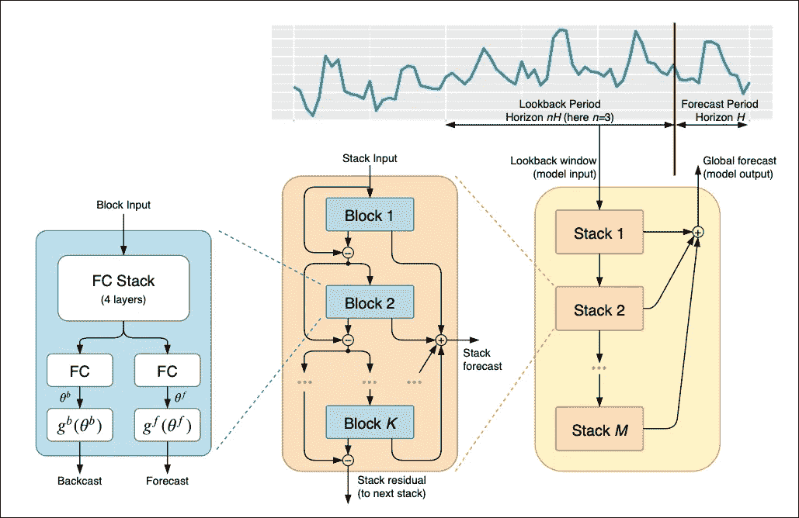

**图 1:**N-BEATS 的顶层架构([来源](https://arxiv.org/pdf/1905.10437.pdf))

注意 3 件事:

1.  ***块*** (蓝色)——基本加工单元。
2.  ***栈*** (橙色)——积木的集合。
3.  ***最终型号*** (黄色)——一叠叠的集合。

模型中的每个神经网络层只是一个密集(全连接)层。

让我们从第一个组件开始，即基本块:

## 1.基本块

假设`H`是预测范围。在 *N 拍*中，回看窗口是视界`H`的倍数。

**图 2** 显示了基本块的架构:

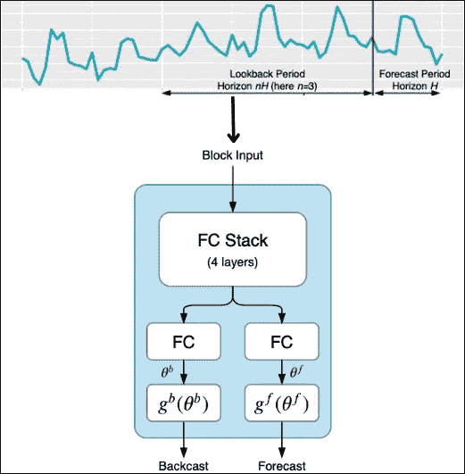

**图 2:** 基本块架构([来源](https://arxiv.org/pdf/1905.10437.pdf))

让我们来看看引擎盖下。

在**图 3 中，**我们使用来自**电力数据集【5】**的纸张基准参数:

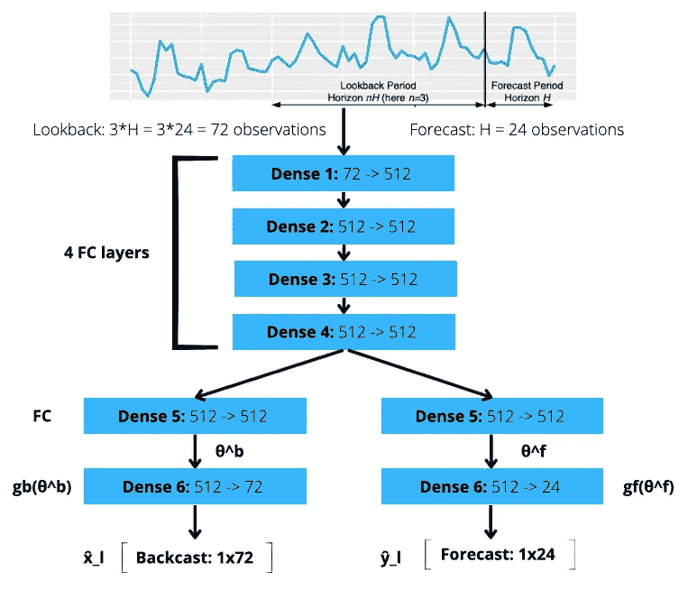

**图 3:** 基本块内的所有操作(图片由作者提供)

让我们看看这里会发生什么:

*   模型回顾`3 days` = `72 hours` = `3 horizons`来预测未来 24 小时的用电量。
*   该块接收回看窗口输入。
*   然后输入通过一个 4 层神经网络。
*   该计算的结果被导向 2 个输出。这里密集层**密集层 5** 估计θ参数(`θ^b`和`θ^f`)，称为**展开系数**。
*   然后，使用**基**层变换`g^b`和`g^f`将这些参数线性投影到新的空间，以产生*和 ***预测*** 信号。这个过程叫做“**神经基础扩展**”。*

> *那么**、**反向预测和预测向量是如何有用的呢？*

*给定`g^b`和`g^f`变换，**反向预测**信号是能够最佳预测**预测**信号的最佳近似向量。当`g^b`和`g^f`采取特定的形式时，反向预测和预测向量就变成了**可解释的**(后面会详细说明)。*

## *2.堆栈*

*为了提高*神经扩展过程的效率，*作者将许多块堆叠在一起。该结构显示在**图 4:***

*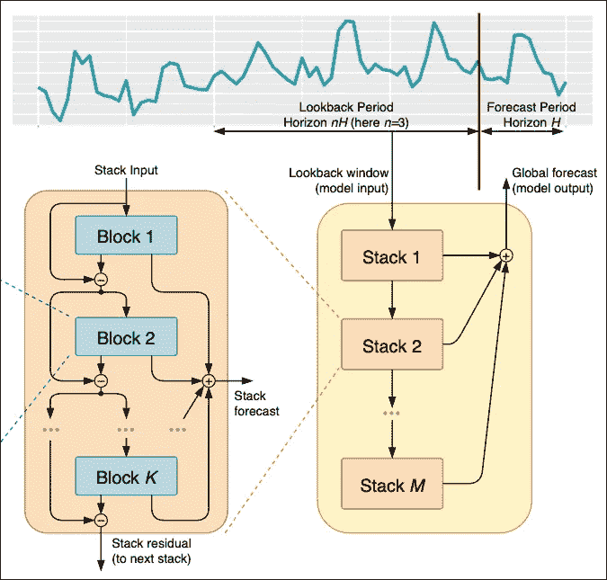*

***图 4:** 积木堆(左)和积木堆(右)——([来源](https://arxiv.org/pdf/1905.10437.pdf))*

*只有第一个块接收原始序列输入。下游块接收来自前一块的回播信号`**x_l+1**` (其中`l`是块索引，即`l_1`是堆栈中的第一块)。*

*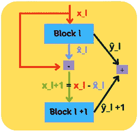*

***图 5:** 块内部的操作(图片由作者提供)*

*在每个堆栈内，反向预测和预测信号被组织成两个分支:这种拓扑被称为**双重残差堆栈**，并且可以由以下等式描述为:*

**

*在每个块中，模型从输入`**x**_l`中移除已经很好地近似的那部分反向预测信号`**x̂**_l`。换句话说:*

> *每个模块的模型学习最佳地逼近输入信号的一部分，并发送其余部分以由下游模块逼近。*

*由于每个模块仅模拟输入信号的一部分，最终预测是来自所有模块的所有*预测* `ŷ`信号的总和。*

*最后，堆叠也堆叠起来(**图 4，**右)。这种架构选择进一步增加了模型的深度，并增强了其学习复杂时间序列的能力。*

*我们已经看到了通用版本的 *N-BEATS* 是如何工作的。接下来，我们将描述*可解释的*版本。*

# *N-BEATS 和 ARIMA 有关系吗？*

*如果你熟悉 **ARIMA** ，你可能会注意到与 *N 节拍*方法*的一些相似之处。**

**ARIMA* 使用 **Box-Jenkins** 方法建模，这是一个迭代过程。具体来说:*

1.  *首先，我们猜测 **AR()** 和 **MA()** 函数(`p`和`q`参数)的顺序。*
2.  *之后，我们使用例如最大似然估计来估计这些参数的系数。*
3.  *然后，我们验证模型的条件是否成立。例如，模型的残差应该是正态和独立的。如果没有，我们返回到步骤 1 并重复该过程。这一次，我们在之前的基础上增加了新的`p`和`q`度。*

*换句话说，在 Box-Jenkins 的每一步中，我们都向模型中添加了更多的信息。每次迭代都会根据模型残差创建更好的输入表示。*

*因此，我们可以得出结论:*

> *在 N-BEATS 中，每个连续的块仅模拟由前一个块重建的反向预测的残余误差，然后根据该误差更新预测。在拟合 ARIMA 模型时，这一过程模仿了 Box-Jenkins 方法。*

*这两种方法的主要区别在于残差的目标函数。 *ARIMA* 关注残差的质量，而 *N-BEATS* 使用任意损失函数。*

*另外，我们不用手动调整任何带有 N 拍的方程——基变换会通过反向传播自动优化。使用 *ARIMA* 然而，我们大量使用自相关和偏自相关图来猜测`AR()`和`MA()`函数的顺序。*

> ***注意:**根据编程语言和库的不同，一些 ARIMA 库实现了略有不同的 Box-Jenkins 方法。在这里，我们记录了教科书的实现。*

# *n-BEATS——可解释的架构*

*通过一些改变， *N-BEATS* 模型变得可以解释了:这些改变是:*

*   *我们只使用 2 个堆栈，趋势堆栈**和季节性堆栈**。通用架构至少使用 30 个。*****
*   ***趋势和季节性堆栈都包含 3 个块。在通用架构中，每个堆栈有一个块。***
*   ***`g^b`和`g^f`的**基础**层权重在堆栈级别共享。***

***基本思想是`g^b`和`g^f`基采取特定的形式。让我们更详细地描述它们。***

## *****趋势块*****

***我们的目标是将`g^b`和`g^f`函数重构为单调的，在预测窗口中缓慢变化。***

***给定一个时间向量`t=[0,1,2,…,*H*−2,*H*−1]` ( `H`是地平线)、来自前一层的θs`θ`和多项式次数`p`，趋势模型被定义为:***

***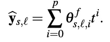***

***换句话说，我们使用**图 3** (通用块)的架构，用上面的操作交换最后一个线性层。结果如**图 6 所示:*****

******

*****图 6:** 趋势块(图片由作者提供)***

***本文中没有描述逆向预测方程，但是它们可以很容易地从项目的实现中推导出来。此外，趋势和季节性块(**图 6** 和**图 7** )采用来自[官方项目报告](https://github.com/ServiceNow/N-BEATS/blob/master/experiments/electricity/interpretable.gin)的参数:***

```
***interpretable.seasonality_layer_size = 2048
interpretable.seasonality_blocks = 3
interpretable.seasonality_layers = 4
interpretable.trend_layer_size = 256
interpretable.degree_of_polynomial = 3
interpretable.trend_blocks = 3
interpretable.trend_layers = 4
interpretable.num_of_harmonics = 1***
```

## ***季节性障碍***

***类似地，我们用适当的`g^b`和`g^f`函数替换最后一层，以捕捉季节性。傅立叶级数是一个很好的选择:***

***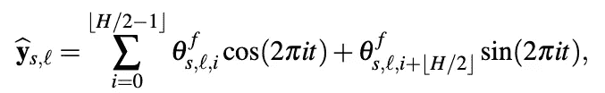***

***然后，架构变成:***

***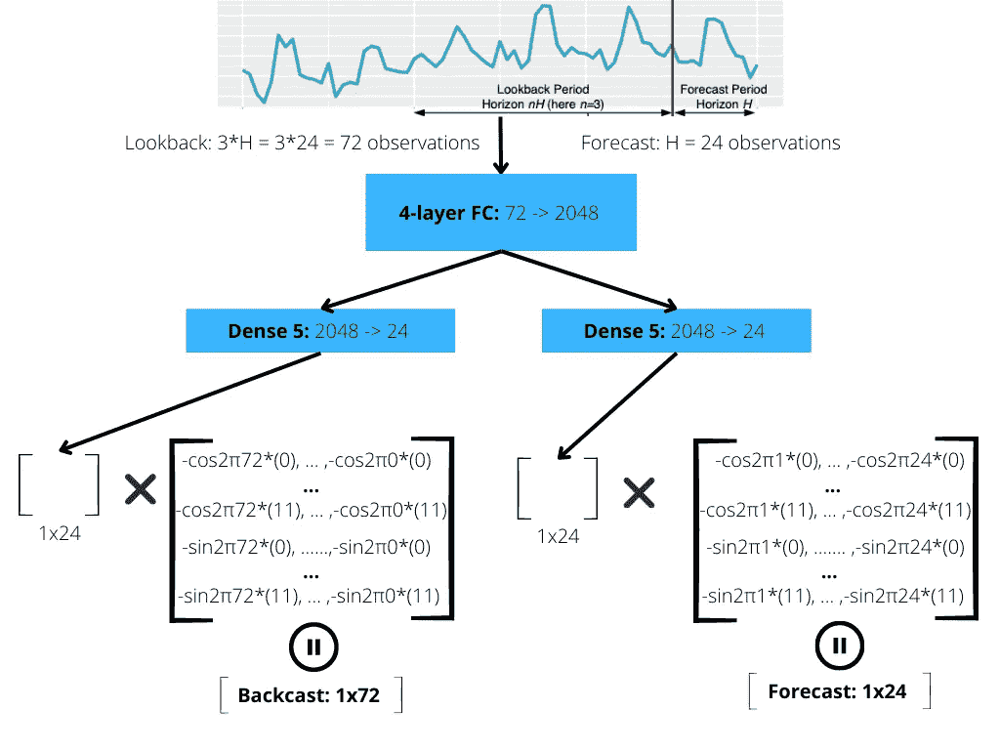***

*****图 7:** 季节性区块(图片由作者提供)***

***我们再次强调，在所有可解释的堆栈中，堆栈中的`g^b`和`g^f`权重是共享的。***

# ***实验结果***

***最后，作者在 3 个流行的时间序列数据集上测试了 *N-BEATS* 的性能——M3[6]、M4[7]和旅游业[8]。***

## ***实验装置***

***作者将所有模型分为特定的类别，并将 N-BEATS 与每个类别的最佳模型进行比较。例如， *DL/TS hybrid* 是 M4 获奖的 ES-RNN 车型。***

***由于所有这些数据集都用于数据科学竞赛，因此所有参与者都依赖集成来实现最佳性能。因此， *N-BEATS* 的作者依靠集合来进行比较。他们使用了三种变体: **N-BEATS-G** (通用)**、N-BEATS-I** (可解释)和**N-BEATS-I+G**(N-BEATS-G 和 N-BEATS-I 所有模型的集合)。***

***最重要的是，他们创造了 6 个不同的模型，每个地平线和变化都有回顾窗口`2H, 3H .. 7H`。关于组件配置的更多细节，请查看原始文件。总之，作者集合了 180 个模型来报告测试集的最终结果。***

## ***结果***

***所有数据集的结果如**图 8:** 所示***

***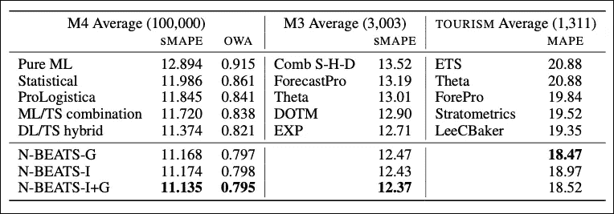***

*****图 8:** 在 M3、M4 和旅游数据集上的实验结果([来源](https://arxiv.org/pdf/1905.10437.pdf)***

***结果相当可观。***

***在所有数据集上， *N-BEATS* 优于其他实现，其中 *N-BEATS-I+G* 最为成功。***

***请注意，在每个数据集中，竞赛使用 MAPE、斯马普和 OWA 指标(越低越好)。这些指标在时间序列竞赛中很受欢迎。***

> *****注意:**与其他方法相反，N-BEATS 不需要任何手工制作的特征工程或输入缩放。因此，N-BEATS 在不同的时间序列任务中更容易使用。***

# ***零射击迁移学习***

****N-BEATS* 的主要贡献是能够在时间序列上成功实现迁移学习。***

## ***预赛***

*****迁移学习**是一个更通用的术语——它指的是一个模型如何在不同的数据集之间转移其知识。这已经建立在计算机视觉或 NLP 任务上:我们可以下载一个预训练的模型，并通过微调将其调整到我们的数据集。***

*****元学习**(或少量学习)是指模型只需少量训练/微调就能适应我们的数据集。最好的场景是 ***零触发学习*** ，其中模型不在目标数据集上训练。***

> ***零命中率学习是模型使用看不见的数据进行预测的能力，而无需对它们进行专门训练。这种学习方法更好地反映了人类的感知。***

***此外，这种向元学习的新范式转变已经被最新的人工智能研究所接受，如 open AI**—**[**CLIP【9】**](https://medium.com/towards-data-science/clip-the-most-influential-ai-model-from-openai-and-how-to-use-it-f8ee408958b1)**和**[**Whisper【10】**](https://medium.com/towards-data-science/whisper-transcribe-translate-audio-files-with-human-level-performance-df044499877)就是其中的几个。*******

## *****零拍 N 拍*****

*******yo shua beng io**(*N-BEATS*的合著者)在之前的工作中已经建立了预测任务迁移学习的理论基础【11】。*****

******N-BEATS* 的作者发表了一篇后续论文[12]，其中总结了大部分工作，包括时间序列预测模型应该满足哪些要求才能执行有效的迁移学习。*****

*****让我们来关注一下*的 N-BEATS。******

*****作者指出 *N-BEATS 的*元学习能力取决于两个过程:I)内部学习过程和外部学习过程**。它们如**图 9 所示:*********

***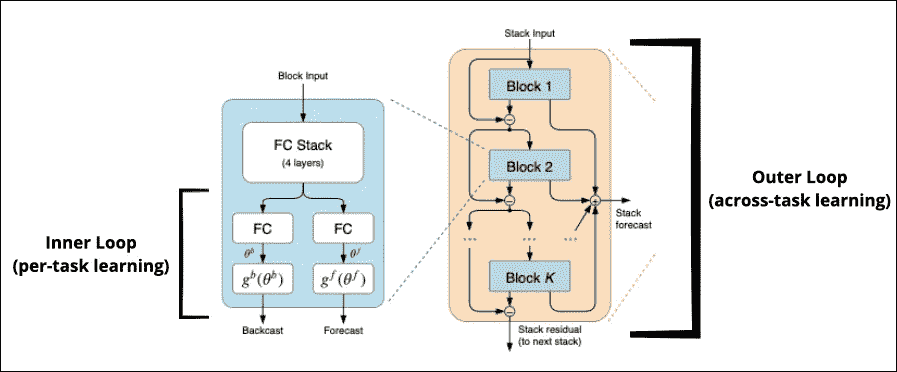***

*****图 9:**N-BEATS 中的元学习过程([来源](https://arxiv.org/pdf/1905.10437.pdf)，作者编辑)***

*****内部循环**发生在每个模块内部，重点是学习特定任务的特征。***

*****外部循环**发生在堆栈级别。在这里，模型学习所有任务的全局特征。***

> ***换句话说，内环学习局部时间特性，而外环学习所有时间序列的更长相关性。***

***然而，这回避了下面的部分:***

## ***为什么 ARIMA 不适合迁移学习？***

***如果一个既定的范例规定了一个预测模型应该满足哪些标准才适合迁移学习，那么为什么 ARIMA 不是呢？***

***为了回答这个问题，我们将再次关注[12]描述的两个学习过程***

***创建 ARIMA 模型时，有两个挑战:***

1.  *****参数估计:**使用最大似然法等统计技术估计参数。**这是内循环。*****
2.  *****模型公式:**这定义了自回归方程的形式。例如，如果我们的模型有一点趋势，没有季节性，正常残差，我们可以决定高斯 ETS 可能会做这项工作。**这是外循环。*****

***请注意，统计模型只通过了第一个标准，即内部循环。***

***一旦我们选择了模型，参数估计部分就很简单了。但是，模型制定部分需要人工干预。因此，关于统计方法，**外环的作用没有实现。*****

***因此，我们得出结论:***

> ***N-BEATS 用可学习的参数估计策略取代了经典统计模型的模型参数估计的预定义规则集。这种策略允许 N-BEATS 在多个看不见的时间序列上很好地概括。***

## ***N 拍的零拍学习结果***

***在本次实验分析中，作者用一些新模型丰富了之前基准(**图 8** )的结果:***

*   *****N 拍-M4:** 作者在 M4 上建立了一个预训练的 *N 拍*模型。***
*   ***迪帕尔-M4:M4 上的一款经过预训练的*迪帕尔*型号也加入了型号库。***

***总结果如**图 10** 所示:***

***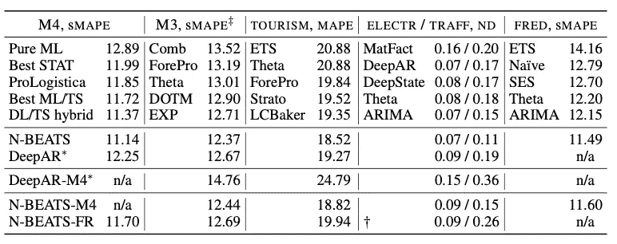***

*****图 10:** 零拍车型对比([来源)](https://arxiv.org/pdf/2002.02887.pdf)***

***同样，结果非常有趣。***

*   ***zero-shot***N-BEATS-M4***在 M4 和旅游数据集上的表现优于所有其他模型(包括获胜者)，尽管它没有在这些数据集上进行训练。***
*   ***零距离射击**迪帕尔-M4** 似乎表现不佳。这是意料之中的，因为 *DeepAR* 不适合迁移学习。***
*   ***在每个数据集中，与定制训练的 *N 拍*相比，零拍 *N 拍*模型表现非常好。如果能看到在 Whisper 等其他零炮模型中发现的有效稳健性与总体稳健性的关系图，那将会很有意思。***

# ***结束语***

****N-BEATS* 是一个突破性的深度学习预测模型，对时间序列领域产生了持久的影响。***

***在本文中，我们描述了 *N-BEATS* 的两个主要优势:首先，它是一个产生 SOTA 结果的强大模型。其次， *N-BEATS* 为实施零投迁移学习建立了一个定义明确的框架。据我所知，这是第一个成功实现这一点的模型。***

***在我们的下一篇文章中，我们将介绍一个使用 *N-BEATS、*的编程教程，并描述一篇更新的论文，名为 *N-HiTS* 。***

# ***感谢您的阅读！***

***我每个月写一篇有影响力的 AI 论文的深度分析。
**保持连接！*****

*   ***订阅我的[简讯](https://medium.com/subscribe/@nikoskafritsas)！***
*   ***在 [Linkedin](https://www.linkedin.com/in/nikos-kafritsas-b3699180/) 上关注我！***

# ***参考***

***[1]根据 DALLE 创作，文字提示“通过空间传输的霓虹正弦信号，概念艺术”，给 rg***

***[2] Slawek Smyl 等著[*M4 预测竞赛:引入全新混合 ES-RNN 模型*](https://eng.uber.com/m4-forecasting-competition/)***

***[3] Boris O .等著 [*N-BEATS:可解释性时间序列预测的神经基础展开分析*](https://arxiv.org/pdf/1905.10437.pdf) *，* ICLR (2020)***

***[4] D. Salinas 等人 [*DeepAR:用自回归递归网络进行概率预测*](https://arxiv.org/pdf/1704.04110.pdf) 《国际预测杂志》(2019)。***

***[5][electricityloaddiagrams 2011 2014](https://archive.ics.uci.edu/ml/datasets/ElectricityLoadDiagrams20112014)数据集由 UCI，CC BY 4.0。***

***[6]https://forecasters.org/resources/time-series-data/ M3 数据集，公共领域***

***[7]https://forecasters.org/resources/time-series-data/ M4 数据集，公共领域***

***[8]旅游数据集[https://www.kaggle.com/c/tourism1](https://www.kaggle.com/c/tourism1)，公共领域***

***[9]亚历克·拉德福德等 [*从自然语言监督中学习可转移的视觉模型*](https://arxiv.org/pdf/2103.00020.pdf)*(2021 年 2 月)****

***[10]亚历克·拉德福德等人[通过大规模弱监督的鲁棒语音识别](https://cdn.openai.com/papers/whisper.pdf)*(2022 年 9 月)****

***[11] Yoshua Bengio 等人[学习一个突触学习规则 ](https://mila.quebec/wp-content/uploads/2019/08/bengio_1991_ijcnn.pdf)***

***[12] Boris O .等人 [*元学习框架及其在零炮时间序列预测中的应用*](https://arxiv.org/pdf/2002.02887.pdf)***