# N-BEATS Unleashed:使用 Python 中的神经基础扩展分析进行深度预测

> 原文：<https://towardsdatascience.com/n-beats-unleashed-deep-forecasting-using-neural-basis-expansion-analysis-in-python-343dd6307010>

## 深度预测

# N-BEATS Unleashed:使用 Python 中的神经基础扩展分析进行深度预测

## 端到端示例:具有复杂季节性的多变量时间序列的神经预测

[分形数学几何——数码艺术家在像素上的自由图像](https://pixabay.com/illustrations/fractal-math-geometry-rendering-1943505/)

上周，我开始撰写一系列关于深度预测的文章。我们讨论的第一种方法是变压器。

  

今天，让我们为我们的武器库中添加另一个神经网络预测器: **N-BEATS，**时间序列的**神经基础扩展分析**。

N-BEATS 是[Oreshkin 等人在 2019 年的一篇文章中首次描述的一种神经网络类型](https://arxiv.org/abs/1905.10437)作者报告称，N-BEATS 的表现超过了 M4 预测竞赛获胜者 3%。M4 获奖者是递归神经网络和 Holt-Winters 指数平滑的混合体——而 N-BEATS 实现了一种“纯粹的”深度神经架构。

我们将使用 N-BEATS 的 PyTorch 实现，通过 **Darts** 多预测库，我在上周的 Transformer 示例中使用了相同的包。Darts 将 PyTorch 的预测相关类与其他几个包的预测相关类结合在一起。通过在一个全面的时间序列库中包装多种方法，Darts 便于在预测方法、预处理和评估任务之间切换。

为了与变压器进行比较，我们将再次预测西班牙的每小时电价。时间序列展示了三种季节性模式:小时、工作日和月份。30 多个外生变量影响着价格水平。这两个方面将价格转化为一个时间序列问题，这个问题非常复杂，以至于深度预测要优于经典方法。

# 1.N 拍的概念

关于 N-BEATS 的开创性论文将其重点“[放在使用深度学习解决单变量时间序列点预测问题上。“我们将超越最初的范围:整合协变量，生成概率预测而不是点估计。Darts 通过将源数据展平为一维序列，使原始 N-BEATS 架构适应多元时间序列。](https://arxiv.org/pdf/1905.10437.pdf)

【1905.10437.pdf(arxiv.org)【N-BEATS】，奥列什金等人(2020)

该模型由一系列堆栈组成，每个堆栈组合多个块。这些模块通过预测和反向预测链接连接前馈网络。块“[移除信号的一部分…它可以很好地近似](https://arxiv.org/pdf/1905.10437.pdf)。然后，该模块将注意力集中在剩余误差上，这是前面的模块无法解决的。每个块生成一个局部预测，其重点是时间序列的局部特征。堆栈汇总其包含的块的部分预测，然后将结果移交给下一个堆栈。堆栈的目的是通过“回顾”来识别整个时间轴上的非局部模式最后，将部分预测拼凑成模型级别的全局预测。

N-BEATS 的超参数为:

*   **输入层**和**输出层**(常量 INLEN 和 N_FC)的大小应足以为源数据中的每个特征分配一个节点。输入语块的长度不能小于季节性的顺序，否则学习过程会发现更难组合这些语块。为了有效使用内存，请将它们设置为 2 的幂。
*   堆栈中的**块数**(块数)。
*   栈的每个块中每个全连接**层**的**宽度**:其节点计数(LWIDTH)。
*   **批量大小**定义了模型在更新其矩阵权重之前将处理的观察数量。为了有效地将它与系统的内存结构对齐，将其设置为 2 的幂。非常大的批量可能会误导单方向的梯度下降——模型可能会陷入次优最小值。较小的批量将导致梯度下降在不同方向反弹，并可能导致较低的精度，但它们也有助于防止模型[过度拟合](https://arxiv.org/abs/1609.04836)。最常见的建议是选择初始批量为 32。因为我们的数据集有每天 24 小时的频率，所以我将批处理大小设置为可以处理 24 个时间步长的下一个二进制上限:32。
*   **时期**告诉模型它应该运行多少个训练周期。在每个时期，模型将处理整个训练集，进行一次向前和一次向后传递。

考虑到一些过度简化，这些超参数的乘积定义了模型的张量大小。较大的参数值会使它与系统的内存限制相冲突，并导致处理时间成倍增长。而小参数值可能不足以反映源数据中的复杂模式。

正如我们在 Transformer 示例中所做的那样，我们将使用分位数回归得出一个**概率**预测。这是我们可以在所有深度预测模型中使用的一个选项。神经网络的损失函数可以公式化为*分位数损失函数。*然后，分位数回归不仅会计算每个时间步的中心预测值(也称为点估计值)，还会绘制不确定性带。像 1%/99%或 10%/90%这样的分位数对表示预测值可以变化的范围，高于或低于中心值。

关于概率性预测而非确定性预测的更多背景信息，请参考本文:

  

# 2.属国

除了用于数据争论和探索的经典包，如 pandas、numpy 和 matplotlib，我们还引入了 seaborn 的绘图功能。

小的 *missingno* 包是可选的:missingno 有助于可视化空值是如何分布在行和列上的。但是，您可以选择不安装它，并删除它的代码行，而不会影响预测脚本的其余部分。

最后，我们需要 conda-install 或 pip-install Darts 包及其 PyTorch 选项，它涵盖了我们可以通过 Darts 实例化的所有神经网络变体:[Darts/readme . MD at master unit 8co/Darts GitHub](https://github.com/unit8co/darts/blob/master/README.md#installation-guide)。

最好为飞镖创造一个新的虚拟环境。这是我们在安装大的软件包之前应该一直遵循的实践，特别是那些具有非 Python 依赖性的软件包。PyTorch 和 Prophet 依靠 C++。

Darts 至少需要 Python 3.7，目前还不支持 3.10。我在 3.9 中也看到过由 Prophet 选项导致的安装 hickups，所以我选择了 Python 3.7 conda 环境(2021 年 12 月)。

# 3.设置

Jupyter 笔记本的设置单元列出了将控制 N-BEATS 模型的超参数。它为脚本的其他方面添加了许多额外的控制设置。

在最顶端，我们可以看到负载参数。如果用户设置为 True，脚本将不会(重新)训练模型，但是会将以前保存的 tar 文件从当前工作目录加载到内存中。该脚本将根据这个加载的模型创建预测值，并跳过耗时的培训课程。LOAD 选项对于将预训练的模型转移到不同的机器上也很有用，例如生产服务器。

RAND 参数接受随机种子，这将使结果可重复。

N_SAMPLES 建议模型在一个时间步长内绘制 N 个随机预测值，而不是只计算一个点估计值。对于概率预测，N_SAMPLES 必须设置为大于 1。样本数量不会显著增加处理时间。分位数损失函数以低计算成本生成样本。

N-JOBS 限制了脚本可以并行请求的处理器内核数量。如果设置为-1，所有核心都将可用于模型。

列表分位数通知模型应该计算预测分位数的百分比。

分割设置应该为培训保留的实际观察的百分比份额。

FIGSIZE 建议使用默认的绘图尺寸。

# 4.时间序列

该数据集可从 Kaggle 下载，获得 CC0 公共域名许可:[每小时能源需求生成和天气| Kaggle](https://www.kaggle.com/nicholasjhana/energy-consumption-generation-prices-and-weather)

[每小时能源需求生成和天气| Kaggle](https://www.kaggle.com/nicholasjhana/energy-consumption-generation-prices-and-weather) ，作者截图

源文件由两个 csv 文件组成:

*   能源文件记录了西班牙每小时的电价，单位为欧元/百万瓦时(€/兆瓦时)；按来源分类的发电量(煤、天然气、风力等。)在 MWh 和以 MWh 为单位的能量需求(“负载”)。
*   天气文件提供了西班牙五个主要城市的每小时记录。

我们将我们的分析限制在观测数据的最后一年，即 2018 年，并预测接近年底时约 870 个时间步长的每小时电价。

能源数据集中的大部分栏目都按能源类型(如风力、煤炭或太阳能发电厂)报告发电量，单位为兆瓦时。

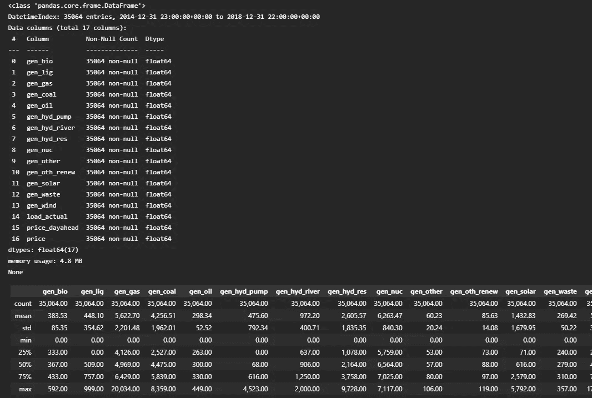

作者图片

N-BEATS 笔记本包含了数据处理和预处理的完整代码。你可以在上周的教程中找到这些步骤的详细解释和它们的笔记本单元:“[变形金刚释放](/transformer-unleashed-deep-forecasting-of-multivariate-time-series-in-python-9ca729dac019)”

价格图显示了一条具有垂直波峰和波谷的曲线。它们的幅度各不相同，这意味着我们面临不止一种季节性。价格水平没有呈现强劲的上升或下降趋势。它趋于回到€ 60/MWh 左右的水平。

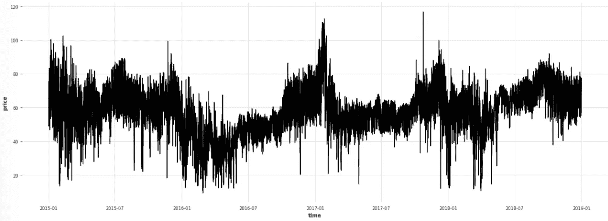

作者图片

天气数据集包括五个西班牙大城市及其每小时的天气记录。

我们将把能源数据和天气数据结合在一个数据帧中。

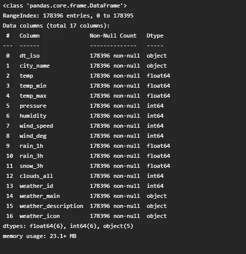

作者图片

相关矩阵将使我们能够辨别众多因素对电价的影响。

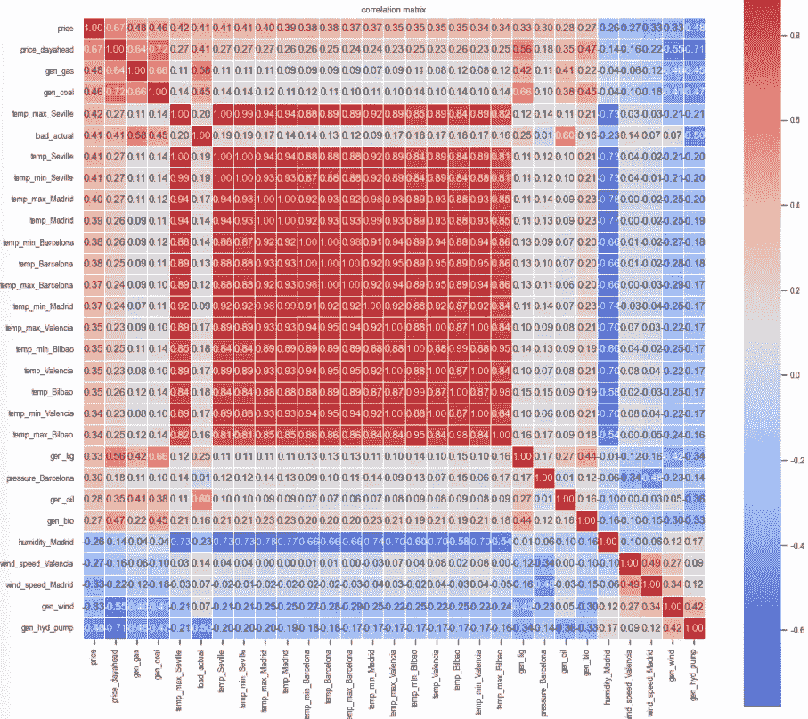

作者图片

该热图强调了许多特征彼此高度相关，尤其是城市温度。我们将把那些至少对价格水平有适度影响的因素分离出来。这种功能集的减少是我在第一篇文章中描述的一个练习: [Transformer Unleashed](/transformer-unleashed-deep-forecasting-of-multivariate-time-series-in-python-9ca729dac019) 。

接下来，我们应该调查时间序列的季节性。

当我们按月份和工作日对价格进行分组时，得到的数据透视表与热图相结合，可视化了两种季节性模式:月与月之间；还有工作日和周末的区别。

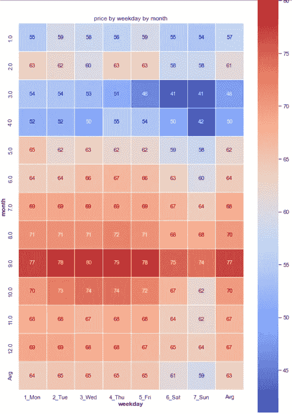

作者图片

第二个数据透视表及其热图揭示了某一天电价的每小时季节性模式。白天和夜间的时间变化，以及工作日和周末的时间变化，显示了和每月季节性一样的对比。

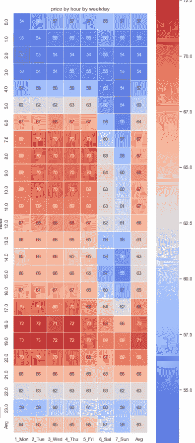

作者图片

我们得出结论，N-BEATS 模型必须学习三种季节模式:

*   每小时的价格波动
*   工作日与周末
*   寒冷和温暖的月份

# 5.飞镖中的时间序列对象

Darts 对时间序列对象进行操作，我们需要将包含源数据的 pandas 序列(或 numpy 数组)转换成时间序列对象。

首先，我们从数据框架的价格列创建一个单变量目标时间序列 ts_P。

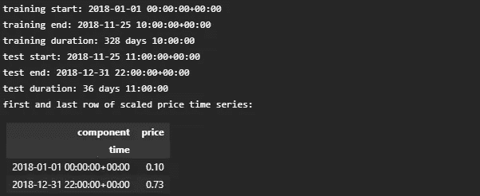

作者图片

然后，我们将数据帧的特征列分组到协变量的多元时间序列中:ts_covF。

接下来，我们在训练集和测试集之间拆分价格时间序列。

如果数据集包含不同量值的值，神经网络的梯度下降可能被误导。我们实例化 Darts 的 scaler 类，并在将 Scaler 应用于训练集和测试集之前，使其适合 price 时间序列的训练集。

然后，我们采取类似的步骤来准备特征协变量。

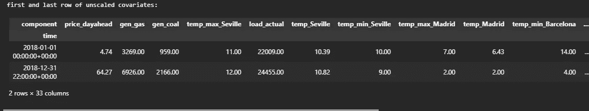

作者图片

Darts 的函数*datetime _ attribute _ time series()*使我们能够将小时、工作日和月分离为协变量。

请注意，第 2 行将我们在实际观测中发现的时间步长增加了 48 小时。这样，我们已经为实际观测结束后的样本外预测准备了时间序列。

第 3 行到第 5 行将日期时间协变量“堆叠”在一起，放在一个多变量时间序列对象中。

第 7 行包含一个标记西班牙公共假日的函数，因此增加了一个有用的第四个协变量。

第 12 行在训练集和测试集之间划分日期时间协变量，然后第 16 到 20 行调整它们的值。

*concatenate()* 函数合并多变量时间序列对象中的特征协变量和日期时间协变量。 *slice_intersect()* 函数确保组件在时间轴的同一段上延伸，否则如果我们试图组合长度不等的时间序列，就会看到一条错误消息。

# 6.训练 N-BEATS 模型

我们使用笔记本顶部的设置单元中定义的超参数来配置 N 拍模型。

参数*似然=分位数回归(分位数)*建议模型在每个时间步从分位数损失函数中抽取样本。这将产生分位数的概率预测，而不仅仅是点估计。

下面的训练单元评估我们在笔记本顶部设置的*负载*常数。如果 LOAD 设置为 True，脚本将不会(重新)训练 N-BEATS 模型，而是会加载一个以前保存在 tar 文件中的模型，该模型现在应该位于当前工作目录中。这个保存并重新加载的模型保留了它的训练状态——我们可以从中提取预测值，而无需进行另一个耗时的训练练习。

如果 LOAD 设置为 False，N-BEATS 会忠实地开始训练。完成后，它的状态会自动保存在一个 tar 文件中，以使其可重用——或者使其可传输给同事、客户或生产服务器。

作者图片

# 7.测试

*predict()* 函数将测试集的长度作为其预测范围。我们提供协变量的时间序列(基于时间和特征)作为第二个参数。

第 13 到 18 行初始化了我们将收集预测结果的变量。

第 37 行的 list comprehension 为列表分位数中的每个百分比调用辅助函数 *predQ()* 。

该函数通过分位数回归在第 23 行获得分位数。每个预测分位数代表其自身的单变量时间序列。第 24 行逆变换这些分位数值，使它们与原始电价兼容。然后，第 25 到 27 行在结果数据帧 dfY 的新列中收集这一系列分位数值。

我们将 50%分位数——中位数或中心预测序列——映射到专用变量 ts_q50。然后，我们将这个预测中值与实际序列进行比较，以获得准确性指标 MAPE 和 RMSE。

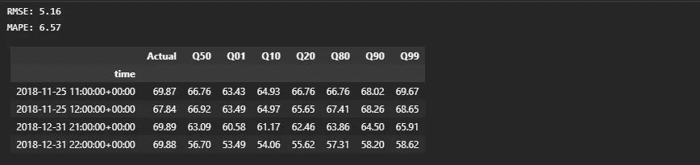

作者图片

以 6.57 的 MAPE 衡量，预测质量并不算糟糕。但是这比我们从变形金刚实验中得到的要差。转换器生成了一个 MAPE 为 4.57 的预测。

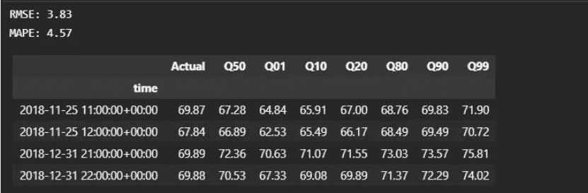

N-BEATS 模型似乎在 12 月下旬受到向下偏差的困扰，此时蓝色预测曲线的倾角始终比实际观测值更深。N-BEATS 是否对“假日”协变量赋予了过多的权重，而 12 月假日的价格与其他假日的价格有所不同？

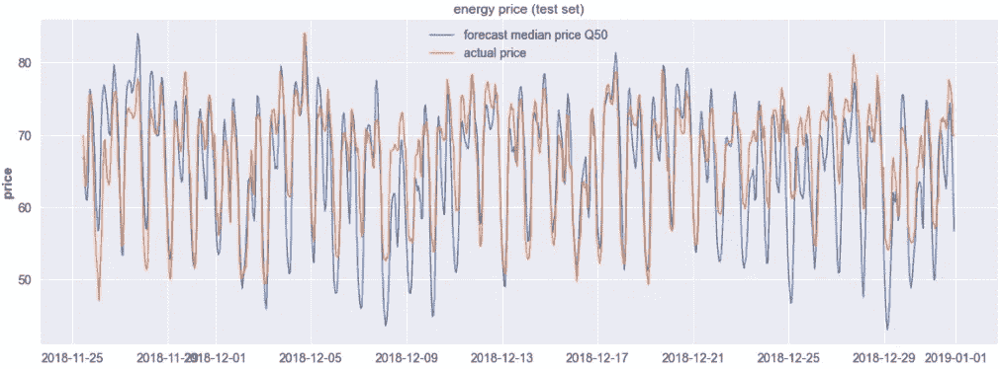

作者图片

训练集不包括 12 月的前一个月，这可能为 N-BEATS 识别特定于 12 月的模式提供了更全面的基础。

我们也可以开始一个调整过程。Darts 为 N-BEATS 和其他深度预测器提供了网格搜索—穷举或随机采样—请参见本文中的 Python 示例:

  

但是 N-BEATS 的处理时间有点令人沮丧。它在时间序列上咬了 1 个多小时。超参数搜索会增加计算量。因此，我经受住了诱惑，试图通过隔夜网格搜索将 MAPE 降低 1%或 2%。

# 8.样本外预测

## 8.1 一步到位的模型和多个样本步骤

假设我们想要预测测试集之后 12 个小时的每小时价格。要生成样本外预测，我们需要提供覆盖扩大预测范围的协变量。

日期时间协变量—小时、工作日、月和假日—已经扩展到 1 月 1 日。请记住，当我们创建它们时，在模型训练之前，我们在实际观察结束后增加了 48 小时。

但是我们还需要为特征协变量得出未来值。天气预报可以很容易地为我们提供未来 12 小时的温度和风速。对于电力需求和发电量，我们必须推导出单变量预测——要么使用 SARIMA 等经典模型；或者我们也可以对这些时间序列应用 N 拍(没有协变量)。

在本练习中，我们假设已经获得了特征协变量的预测值。我们简单地复制 12 月 31 日之前 24 小时内记录的值，并假设 1 月 1 日的天气、需求和发电将遵循与 12 月 31 日相同的每小时模式。

然后我们将这些扩展的协变量输入到第 18 行的 predict()函数中。

在我们提供了协变量之后，样本外预测的脚本几乎与测试阶段的脚本相同。我们得到一个结果数据帧 dfY，它包含了测试集的预测，但是现在扩展了 12 行到 1 月 1 日 10:00。

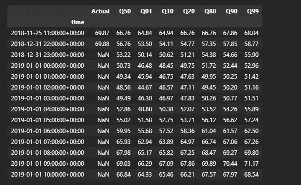

作者图片

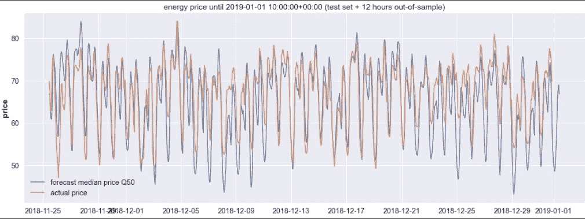

作者图片

## 8.2 样本外预测限于输出长度

模型设置采用一个可选参数 *output_chunk_length* ，默认设置为 1，我们在参数 N_FC 中保持不变。因此，我们训练了一个提前一步的预测模型。

如果我们将 output_chunk_length 提高到 12，样本外预测可能会覆盖 12 个小时，而不需要我们提供未来的协变量作为输入。

让我们通过预测测试集结束后一个小时的电价来尝试一下，而不是预测样本外的 12 个小时。因为我们已经在 output_chunk_length 为 1 的基础上训练了模型，所以我们可以预测下一个小时的*，而无需进行另一次训练练习。*

我们现在将协变量限制在可用的实际源数据:cov_t。

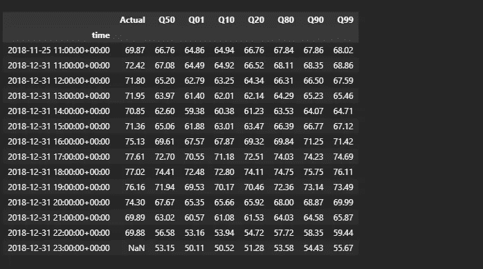

作者图片

正如预期的那样，我们收到了实际观测结束后第一个小时的预报。

自然，我们不能将 output_chunk_length 提高到任意的水平。更高的级别将乘以(取幂)张量的大小、内存使用量和处理时间。输出大小也不能超过 input_chunk_length。因此，不提供未来协变量的样本外预测只适用于相对较短的时间窗，受输入图层大小的限制。

# 9.结论

深度预测器可以处理受外生变量影响的时间序列，这些时间序列表现出多阶季节性，这种组合超出了大多数经典预测方法的能力。

N-BEATS 实现了 6.5%的 MAPE(在任何调整工作之前)。它花费的训练时间是上周 Transformer 示例的两倍多。它选定了一个比变压器高 2%点的 MAPE。如果我没有看到更高的变压器精度，我仍然认为 6.5%的 MAPE 是一个可接受的初始结果，我不会放弃。我认为这是一个中间结果，我们可能可以提高一两个等级。测试集的图显示了 12 月下旬的一些偏差，这是调整模型的起点。

N-BEATS Jupyter 笔记本可以在 GitHub 上下载，与 Transformer 笔记本在同一个存储库中:[h3ik 0th/ES _ energy _ Transformer:Transformer deep forecast(github.com)](https://github.com/h3ik0th/ES_energy_Transformer)

   