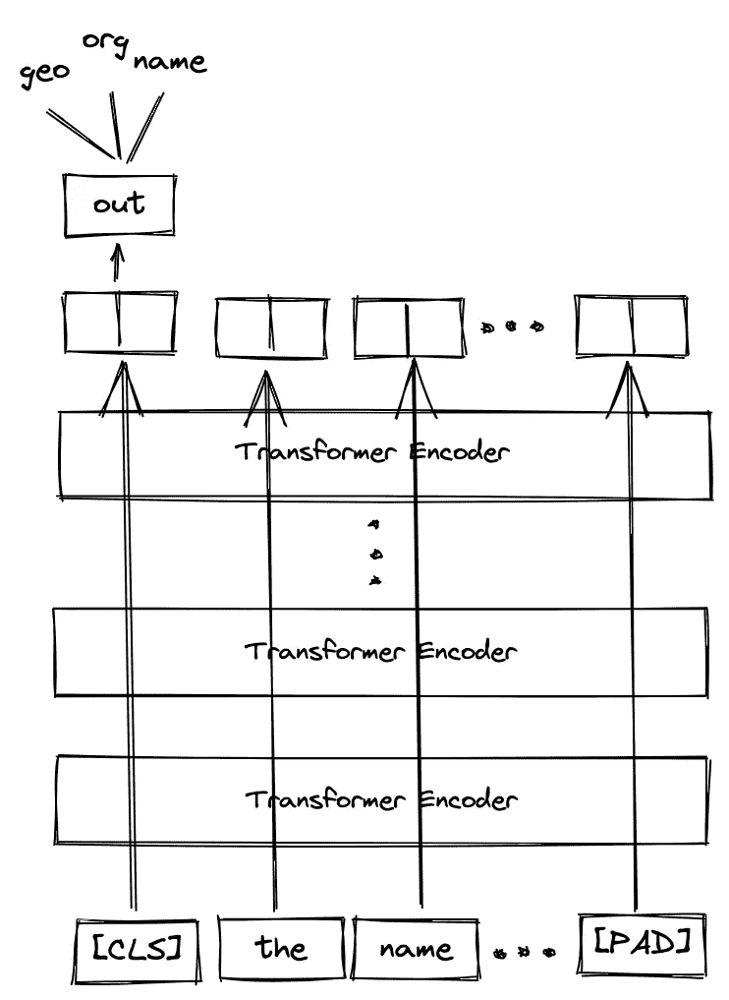
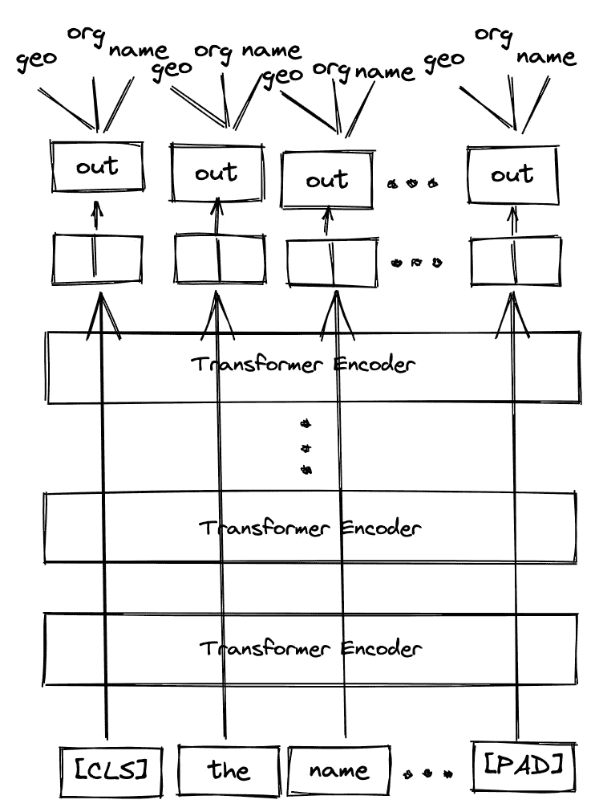
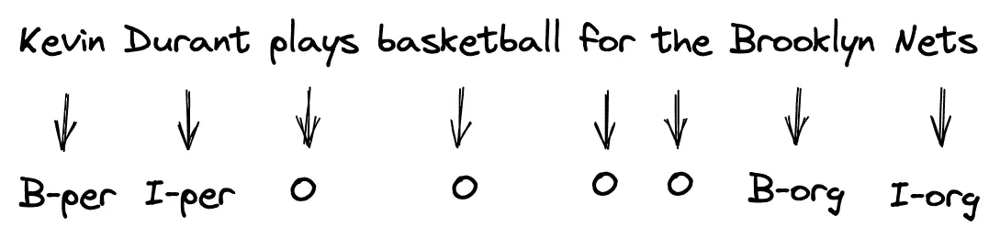
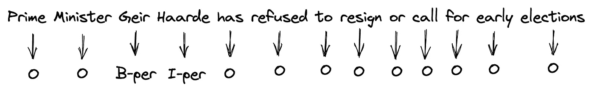
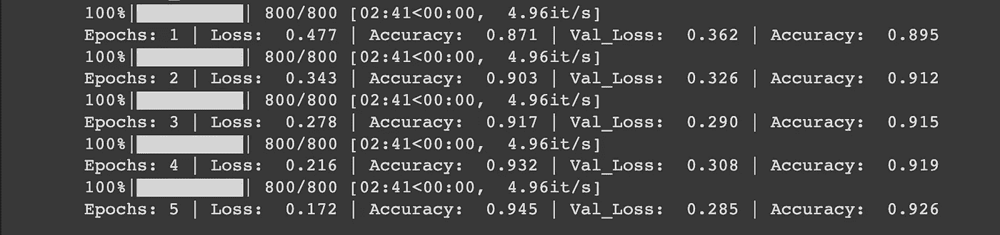

# PyTorch 中基于 BERT 的命名实体识别

> 原文：<https://towardsdatascience.com/named-entity-recognition-with-bert-in-pytorch-a454405e0b6a>

## 如何利用定制数据的预训练 BERT 模型来预测文本中每个单词的实体

照片由 [Aaron Burden](https://unsplash.com/@aaronburden?utm_source=unsplash&utm_medium=referral&utm_content=creditCopyText) 在 [Unsplash](https://unsplash.com/s/photos/dictionary-highlight?utm_source=unsplash&utm_medium=referral&utm_content=creditCopyText)

当涉及到处理 NLP 问题时，BERT 经常作为一个机器学习模型出现，我们可以依靠它的性能。事实上，它已经预先训练了超过 2500 万个单词，它从一系列单词中学习信息的双向性质使它成为一个强大的模型。

我以前写过如何利用 BERT 进行文本分类，在本文中，我们将更多地关注如何使用 BERT 进行命名实体识别(NER)任务。

# 什么是 NER？

NER 是自然语言处理中的一项任务，用于识别和提取句子或文本中有意义的信息(或者我们可以称之为实体)。一个实体可以是一个单词，甚至是指同一类别的一组词。

作为一个例子，让我们说我们下面的句子，我们想从这个句子中提取关于一个人的名字的信息。

NER 任务的第一步是检测实体。这可以是指同一类别的一个单词或一组单词。举个例子:

*   ➡️由一个单词组成的实体
*   由两个词组成的实体，但它们指的是同一个范畴。

为了确保我们的 BERT 模型知道实体可以是单个单词或一组单词，我们需要通过所谓的内部-外部-开始(IOB)标记在我们的训练数据上提供关于实体的开始和结束的信息。我们将在本文后面的数据集上看到更多这方面的内容。

检测到实体后，NER 任务的下一步是对检测到的实体进行分类。实体的类别可以是任何东西，这取决于我们的用例。以下是实体类别的示例:

*   人物:邦德、詹姆斯·邦德、山姆、安娜、弗兰克、莱昂纳多·迪卡普里奥
*   **地点**:纽约、维也纳、慕尼黑、伦敦
*   **组织**:谷歌、苹果、斯坦福大学、德意志银行
*   **地点**:中央公园，勃兰登堡门，时代广场

在我们的 BERT 模型的训练过程中，这些实体基本上是我们的数据的标签，我们将在下面的部分中详细讨论。

# NER 的伯特

如前所述，BERT 是一个基于变形金刚的机器学习模型，如果我们想解决 NLP 相关的任务，它会非常方便。

如果您还不熟悉 BERT，我建议您在阅读本文之前先阅读我以前的一篇关于 BERT 文本分类的文章。在那里，您可以找到关于 BERT 实际上是什么、模型期望哪种输入数据以及您将从模型获得的输出的信息。

 [## PyTorch 中基于 BERT 的文本分类

### 如何利用来自拥抱脸的预先训练的 BERT 模型来分类新闻文章的文本

towardsdatascience.com](/text-classification-with-bert-in-pytorch-887965e5820f) 

用于文本分类的 BERT 和 NER 问题之间的区别在于我们如何设置模型的输出。对于一个文本分类问题，我们只使用从特殊的**【CLS】**标记输出的嵌入向量，正如你在下面的可视化中看到的:

作者图片

同时，如果我们想要使用 BERT 来完成 NER 任务，我们需要使用来自所有令牌的嵌入向量输出，正如您在下面的可视化中所看到的:

作者图片

通过使用从所有标记输出的嵌入向量，我们可以在标记级别对文本进行分类。这正是我们想要的，因为我们希望我们的伯特模型预测每个令牌的实体。现在事不宜迟，我们去实现吧。

# 关于数据集

我们将在本文中使用的数据集是 CoNLL-2003 数据集，这是一个专门用于 NER 任务的数据集。你可以通过下面的链接下载 Kaggle 上的数据。

 [## NER 数据

### 命名实体识别数据

www.kaggle.com](https://www.kaggle.com/datasets/rajnathpatel/ner-data) 

这个数据集是在开放数据库 1.0 版许可下分发的，因此我们可以出于自己的目的自由共享和使用这个数据集。现在让我们看看数据集是什么样子的。

正如我们在上面看到的，我们有一个由文本和标签组成的数据框架。标签对应于文本中每个单词的实体类别。

总共有 9 个实体类别，它们是:

*   `geo`为地理实体
*   `org`为组织实体
*   `per`为人身实体
*   `gpe`对于地缘政治实体
*   `tim`为时间指示实体
*   `art`为工件实体
*   `eve`为事件实体
*   `nat`为自然现象实体
*   如果单词不属于任何实体，则分配`O`。

让我们来看看数据集中可用的唯一标签:

您可能会注意到，每个实体类别前面都有字母`I`或`B`。这对应于前面提到的 IOB 标记。`I`表示 ***中间***`B`表示 ***开始*** 。让我们来看看下面的句子，以便更好地理解 IOB 标记的概念。

*   “凯文”有`B-pers`的标签，因为它是一个人实体的开始
*   “杜兰特”有`I-pers`的标签，因为它是一个人实体的延续
*   ‘布鲁克林’有`B-org`因为它是一个组织实体的开始
*   “网络”有`I-org`的标签，因为它是一个组织实体的延续
*   其他单词被分配`O`标签，因为它们不属于任何实体

# 数据预处理

当然，在我们能够使用 BERT 模型对标记的实体进行分类之前，我们需要首先进行数据预处理，这包括两个部分:标记化和调整标签以匹配标记化。先从标记化说起。

## 标记化

使用 BERT 可以很容易地实现标记化，因为我们可以使用带有 HuggingFace 的预训练 BERT 基础模型中的`BertTokenizerFast`类。

为了举例说明 BERT tokenizer 是如何工作的，让我们来看看数据集中的一个文本:

用`BertTokenizerFast`标记上面的文本非常简单:

当从上面的`BertTokenizerFast`类调用`tokenizer`方法时，我们提供了几个参数:

*   `padding`:用一个特殊的**【PAD】**标记将序列填充到我们指定的最大长度。BERT 模型的最大序列长度为 512。
*   `max_length`:序列的最大长度。
*   `truncation`:这是一个布尔值。如果我们将该值设置为 True，那么将不会使用超过最大长度的令牌。
*   `return_tensors`:返回的张量类型，取决于我们使用的机器学习框架。既然我们使用 PyTorch，那么我们使用`pt`。

下面是标记化过程的输出:

如您所见，我们从标记化过程中获得的输出是一个字典，其中包含三个变量:

*   `input_ids`:序列中记号的 id 表示。在 BERT 中，id 101 为特殊**【CLS】**令牌保留，id 102 为特殊**【SEP】**令牌保留，id 0 为**【PAD】**令牌保留。
*   `token_type_ids`:标识令牌所属的序列。因为每个文本只有一个序列，所以`token_type_ids`的所有值都是 0。
*   `attention_mask`:识别令牌是真令牌还是填充符。如果它是一个真实的令牌，则该值为 1，如果它是一个**【PAD】**令牌，则该值为 0。

从上面的`input_ids`中，我们可以用下面的`decode`方法将 ids 解码回原始序列:

在实现了`decode`方法之后，我们恢复了原来的序列，增加了来自 BERT 的特殊标记，例如序列开头的**【CLS】**标记，序列结尾的**【SEP】**标记，以及一堆**【PAD】**标记，以满足所需的最大长度 512。

在这个标记化过程之后，我们需要进行下一步，即调整每个标记的标签。

## 标记化后调整标签

这是我们在标记化过程之后需要做的一个非常重要的步骤。这是因为在标记化过程之后，序列的长度不再匹配原始标签的长度。

BERT 记号赋予器使用所谓的词块记号赋予器，它是一个子词记号赋予器。这意味着 BERT tokenizer 可能会将一个单词拆分成一个或多个有意义的子单词。

例如，假设我们有以下序列:

上面的序列总共有 13 个标记，因此它也有 13 个标签。然而，在 BERT 标记化之后，我们得到以下结果:

在令牌化过程之后，我们需要解决两个问题:

*   增加了来自 BERT 的特殊令牌，如**【CLS】****【SEP】****【PAD】**
*   一些记号被分裂成子单词的事实。

作为子词标记化，词块标记化将生僻字拆分成它们的子词，例如上面示例中的' *Geir* '和' *Haarde* '。这种子词标记化有助于 BERT 模型学习相关词的语义。

这种单词片段标记化和添加来自 BERT 的特殊标记的结果是标记化后的序列长度不再匹配初始标签的长度。

从上面的例子中，现在在标记化之后，序列中总共有 512 个标记，而标签的长度仍然与之前相同。此外，序列中的第一个标记不再是单词' *Prime* ，而是新添加的**【CLS】**标记，因此我们也需要移动我们的标签。

为了解决这个问题，我们需要调整标签，使其与标记化后的序列具有相同的长度。为此，我们可以利用来自标记化结果的`word_ids`方法，如下所示:

从上面的代码片段中可以看出，每个被拆分的令牌共享同一个`word_ids`，其中来自 BERT 的特殊令牌如**【CLS】****【SEP】****【PAD】**都没有特定的`word_ids`。

这些`word_ids`将非常有助于通过应用以下两种方法中的任何一种来调整标签的长度:

1.  我们只为每个分裂令牌的第一个子词提供一个标签。子词的延续将简单地用“-100”作为标签。所有没有`word_ids`的代币也将标上“-100”。
2.  我们在属于同一单词的所有子单词中提供相同的标签。所有没有`word_ids`的令牌都将被标记为“-100”。

下面代码片段中的函数将执行上面定义的步骤。

如果要应用第一种方法，将`label_all_tokens`设置为假。如果您想应用第二种方法，请将`label_all_tokens`设置为 True，如下面的代码片段所示:

在本文的其余部分，我们将实现第一种方法，在这种方法中，我们将只为每个令牌中的第一个子词提供一个标签，并将`label_all_tokens`设置为 False。

# 数据集类

在我们为 NER 任务训练 BERT 模型之前，我们需要创建一个数据集类来批量生成和获取数据。

在上面的代码片段中，我们用`__init__`函数中的`tokenizer`变量调用`BertTokenizerFast`类来标记我们的输入文本，用`align_label`函数在标记过程后调整我们的标签。

接下来，让我们将数据随机分为训练、变异和测试。但是，请注意，数据总数是 47959。因此，为了演示和加快培训过程，我将只选取其中的 1000 个。当然，你可以将所有的数据用于模型训练。

# 模型结构

在本文中，我们将使用来自 HuggingFace 的预训练 BERT 基本模型。既然我们要在标记级别对文本进行分类，那么我们需要使用`BertForTokenClassification`类。

`BertForTokenClassification` class 是一个模型，它包装了 BERT 模型，并在 BERT 模型之上添加了线性层，这些层将充当令牌级分类器。

在上面的代码片段中，首先，我们实例化模型，并将每个令牌分类器的输出设置为数据集上唯一实体的数量，在我们的示例中是 17。

接下来，我们将为训练循环定义一个函数。

# 训练循环

我们的 BERT 模型的训练循环是标准 PyTorch 训练循环，增加了一些内容，如下所示:

在上面的训练循环中，我只训练了 5 个时期的模型，然后使用 SGD 作为优化器。每批的损耗计算已经由`BertForTokenClassification`级负责。

在训练循环的每个时期，我们还需要做一个重要的步骤。在模型预测之后，我们需要忽略所有标签为'-100 '的标记，正如您在第 36、37、62 和 63 行中看到的。

以下是我们训练 5 个时期的 BERT 模型后的训练输出示例:

当然，当您训练自己的 BERT 模型时，您将看到的输出可能会有所不同，因为在训练过程中存在随机性。

您可以做很多事情来提高我们模型的性能。如果你注意到了，我们有一个数据不平衡的问题，因为有很多带有“O”标签的令牌。例如，我们可以通过在训练过程中应用类权重来改进我们的模型。

此外，您可以尝试不同的优化器，如权重衰减正则化的 Adam 优化器。

# 根据测试数据评估模型

既然我们已经训练了我们的模型，我们可以用下面的代码片段来评估它在看不见的测试数据上的性能。

在我的例子中，经过训练的模型在测试集上达到了平均 92.22%的准确率。当然，您可以将指标更改为 F1 得分、精确度或召回率。

或者，我们可以使用经过训练的模型来预测文本或句子中每个单词的实体，代码如下:

如果一切都完美，那么我们的模型将能够相当好地预测一个看不见的句子的每个单词的实体，正如你在上面看到的。

# 结论

在这篇文章中，我们实现了命名实体识别(NER)任务的伯特。这意味着我们已经训练了 BERT 模型来在标记级别预测定制文本或定制句子的 IOB 标记。

我希望这篇文章能帮助你开始使用 NER 任务的 BERT。你可以在 [**这本笔记本**](https://github.com/marcellusruben/medium-resources/tree/main/NER_BERT) 中找到本文实现的所有代码。