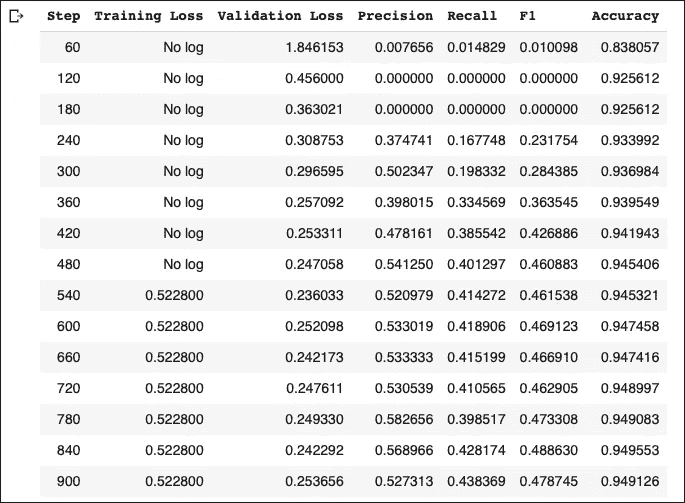

# 深度学习命名实体识别(BERT)——基本指南

> 原文：<https://towardsdatascience.com/named-entity-recognition-with-deep-learning-bert-the-essential-guide-274c6965e2d>

## 从数据准备到 NER 任务的模型训练——以及如何给自己的句子加标签


照片由[亚伦·伯顿](https://unsplash.com/@aaronburden?utm_source=medium&utm_medium=referral)在 [Unsplash](https://unsplash.com?utm_source=medium&utm_medium=referral) 拍摄

> 更新:您现在可以了解如何使用 Streamlit 部署该型号！

如今，NLP 已经成为深度学习的代名词。

但是，深度学习并不是每个 NLP 任务的“灵丹妙药”。例如，在句子分类任务中，简单的线性分类器可以相当好地工作。尤其是如果你有一个小的训练数据集。

然而，一些 NLP 任务随着深度学习而蓬勃发展。其中一个这样的任务就是 ***命名实体识别*** — NER:

> *NER 是识别* *并将命名实体归类到预定义的实体类别中的过程。*

例如，在句子中:

> 尼克生活在希腊的 T21，是一名数据科学家。

我们有两个实体:

*   **尼克，**也就是一个**的‘人’。**
*   **希腊，**即的一个**‘地点’。**

因此，根据上面的句子，分类器应该能够定位这两个术语('**尼克'，'希腊'【T34)，并正确地将它们分别分类为'**人**和'**地点**'。**

在本教程中，我们将建立一个 NER 模型，使用 **HugginFace 变形金刚**。

让我们开始吧！

# 加载数据

我们将使用已经包含在 **HugginFace 数据集**库中的[**wnut _ 17**](https://huggingface.co/datasets/wnut_17)**【1】**数据集。

## 浏览数据集

该数据集侧重于在新兴讨论的背景下识别不寻常的、以前未见过的实体。它包含 *5690* 文件，分为*培训*套、vali *d* 套和*测试*套。文本句子被标记成单词。让我们加载数据集:

```
wnut = load_dataset(“wnut_17”)
```

我们得到以下结果:

接下来，我们打印`ner_tags` ——我们模型的预定义实体:

每个`ner_tag`描述一个实体。可以是以下之一:**公司**、**创意作品**、**团体**、**地点**、**人物、**和**产品。**

每个`ner_tag`前面的字母表示实体的令牌位置:

*   ***B* -** 表示一个实体的开始。
*   ***I* -** 表示一个令牌包含在同一个实体内部(例如" *York"* 令牌是" *New York* "实体的一部分)。
*   ***0*** 表示该令牌不对应任何实体。

我们还创建了`id2tag` *字典*，它将每个标签映射到它的`ner_tag`——这将在以后派上用场。

## 重组培训和验证数据集

我们的数据集没有那么大。请记住，**变形金刚**需要大量数据来利用其卓越的性能。

为了解决这个问题，我们将*训练*和*验证*数据集连接成单个*训练*数据集。出于验证目的，测试数据集将保持原样:

## 培训示例

让我们打印数据集中的第三个训练示例。**我们将在整个教程中使用该示例作为参考:**

' **Pxleyes'** 令牌被归类为`B-corporation`(一个**公司的开始)。其余的记号是不相关的——它们不代表任何实体。**

# 预处理

接下来，我们标记我们的数据。与其他用例相反， **NER** 任务的令牌化需要特殊处理。

我们将使用 HugginFace 库中的`bert-base-uncased`模型和标记器。

Transformer 模型大多使用**基于子词的记号化器。**

在标记化过程中，一些单词可能会被拆分成两个或多个单词。这是一种标准的做法，因为罕见的单词可以分解成有意义的符号。例如， **BERT** 模型默认实现了**字节对编码(BPE)令牌化。**

让我们对我们的样本训练示例进行符号化，看看这是如何工作的:

这是最初的培训示例:

这就是 **BERT 的**标记器如何标记训练示例:

请注意，有两个重要问题:

*   添加特殊标记`[CLS]`和`[SEP]`。
*   令牌“**pxl eyes”**被拆分成 3 个子令牌:`p`、`##xley`、**、**和`##es`。

换句话说，标记化造成了输入和标签之间的不匹配。因此，我们按照以下方式重新排列令牌和标签:

1.  每个单词标记被映射到其对应的`ner_tag`。
2.  我们将标签`-100`分配给特殊记号`[CLS]`和`[SEP]`，因此损失函数忽略它们。默认情况下，PyTorch 在损耗计算过程中忽略`-100` 值。
3.  对于子词，我们只标记给定词的第一个标记。因此，我们将`-100`分配给同一个单词的其他子发音。

比如令牌**px eyes**被标注为`1` ( `B-corporation`)。它被标记为`[‘p’, ‘##xley’, ‘##es’]`，标记对齐后，标签应变成`[1, -100, -100]`

我们在`tokenize_and_align_labels()`函数中实现该功能:

就是这样！让我们调用我们的自定义标记化函数:

下表准确显示了我们的样本训练示例的标记化输出:

# 微调模型

我们现在准备建立我们的深度学习模型。

我们加载`bert-base-uncased`预训练模型，并使用我们的数据对其进行微调。

但是首先，我们应该训练一个简单的分类器作为基线模型。

## 基线模型

对于基线分类器来说，最明显的选择是用整个训练数据集中最频繁出现的实体来标记每个标记—`O`实体:

如果我们用它所属的句子的最频繁的标签来标记每个记号，基线分类器变得不那么简单:

因此，我们使用第二个模型作为基线。

## 用于命名实体识别的 BERT

**数据整理器**将训练样本分批在一起，同时应用填充以使它们大小相同。排序器不仅填充输入，还填充标签:

关于评估，由于我们的数据集是不平衡的，**我们不能只依靠准确性**。

因此，我们还将测量**精度**和**召回**。这里，我们将加载包含在**数据集**库中的`[seqeval](https://github.com/chakki-works/seqeval)`指标。该指标通常用于**词性标注**和 **NER** 任务。

让我们将它应用到我们的参考培训示例中，看看它是如何工作的:

**注意:**记住，损失函数在训练时会忽略所有标记有`-100`的记号。我们的评估功能也应该考虑这些信息。

因此，`compute_metrics` 函数的定义稍有不同——我们通过忽略所有标有`-100`的内容来计算 ***精度******召回******f1 分数、*** 和 ***精度*** :

最后，我们实例化`Trainer`类来微调我们的模型。注意**提前停止**回调的用法:

这些是我们的培训指标:



与基线模型相比，该模型实现了更好的验证准确性。此外，如果我们使用更大的模型，或者让模型训练更多的时期而不应用**提前停止**回调，我们可以获得更好的`f1-score` 。

# 测试集评估

对于我们的测试集，我们使用与之前相同的方法。

`seqeval`度量还输出**每个类的度量**:

`location`和`person`实体得分最高，而`group`得分最低。

# 获得预测

最后，我们创建一个对我们自己的句子执行实体识别的函数:

让我们试几个例子:

模型已经成功标记了这两个国家！看一看**美国**:

*   “**联队**被正确标记为`B-location`。
*   **状态**被正确标记为`I-location`。

苹果再次被正确地标记为**公司**。此外，我们的模型正确地识别了苹果**产品。**

# 结束语

***命名实体识别*** 是一项基本的自然语言处理任务，有着众多的实际应用。

尽管 HugginFace 库已经为这个过程创建了一个超级友好的 API，但是仍然有一些混乱的地方。

我希望这篇教程对他们有所启发。这篇文章的源代码可以在[这里](https://jovian.ai/nkafr/ner-transformers)找到

# 感谢您的阅读！

*   订阅我的[简讯](https://towardsdatascience.com/subscribe/@nikoskafritsas)！
*   在 Linkedin 上关注我！
*   加入 Medium！(附属链接)

# 参考

1.WNUT 2017 (WNUT 2017 新兴和稀有实体认可)，许可证:CC BY 4.0，[来源](https://huggingface.co/datasets/wnut_17)