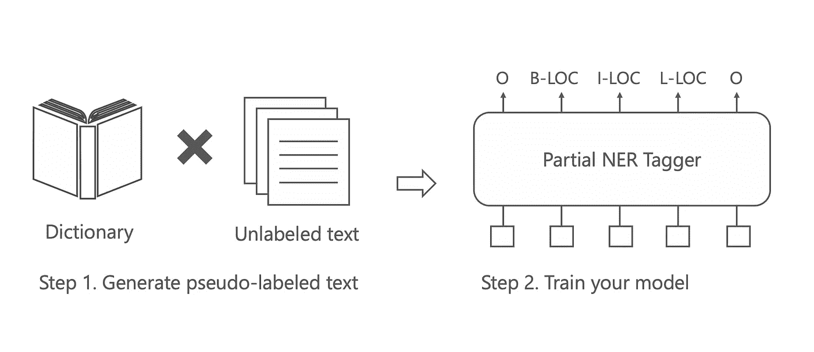
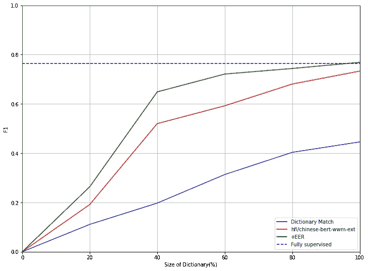

# 具有部分注释数据的命名实体识别

> 原文：<https://towardsdatascience.com/named-entity-recognition-with-partially-annotated-data-ec679d42fceb>

## 利用你的字典和规则快速建立一个 NER 模型


照片由[皮斯特亨](https://unsplash.com/@pisitheng?utm_source=unsplash&utm_medium=referral&utm_content=creditCopyText)在 [Unsplash](https://unsplash.com/ja/s/%E5%86%99%E7%9C%9F/dictionary?utm_source=unsplash&utm_medium=referral&utm_content=creditCopyText) 上拍摄

命名实体识别(NER)是信息提取的一个子任务，它识别文档中的实体并将它们分类到预定义的类别中，如人名、组织、位置等。NER 广泛应用于自然语言处理领域，如信息抽取、信息检索、问题回答等。

对于大型和高质量的手动注释数据集，这个问题可以通过微调预先训练的大型语言模型(如 BERT 和 RoBERTa)来解决。然而，准备如此大的和完全注释的数据集是昂贵的，并且在许多情况下是不现实的，例如低资源语言。

另一方面，部分带注释的数据集可以通过知识库、地名词典、正则表达式等轻松创建。在这些数据集中，大多数被识别的实体是正确的(高精度)，但不是所有的实体都被识别(低召回)。如果我们能够充分利用这些数据集，我们应该能够减少注释成本，并加快模型开发。



从部分批注的数据集训练 NER 模型。图片来自[资源库](https://github.com/doccano/spacy-partial-tagger/)(麻省理工学院许可)。

然而，部分注释的数据集有一个问题:缺少实体，数据集可能不包含一些实体。这个问题会漏掉一些实体来注释。因此，在这种数据集上训练的标准模型无法识别这些缺失的实体。导致模型性能变差，尤其是召回率低。

为了解决这个问题，在 2021 年 TACL 中提出了预期实体比率(EER)损失[1]。这种损失促使实体在整个数据集中出现的百分比在某个范围内。通过结合这种损失，它将试图尽可能多地预测实体，即使当标签丢失时。

在接下来的几节中，我将向您展示如何使用 EER 从部分带注释的数据集中训练模型。为此，我将使用 [spacy-partial-tagger](https://github.com/doccano/spacy-partial-tagger/) ，这是一个使用 EER 实现模型的 Python 库。如果你想详细了解 EER，请看报纸。

<https://github.com/doccano/spacy-partial-tagger>  

让我们开始实施。

# 快速入门

首先你需要安装`spacy-partial-tagger`。如果您使用 M1 Mac，安装`fugashi`可能会有问题。在这种情况下，请在安装前尝试使用`brew install mecab`。

```
pip install spacy-partial-tagger
```

接下来，将数据集准备为 spaCy 二进制格式文件。本库期望标记化是基于字符的。关于格式的更多细节，见[本页](https://spacy.io/api/data-formats#training)。在下面的示例中，spaCy 的 EntityRuler 和一个小字典用于创建部分带注释的数据集:

为了训练模型，使用`spacy train`命令。它只需要一个包含所有设置和超参数的`[config.cfg](https://spacy.io/usage/training#config)`配置文件。您可以选择在命令行上用[覆盖](https://spacy.io/usage/training#config-overrides)设置。下面是一个`spact-partial-tagger’s`配置文件的例子:

最后，运行`train`命令:

```
python **-**m spacy train config**.**cfg \
       **--**output**=./model** \
       **--**paths**.**train corpus**/**train**.**spacy \
       **--**paths**.**dev corpus**/**valid**.**spacy \
       **--**gpu**-**id 0 \
       **--**training**.**patience 1000
```

就是这样。如果你想知道详细情况，请查看[库中的笔记本](https://github.com/doccano/spacy-partial-tagger/blob/main/notebooks/bc5cdr.ipynb)。

# 实验

在这一节中，我将在 dictionary match 创建的部分带注释的数据集上运行实验并展示 EER 模型的性能。由于字典大小在真实场景中是有限的，所以我将测试字典大小在 20~100%之间变化时的性能。

我在电子商务领域使用 DSNER 数据集进行命名实体识别( [Unlicense license](https://github.com/rainarch/DSNER/blob/master/LICENSE) )。它包含“品牌”、“材料”、“模型”、“产品”和“规格”作为实体类。至于字典，我用的是已经发表在[前期研究](https://github.com/rainarch/DSNER/)【2】(同许可)的一本。这个字典中存储的实体数量是 927。至于预训练模型，我选择了 HFL 出版的`hfl/chinese-bert-wwm-ext`。

我们来看看以下四款车型的表现:

*   `hfl/chinese-bert-wwm-ext`全监督数据(full supervised)训练
*   `hfl/chinese-bert-wwm-ext`对部分注释的数据进行训练(`hfl/chinese-bert-wwm-ext`
*   `hfl/chinese-bert-wwm-ext` +针对部分注释数据训练的 EER 模型(+ EER)
*   字典匹配

# 结果

结果如下。在这种情况下，我们可以看到在部分注释的数据集上训练的`hfl/chinese-bert-wwm-ext`模型的性能优于字典匹配的性能。我们还看到，使用 EER 可以提高性能，尤其是当字典很小时。这是因为使用 EER 可以提高召回率。结果还表明，其性能几乎与完全监督的性能相当。



不同字典大小下的性能(图片由作者提供)

# 最后的话

在本文中，我将向您展示如何使用 EER 从部分带注释的数据集中训练命名实体识别模型。实验结果表明，EER 对于电子商务数据集和词典组合的有效性，尤其是在词典规模较小时。我认为 EER 并不是在所有情况下都有效，但是如果你对此感兴趣，请尝试`spacy-partial-tagger`。

# 参考

1.  托马斯·埃夫兰和迈克尔·柯林斯。2021.[通过预期实体比率损失进行部分监督的命名实体识别](https://aclanthology.org/2021.tacl-1.78)。计算语言学协会汇刊，9:1320–1335。
2.  杨耀生、、、何正秋和。2018.[远程监督 NER 进行部分标注学习和强化学习](https://aclanthology.org/C18-1183)。《第 27 届国际计算语言学会议论文集》,第 2159-2169 页，美国新墨西哥州圣达菲。计算语言学协会。