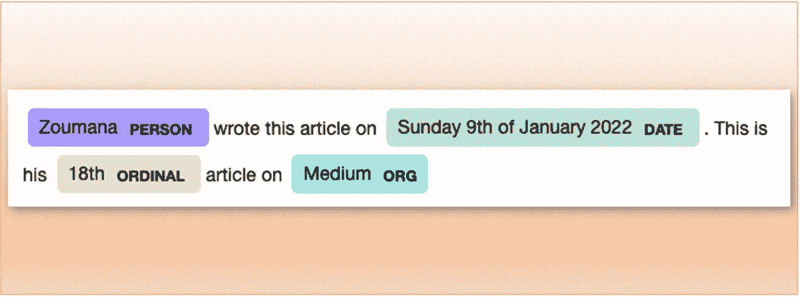
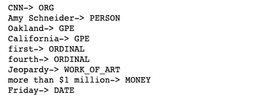
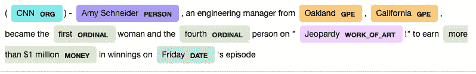
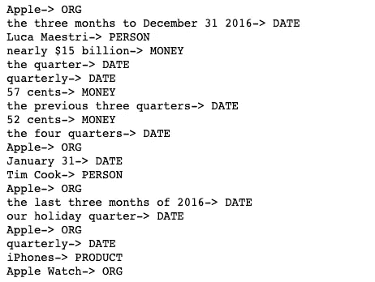
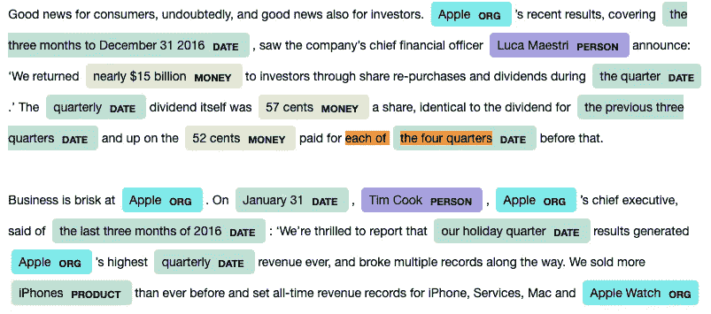
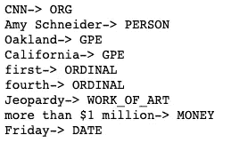
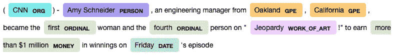
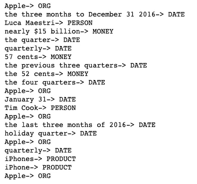
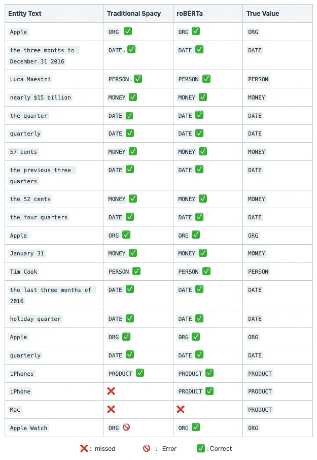

# 用 Spacy 和强大的 roBERTa 进行命名实体识别

> 原文：<https://towardsdatascience.com/named-entity-recognition-with-spacy-and-the-mighty-roberta-97d879f981>

# 用 Spacy 和强大的 roBERTa 进行命名实体识别

## 命名实体识别(NER)，文本数据挖掘的一个重要方面



作者图片

# 介绍

当阅读文本时，人类可以自然地识别命名的实体，如日期、货币、位置、人名、医疗代码、品牌等。然后，该步骤可能与从大文本数据中进一步提取信息相关，以便更好地回答以下问题:

*   新闻中的 covid19 变体趋势名称是什么？
*   在给定的工作描述中提到了哪些工具，熟练程度如何？
*   等等。

本文的目标是使用 spaCy transformers 中的 spaCy 和 roBERTa 来自动识别和提取前面介绍中定义的实体。

# 命名实体识别与提取

如果你喜欢，可以在 YouTube 上观看完整视频:

## 实验数据

我们将执行两个不同文本数据的实体提取，一个短文本和一个更长的文本(分别来自 CNN 和 [Etoro](https://stocks.etoro.com/en/dynamic?symbol=aapl&gc=stocks&gclid=Cj0KCQiAieWOBhCYARIsANcOw0wukvjrvjE89sMrm8z17zXjVxPMhNQJ0l2_aJu3SS0yMrVOb53_EjMaAqLkEALw_wcB&gclid=Cj0KCQiAieWOBhCYARIsANcOw0wukvjrvjE89sMrm8z17zXjVxPMhNQJ0l2_aJu3SS0yMrVOb53_EjMaAqLkEALw_wcB&utm_medium=SEM&utm_source=35552&utm_content=0&utm_serial=CAMP_13173467172%7CAG_126138830561%7CCP_ZeroStocks_%7CKW_Trading%20aapl%20stocks_MT_e&utm_campaign=CAMP_13173467172%7CAG_126138830561%7CCP_ZeroStocks_%7CKW_Trading%20aapl%20stocks_MT_e&utm_term=&cq_src=google_ads&cq_cmp=13173467172&cq_term=trading%20aapl%20stocks&cq_plac=&cq_net=g&cq_plt=gp) )最后，比较传统 spaCy 和 roBERTa 的性能。

*   ***短文*** : *艾米·施耐德，一位来自加州奥克兰的工程经理，成为《危险边缘》节目的第一位女性和第四位主持人。“在周五的比赛中赢得超过 100 万美元的奖金”。*
*   ***较长正文:****对消费者来说无疑是好消息，对投资者来说也是好消息。苹果公司最近的业绩涵盖了截至 2016 年 1 2 月 31 日的三个月，该公司首席财务官卢卡·马埃斯特里宣布:“我们在本季度通过股票回购和股息向投资者返还了近 150 亿美元。”季度股息为每股 57 美分，与前三个季度的股息相同，高于此前四个季度的每股 52 美分。苹果公司生意兴隆。1 月 31 日，苹果首席执行官蒂姆·库克(Tim Cook)在谈到 2016 年最后三个月时说:“我们很高兴地宣布，我们的假日季度业绩创造了苹果有史以来最高的季度收入，并打破了多项纪录。我们卖出了比以往更多的 iPhone，并创造了 iPhone、服务、Mac 和 Apple Watch 的历史收入记录*

## 先决条件

这是关于安装分析所需的所有库。

## 提取和可视化命名实体的步骤

第一个函数***print _ entities***用于从给定的文本和管道中提取命名实体(在我们的例子中是传统的 spaCy 或 spaCy transformer)。它的工作原理如下:

*   `pipeline`是我们从`spacy.load`指令中得到的语言对象。它包含处理`text`所需的所有组件和数据
*   `pipeline(text)`运行`pipeline`并返回已处理的`document`
*   命名实体是通过迭代`document.ents`对象获得的。
*   然后在每次迭代中，我们可以从`.text`访问实体文本，从`.label_`访问实体标签

第二个函数***visualize _ entities***执行`displacy.render`函数来产生所有实体的良好可视化。

既然我们已经安装了所有的库并定义了命名实体提取函数，我们就可以继续进行分析了。

## 传统空间

这是一个面向工业级自然语言处理的开源库，已经在 [OntoNotes 5.0](https://catalog.ldc.upenn.edu/LDC2013T19) 语料库上进行了训练。

***分析短文***

```
print_entities(nlp_sm, short_text)
```



图 1:实体文本和短文本的相应标签(图片由作者提供)

```
visualize_entities(nlp_sm, short_text)
```



图 2:实体文本的可视化和短文本的相应标签(图片由作者提供)

传统空间成功地将 CNN 识别为一个组织(ORG)，Amy Schneider 识别为一个人，Oakland 和 California 识别为地理政治实体(GEP)等。你可以在文件[的](https://catalog.ldc.upenn.edu/docs/LDC2013T19/OntoNotes-Release-5.0.pdf)[实体名称注释](https://catalog.ldc.upenn.edu/docs/LDC2013T19/OntoNotes-Release-5.0.pdf)部分找到实体代码定义的详尽列表。

***分析长文***

```
print_entities(nlp_sm, long_text)
```



图 3:实体文本和较长文本的相应标签(图片由作者提供)

```
visualize_entities(nlp_sm, short_text)
```



图 4:实体文本的可视化和较长文本的相应标签(图片由作者提供)

**观察**:对于短文本，结果看起来很完美，因为所有的实体都被正确识别了。但是，对于第二个文本，模型犯了以下错误

*   将 **Apple Watch** 误认为是**Organization**(组织)而不是产品。
*   缺少识别 **iPhone** 和 **Mac。**

让我们看看罗伯塔模型在同样的文本上是如何表现的。

## 太空变形金刚—罗伯塔

这是来自 2019 年 spaCy 推出的`spacy-transformers`库。它旨在通过将 spacy 连接到 HuggingFace 的变压器模型来为 spaCy 管道供电。

***分析短文***

```
print_entities(roberta_nlp, short_text)
```



图 5:实体文本和长文本的相应标签(图片由作者提供)

```
visualize_entities(roberta_nlp, short_text)
```



图 6:实体文本的可视化和长文本的相应标签(图片由作者提供)

到目前为止，一切都很好，与短文本上传统空间的结果相比没有什么变化。

***分析长文***

```
print_entities(roberta_nlp, long_text)
```



图 6:实体文本和较长文本的相应标签(图片由作者提供)

```
visualize_entities(roberta_nlp, long_text)
```


图 7:实体文本的可视化和较长文本的相应标签(图片由作者提供)

下面的汇总表包含传统 spacy 和 roBERTa 对长文本的结果。我们可以清楚地看到，罗伯塔的表现优于传统空间。罗伯塔只失败过一次，就是没有认出麦克。另一方面，传统空间无法识别 iPhone 和 Mac，但也错误地识别了 Apple Watch。



图 8:实体标识对照表。罗伯塔胜过传统空间(图片由作者提供)

我希望这篇文章是有用的。通过从下面的链接运行我的 GitHub 中的代码，自己尝试一下。在 YouTube[上关注我](https://www.youtube.com/channel/UC9xKdy8cz6ZuJU5FTNtM_pQ)以获得更多互动会话！

# 额外资源

[GitHub](https://github.com/keitazoumana/Named-Entity-Recognition)

英语空间

[太空变形金刚](https://pythonrepo.com/repo/explosion-spacy-transformers-python-natural-language-processing)

再见🏃🏾