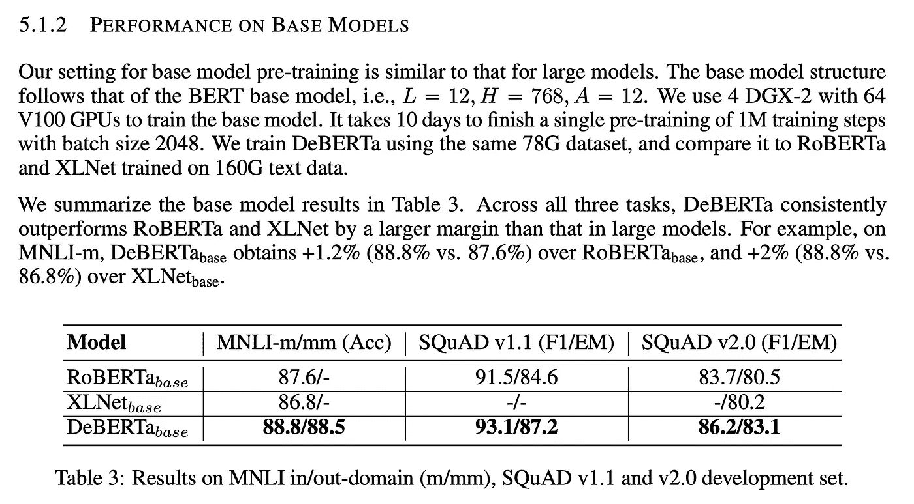
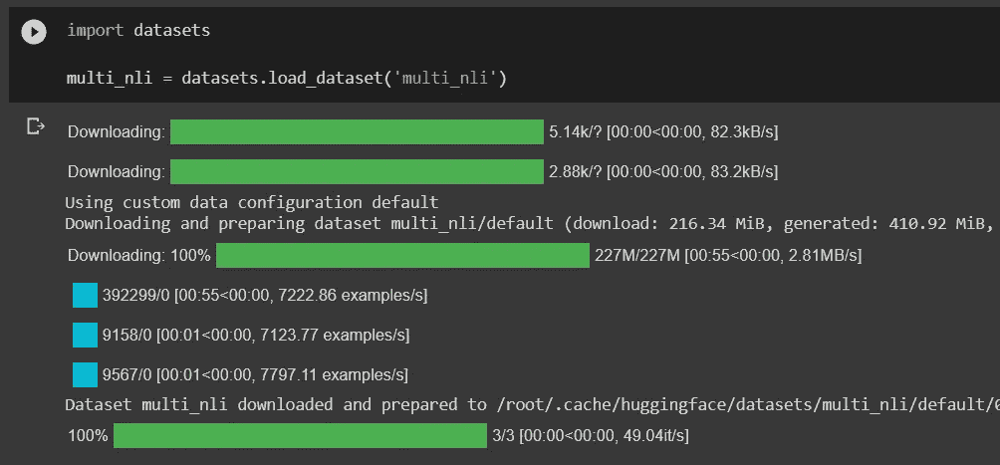
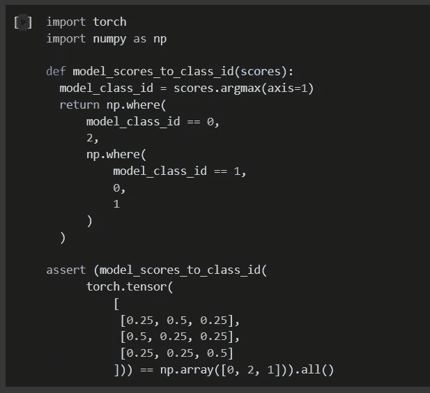
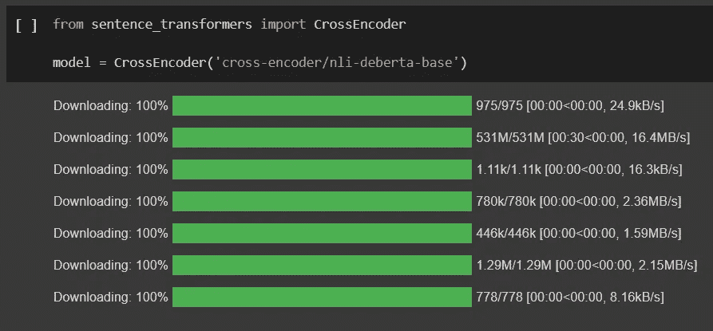
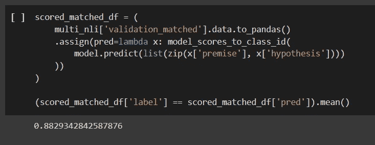
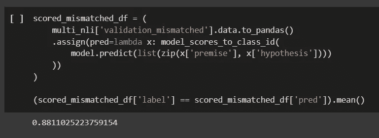

# 自然语言推理综述

> 原文：<https://towardsdatascience.com/natural-language-inference-an-overview-57c0eecf6517>

## 基准和模型


瓦伦丁·维萨摄于 Pexels

# 什么和为什么？

自然语言推理(NLI)的任务是确定是否给定的“假设”逻辑上遵循“前提”。通俗地说，你需要了解假设是否成立，而前提是你对该学科的唯一了解。

**你为什么要读这个？**我假设你对 NLI 一无所知，并承诺让你了解该领域的最新发展(2022 年 4 月)。对于一篇文章来说，这是一个相当大胆的承诺，不是吗？

# 问题陈述

> [自然语言推理](https://affine.ai/natural-language-inferencing-nli-task-demonstration-using-kaggle-dataset/)也被称为识别文本蕴涵(RTE ),是确定给定的“假设”和“前提”在逻辑上是否相互遵循(蕴涵)或不遵循(矛盾)或不确定(中性)的任务。

你可以认为 NLI 根据前提将假设分为三类:蕴涵，矛盾，或中性。还有一个相关的问题:事实核查。事实核查问题与 NLI 非常相似。唯一不同的是，你没有前提。因此，事实核查包括两个问题:搜索问题和 NLI。在这篇文章中，我将集中讨论 NLI 问题。

# 基准

当开始一个新游戏时，第一步是学习游戏规则。在机器学习中，基准是研究人员遵循的事实规则。

## SNLI

*   [网站](https://nlp.stanford.edu/projects/snli/)
*   [论文](https://nlp.stanford.edu/pubs/snli_paper.pdf)
*   [基准](https://paperswithcode.com/sota/natural-language-inference-on-snli)
*   示例:570k
*   前提类型:句子。
*   标签:蕴涵，中立，矛盾。

这是 NLI 标杆管理的经典之作，所以这个标杆被广泛使用，被尊重，坦白地说，已经过时了。
SNLI 数据集基于来自 Flickr30k 语料库的图像标题，其中图像标题被用作前提。该假设由土耳其机械工人按照以下说明手动创建:

1.  蕴涵:写一个替代的标题，这个标题绝对是对照片的准确描述；
2.  中性:写一个可能是照片的准确描述的备选标题；
3.  矛盾:写一个替代说明，这是对照片的错误描述。

SNLI 有两个明显的缺点:

*   前提是限于简短的照片描述，因此不包含时间推理，信仰，或模态。
*   简单而简短的前提要求简单而简短的假设，因此在模型可以轻松达到人类准确性水平的情况下，基准测试不够具有挑战性。

## MultiNLI

*   [网站](https://cims.nyu.edu/~sbowman/multinli/)
*   [论文](https://cims.nyu.edu/~sbowman/multinli/paper.pdf)
*   [基准](https://paperswithcode.com/sota/natural-language-inference-on-multinli)
*   示例:433k
*   前提类型:句子
*   标签:蕴涵，中立，矛盾。

MultiNLI (MNLI)模仿 SNLI 数据集模式，但涵盖了一系列口语和书面语文本。因此，MNLI 可以与 SNLI 结合使用，并提供十种不同风格的文本。

MNLI 的前提来源于十个来源或体裁(基于开放的美国国家语料库):

1.  面对面:两人对话的夏洛特叙事和对话集的转录；
2.  政府:来自公共领域政府网站的报告、演讲、信件和新闻稿；
3.  信件:来自印第安纳跨文化交流中心
    慈善募捐演讲的信件；
4.  9/11:美国国家恐怖袭击委员会的公开报告；
5.  OUP:由牛津大学出版社出版的关于纺织业和儿童发展的五部非虚构作品；
6.  石板:来自石板杂志档案的流行文化文章；
7.  电话:从宾夕法尼亚大学语言数据联盟总机语料库中转录的双方电话对话；
8.  旅行:Berlitz 出版社出版的旅行指南；
9.  逐字记录:逐字记录档案中为非专业人员提供的关于语言学的帖子；
10.  小说:几部 1912 年至 2010 年间创作的免费当代小说作品。

假设创建过程如下:向一名众包工作人员展示前提，并要求他写出三个新句子:

1.  蕴涵:前提为真时必然为真或适当的事物；
2.  矛盾:前提为真时必然为假或不恰当的矛盾；
3.  中立:两种情况都不适用。

该数据集的一个重要特征是，十个流派中只有五个出现在训练集中，使得其他五个流派对于模型来说是不可见的。这些看不见的体裁可以用来评估模型对看不见的文本来源的概括程度。

## 超强力胶水

*   [网站](https://super.gluebenchmark.com/)
*   [论文](https://arxiv.org/abs/1905.00537)
*   [基准](https://paperswithcode.com/sota/natural-language-inference-on-rte)
*   基准
*   示例:RTE: 3k，CB: <1k
*   前提类型:句子
*   标签:RTE:蕴涵，not _ 蕴涵；CB:包含，不确定，未知

SuperGLUE 是衡量 NLP 模型在三个任务中的性能的十个基准的集合:

1.  自然语言推理
2.  问题回答
3.  共指消解

基于在这些任务中的表现，SuperGLUE 旨在提供一个单一的分数，该分数概括了模型在自然语言理解方面的能力。SuperGLUE 是一个非常流行的 GLUE 基准的扩展，具有更复杂的任务。

强力胶有两个 NLI 基准:RTE 和 CB。

RTE，即识别文本蕴涵，来自于每年的文本蕴涵比赛。RTE 包含 RTE1、RTE2、RTE3 和 RTE5 数据集。数据本身来自维基百科和新闻文章。RTE 的一个显著特点是标注的是二类分类而不是三类分类，所以没有中性标签。

CB，或 CommitmentBank，是一个短文本的语料库，其中至少有一个句子包含嵌入子句。每一个嵌入的条款都有注释，说明撰写该文本的人对该条款真实性的承诺程度。由此产生的任务是从华尔街日报、英国国家语料库的小说和 Switchboard 中抽取的例子的三类文本蕴涵。每个例子由一个包含嵌入子句的前提组成，相应的假设是该子句的提取。

## 发热

*   [网站](https://aclanthology.org/W18-5501/)
*   [论文](https://aclanthology.org/W18-5501v3.pdf)
*   [基准](https://paperswithcode.com/sota/fact-verification-on-fever)
*   示例:185k
*   前提类型:维基百科网址+句子编号
*   标签:支持、反驳、NotEnoughInfo

注意:这个数据集称假设为“主张”。

这个数据集不同于 SNLI 和 MNLI，因为它支持 NLI 和事实检查问题。数据集提供的不是前提，而是维基百科页面的 URL，可以从中提取前提。该数据集还提供了页面上的前提句数量，以支持纯 NLI 用例。

这些声明是人工生成的，根据维基百科页面的介绍部分进行人工验证，并标记为支持、反驳或无信息。

这些说法是通过转述维基百科的事实，并以各种方式对其进行变异而产生的，其中一些方式是改变意思。对于每一个主张，在不知道该主张是从哪里产生的情况下，注释者从维基百科中选择句子形式的证据来证明该主张的标注。

数据集的一个警告是，它没有为 NotEnoughInfo 标签提供前提的维基百科 URL。因此，如果您想将数据集用于 NLI 用例，您将需要自己搜索前提。

## 维基-事实核查

*   [网站](https://aclanthology.org/2020.lrec-1.849/)
*   [论文](https://aclanthology.org/2020.lrec-1.849.pdf)
*   基准:在有代码的论文上没有基准
*   示例:160k
*   前提类型:证据文档
*   标签:蕴涵、矛盾、中性

与 SNLI、MNLI 和 FEVER 不同，该数据集由从维基百科引文中提取的真实说法组成。这些前提或证据文件是索赔中引用的文件。此外，数据集为每个索赔提供了上下文，这在不明确的情况下会有所帮助。对真实世界主张的强调确实给 NLI 提出了一个更具挑战性的任务。

这个数据集的缺点是质量:主张和前提是从维基百科自动提取的，有时毫无意义。

## 安利

*   [网站](https://ai.facebook.com/research/publications/adversarial-nli-a-new-benchmark-for-natural-language-understanding/)
*   [论文](https://scontent.fdnk6-1.fna.fbcdn.net/v/t39.8562-6/106008535_712002762933999_6704813911278641056_n.pdf?_nc_cat=100&ccb=1-5&_nc_sid=ae5e01&_nc_ohc=g5vmzERZnDYAX_iPF8n&_nc_ht=scontent.fdnk6-1.fna&oh=00_AT_4-DztcLXRjMoKxV18bJ14vWfbQdPeWmU7tNkmky22AA&oe=6200E66E)
*   [基准测试](https://paperswithcode.com/sota/natural-language-inference-on-anli-test)
*   示例:第 1 轮— 19k，第 2 轮— 47k，第 3 轮— 103k
*   前提类型:句子
*   标签:蕴涵、矛盾、中性

*安立是迄今为止最先进的 NLI 基准*。ANLI 的收集过程与其他数据集非常不同，因为它采用了一种称为“人与模型在回路中的蕴涵训练”(HAMLET)的技术。

HAMLET 将数据收集过程分成几轮，每轮包括以下步骤:

1.  训练一个 SOTA 模型。
2.  人类注释者被给予上下文(前提)和期望的目标标签，并被要求生成**一个假设，该假设将欺骗模型对标签进行错误分类**。
3.  如果模型对示例进行了错误分类，则该示例将被展示给两个人类验证者以确保它是正确的。如果他们不同意，第三个人验证打破平局。
4.  该示例被添加到这一轮的训练集中，并将用于为下一轮训练模型。

每一轮，模型和数据集的复杂性都在增加:

1.  第一轮。型号:BERT-大号。数据集:SNLI + MNLI。上下文:维基百科+ HotpotQA。
2.  第二轮。模特:罗伯塔模特的集合。数据集:SNLI+ MNLI +发烧+第 1 轮数据。上下文:新的来自维基百科+ HotpotQA。
3.  第三轮。模特:罗伯塔模特的集合。数据集:SNLI + MNLI +发烧+第一轮数据+第二轮数据。上下文:各种来源，包括口语文本和更长的上下文。

在每一轮中，使用的 NLI 模型更强，背景更长，更难理解。因此，对手注释者必须在每一轮都拿出更多的例子，才能设法欺骗模型。例如，在第一轮中，注释者在模型被愚弄之前平均做了 3.4 次尝试，而在第三轮中，他们平均需要 6.4 次尝试。

ANLI 数据集被设计为比其他数据集更难收集，并提供更长的真实环境。此外，ANLI 通过增加新的回合提供了一种扩展机制，以便基准可以与 SOTA 模型一起发展。

# SOTA 模型

这是你们期待已久的部分——模特！不出所料，源自 BERT 的架构在列表中名列前茅。

## 德伯塔

*   [网站](https://paperswithcode.com/paper/deberta-decoding-enhanced-bert-with)
*   [论文](https://arxiv.org/pdf/2006.03654v6.pdf)

这是一个基于 Transformer 的架构，也是目前大多数强力胶任务上的 SOTA 模型:NLI (RTE，CommitmentBank)，常识推理(ReCoRD)，问题回答(COPA，MultiRC)。

德伯塔:

1.  引入分散注意力机制，其中每个单词使用两个向量来表示，这两个向量对单词的内容和位置进行编码。单词间的注意力权重是使用关于单词内容和相对位置的解纠缠矩阵来计算的。
2.  使用增强的屏蔽解码器将绝对位置结合到解码层中，以在模型预训练中预测屏蔽的记号。
3.  采用一种新的虚拟对抗训练方法进行微调，以提高模型的泛化能力。

## 罗伯塔

*   [网站](https://paperswithcode.com/paper/roberta-a-robustly-optimized-bert-pretraining)
*   [论文](https://arxiv.org/pdf/1907.11692v1.pdf)

这是一个基于变压器的架构。有趣的是，它只是调整了 BERT 训练过程的几个超参数，并实现了一个新的 SOTA 模型，击败了许多 BERT 修改。这项工作对 BERT 之后发布的模型所展示的性能改进的来源提出了质疑。

罗伯塔:

1.  用更多数据的更大批量来训练模型更长时间
2.  移除下一句预测目标
3.  较长序列的训练
4.  动态改变应用于训练数据的掩蔽模式

# 和德伯塔一起玩

我决定在 MNLI 数据集上重现 DeBERTa 结果。由于计算限制，选择了 DeBERTa 基础模型。MNLI 有两部分测试数据集:匹配和不匹配的流派。简而言之，匹配的流派出现在列车分裂，而不匹配的流派没有。根据 DeBERTa 的论文，DeBERTa 基本模型应该在匹配的 MNLI-m 测试数据集上产生 88.8%的准确度，在不匹配的 MNLI-mm 测试数据集上产生 88.5%的准确度:



罗伯塔和德贝塔的表现比较。

获得 DeBERTa 预训练权重的最简单方法是使用 HuggingFace 库。我用过微软的基于 deberta 的型号(T1 ),但也有更新的基于 T2 的型号(T3)。为了使用这些预先训练好的权重，你需要使用[来自句子转换库](https://www.sbert.net/examples/applications/cross-encoder/README.html)的 CrossEncoder 类来加载它们。

[MNLI 数据集可从 HuggingFace 数据集库](https://huggingface.co/datasets/multi_nli)获得，我们应该对 MNLI-m 使用 *validation_matched* 拆分，对 MNLI-mm 使用 *validation_mismatched* 拆分。

**在 MNLI 上再现 DeBERTa 性能时，有两个注意事项**:

1.  首先，数据集和训练模型中的标签编码不同。这就是为什么如果你马上在 MNLI-m 上给模型打分，你只会得到 31%左右的准确率。
2.  第二，训练好的模型对句序比较敏感:前提先行，假设次之。

数据集的标签编码:

*   0 —蕴涵
*   1-中性
*   2 —矛盾

已训练模型的标签编码:

*   0 —矛盾
*   1-蕴涵
*   2-中性

当应用上述修复时，该模型在 MNLI-m 数据集上产生了 **88.29%的准确度**分数。我认为其原因是**来自 HuggingFace 的 deberta-base 权重根本没有在 MNLI 数据集上训练过**。这也解释了为什么在我的测试中，匹配和不匹配的体裁之间的差异如此之小:88.29%匹配和 88.11%不匹配，而论文报告的匹配和不匹配比例分别为 88.8%和 88.5%。该模型应该在匹配的流派上进行训练，并在这些流派上表现得更好。然而，该模型没有在任何流派上进行训练，因此它以相同的方式在匹配和不匹配的情况下执行，并且在这两种情况下，性能都比论文中报道的差。

让我们来看看重现结果的工作流程。我假设实验是在配有 GPU 的 Colab 笔记本上运行的。

首先，我们需要安装所需的软件包:

```
!pip install transformers sentence-transformers datasets sentencepiece
```

接下来，我们加载数据集:



使用 HuggingFace 数据集库加载 MNLI 数据集

请记住，模型和数据集中的标签编码是不兼容的，我们需要定义一个映射函数:



定义一个将模型标签转换为数据集标签的函数

并使用 CrossEncoder 加载模型:



使用 sentence_transformers 库加载预训练的模型权重

最后，我们可以在 *validation_matched* split 上对模型进行评分，以实现 88.29%的匹配流派:



在 validation_matched 上对模型评分

并在*validation _ mismatched*split 上对模型进行评分，在不匹配流派上达到 88.11%；



对模型进行评分验证 _ 不匹配

你可以在这里找到[一个完整的 Colab 笔记本](https://colab.research.google.com/drive/1317xbFEPrQkFT7m_uMjwDOqynAXAbZ3o?usp=sharing)。

# 结论

我们回顾了 NLI 最常用的数据集和模型。我们还在 MNLI 上复制了 DeBERTa base 的结果。

如果你需要快速解决一个 NLI 任务，使用德伯塔模型。这是 SOTA，可以通过 HuggingFace 获得。如果你需要一个基准，我更喜欢使用 ANLI 或 MNLI。

这几天我特别喜欢 ML 的一点就是变形金刚无处不在。因此，我们审查的模型也适用于 NLI 以外的许多应用任务。反过来也可以——许多基于 transformer 的模型在 NLI 任务上进行了基准测试，以显示与以前的架构相比的性能提升。

自然语言推理是一项重要的任务，它使我们开发出能够实际理解句子之间依赖关系的模型。到目前为止，我们已经介绍了太多关于 NLI 的内容，但是您已经有足够的基础来探索其他模型并理解基准之间的差异。

祝你在 ML 的道路上好运，记得和社区分享你的旅程！